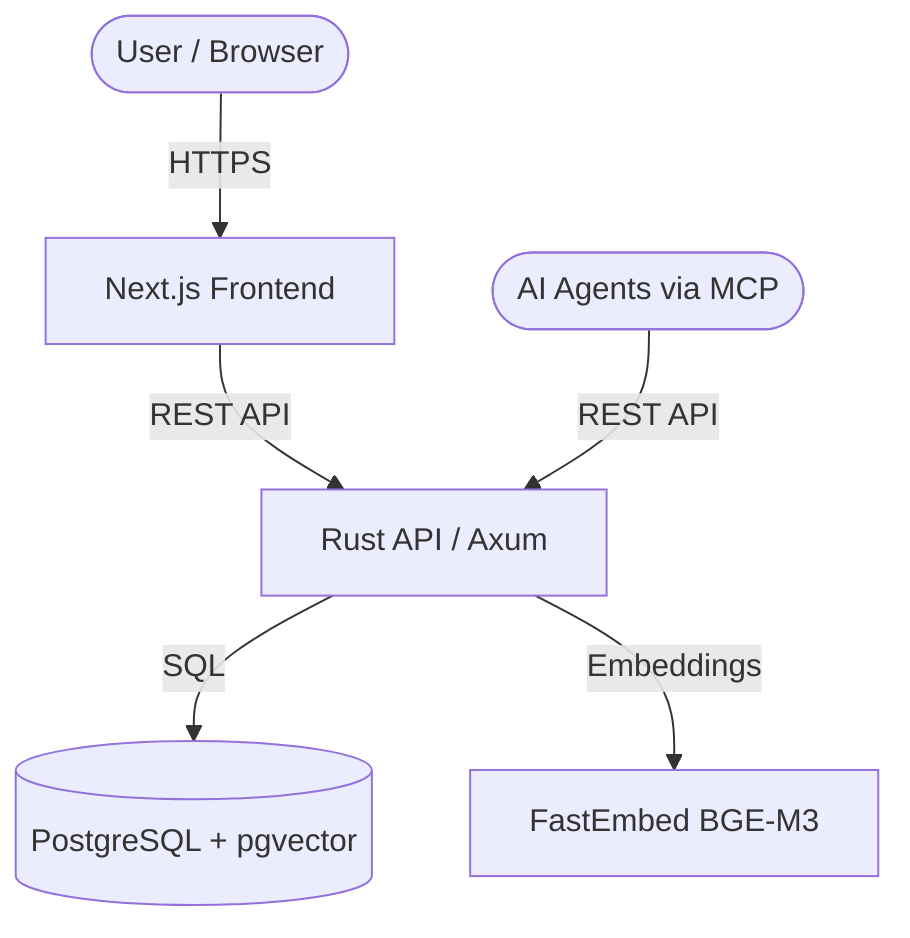

# Architecture Overview

**UET Platform** ถูกออกแบบมาในรูปแบบ **Microservices** เพื่อให้สามารถรองรับการขยายขนาด (Scalability) และแยกระบบย่อยออกจากกันได้อย่างชัดเจน โดยแบ่งออกเป็น 3 ส่วนหลักๆ ดังนี้:

## 1. Web Frontend (`uet_web`)

ส่วนติดต่อผู้ใช้ (User Interface) ที่สร้างด้วยเทคโนโลยีเว็บสมัยใหม่ เพื่อให้ใช้งานได้รวดเร็วและรองรับ SEO

- **Framework:** Next.js 14 (App Router)
- **Language:** TypeScript
- **Styling:** Tailwind CSS, Shadcn UI
- **Internationalization (i18n):** รองรับภาษาไทย, อังกฤษ, จีน ผ่าน `next-intl`
- **Features:** 
  - ระบบบัญชีผู้ใช้และการจัดการ API Keys (Dashboard)
  - หน้าแสดงเอกสาร Documentation (MDX/Markdown)
  - ระบบถาม-ตอบ AI Knowledge Base (MCP Interface)

## 2. Backend API (`uet_api`)

ส่วนประมวลผลหลัก ทำหน้าที่เป็นประตูเชื่อมระหว่าง Frontend กับฐานข้อมูลและระบบ AI 

- **Framework:** Axum (Rust)
- **Database ORM:** SQLx (PostgreSQL)
- **Features:**
  - **Authentication:** ระบบ Login/Register และ JWT (JSON Web Tokens)
  - **MCP Server:** Model Context Protocol สำหรับเชื่อมต่อกับ LLMs
  - **Vector Search:** ระบบค้นหาความหมาย (Semantic Search) ใน Knowledge Base โดยใช้ FastEmbed (BGE-M3) สำหรับแปลงข้อความเป็นเวกเตอร์
  - **Rate Limiting & Quota:** ระบบจำกัดปริมาณการใช้งาน API สำหรับผู้ใช้แต่ละระดับ
  - **Payment Integration:** เชื่อมต่อกับ Stripe สำหรับระบบ Subscription

## 3. Database & Knowledge Base (`uetlab`)

ระบบจัดเก็บข้อมูลทั้งหมดของแพลตฟอร์ม

- **Database Engine:** PostgreSQL 16
- **Vector Extension:** pgvector (สำหรับเก็บและค้นหา Embedding)
- **Stored Data:**
  - `users`, `plans`, `api_keys`: ข้อมูลผู้ใช้งานและสิทธิ์
  - `mcp_kb_documents`, `mcp_kb_chunks`: ข้อมูลเอกสารฟิสิกส์ ทฤษฎี และสมการของ UET
  - `mcp_query_logs`: ประวัติการค้นหาและการใช้งาน

## 4. Model Context Protocol (MCP) Integration

ระบบที่ทำให้ UET โดดเด่นคือการนำ **MCP** มาใช้เพื่อเปิดให้ AI Agents (เช่น Claude, ChatGPT, Cascade) สามารถดึงข้อมูลทฤษฎี UET ไปใช้คำนวณและวิเคราะห์ได้อย่างถูกต้อง

- `GET /api/mcp/topics` - ดึงรายชื่อหัวข้อทั้งหมด (31 โดเมน)
- `GET /api/mcp/equation/:name` - ดึงสมการเฉพาะเจาะจงและคำอธิบายตัวแปร
- `POST /api/mcp/query` - ค้นหาแบบ Natural Language ด้วย Vector Search

## 5. Deployment Architecture

UET Platform สามารถรันได้ทั้งบน Local Machine และบน Cloud ผ่าน Docker

*สถาปัตยกรรมนี้รองรับการนำไปติดตั้งบน Railway.app หรือ AWS/GCP ได้อย่างง่ายดายผ่าน `Dockerfile` ที่เตรียมไว้ให้*
