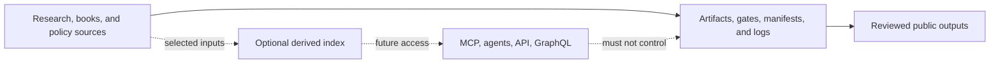

# UET Repository Architecture

## Current decision

This repository is research-first. The canonical work is the research corpus,
theory/history, books, Thailand proposals, evidence artifacts, manifests, gates,
and work logs. The optional platform layer is retained for future use but does
not control or block ordinary research work.

The previous platform design is preserved in
[`architecture_legacy.md`](./architecture_legacy.md). It is historical design
context, not a statement that the web app, deployment, payment, or production
knowledge service is active.

## Layers

| Layer | Canonical location | Responsibility | Dependency rule |
| :-- | :-- | :-- | :-- |
| Research | `docs/core/`, `docs/topics/` | equations, experiments, evidence, topic packages | independent of services |
| Standards | `AGENTS.md`, `docs/topics/For Work/` | workflow, claim, data, formula, result, and publication rules | governs all research work |
| History and books | `uet_history/` | theory history, book registry, blueprints, reviewed publish tree | uses its own book workflow |
| Policy | `thailand_proposals/` | policy and project narratives | claims must link to evidence or be labeled proposal |
| Repository operations | `WORK_LEDGER/`, `.github/`, manifests | checkpoints, CI, publishing, hygiene | records changes, not scientific truth |
| Optional platform | `services_and_experiments/` | agents, retrieval, API, Rust experiments | source-only and non-blocking |
| Derived retrieval | `docs/knowledge_base/`, future indexes | local search and selected retrieval copies | never source of truth |

## Data and control flow

## Service roles

- `uet_core/` is a future reusable Rust calculation library. It is not the
  canonical implementation or status authority for `docs/core/`.
- `uet_kb/` is a future retrieval/MCP implementation. Its index must be
  regenerable from canonical files and must return source paths.
- `uet_agents/` is optional orchestration and ingestion support. It cannot
  promote claims, gates, verifier results, or publication status.
- `uet_api/` and GraphQL are future access layers. They remain parked until a
  stable client, schema, and concrete use case justify activation.
- `uet_chain/`, `uet_security/`, `uet_miner/`, and unfinished modules remain
  future or archived experiments, not a live network or security boundary.

## Operating rules

1. Edit the canonical source before updating any derived index.
2. Keep research usable with all services stopped or unavailable.
3. Record topic or book waves in their local update log when one exists.
4. Record every coherent repo work section in `WORK_LEDGER/`.
5. At ten ledger entries for unpushed work, stop expanding scope and checkpoint.
6. Do not add GraphQL, public API, deployment, authentication, or embeddings
   only because the legacy platform design mentions them.

## Related records

- [`CONTEXT-MAP.md`](../../../CONTEXT-MAP.md)
- [`CONTEXT.md`](../../../CONTEXT.md)
- [`SERVICE_STATUS.md`](../../../services_and_experiments/SERVICE_STATUS.md)
- [`ADR 0001`](../../adr/0001-research-first-optional-platform.md)
- [`knowledge-system-architecture.md`](./knowledge-system-architecture.md)
