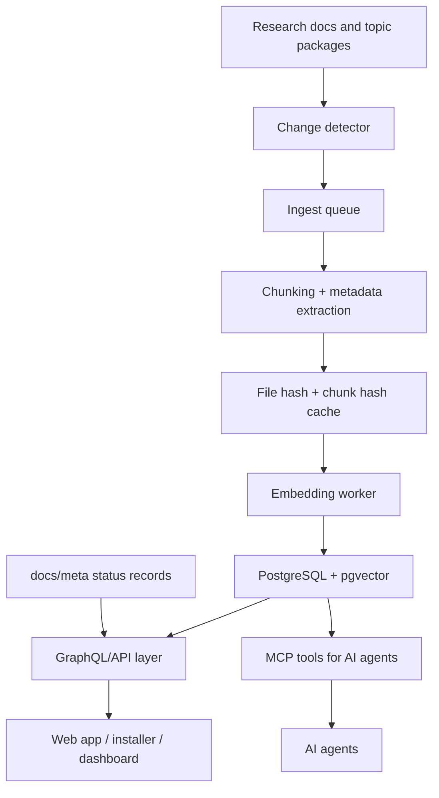

# Knowledge System Architecture

This document defines the intended knowledge architecture for the UET research
platform.

The goal is to let humans, applications, and AI agents search the project without
turning the search index into a new source of truth. UET research changes over
time, so the knowledge system must support incremental updates instead of manual
full re-embedding after every research edit.

## Core principle

The research files remain canonical.

The knowledge base is a searchable copy of selected project material. It exists
to make retrieval faster and cheaper, not to replace the documents, metadata,
verifier artifacts, or topic standards that define the actual project state.

## System roles

| Layer | Role | Source-of-truth status |
| :-- | :-- | :-- |
| `docs/` | Main documentation and research codebase | Canonical for written project content |
| `docs/topics/` | Topic workspaces and research packages | Canonical for topic-local evidence |
| `docs/topics/For Work/` | Research workflow standard | Canonical for research operating rules |
| `docs/meta/` | Machine-readable project status and release metadata | Canonical for repo-wide status summaries |
| `docs/knowledge_base/` | Legacy and utility layer for local indexing/search experiments | Not canonical; should not be treated as current truth without service alignment |
| `services_and_experiments/uet_kb/` | Knowledge-base service and MCP-oriented access layer | Service implementation layer |
| `services_and_experiments/uet_api/` | Platform API, auth, quota, and retrieval endpoints | Application service layer |
| PostgreSQL + pgvector | Canonical deployed vector store once selected | Search index, not research truth |
| MCP tools | AI-agent interface for simple retrieval actions | Access layer |
| GraphQL API | Structured query/admin layer for apps and humans | Access/control layer |

## Intended data flow



## Boundaries

### Canonical state

Use the repository documents and metadata for truth:

- topic status comes from `docs/topics/README.md`, `docs/meta/`, local topic
  documents, verifier artifacts, gates, manifests, and update logs
- research workflow rules come from `docs/topics/For Work/`
- formula, data, claim, and result readiness must be reconstructed from the
  relevant topic package and artifacts

### Searchable state

Use the knowledge base for retrieval:

- semantic search
- topic-aware document lookup
- chunk-level recall
- AI context retrieval
- app-facing document search

Search results should point back to canonical files. A search hit is not proof
that a claim is current, validated, or publication-ready.

### Access layers

MCP and GraphQL should not compete.

MCP should expose small AI-friendly tools such as:

- `search_knowledge_base`
- `get_document`
- `list_topics`
- `get_topic_status`
- `search_physics`

GraphQL should expose structured project navigation and admin/control surfaces
such as:

- topics
- documents
- chunks
- ingest jobs
- stale documents
- index versions
- search results with filters

## Why incremental indexing is required

UET research changes continuously. A manual full re-embedding process creates
three problems:

1. it wastes compute on unchanged files
2. it makes the index easy to forget or leave stale
3. it hides whether a search answer came from current or outdated content

The intended system should store file and chunk hashes so only changed content is
embedded again.

## Recommended canonical backend

The platform should converge on one deployed vector backend:

- PostgreSQL for document/index metadata
- pgvector for embeddings
- local embedding generation as the default path
- optional higher-cost embedding providers only when explicitly configured

SQLite, LanceDB, or local experimental stores may remain useful for migration or
development experiments, but they should not be treated as the canonical platform
index unless the architecture is deliberately changed.

## Current migration posture

The repository currently contains multiple historical approaches to knowledge
search. Until they are aligned:

- `docs/knowledge_base/` should be treated as legacy/utility code
- `services_and_experiments/uet_kb/` should be treated as the likely MCP service
  direction
- `services_and_experiments/uet_api/` should be treated as the application API
  direction
- PostgreSQL + pgvector should be treated as the preferred target store

Before implementation, verify the current database schema, service routes, and
indexing scripts so the system does not keep multiple incompatible stores alive.
## Personal-first implementation note

The first working version is for personal research use, not for a public
platform.

Near-term work should stay deliberately small:

1. index local files
2. detect changed files by hash
3. provide local search
4. point search results back to canonical files
5. prepare a clean path for later embeddings and MCP access

Web UI, GraphQL, installer flows, auth, quota, and public API surfaces are later
platform work. They should not block the personal research memory layer.

The current local helper is:

```text
python -m docs.knowledge_base.personal_kb status
python -m docs.knowledge_base.personal_kb ingest --dry-run
python -m docs.knowledge_base.personal_kb ingest
python -m docs.knowledge_base.personal_kb search "claim evidence"
```

This is not the final vector system. It is the small base layer that makes file
changes and local recall visible before adding embeddings, MCP, or GraphQL.
