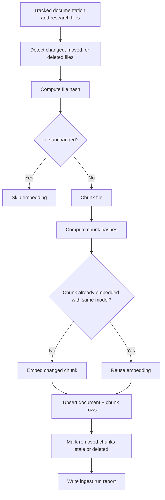

# Knowledge Ingestion Workflow

This document defines the intended workflow for keeping the UET knowledge base
current while research continues to change.

The goal is not to re-embed the whole repository manually. The goal is to detect
what changed, update only the affected chunks, and make stale index state visible.

## Workflow summary



## Files to index

The first pass should focus on high-value documentation and research sources:

- `docs/UET_Documentation_Details/`
- `docs/topics/`
- `docs/meta/`
- `docs/core/`
- `docs/knowledge_base/` documentation only, if it explains retrieval behavior
- `thailand_proposals/`, if public project/policy material should be searchable
- selected `uet_history/` material, only when marked as historical context

Generated outputs, caches, build artifacts, and temporary reports should be
excluded unless a specific result artifact is meant to be searchable.

## Required metadata

Each indexed document should store:

| Field | Purpose |
| :-- | :-- |
| `source_path` | Repo-relative source file path |
| `source_kind` | Documentation, topic doc, metadata, result artifact, architecture doc, etc. |
| `topic_id` | Topic identifier when applicable |
| `file_hash` | Hash of full file content |
| `git_commit` | Commit or working-tree marker used during ingest |
| `indexed_at` | Ingest timestamp |
| `status` | Active, stale, deleted, ignored, or failed |
| `parser_version` | Version of the chunking/parser rule |

Each indexed chunk should store:

| Field | Purpose |
| :-- | :-- |
| `chunk_hash` | Hash of normalized chunk content |
| `chunk_index` | Stable order within the source file |
| `heading_path` | Markdown heading context when available |
| `text` | Chunk text used for retrieval |
| `embedding` | Vector generated by the configured model |
| `embedding_model` | Model identity such as local BGE-M3/FastEmbed |
| `embedding_dim` | Vector dimension |
| `token_count` | Approximate chunk size |

## Ingest modes

### First-run ingest

Use this when a new installation is created or the index is missing.

Expected behavior:

1. scan the configured source paths
2. create document and chunk records
3. generate embeddings for all eligible chunks
4. write an ingest report
5. expose the index version through API/MCP/GraphQL

### Incremental ingest

Use this during normal research work.

Expected behavior:

1. compare current files against stored `file_hash` records
2. skip unchanged files
3. re-chunk changed files
4. reuse unchanged chunk embeddings when `chunk_hash` and `embedding_model` match
5. embed only new or modified chunks
6. mark missing files and removed chunks as stale/deleted
7. write a compact ingest report

### Forced reindex

Use this only when the chunking rule, parser version, embedding model, or vector
dimension changes.

A forced reindex should create a visible new index version rather than silently
overwriting old state.

## Staleness rules

The system should make stale state explicit:

- if a source file changed but ingest failed, the previous chunks should be
  marked stale
- if a file was deleted or moved, old chunks should not continue appearing as
  normal active search results
- if an embedding model changes, old chunks should remain linked to their model
  and not be mixed invisibly with the new model
- if `docs/meta/` says a topic status changed, search results should still point
  users back to the current metadata rather than inferring status from old prose

## Local development command shape

The exact command can change during implementation, but the user-facing behavior
should converge toward:

```text
kb ingest --all
kb ingest --changed
kb ingest --paths docs/topics/0.20_Atomic_Physics
kb watch
kb status
```

`kb watch` should be optional. The reliable base feature is `kb ingest --changed`.

## Verification checklist

An ingest implementation is not ready until it can show:

- unchanged files are skipped
- modified files update only affected chunks
- deleted files become stale/deleted
- the active embedding model is recorded
- the ingest report lists failures
- search results return source paths and chunk context
- AI answers can link back to canonical files
## Current personal workflow

The first implementation is intentionally small and local. It should help the
researcher and AI agent work inside the repo before any public platform work is
attempted.

Use:

```text
python -m docs.knowledge_base.personal_kb status
python -m docs.knowledge_base.personal_kb ingest --dry-run
python -m docs.knowledge_base.personal_kb ingest
python -m docs.knowledge_base.personal_kb search "formula audit"
```

The helper tracks hashes and builds a text index. Embeddings can be added later
once the changed-file workflow is stable.
