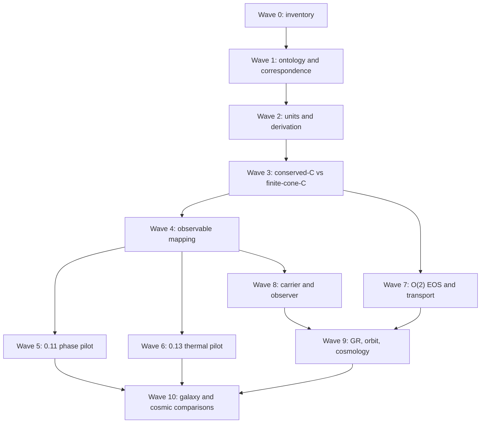

# UET Research Dependency Graph — Waves 0–10

The graph is a dependency map, not a statement that every arrow is already
closed. The current foundation gate is the controlling cut: downstream
artifacts may remain useful as diagnostics, but they cannot promote a claim
while the upstream ontology, units, correspondence, or numerical gate is
blocked.

## Two-arm C decision

The conserved-C branch and the finite-cone-C branch are deliberately separate:

1. conserved C is the phase/order comparator and retains its conservation
   interpretation;
2. finite-cone C is a non-conserved telegraph realization with a separate
   order/behaviour ontology;
3. a conserved Cattaneo current is a negative control until a derived UV or
   nonlocal regularization removes its high-(k) unbounded speed.

No edge in this graph maps (C) directly to mass, maps (R_{gen}) to a
particle, or promotes a detector record to a physical field.

## Latest plan update — 2026-08-01 Wave 8 photon comparator

Wave 8 now has a deterministic normalized standard-photon comparator. The new
`photon_observer_baseline.py` implementation and
`photon_observer_baseline_verification.json` verify the declared relations
`p=E*n`, `t_arrival=t_emit+L/c`, source energy/momentum ledger closure, causal
speed, and detector-record separation from propagation. Focused tests pass.

This closes only the local standard-comparator subgate. Wave 8 remains
`BLOCKED` because the SI detector/observable package, external provenance,
the neutrino/positron comparator packages, and any UET source-to-carrier
transition law are still missing. No photon identity was assigned to
`R_gen`, and no massless transition was inferred.

The active execution order is now:

1. keep the photon comparator as a fixed standard control;
2. close or explicitly bound the dimensional detector/observable lane;
3. audit Wave 9 gravity/orbit/cosmology correspondence and its curved-solver
   controller;
4. audit Wave 10 galaxy/cosmic data gates and Wave 11 particle prerequisites;
5. regenerate the all-wave closure and preserve the foundation gate as the
   controlling claim boundary.
## Latest plan update — 2026-08-01 Wave 9 and Wave 11 boundary repair

Wave 9 metadata now distinguishes the local exact closed-limit formula
comparator from a full covariant UET derivation. The GR claim gate records the
existing `gr_closed_limit_verification.json` as a local evaluator with `PASS`
status, while keeping the covariant parent action, Bianchi/exchange verifier,
curved 3+1 evolution, and physical GR benchmark package open.

Wave 11 now has `particle_dirac_program_gate.json`. Its six prerequisites are
machine-readable and all remain `MISSING`; the gate itself passes as a
boundary audit with status `DEFERRED_BLOCKED`. This closes the evidence and
controller bookkeeping for the particle/Dirac wave without deriving a spinor,
neutrino, positron, antimatter, or particle identity for `R_gen`.

The all-wave artifact remains `ALL_WAVE_STATUS_ACCOUNTING_CLOSED_FOUNDATION_PHYSICS_NOT_CLOSED` with 12 planned waves. The next work is not a claim upgrade: it is to close the remaining foundation correspondence/units/observable gates and only then revisit the blocked application lanes.
## Latest plan update — 2026-08-01 active-lane evidence synchronization

The active carrier/observer lane now references the verified normalized photon
source–propagation–detector comparator as a standard control. This is an
evidence-chain repair only: the lane remains `SIMULATION_ONLY`, the foundation
remains `BLOCKED`, and no `R_gen` particle identity or SI detector prediction
is enabled.
## Latest plan update — 2026-08-01 TTG source equation layer

The thermal dependency now has an explicit standard source-equation node:
g_n -> Delta_Tq -> y_TTG, with c_v kept distinct from UET C. This supports
observable correspondence only. It does not create a Phi -> temperature identity,
close the dimensional lane, or permit external fit/validation.
## Latest plan update — 2026-08-01 central registry addenda synchronization

The registry graph now treats impact/effect, cosmology, persistence/resource
selection, and characteristic-wave addenda as merged candidate nodes. Their
claim ceilings are unchanged, and every downstream edge remains blocked by the
foundation correspondence, units, observable, or physical-source gates.
## Latest plan update — 2026-08-01 publisher supplementary route audit

The thermal source dependency now distinguishes a publisher data statement from
a locally reproducible numeric package. The captured supplementary description
is provenance evidence only; it does not satisfy the numeric-data or dimensional
observable gates.