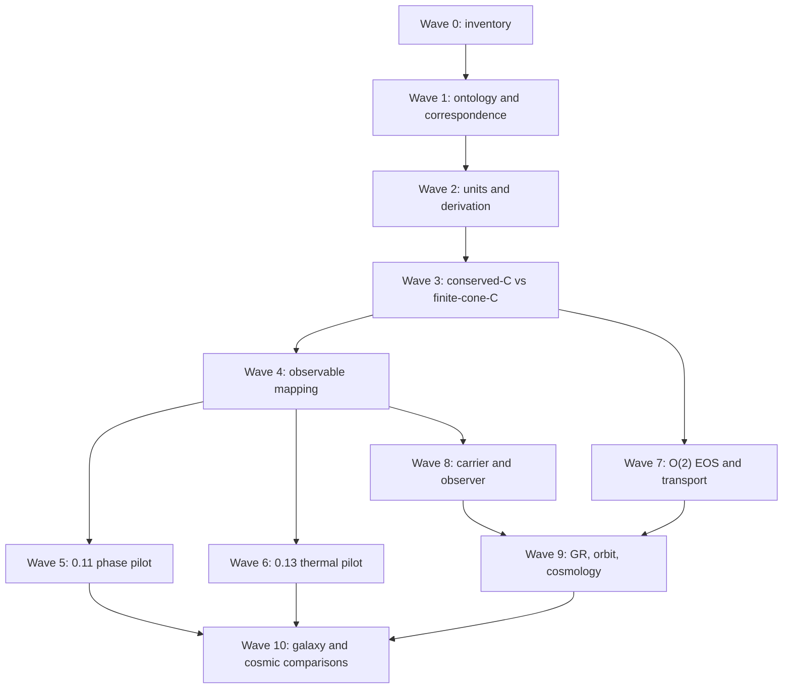

# UET Research Dependency Graph — Waves 0–10

The graph is a dependency map, not a statement that every arrow is already
closed. The current foundation gate is the controlling cut: downstream
artifacts may remain useful as diagnostics, but they cannot promote a claim
while the upstream ontology, units, correspondence, or numerical gate is
blocked.

## Two-arm C decision

The conserved-C branch and the finite-cone-C branch are deliberately separate:

1. conserved C is the phase/order comparator and retains its conservation
   interpretation;
2. finite-cone C is a non-conserved telegraph realization with a separate
   order/behaviour ontology;
3. a conserved Cattaneo current is a negative control until a derived UV or
   nonlocal regularization removes its high-(k) unbounded speed.

No edge in this graph maps (C) directly to mass, maps (R_{gen}) to a
particle, or promotes a detector record to a physical field.
