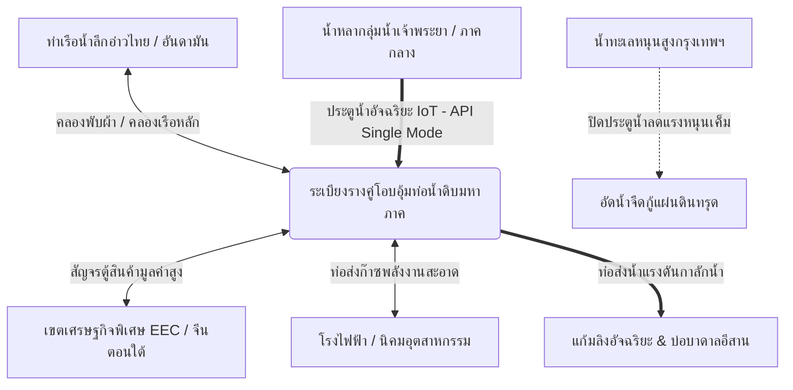

# ยุทธศาสตร์ระเบียงโลจิสติกส์การค้าและระบบบริหารสมดุลอุทกวิทยาข้ามภูมิภาคแบบบูรณาการ (Inter-Regional Logistics & Dynamic Hydrological Balancing Corridor Strategy)

**Date Added:** 2026-05-08  
**Status:** 💡 Idea (ไอเดียตั้งต้น) / 📝 Pending Research (รอการวิจัย)  
**Category:** Policy / Logistics / Disaster Management  

---

## 1. ปัญหาบนโลกจริง (The Real-world Problem)

### 1.1 ความซับซ้อนและต้นทุนแฝงของระบบโลจิสติกส์อาเซียน (Logistical Fragmentation & High-Friction Gateways)
* **ข้อจำกัดของระบบ Landbridge แบบเดิม:** โครงการแลนด์บริดจ์ (Land Bridge) รูปแบบดั้งเดิมที่เน้นการถ่ายสินค้าจากเรือขึ้นรถไฟ และถ่ายลงเรืออีกรอบ (Double-handling) มักเผชิญกับ **ความล่าช้าสะสม (Transit Friction) และต้นทุนแฝงในการยกตู้สินค้าขึ้น-ลง (Handling Cost)** ซึ่งบั่นทอนขีดความสามารถการแข่งขันด้านเวลาเมื่อเทียบกับการเดินเรือผ่านช่องแคบมะละกาโดยตรง
* **การกระจุกตัวเชิงเดี่ยว (Centralized Logistics Vulnerability):** ห่วงโซ่อุปทานของประเทศและภูมิภาคอาเซียนตอนกลางพึ่งพิงท่าเรือแหลมฉบังและกรุงเทพฯ เป็นส่วนใหญ่ หากเกิดวิกฤตการณ์ทางธรรมชาติหรือความขัดแย้งทางภูมิรัฐศาสตร์ ระบบขนส่งจะเผชิญภาวะชะงักงันฉับพลัน (Single Point of Failure)

### 1.2 วิกฤตภัยพิบัติข้ามภูมิภาคแบบขาดการเชื่อมโยง (Systemic Inter-Regional Hydrological Disasters)
ในปัจจุบัน หน่วยงานรัฐแยกแยะการจัดการภัยพิบัติและโครงสร้างพื้นฐานออกเป็นส่วนงานย่อย (Silo Management) ทำให้ไม่สามารถปรับสมดุลทรัพยากรข้ามภูมิภาคได้อย่างมีประสิทธิภาพ ส่งผลให้เผชิญภัยพิบัติซ้ำซาก:
* **พื้นที่ลุ่มภาคกลาง (ลุ่มเจ้าพระยา):** ประสบปัญหาอุทกภัยรุนแรงในช่วงฤดูมรสุม น้ำเหนือหลากเข้าท่วมพื้นที่นิคมอุตสาหกรรมและเกษตรกรรม ขณะเดียวกันกรุงเทพมหานครและปริมณฑลกำลังเผชิญหน้ากับ **วิกฤตแผ่นดินทรุดตัว (Land Subsidence)** จากการสูบน้ำบาดาลในอดีต ร่วมกับภัยน้ำทะเลหนุนสูง (Astronomical High Tides) ที่ลิ่มน้ำเค็มรุกเข้าทำลายระบบประปาเมืองหลวง
* **พื้นที่ภาคตะวันออกเฉียงเหนือ (แอ่งโคราช-แอ่งสกลนคร):** ประสบปัญหาภัยแล้งเรื้อรังแทบทุกปีเนื่องจากปริมาณฝนทิ้งช่วง ดินมีลักษณะเป็นดินปนทรายที่มีความซึมผ่านสูง (High Soil Permeability) ไม่สามารถกักเก็บน้ำบนผิวดินได้มีประสิทธิภาพพอ
* **ความสูญเปล่าทางอุทกวิทยา:** น้ำหลากจากภาคกลางมหาศาลถูกปล่อยทิ้งลงสู่อ่าวไทยโดยเปล่าประโยชน์เพื่อป้องกันน้ำท่วมเมือง ขณะที่ภาคอีสานกำลังแห้งแล้งจนพืชผลเสียหายอย่างหนักเนื่องจากไม่มีท่อเชื่อมโยงส่งน้ำข้ามเขตลุ่มน้ำ (Inter-basin Transfer)

---

## 2. ข้อเสนอเชิงนโยบายยุทธศาสตร์ชาติ (Proposed Solution & Policy Strategy)

เพื่อแก้ไขปัญหาระดับมหภาคอย่างบูรณาการ ยุทธศาสตร์นี้เสนอให้พัฒนา **"ระเบียงอัจฉริยะกู้วิกฤตคู่ขนาน ราง-น้ำ" (Inter-Regional Rail-Water Co-corridors)** โดยเปลี่ยนเส้นทางโลจิสติกส์คมนาคมหลักของประเทศให้ทำหน้าที่เป็นทั้งช่องทางขนส่งสินค้า และท่อส่งจ่ายทรัพยากรน้ำจืดเพื่อปรับดุลยภาพภัยพิบัติข้ามภูมิภาคไปพร้อมกัน

### 2.1 ระเบียงรางคู่โอบอุ้มท่อน้ำดิบมหาภาค (Multimodal Rail-Water Co-corridors)
* **การบูรณาการสิทธิทางสายทาง (Right-of-Way Optimization):** ในระหว่างการเวนคืนที่ดินและก่อสร้างรถไฟทางคู่ (Double-track Railway) หรือทางหลวงพิเศษระหว่างเมือง (Motorways) ยุทธศาสตร์นี้เสนอให้ฝัง **"ท่อส่งจ่ายน้ำจืดแรงดันสูงเนื้อโพลิเมอร์แรงเสียดทานต่ำ" (Mass Raw Water Conduits)** ขนาดใหญ่ขนานไปใต้ทางรถไฟหรือเขตก่อสร้าง ซึ่งช่วยลดงบประมาณการเวนคืนที่ดินแยกส่วนได้เกือบ $100\%$ และเพิ่มประสิทธิภาพทางพื้นที่การใช้งาน
* **อุโมงค์ร่วมสาธารณูปโภคอเนกประสงค์เชื่อมภูมิภาค (Combined Utility Tunnels):** สำหรับแนวตัดผ่าเทือกเขาหลัก (เช่น เทือกเขาบรรทัด หรือทิวเขาดงพญาเย็น) จะไม่ก่อสร้างอุโมงค์แยกขาดจากกัน แต่จะออกแบบเป็น **"อุโมงค์อเนกประสงค์ขนาดยักษ์ร่วม"** โดยมีคันกั้นฉนวนหนาพิเศษกั้นตรงกลางทางกายภาพ (Structural Central Steel Bulkhead) ฝั่งหนึ่งใช้เป็นเส้นทางวิ่งรถไฟทางคู่ความเร็วสูงที่มีการซับเสียงอย่างสมบูรณ์ ส่วนอีกฝั่งใช้เป็นช่องวางท่อส่งจ่ายน้ำหลักและท่อพลังงานสะอาด ช่วยแชร์ต้นทุนการระเบิดเจาะภูเขาลงได้กว่า $35\%$

### 2.2 ระบบรวมสัญญาณอุทกวิทยาซิงเกิ้ลโหมดระดับชาติ (Unified IoT-API Water Lifecycle Sync & Single-Mode Architecture)
* **การซิงโครไนซ์อัจฉริยะรอบทิศทาง:** วงจรการไหลของน้ำทั้งหมดจะเชื่อมต่อผ่านเครือข่ายเซ็นเซอร์ IoT ตลอดสายระเบียง โดยประมวลผลผ่านสถาปัตยกรรมซอฟต์แวร์เดี่ยว (Single-Mode Unified API) ร่วมกับดาวเทียมสำรวจและสถานีอากาศ
* **ระบบคาดการณ์ความเป็นมาเป็นไปของน้ำ:** เนื่องจากระบบรู้ข้อมูลพิกัดระดับน้ำ (Water Levels), ปริมาตรน้ำดิบในอ่างและบาดาล (Water Volumes), ตลอดจนขอบเขตภูมิศาสตร์ลุ่มน้ำ (Spatial Boundaries) อย่างชัดเจน ระบบประมวลผลกลางจะทำการจำลองสถานการณ์และควบคุมประตูน้ำ IoT ตลอดแนวเชื่อมโยงให้ทำงานสอดประสานกันโดยอัตโนมัติ

### 2.3 การส่งจ่ายน้ำข้ามลุ่มน้ำ ปรับดุลอุทกภัยและภัยแล้งข้ามภูมิภาค (Cross-Regional Water Balancing)
* **การผันน้ำหลากช่วงมรสุมป้อนอีสาน (Monsoon Siphon Flush):** ในช่วงวิกฤตน้ำท่วมภาคกลาง ระบบจะเปิดประตูน้ำ IoT ดักมวลน้ำหลากส่วนเกินส่งเข้าท่อน้ำดิบใต้รางรถไฟ และใช้แรงดันต่างระดับผสมผสานปั๊มไฮโดรลิก ปั๊มน้ำขึ้นสู่ที่สูงและส่งต่อไปยังภาคอีสาน เพื่อเติมเข้าสู่อ่างแก้มลิงยางพาราธรรมชาติและระบบอัดน้ำบาดาลกักเก็บใต้ดินระบบปิด ป้องกันการระเหยของน้ำจืดในดินทรายลอยตัว
* **กำแพงป้องกันน้ำเค็มหนุนและกู้แผ่นดินทรุดกรุงเทพฯ (Bangkok Ground Subsidence Countermeasure):** ผันมวลน้ำจืดบางส่วนเข้าสู่ระบบอัดน้ำใต้ดินรอบกรุงเทพมหานคร (Artificial Groundwater Recharge) เพื่อเพิ่มแรงดันรูพรุนของดิน (Pore-water Pressure) ป้องกันแผ่นดินทรุดตัวอย่างมีทิศทาง พร้อมทั้งประสานประตูน้ำชายฝั่งควบคุมสมดุลน้ำต้านลิ่มเกลือหนุนในฤดูแล้ง

### 2.4 การขนส่งมูลค่าสูงควบคู่ท่อส่งถ่ายพลังงานสะอาดเชื่อมต่อลูกค้าโลก (High-Value Cargo & Green Energy Corridors)
* **เป้าหมายตู้สินค้ามูลค่าสูง (High-value Freight Focus):** ทางรถไฟรางคู่และเส้นทางคลองเรือพับผ้าจะเน้นให้บริการแก่สินค้ามูลค่าสูง (ตู้คอนเทนเนอร์อิเล็กทรอนิกส์ ยารักษาโรค ชิ้นส่วนยานยนต์) ที่ต้องการอัตราการเปลี่ยนผ่านข้ามมหาสมุทรที่รวดเร็วและปลอดภัย โดยจัดตารางการแล่นผ่านท่าเรือผ่าน API เดินเรือแบบไร้รอยต่อ
* **ระเบียงท่อส่งจ่ายเชื้อเพลิงสะอาดแชร์สิทธิทางสายทาง (Green Liquid Energy Pipelines):** นอกเหนือจากท่อน้ำดิบ อุโมงค์อเนกประสงค์ร่วมจะติดตั้งท่อส่งจ่ายของเหลวพลังงานสะอาดยุคใหม่ เช่น **แอมโมเนียเหลวสีเขียว (Green Ammonia) และไฮโดรเจนเหลว (Liquid Hydrogen)** เพื่อป้อนเชื้อเพลิงสะอาดโดยตรงจากท่าเรือทะเลลึกภาคใต้สู่นิคมอุตสาหกรรมใน EEC และกรุงเทพฯ ช่วยลดความจำเป็นในการขนส่งพลังงานด้วยรถบรรทุกถนนหลวงที่มีความเสี่ยงอุบัติเหตุสูง

### 2.5 ปรับสมดุลการสัญจรของสัตว์ป่า ท้องถิ่น และการประมงนวัตกรรมใหม่ (Single-Mode Crossing Coexistence & Smart Traps)
* **การข้ามฝั่งอย่างไร้อุปสรรค (API-driven Crossings):** การจราจรของเรือสินค้าในคลองพับผ้าภาคใต้และรถไฟบนระเบียงรางคู่จะถูกควบคุมตารางเวลาเดินรถ/เดินเรืออย่างแม่นยำผ่าน API ระบบซิงเกิ้ลโหมด ทำให้ความหนาแน่นของการจราจรอยู่ในระดับต่ำที่ควบคุมได้ สัตว์ป่า สัตว์น้ำ และประชาชนท้องถิ่นจึงสามารถข้ามผ่านแดนผ่านสะพานเชื่อมชีวภาพ (Eco-bridges) หรือช่องข้ามทางน้ำได้อย่างปลอดภัยและมีตารางที่จัดสรรชัดเจน
* **ระบบตาข่ายดักจับประมงนวัตกรรมใหม่และการฟื้นฟูธรรมชาติ (Intelligent Biosecurity Mesh & Selective Fishery Station):**
  * ในอุโมงค์และจุดเชื่อมรอยต่อทางน้ำลึก จะมีการวาง **"ตาข่ายดักจับสิ่งมีชีวิตเร็ดรอดอัจฉริยะ" (Intelligent Biosecurity Mesh)** เพื่อสกัดกั้นการอพยพข้ามฝั่งที่อาจทำลายสมดุลนิเวศวิทยา
  * ตาข่ายนี้จะติดตั้งกล้อง AI Computer Vision จับภาพสัตว์น้ำที่ว่ายชน หากเป็นปลาเศรษฐกิจทั่วไปหรือเอเลี่ยนสปีชีส์ ระบบจะลำเลียงเข้าสู่กระชังประมงอัจฉริยะ ให้ชาวประมงท้องถิ่นนำไปสร้างรายได้และบริโภค ซึ่งถือเป็นการประมงนวัตกรรมรูปแบบใหม่
  * ทันทีที่เซ็นเซอร์ตรวจพบ "สัตว์หายาก/สัตว์อนุรักษ์" (เช่น ฝูงโลมาอิรวดี หรือเต่าทะเล) ระบบจะสั่งการเปิดกลไกปล่อยคืนสู่เขตปลอดภัยดั้งเดิม (Automatic Eco-Release Bypass) ทันทีอย่างเป็นระบบและอ่อนโยนที่สุด

---

## 3. มุมมองเชิงระบบตามทฤษฎี UET (UET Perspective)

ภายใต้ทฤษฎี **Unity Equilibrium Theory (UET)** โครงข่ายโลจิสติกส์การค้าและปัญหาภัยพิบัติอุทกวิทยาข้ามภูมิภาค ไม่ใช่ระบบที่ตัดขาดจากกัน แต่เป็นหนึ่งใน **"โครงข่ายการไหลของมวล สารสนเทศ และพลังงานเชิงอุณหพลศาสตร์" (Thermodynamic Flows of Mass, Information, and Energy)**

### 3.1 การควบคุมการกระจายตัวของเอนโทรปีในลุ่มน้ำ (流域熵值管理 - Basin Entropy Management)
ภัยแล้งและอุทกภัย แท้จริงแล้วคือ **"ภาวะความไม่สมดุลเชิงตำแหน่งของการกระจายมวลน้ำ" (Spatial Mass Imbalance of Water)** ซึ่งถือเป็นสภาวะที่มีเอนโทรปีสูง (High Entropy State) 
เมื่อลุ่มน้ำเจ้าพระยามีน้ำปริมาณมากเกินไปจนเกิดความโกลาหลระบายไม่ทัน ($dS_{\text{central}} > 0$) และลุ่มน้ำอีสานขาดแคลนทรัพยากรตัวกลางทำปฏิกิริยา ($dS_{\text{isan}} > 0$) 
หากเราเชื่อมต่อลุ่มน้ำเข้าหากันด้วยระเบียงส่งน้ำคู่ขนานรางคู่ และเหนี่ยวนำด้วยข้อมูลข่าวสารจากระบบประมวลผล API ส่วนกลาง ($dI_{\text{API}}$) ระบบจะสามารถผันมวลน้ำข้ามขอบเขตเชิงพื้นที่เพื่อปรับลดค่าเอนโทรปีสุทธิรวมของระบบประเทศลงได้:

$$dS_{\text{national}} = dS_{\text{freight}} + dS_{\text{water}} - dI_{\text{API}} \le 0$$

สารสนเทศอัจฉริยะ ($I_{\text{API}}$) จะทำหน้าที่เสมือน **"ตัวลดทอนเอนโทรปีภายนอก" (Negative Entropy Driver)** นำพาโครงข่ายระบบขนส่งและการกระจายน้ำสู่จุดสมดุลแบบคงที่เชิงพลวัต (Active Steady-State Equilibrium) และปกป้องโครงสร้างพื้นฐานระดับชาติจากการล่มสลายจากภัยพิบัติ

---

## 4. สิ่งที่ต้องวิจัยเพิ่มในอนาคต (Future Research Needs)

### 4.1 การวิจัยข้อมูลที่ยังตกหล่น (Missing Data)
* **การวิเคราะห์การทรุดตัวของชั้นดินลึกกรุงเทพฯ:** ต้องรวบรวมข้อมูลระดับการบดอัดตัวของดินชั้นดินเหนียวหนาและชั้นทรายบาดาลกรุงเทพฯ เพื่อประเมินค่าแรงดันที่ต้องการในการอัดกลับน้ำจืดกู้แผ่นดินทรุดอย่างแม่นยำ
* **แผนที่ธรณีวิทยาแนวก่อสร้างอุโมงค์อเนกประสงค์:** สำรวจรอยเลื่อนและโครงสร้างชั้นหินแกนกลางของภูเขาตามแนวเส้นทางคมนาคม เพื่อรับประกันเสถียรภาพและความปลอดภัยสูงสุดของการใช้โครงสร้างอุโมงค์ร่วมกันของรถไฟและระบบท่อน้ำแรงดันสูง

### 4.2 การสร้างแบบจำลองคอมพิวเตอร์และการทดลองเสมือน (Simulation & Modeling)
* **แบบจำลองชลศาสตร์แรงดันสูงข้ามลุ่มน้ำ (Transient Hydraulics Simulation):** พัฒนาแบบจำลองชลศาสตร์คำนวณการไหลของมวลน้ำดิบภายในท่อระยะทางยาวหลายร้อยกิโลเมตร เพื่อประเมินค่าการสูญเสียแรงดัน (Friction Loss) ความต้องการสถานีสูบเพิ่มแรงดัน (Booster Stations) และการออกแบบวาล์วป้องกันปรากฏการณ์ค้อนน้ำ (Water Hammer Countermeasures) ในกรณีปิดประตูกะทันหัน
* **โมเดลพลศาสตร์ฝูงเรือและขบวนรถไฟ (Dynamic Flow Coupling):** พัฒนาโมเดลจำลองรอบเวลาวิ่งขบวนรถไฟทางคู่ควบรวมกับตารางขบวนเรือสินค้าเดินทะเล เพื่อพิสูจน์ขีดความสามารถการสัญจรและข้ามผ่านของชุมชนและสัตว์ป่า ว่าสามารถ Co-exist ได้อย่างลื่นไหลไม่มีภาวะคอขวดสะสม

---

## 5. แหล่งอ้างอิงและข้อมูลเสริม (References & Resources)

* **[Southern Waterway Alternative Masterplan](file:///c:/Users/santa/Desktop/uet_harness/docs/incubator/03_logistics_and_infra/southern_waterway_alternative.md):** ร่องน้ำเดินเรือพับผ้าหลักที่เป็นอินเตอร์เฟสกับลูกค้าโลกฝั่งมหาสมุทร
* **UET Topic 0.39 (Bio-Smart Water City Blueprint):** เอกสารอ้างอิงเชิงวิชาการด้านการแปรเปลี่ยนปัญหาน้ำท่วมให้เป็นสินทรัพย์อุตสาหกรรมชีวภาพและทรัพยากรหมุนเวียน
* **PIANC Report No. 121-2014:** แนวทางการออกแบบร่องน้ำอัจฉริยะที่ปลอดภัยต่อขบวนเรือพาณิชย์ขนาดใหญ่
