# 📖 โครงร่างหนังสือ: The Origin of Wealth (ต้นกำเนิดความมั่งคั่งแห่งประชาชาติ)
> **ผู้เขียน:** สังเคราะห์จากทัศนะและแนวคิดเชิงทฤษฎี UET (Unity Equilibrium Theory)
> **แนวคิดหลัก:** การใช้ประวัติศาสตร์อารยธรรม วิวัฒนาการความรู้ และคณิตศาสตร์/ฟิสิกส์เชิงระบบ เพื่ออธิบายว่าความมั่งคั่งแท้จริงไม่ใช่ "เงินตรากระดาษ" แต่คือ "ประสิทธิภาพของเครื่องมือวัดและโครงสร้างทางตรรกะที่มนุษยชาติใช้ในการจัดการข้อมูลและพลังงาน"

---

## 🗺️ แผนผังวิวัฒนาการของ "ไม้บรรทัดแห่งความรู้" (The Evolutionary Tech-Tree)

```mermaid
graph TD
    %% Hominid & Firewood Phase
    Savannah["🦁 แอฟริกา: วิกฤตภูมิอากาศแห้งแล้ง<br/>(Milankovitch Climate Shift)"] -->|บีบให้ควบคุมไฟ| Firewood["🪵 อุตสาหกรรมฟืน & คลังฟืนในถ้ำ<br/>(First Industry & Logistics)"]
    Firewood -->|ความจำเป็นในการนับความสมมาตร| MathLogics["📐 ตรรกะคณิตศาสตร์ก่อนภาษาพูด<br/>(Math as First Language)"]
    
    %% Historical Rulers Phase
    MathLogics -->|รังวัดที่ดินหลังน้ำท่วมไนล์| Egypt["📐 เรขาคณิตอียิปต์โบราณ<br/>(Geometry: Physical Ruler)"]
    Egypt -->|ข้อจำกัดเลขโรมันขัดขวางการคำนวณ| Crusade["⚔️ สงครามครูเสด & การแลกเปลี่ยนวัฒนธรรม<br/>(Import of Hindu-Arabic Numerals)"]
    Crusade -->|อินเดียคิดเลขศูนย์จากปรัชญาสุญญตา| India["0️⃣ ศูนย์ และ สุญญตา<br/>(The Invention of Zero)"]
    
    %% Abstract Rulers Phase
    India -->|ไม้บรรทัดนามธรรมในโลกความคิด| Calculus["📈 แคลคูลัส & ทางลัดค่าลิมิต<br/>(Calculus as Relationship Ruler)"]
    Calculus -->|คำนวณย่านความเร็ว/พลังงานต่ำ| Newton["🍎 ไม้บรรทัดนิวตัน<br/>(Absolute Space & Time)"]
    
    %% Epistemological Upgrades
    Newton -->|ข้อมูลขัดแย้งสะสม + เครื่องมือละเอียดขึ้น| EinsteinUpgrade["⏳ สังเคราะห์ Riemann + Maxwell + ข้อจำกัด c"]
    EinsteinUpgrade -->|ไม้บรรทัดยืดหยุ่นตามความหนาแน่นพลังงาน| Einstein["⏳ ไม้บรรทัดไอน์สไตน์<br/>(Spacetime Curvature / E=mc²)"]
    
    %% Modern Economic Phase
    Einstein -->|ปลายยุคไอน์สไตน์: ปัญหาเงินเฟียด| FiatGlitch["💸 วิกฤตเงิน Fiat 1971<br/>(เงินสร้างหนี้ขโมยอนาคต)"]
    FiatGlitch -->|ปฏิรูประบบเงินด้วยกฎฟิสิกส์| DynamicMoney["🪙 Dynamic Energy Money<br/>(เงินอิงฟิสิกส์: เฟ้อได้ ฝืดได้ ห้ามเฟียด)"]
    
    %% Styling
    classDef hominid fill:#2d3a1a,stroke:#6e8f3d,stroke-width:2px,color:#fff;
    classDef history fill:#3c2d12,stroke:#a67c37,stroke-width:2px,color:#fff;
    classDef abstract fill:#1a103c,stroke:#7d5bb6,stroke-width:2px,color:#fff;
    classDef science fill:#102e3c,stroke:#4a8a9e,stroke-width:2px,color:#fff;
    classDef econ fill:#3c101a,stroke:#a64b58,stroke-width:2px,color:#fff;
    
    class Savannah,Firewood,MathLogics hominid;
    class Egypt,Crusade,India history;
    class Calculus abstract;
    class Newton,EinsteinUpgrade,Einstein science;
    class FiatGlitch,DynamicMoney econ;
```

---

## 📑 สารบัญและรายละเอียดเนื้อหารายบท (Chapter-by-Chapter Blueprint)

### 📌 บทนำ: ความย้อนแย้งเชิงระบบและความมั่งคั่งที่แท้จริง
*   **แก่นประเด็น:** การรื้อถอนกรอบคิดของวิชาเศรษฐศาสตร์กระแสหลักที่ประเมินคุณค่าทุกอย่างเป็นตัวเลขสมมติ โดยดึงกระบวนการคิดกลับมาสู่ "ความจริงทางฟิสิกส์ขั้นพื้นฐาน"
*   **คำถามนำทางเชิงวิพากษ์:**
    *   ทำไมเราจึงยอมรับโครงสร้างที่ "ค่าเดินทางในชีวิตประจำวันสูงเท่ากับค่าอาหารที่หล่อเลี้ยงชีวิต"? (การบิดเบือนมูลค่าพลังงานชีวภาพเพื่อไปทำงานป้อนระบบ)
    *   ทำไมระบบการเงินในปัจจุบันจึงสามารถเพิ่มปริมาณเงินได้อย่างไม่มีขีดจำกัดผ่านการ "สร้างหนี้สิน" ซึ่งเป็นการขโมยแรงงานและพลังงานในอนาคตของประชากร?
*   **ข้อเสนอตั้งต้น:** ความมั่งคั่งที่แท้จริงไม่ได้เริ่มต้นจากการสะสมเงินตรา แต่เริ่มต้นจากการสะสม "ความรู้และการจัดการข้อมูล" เพื่อการเอาตัวรอดที่มีประสิทธิภาพสูงสุดภายใต้กฎของเอนโทรปี

---

### 📌 บทที่ 1: รากฐานอุณหเศรษฐศาสตร์ - ข้อมูล พลังงาน และขีดจำกัดทางกายภาพ (The Thermoeconomic Root of Wealth)
> *"เศรษฐกิจไม่ได้เกิดขึ้นในสุญญากาศของตัวเลข แต่อยู่ภายใต้กฎเทอร์โมไดนามิกส์เดียวกับจักรวาล"*

*   **1.1 เงินในฐานะตัวแทนพลังงาน (Money as Energy Proxy):**
    *   การทำงานของมนุษย์ในทางกายภาพคือการลงแรงเพื่อแปลงสภาพทรัพยากรธรรมชาติให้กลายเป็นสิ่งใช้ประโยชน์ได้ "เงิน" จึงเป็นสิทธิ์ในการดึงพลังงานและการทำงานในระบบ
    *   ปริมาณเงินในระบบเศรษฐกิจควรเพิ่มขึ้นก็ต่อเมื่อเราเกิด **"นวัตกรรม/ความรู้ใหม่"** ที่ทำให้สามารถดึงพลังงานประเภทใหม่ๆ หรือแปลงทรัพยากรที่เคยไร้ค่าให้กลายเป็นสิ่งที่มีประโยชน์ได้ (เช่น การค้นพบวิธีการใช้ฟืน การใช้น้ำมัน หรือการประมวลผล AI)
*   **1.2 ความจริงของความรู้และการจัดการข้อมูล:**
    *   ความมั่งคั่งที่แท้จริงคือความสามารถในการประมวลผลข้อมูลเพื่อลดความสูญเสีย (Entropy) ในระบบ
    *   เมื่อมนุษย์มี "ความรู้" มากขึ้น เราจะใช้พลังงานและทรัพยากรน้อยลงในการสร้างผลผลิตที่เท่าเดิม ความรู้จึงเป็นตัวขับเคลื่อนขนาดเศรษฐกิจที่แท้จริง

---

### 📌 บทที่ 2: อุตสาหกรรมแรกและตรรกะแรกของมนุษยชาติ - อุตสาหกรรมฟืน (The Firewood Economy & Logistical Math)
> *"ก่อนที่มนุษย์จะรู้จักภาษาพูดที่ซับซ้อน เราต้องเรียนรู้คณิตศาสตร์เชิงปริมาณเพื่อแบ่งฟืนไม่ให้คนในเผ่าหนาวตาย"*

*   **2.1 วิกฤตภูมิอากาศในแอฟริกาและการควบคุมไฟ:**
    *   วัฏจักรภูมิอากาศโลกในระยะยาว (Milankovitch Cycles) ส่งผลให้พื้นที่แอฟริกาเหนือเปลี่ยนผ่านจากป่าชุ่มชื้นกลายเป็นทุ่งหญ้าสะวันนาและทะเลทรายซาฮาราที่แห้งแล้ง
    *   ความร้อนจัดทำให้เกิดไฟป่าตามธรรมชาติได้ง่าย โฮโมเซเปียนส์เผชิญแรงบีบคั้นทางวิวัฒนาการให้ต้องหันมาเผชิญหน้ากับไฟ เปลี่ยนความกลัวเป็นโอกาสในการกักเก็บและควบคุมไฟป่าเพื่อปรุงอาหารและป้องกันตัว
*   **2.2 อุตสาหกรรมฟืน (Pyrotechnology) ในฐานะระบบลอจิสติกส์แรก:**
    *   อุตสาหกรรมแรกที่มีการจัดการกำลังคน วางแผน และทำลอจิสติกส์ร่วมกันไม่ใช่การเกษตรหรือการล่าสัตว์ แต่คือ **"การจัดการคลังฟืน"**
    *   มนุษย์ทำการสับไม้ด้วยขวานหินหนักๆ ให้มีขนาดที่ "สมมาตร" เพื่อให้จัดเก็บง่ายในถ้ำไม่ให้ชื้น และเพื่อให้ค่าพลังงานที่สม่ำเสมอเมื่อนำไปเผาไหม้
    *   เกิดการแบ่งหน้าที่เป็นระบบ: กลุ่มหาฟืน, กลุ่มเฝ้าไฟไม่ให้ดับ, กลุ่มออกล่าและสำรวจ
*   **2.3 ภูมิรัฐศาสตร์คลังฟืนและการทำลายล้างลอจิสติกส์ (Logistical Sabotage):**
    *   คลังฟืนในถ้ำคืออำนาจชี้เป็นชี้ตายของเผ่า สงครามยุคดึกดำบรรพ์ไม่ได้เน้นการฆ่าฟันกันตรงๆ แต่คือ **"การลอบเข้าทำลายหรือล้างสต็อกคลังฟืนของฝ่ายตรงข้าม"** เมื่อศัตรูไม่มีฟืนคอยปรุงอาหารและไม่มีไฟไล่สัตว์ร้าย ระบบของเผ่าเหล่านั้นจะเสื่อมสลายไปเอง
*   **2.4 คณิตศาสตร์เป็นภาษาแรกของมนุษยชาติ:**
    *   คณิตศาสตร์และตรรกะเชิงปริมาณพัฒนาขึ้นมาเป็น **"ไม้บรรทัดตัวแรก"** ในสมองมนุษย์เพื่อจัดการคลังฟืน
    *   หากผู้ดูแลสั่งให้สมาชิกไปขนฟืนโดยไม่มีตรรกะตัวเลขที่ตรงกัน ("เอาฟืนขนาดเท่านี้มา 3 ท่อน") เผ่าจะใช้ฟืนหมดสต็อกอย่างรวดเร็วและหนาวตายในคืนถัดๆ ไป ตรรกะคณิตศาสตร์จึงเกิดขึ้นก่อนภาษาพูดที่ซับซ้อนเพื่อเชื่อมระบบความคิดเข้ากับโลกกายภาพ

---

### 📌 บทที่ 3: กำเนิดไม้บรรทัด - จากเรขาคณิตอียิปต์ถึงอิทธิพลสงครามครูเสดและการเดินทางของเลขศูนย์ (Upgrading the Quantitative Ruler)
> *"ยุโรปไม่อาจหลุดพ้นจากยุคมืดได้หากยังใช้เลขโรมันที่บวกคูณไม่ได้ และการเดินทางของเลขศูนย์ผ่านสงครามครูเสดคือตัวปลดล็อกสมรรถนะการคิด"*

*   **3.1 อียิปต์โบราณกับเรขาคณิตกายภาพ (Geometry):**
    *   แม่น้ำไนล์ท่วมทะลักล้างแนวเขตที่ดินทุกปี ฟาโรห์จึงต้องส่งผู้รังวัดไปคำนวณและวาดแผนที่พรมแดนใหม่เพื่อเก็บภาษี เกิดเป็นเรขาคณิต (**Geometry**: Geo = โลก, Metry = การวัด) ซึ่งเป็นไม้บรรทัดเชิงกายภาพในการระบุพื้นที่ทำกิน
*   **3.2 ทางตันของตัวเลขโรมันและยุคมืดในยุโรป:**
    *   อารยธรรมยุโรปในยุคโบราณใช้ระบบ **เลขโรมัน (I, II, V, X, C, M)** ซึ่งมีลักษณะแข็งทื่อ ไม่มีการระบุหลักหน่วย สิบ ร้อย พัน ที่ชัดเจน และที่สำคัญคือไม่มีระบบการคำนวณเศษส่วนและเลขศูนย์
    *   ตัวเลขโรมันทำให้การคำนวณทางบัญชี ดอกเบี้ย การค้า และการคำนวณทางวิทยาศาสตร์ระดับสูงเกือบจะเป็นไปไม่ได้ ทำให้ระบบความรู้และการคำนวณของยุโรปชะงักงัน
*   **3.3 เลขศูนย์และการเดินทางผ่านสงครามครูเสด:**
    *   อารยธรรมอินเดียคิดค้นเลข **"ศูนย์" (0)** จากแนวคิดทางปรัชญาเรื่อง **สุญญตา (Emptiness/Sunyata)** ทำให้ความว่างเปล่ามีตัวตนเชิงสัญลักษณ์ทางคณิตศาสตร์
    *   ความรู้เรื่องเลขศูนย์และระบบจำนวนฮินดู-อารบิก เดินทางจากอินเดียเข้าสู่ดินแดนเอเชียกลาง (โลกอิสลามยุครุ่งเรือง) 
    *   ในช่วง **สงครามครูเสด (Crusades)** เกิดการปะทะและการแลกเปลี่ยนวัฒนธรรมและการค้าระหว่างยุโรปกับเอเชียกลาง ยุโรปจึงได้นำเข้าตัวเลขฮินดู-อารบิกและเลขศูนย์นี้เข้ามาใช้
    *   การได้รับเลขศูนย์ปฏิวัติวิธีคิดของยุโรปอย่างมหาศาล ปลดล็อกการทำบัญชีคู่ การคำนวณพาณิชย์ และเป็นเชื้อไฟหลักที่ทำให้เกิดวิทยาศาสตร์ยุคหลังผ่านการพัฒนาคณิตศาสตร์ของกาลิเลโอและนำไปสู่ยุคของนิวตัน

---

### 📌 บทที่ 4: แคลคูลัส - ไม้บรรทัดโลกนามธรรมที่วัดความสัมพันธ์ (Calculus as the Relationship Ruler)
> *"ไม้บรรทัดในโลกจริงไม่มีวันเที่ยงตรงเพราะมันยืดหดตามความร้อน แต่นิวตันได้สร้างแคลคูลัสขึ้นมาเป็นไม้บรรทัดในโลกนามธรรมที่เสถียรและสามารถวัดของสองสิ่งที่เปลี่ยนแปลงสัมพันธ์กันได้"*

*   **4.1 ข้อจำกัดของไม้บรรทัดทางกายภาพ:**
    *   ในโลกความเป็นจริงทางกายภาพ วัตถุทุกชนิดขยายตัวหรือหดตัวตามอุณหภูมิและความชื้น ไม้บรรทัดโลหะหรือไม้สองอันไม่มีทางยาวเท่ากันอย่างสมบูรณ์แบบ วัตถุทางกายภาพจึงไม่มีเสถียรภาพพอที่จะทำหน้าที่เป็นมาตรวัดสากลที่เชื่อถือได้ร้อยเปอร์เซ็นต์
*   **4.2 แคลคูลัสคือไม้บรรทัดในโลกนามธรรม:**
    *   นิวตันเกิดในยุคที่ยุโรปเริ่มพัฒนาคณิตศาสตร์และวิทยาศาสตร์ (ต่อยอดจากกาลิเลโอ) เขาตระหนักว่าเพื่อจะอธิบายธรรมชาติที่มีความเคลื่อนไหว (Becoming) เขาต้องการไม้บรรทัดที่เสถียรและยืดหยุ่นในโลกของความคิด
    *   **แคลคูลัส (Calculus)** คือไม้บรรทัดนามธรรมนั้น มันไม่ได้ใช้วัดระยะทางทื่อๆ แบบไม้บรรทัดทั่วไป แต่ถูกออกแบบมาเพื่อ **"วัดความสัมพันธ์ระหว่างตัวแปรสองตัวในระบบที่กำลังเปลี่ยนแปลงตลอดเวลา"** (เช่น ความเร็วและเวลา เพื่อหาตำแหน่ง หรือการเปลี่ยนแปลงของมวลและแรง)
*   **4.3 ลิมิต (Limit) และอินฟินิตี้ (Infinity) ในฐานะทางลัดสามัญสำนึก (Common Sense Shortcut):**
    *   หลักการหาพื้นที่ใต้กราฟคือการซอยพื้นที่ให้เป็นแท่งสี่เหลี่ยมเล็กๆ ที่สมมาตรและเท่ากันจำนวนมาก
    *   การที่เราจะซอยช่องให้ละเอียดที่สุดเท่าที่จะทำได้ในความคิด มนุษย์ใช้แนวคิด **"อินฟินิตี้ (Infinity - อนันต์)"** และ **"ลิมิต (Limit - การลู่เข้าหา)"** มาเป็น **"ทางลัดทางตรรกะ"** เพื่อสร้างมาตรวัดที่ละเอียดเท่าใดก็ได้โดยไม่ต้องใช้วิธีคำนวณที่ยุ่งยากไร้จุดสิ้นสุด
    *   ประเด็นไม่ใช่ว่าอินฟินิตี้มีจริงในธรรมชาติหรือไม่ (ซึ่งเป็นสิ่งที่นักคิดยุคนั้นเถียงกันจนปวดหัว) แต่ในเชิงปฏิบัติ มันคือการประดิษฐ์สูตรลัดที่ง่ายที่สุดเพื่อให้เราแบ่งซอยสัดส่วนได้สมส่วนและละเอียดตามต้องการ นิวตันใช้สูตรลัดนี้ในการสร้างกฎการเคลื่อนที่และแคลคูลัสเพื่อนิยามความสัมพันธ์ของระบบกายภาพอย่างมีประสิทธิภาพ

---

### 📌 บทที่ 5: วิวัฒนาการทางญาณวิทยา - จากปลายยุคนิวตัน สู่ไอน์สไตน์ และการส่งต่อสู่ระบบการเงิน (The Pattern of Epistemological Upgrades)
> *"ทฤษฎีทางวิทยาศาสตร์ไม่ได้ถูกโยนทิ้งเพราะมันผิด แต่ถูกอัปเกรดเพราะข้อมูลใหม่มีความหนาแน่นเกินกว่าที่ไม้บรรทัดเดิมจะวัดได้"*

*   **5.1 แพทเทิร์นของการอัปเกรดทฤษฎี (Epistemological Pattern):**
    *   เมื่อมนุษย์สร้างทฤษฎีหรือ "ไม้บรรทัด" ขึ้นมา (เช่น กฎการเคลื่อนที่ของนิวตัน) เราจะใช้งานมันในการอธิบายโลกไปได้ยาวนาน
    *   เมื่อเครื่องมือตรวจวัดละเอียดขึ้น ข้อมูลใหม่ๆ ในระบบมีความหนาแน่นสูงขึ้น (High Data Density) เราจะพบความไม่สอดคล้อง (Discrepancy) ระหว่างข้อมูลจริงกับทฤษฎีเดิมเพิ่มขึ้นเรื่อยๆ
    *   เมื่อถึงจุดวิกฤต มนุษย์จะถูกบีบให้สร้างทฤษฎีใหม่เพื่อแก้ปัญหาที่เกิดจากสมมติฐานเดิม ดังคำกล่าวของไอน์สไตน์ที่ว่า: *เราไม่สามารถแก้ปัญหาด้วยระดับคิดแบบเดียวกับที่สร้างปัญหานั้นขึ้นมาได้*
*   **5.2 การอัปเกรดของไอน์สไตน์ (Einsteinian Upgrade):**
    *   ไอน์สไตน์ไม่ได้คิดค้นคณิตศาสตร์ใหม่ทั้งหมดขึ้นมาเอง แต่เขาทำการรวบรวมคณิตศาสตร์บริสุทธิ์ของ **รีมันน์ (Riemannian Geometry)** และฟิสิกส์เรื่องคลื่นแม่เหล็กไฟฟ้าของ **แม็กซ์เวลล์ (Maxwell's Equations)** 
    *   เขานำมาอธิบายความสัมพันธ์ระหว่างมวลและพลังงาน ($E=mc^2$) โดยใส่ข้อจำกัดทางกายภาพสูงสุดของระบบคือ **"ความเร็วแสง (c)"** เข้าไปเป็นขอบเขตพฤติกรรมของตัวแปรในระบบ
    *   ทำให้ได้ไม้บรรทัดใหม่คือ สเปซ-เวลาที่ยืดหยุ่น ยืดหดได้ตามแรงโน้มถ่วงและความหนาแน่นของพลังงาน ซึ่งวัดความจริงได้ละเอียดและครอบคลุมมากกว่าระบบคลาสสิกของนิวตัน
*   **5.3 การเปลี่ยนผ่านสู่ปลายยุคไอน์สไตน์และการเงินสมัยใหม่:**
    *   ในปัจจุบัน เรากำลังอยู่ใน **"ปลายยุคไอน์สไตน์"** ทั้งในเชิงวิทยาศาสตร์ (เกิดข้อขัดแย้งของข้อมูลใหม่ เช่น Hubble Tension ที่ไม้บรรทัดเดิมอธิบายไม่ได้) และเชิงระบบเศรษฐกิจ
    *   ในทางเศรษฐศาสตร์ ระบบการเงินถูกปฏิรูปด้วยการขยายตัวอย่างไร้พรมแดน แต่ในปี 1971 ระบบเงินได้หลุดออกจากพันธนาการทางฟิสิกส์ทั้งหมด (Nixon Shock) และเปลี่ยนมาพิมพ์เงิน Fiat ค้ำด้วยหนี้สินลอยๆ ซึ่งขัดกับหลักเทอร์โมไดนามิกส์อย่างรุนแรง ไม้บรรทัดวัดมูลค่าชีวิตมนุษย์จึงพังทลายลงและทำให้เกิดวิกฤตระบบสากลในปัจจุบัน

---

### 📌 บทที่ 6: Dynamic Energy Money - ไม้บรรทัดการเงินที่สมดุลทางฟิสิกส์ (Thermodynamic Monetary System)
> *"ระบบการเงินที่ดีต้องไม่ใช้ไม้บรรทัดกระดาษที่พิมพ์เพิ่มได้ตามใจชอบ แต่ต้องเป็นไม้บรรทัดที่ยืดหยุ่นตามนวัตกรรมและจำกัดด้วยพลังงานกายภาพจริง"*

*   **6.1 ความล้มเหลวของ Fiat และความแข็งทื่อของ Bitcoin:**
    *   *เงิน Fiat* ไร้เสถียรภาพเพราะสามารถพิมพ์ขยายได้ไม่มีขีดจำกัด บิดเบือนการไหลของข้อมูลพลังงานในตลาด
    *   *Bitcoin* แม้จะมีพลังงานค้ำประกัน (Proof of Work) แต่เป็นไม้บรรทัดที่แข็งทื่อเกินไป มีจำนวนจำกัดตายตัว ไม่สามารถยืดหยุ่นรองรับขนาดเศรษฐกิจและความรู้ของมนุษยชาติที่เพิ่มขึ้นได้
*   **6.2 โมเดลเงินอิงฟิสิกส์ของ UET (Dynamic Energy Money):**
    *   เป็นระบบการเงินที่มีกลไกยืดหยุ่นปรับเปลี่ยนตามเงื่อนไข (Dynamic Difficulty Adjustment) 
    *   ปริมาณเงินหมุนเวียนจะถูกค้ำประกันและอ้างอิงกับ **"สินทรัพย์ทางกายภาพจริงทั้งหมดในระบบ" (Total System Assets)** เช่น พลังงานสะอาด สิทธิการพัฒนาที่ดิน และทรัพยากรธรรมชาติ
    *   ปริมาณเงินจะเพิ่มขึ้นได้ตามสัดส่วนนวัตกรรมและความรู้ใหม่ที่ทำให้อัตราการแปลงพลังงานมีประสิทธิภาพมากขึ้น (สร้างคุณค่าจริง) และหดตัวลงเมื่อทรัพยากรลดลง
    *   เป็นระบบการเงินที่ **"เฟ้อได้ ฝืดได้ แต่ห้ามเฟียด (ห้ามพิมพ์กู้ลอยๆ)"** ทำให้เงินทำหน้าที่เป็นไม้บรรทัดนามธรรมที่เที่ยงตรงในการวัดมูลค่าของงานและพลังงานของมนุษยชาติอย่างแท้จริง

---

## 🛠️ แนวทางประยุกต์ใช้งานโครงร่างนี้
1. **จัดเก็บเอกสาร:** บันทึกโครงร่างนี้ไว้ที่ [the_origin_of_wealth_book_blueprint.md](file:///C:/Users/santa/Desktop/uet_harness/docs/incubator/01_policy_and_strategy/the_origin_of_wealth_book_blueprint.md)
2. **ปรับปรุงฉบับสรุปประวัติศาสตร์:** ทำการอัปเดตไฟล์สำเนาประวัติศาสตร์ที่ [the_origin_of_wealth_book_blueprint.md](file:///C:/Users/santa/Desktop/uet_harness/uet_history/documents/Economics/summaries/the_origin_of_wealth_book_blueprint.md) ให้ตรงตามนี้ เพื่อรักษาเอกภาพของเอกสารสรุปในระบบ
3. **ขยายความสู่เล่มหนังสือ:** ใช้โครงร่างนี้เป็นแกนกลางสำหรับเริ่มเขียนขยายรายละเอียดรายบทต่อไป
