# 📖 โครงร่างหนังสือ: The Origin of Wealth (ต้นกำเนิดความมั่งคั่งแห่งประชาชาติ)
> **ผู้เขียน:** สังเคราะห์จากทัศนะและแนวคิดเชิงทฤษฎี UET (Unity Equilibrium Theory)
> **แนวคิดหลัก:** การใช้ประวัติศาสตร์อารยธรรม วิวัฒนาการความรู้ และตรรกะเชิงระบบ เพื่ออธิบายว่าเงินตราเป็นเพียง "ตัวกลางสัดส่วนระหว่าง ปริมาณของในระบบ กับ ปริมาณเงินทั้งหมด" และวิพากษ์ระบบทุนนิยมและการเงินกระแสหลักที่บิดเบือนสัจธรรมข้อนี้จนขัดแย้งกับชีวภาพและธรรมชาติของมนุษย์

---

## 🗺️ แผนผังวิวัฒนาการของ "ไม้บรรทัดแห่งความรู้" (The Evolutionary Tech-Tree)

```mermaid
graph TD
    %% Hominid & Firewood Phase
    Savannah["🦁 แอฟริกา: วิกฤตภูมิอากาศแห้งแล้ง<br/>(Milankovitch Climate Shift)"] -->|บีบให้ควบคุมไฟ| Firewood["🪵 อุตสาหกรรมฟืน & คลังฟืนในถ้ำ<br/>(First Industry & Logistics)"]
    Firewood -->|ความจำเป็นในการนับความสมมาตร| MathLogics["📐 ตรรกะคณิตศาสตร์ก่อนภาษาพูด<br/>(Math as First Language)"]
    
    %% Historical Rulers Phase
    MathLogics -->|รังวัดที่ดินหลังน้ำท่วมไนล์| Egypt["📐 เรขาคณิตอียิปต์โบราณ<br/>(Geometry: Physical Ruler)"]
    Egypt -->|ข้อจำกัดเลขโรมันขัดขวางการคำนวณ| Crusade["⚔️ สงครามครูเสด & การแลกเปลี่ยนวัฒนธรรม<br/>(Import of Hindu-Arabic Numerals)"]
    Crusade -->|อินเดียคิดเลขศูนย์จากปรัชญาสุญญตา| India["0️⃣ ศูนย์ และ สุญญตา<br/>(The Origin of Zero)"]
    
    %% Abstract Rulers Phase
    India -->|ไม้บรรทัดนามธรรมในโลกความคิด| Calculus["📈 แคลคูลัส & ทางลัดค่าลิมิต<br/>(Calculus as Relationship Ruler)"]
    Calculus -->|คำนวณย่านความเร็ว/พลังงานต่ำ| Newton["🍎 ไม้บรรทัดนิวตัน<br/>(Absolute Space & Time)"]
    
    %% Epistemological Upgrades
    Newton -->|ข้อมูลขัดแย้งสะสม + เครื่องมือละเอียดขึ้น| EinsteinUpgrade["⏳ สังเคราะห์ Riemann + Maxwell + ข้อจำกัด c"]
    EinsteinUpgrade -->|ไม้บรรทัดยืดหยุ่นตามความหนาแน่นพลังงาน| Einstein["⏳ ไม้บรรทัดไอน์สไตน์<br/>(Spacetime Curvature / E=mc²)"]
    
    %% Modern Economic Phase
    Einstein -->|ปลายยุคไอน์สไตน์: ปัญหาเงินเฟียด| FiatGlitch["💸 วิกฤตเงิน Fiat 1971<br/>(เงินสร้างหนี้ขโมยอนาคต)"]
    FiatGlitch -->|ปฏิรูประบบเงินด้วยกฎฟิสิกส์| DynamicMoney["🪙 Dynamic Energy Money<br/>(เงินอิงฟิสิกส์: เฟ้อได้ ฝืดได้ ห้ามเฟียด)"]
    
    %% Styling
    classDef hominid fill:#2d3a1a,stroke:#6e8f3d,stroke-width:2px,color:#fff;
    classDef history fill:#3c2d12,stroke:#a67c37,stroke-width:2px,color:#fff;
    classDef abstract fill:#1a103c,stroke:#7d5bb6,stroke-width:2px,color:#fff;
    classDef science fill:#102e3c,stroke:#4a8a9e,stroke-width:2px,color:#fff;
    classDef econ fill:#3c101a,stroke:#a64b58,stroke-width:2px,color:#fff;
    
    class Savannah,Firewood,MathLogics hominid;
    class Egypt,Crusade,India history;
    class Calculus abstract;
    class Newton,EinsteinUpgrade,Einstein science;
    class FiatGlitch,DynamicMoney econ;
```

---

## 📑 สารบัญและรายละเอียดเนื้อหารายบท (Chapter-by-Chapter Blueprint)

### 📌 บทนำ: ความย้อนแย้งเชิงระบบและความมั่งคั่งที่แท้จริง
*   **แก่นประเด็น:** การรื้อถอนกรอบคิดของวิชาเศรษฐศาสตร์กระแสหลักที่ประเมินคุณค่าทุกอย่างเป็นตัวเลขสมมติ โดยดึงกระบวนการคิดกลับมาสู่ "ความจริงทางกายภาพและชีววิทยา"
*   **คำถามนำทางเชิงวิพากษ์:**
    *   ทำไมเราจึงยอมรับโครงสร้างที่ "ค่าเดินทางในชีวิตประจำวันสูงเท่ากับค่าอาหารที่หล่อเลี้ยงชีวิต"? (การบิดเบือนมูลค่าพลังงานชีวภาพเพื่อไปทำงานป้อนระบบ)
    *   ทำไมระบบการเงินในปัจจุบันจึงสามารถเพิ่มปริมาณเงินได้อย่างไม่มีขีดจำกัดผ่านการ "สร้างหนี้สิน" ซึ่งเป็นการขโมยแรงงานและเวลาในอนาคตของประชากร?

---

### 📌 บทที่ 1: รากฐานอุณหเศรษฐศาสตร์ - เงินในฐานะตัวกลางสัดส่วนและพฤติกรรมของวัตถุ (The Root of Value)
> *"เงินไม่ใช่สิ่งของที่มีมูลค่าในตัวเอง แต่เป็นตัวกลางของอัตราส่วนระหว่างสองตัวแปรในระบบ"*

*   **1.1 สมการมูลค่าของเงิน (The Value Ratio of Money):**
    *   UET วิเคราะห์สัดส่วนความสัมพันธ์ของ 2 ตัวแปรหลักที่กำหนดมูลค่าของเงิน:
        $$\text{มูลค่าของเงิน} = \frac{\text{ปริมาณของ/ทรัพยากรทั้งหมดในระบบ}}{\text{ปริมาณเงินทั้งหมดในระบบ}}$$
*   **1.2 การทดลองเชิงจินตนาการ: ก้อนหินในลูกโป่งพองตัว (The Stone in the Balloon):**
    *   จินตนาการว่าบัญชีเงินเก็บของเราคือ **"ก้อนหิน"** ก้อนหนึ่ง (เช่น เงิน 100 บาท) ซึ่งเก็บอยู่ภายใน **"ลูกโป่งลูกใหญ่"** ที่แทนระบบเศรษฐกิจทั้งหมดซึ่งมีปริมาณเงินและทรัพยากรค้ำประกันอยู่ภายใน
    *   **เงินเฟ้อทำงานอย่างไร:** เมื่อมีการพิมพ์เงินเข้าสู่ระบบ (เหมือนการเติมลมหรือน้ำเข้าไปในลูกโป่ง) ลูกโป่งนี้จะขยายใหญ่ขึ้น (พองตัว) ก้อนหินของเรายังคงตัวเท่าเดิม แต่มูลค่าสัมพัทธ์ในลูกโป่งของเราหดเล็กลงครึ่งหนึ่งทันทีเมื่อปริมาณเงินทั้งระบบขยายตัวจาก 100,000 เป็น 200,000
    *   **มายาการรวยขึ้น (The Illusion of Wealth):** ระบบอาจประกาศว่าระบบรวยขึ้นเพราะขนาดลูกโป่งใหญ่ขึ้น แต่หากทรัพยากรจริงในลูกโป่งมีเท่าเดิม ลมที่เติมเข้าไปไม่ได้สร้างความมั่งคั่งจริง มันเป็นเพียงการหั่นมูลค่าก้อนหิน 100 บาทของเราให้เหลือ 50 บาทในทางกายภาพ
    *   **ทางออกเชิงระบบ - ก้อนหินที่โตตามลูกโป่ง (The Scaling Stone):** ระบบการเงินในอุดมคติหรือระบบที่ดี ควรออกแบบให้เมื่อเราฝากมูลค่าไว้ในก้อนหินแล้ว ขนาดของก้อนหินต้องขยายตัวตามสเกลการเติบโตจริงของลูกโป่งด้วย ไม่ใช่ปล่อยให้ก้อนหินคงที่ในขณะที่ลูกโป่งขยายตัวลอยๆ จนสัดส่วนของเราเสื่อมค่าลง
    *   **การอพยพมูลค่าสู่สินทรัพย์จริง (Escaping to Intrinsic Assets):** ในระบบเงินกระดาษ (Fiat) เงินไม่สามารถเป็นเครื่องเก็บรักษาความมั่งคั่งได้ มนุษย์จึงต้องดิ้นรนนำเงินไปแลกเปลี่ยนเป็น "หุ้น" หรือ "ทองคำ" ซึ่งเป็นทรัพย์สินที่มีมูลค่าคู่ขนานและสามารถเติบโตขยายสเกลตามขนาดของเศรษฐกิจ (ลูกโป่ง) ได้จริง เพราะมันผูกอยู่กับทรัพยากรและแรงงานจริงที่จับต้องได้
    *   **มายาการของสินเชื่อ (The Credit Illusion - "แค่เชื่อก็เสกเงิน"):** นิยามของคำว่า "สินเชื่อ" แท้จริงแล้วคือการสร้างเงินขึ้นมาจากความเชื่อใจ (Credit/Trust) ในระบบธนาคารพาณิชย์โดยไม่มีทรัพยากรกายภาพรองรับล่วงหน้า เมื่อใครๆ ก็สามารถกู้ยืมและปั๊มตัวเลขเงินลอยๆ ออกมาได้ ลูกโป่งการเงินจึงพองตัวและเจือจางค่าเงินอย่างควบคุมไม่ได้ นำไปสู่ความล้มเหลวเชิงโครงสร้างของระบบปัจจุบัน
*   **1.3 การประมวลผลคือการมีพฤติกรรม (Behavior & Processing):**
    *   การนำทรัพยากรภายนอกเข้ามาบริหารจัดการ ไม่ใช่เรื่องของนิติกรรมเปล่าๆ แต่คือการนำมาผ่านกระบวนการมี **"พฤติกรรม (Behavior)"** หรือ **"การประมวลผล (Processing)"**
    *   **การบริการ (Services):** คือการใช้พฤติกรรมในการประมวลผลการทำงานโดยตรงของมนุษย์
    *   **วัตถุผลผลิต (Goods/Products):** คือทรัพยากรที่ถูกนำไปผ่านการมีพฤติกรรมแปรรูปจนเสร็จสิ้นและส่งต่อให้มนุษย์บริโภค (ซึ่งการบริโภคก็คืออีกหนึ่งพฤติกรรมในระบบ)

---

### 📌 บทที่ 2: อุตสาหกรรมแรกและตรรกะแรกของมนุษยชาติ - อุตสาหกรรมฟืน (The Firewood Economy & Logistical Math)
> *"ก่อนที่มนุษย์จะรู้จักภาษาพูดที่ซับซ้อน เราต้องเรียนรู้คณิตศาสตร์เชิงปริมาณเพื่อแบ่งฟืนไม่ให้คนในเผ่าหนาวตาย"*

*   **2.1 วิกฤตภูมิอากาศในแอฟริกาและการควบคุมไฟ:**
    *   วัฏจักรภูมิอากาศโลกในระยะยาว (Milankovitch Cycles) ส่งผลให้พื้นที่แอฟริกาเหนือเปลี่ยนจากป่าชุ่มชื้นเป็นทุ่งหญ้าสะวันนาและทะเลทรายซาฮาราที่แห้งแล้ง บีบให้โฮโมเซเปียนส์ต้องเผชิญหน้ากับไฟป่า เปลี่ยนความกลัวเป็นการควบคุมไฟป่าเพื่อปรุงอาหารและป้องกันตัว
*   **2.2 อุตสาหกรรมฟืน (Pyrotechnology) ในฐานะระบบลอจิสติกส์แรก:**
    *   อุตสาหกรรมแรกที่มีการจัดการกำลังคน วางแผน และทำลอจิสติกส์ร่วมกันไม่ใช่การเกษตรหรือการล่าสัตว์ แต่คือ **"การจัดการคลังฟืน"**
    *   มนุษย์ทำการสับไม้ด้วยขวานหินหนักๆ ให้มีขนาดที่ "สมมาตร" เพื่อให้จัดเก็บง่ายในถ้ำไม่ให้ชื้น และเกิดการแบ่งหน้าที่เป็นระบบ: กลุ่มหาฟืน, กลุ่มเฝ้าไฟไม่ให้ดับ, กลุ่มออกล่าและสำรวจ
*   **2.3 ภูมิรัฐศาสตร์คลังฟืนและการทำลายล้างลอจิสติกส์ (Logistical Sabotage):**
    *   คลังฟืนในถ้ำคืออำนาจชี้เป็นชี้ตายของเผ่า สงครามยุคดึกดำบรรพ์ไม่ได้เน้นการฆ่าฟันกันตรงๆ แต่คือ **"การล้างสต็อกคลังฟืนของฝ่ายตรงข้าม"** เมื่อศัตรูไม่มีฟืนคอยปรุงอาหารและป้อนไฟเพื่อไล่สัตว์ร้าย ระบบของเผ่าเหล่านั้นจะเสื่อมสลายไปเอง
*   **2.4 คณิตศาสตร์เป็นภาษาแรกของมนุษยชาติ:**
    *   คณิตศาสตร์และตรรกะเชิงปริมาณพัฒนาขึ้นมาเป็น **"ไม้บรรทัดตัวแรก"** ในสมองมนุษย์เพื่อจัดการคลังฟืน
    *   หากผู้ดูแลสั่งให้สมาชิกไปขนฟืนโดยไม่มีตรรกะตัวเลขที่ตรงกัน ("เอาฟืนขนาดเท่านี้มา 3 ท่อน") เผ่าจะใช้ฟืนหมดสต็อกอย่างรวดเร็วและหนาวตายในคืนถัดๆ ไป ตรรกะคณิตศาสตร์จึงเกิดขึ้นก่อนภาษาพูดที่ซับซ้อนเพื่อเชื่อมระบบความคิดเข้ากับโลกกายภาพ

---

### 📌 บทที่ 3: กำเนิดไม้บรรทัด - จากเรขาคณิตอียิปต์ถึงอิทธิพลสงครามครูเสดและการเดินทางของเลขศูนย์ (Upgrading the Quantitative Ruler)
> *"ยุโรปไม่อาจหลุดพ้นจากยุคมืดได้หากยังใช้เลขโรมันที่บวกคูณไม่ได้ และการเดินทางของเลขศูนย์ผ่านสงครามครูเสดคือตัวปลดล็อกสมรรถนะการคิด"*

*   **3.1 อียิปต์โบราณกับเรขาคณิตกายภาพ (Geometry):**
    *   แม่น้ำไนล์ท่วมทะลักล้างแนวเขตที่ดินทุกปี ฟาโรห์จึงต้องส่งผู้รังวัดไปคำนวณและวาดแผนที่พรมแดนใหม่เพื่อเก็บภาษี เกิดเป็นเรขาคณิต (**Geometry**: Geo = โลก, Metry = การวัด) ซึ่งเป็นไม้บรรทัดเชิงกายภาพในการระบุพื้นที่ทำกิน
*   **3.2 ทางตันของตัวเลขโรมันและยุคมืดในยุโรป:**
    *   อารยธรรมยุโรปในยุคโบราณใช้ระบบ **เลขโรมัน (I, II, V, X, C, M)** ซึ่งมีลักษณะแข็งทื่อ ไม่มีระบบการคำนวณเศษส่วนและเลขศูนย์ ทำให้การคำนวณทางบัญชี ดอกเบี้ย การค้า และการคำนวณทางวิทยาศาสตร์ระดับสูงทำได้ยากมาก ระบบความรู้และการคำนวณของยุโรปจึงชะงักงัน
*   **3.3 เลขศูนย์และการเดินทางผ่านสงครามครูเสด:**
    *   อารยธรรมอินเดียคิดค้นเลข **"ศูนย์" (0)** จากแนวคิดทางปรัชญาเรื่อง **สุญญตา (Emptiness/Sunyata)** ปลดล็อกขีดจำกัดทางตัวเลข
    *   ความรู้เรื่องเลขศูนย์เดินทางจากอินเดียเข้าสู่ดินแดนเอเชียกลาง (โลกอิสลาม) และในช่วง **สงครามครูเสด (Crusades)** ยุโรปได้นำเข้าตัวเลขฮินดู-อารบิกและเลขศูนย์นี้เข้ามาผ่านการแลกเปลี่ยนวัฒนธรรมและการค้า ปฏิวัติวิธีคิดของยุโรปอย่างมหาศาล ปลดล็อกการทำบัญชีคู่ การคำนวณพาณิชย์ และปูทางสู่ยุควิทยาศาสตร์ของกาลิเลโอและนิวตัน

---

### 📌 บทที่ 4: แคลคูลัส - ไม้บรรทัดโลกนามธรรมที่วัดความสัมพันธ์ (Calculus as the Relationship Ruler)
> *"ไม้บรรทัดในโลกจริงไม่มีวันเที่ยงตรงเพราะมันยืดหดตามความร้อน แต่นิวตันได้สร้างแคลคูลัสขึ้นมาเป็นไม้บรรทัดในโลกนามธรรมที่เสถียรและสามารถวัดของสองสิ่งที่เปลี่ยนแปลงสัมพันธ์กันได้"*

*   **4.1 ข้อจำกัดของไม้บรรทัดทางกายภาพ:**
    *   In โลกจริง วัตถุทุกชนิดยืดหดตามสภาพแวดล้อม ไม้บรรทัดโลหะหรือไม้ไม่มีทางยาวเท่ากันอย่างสมบูรณ์แบบ วัตถุทางกายภาพจึงไม่มีเสถียรภาพพอที่จะทำหน้าที่เป็นมาตรวัดที่เชื่อถือได้จริง
*   **4.2 แคลคูลัสคือไม้บรรทัดในโลกนามธรรม:**
    *   นิวตันสร้างแคลคูลัสขึ้นมาเป็นไม้บรรทัดที่เสถียรในโลกของความคิด เพื่อใช้วัด **"ความสัมพันธ์ระหว่างตัวแปรสองตัวในระบบที่กำลังเปลี่ยนแปลงตลอดเวลา"** (เช่น ความเร็วและเวลา หรือมวลและแรง)
*   **4.3 ลิมิต (Limit) และอินฟินิตี้ (Infinity) ในฐานะทางลัดสามัญสำนึก (Common Sense Shortcut):**
    *   หลักการหาพื้นที่ใต้กราฟคือการซอยพื้นที่ให้เป็นแท่งสี่เหลี่ยมเล็กๆ ที่สมมาตรและเท่ากันจำนวนมาก
    *   การใช้แนวคิด **"อินฟินิตี้ (Infinity)"** และ **"ลิมิต (Limit)"** คือการสร้าง **"ทางลัดทางตรรกะ"** เพื่อให้เราซอยช่องได้ละเอียดเท่าใดก็ได้โดยมีมาตรสมส่วนและใช้สูตรคำนวณที่ง่ายที่สุด หากไม่มีทางลัดนี้ การคำนวณระบบที่แปรผันจะยุ่งยากเกินกว่าจะนำมาประยุกต์ใช้ได้จริง

---

### 📌 บทที่ 5: วิพากษ์ทฤษฎีกระแสหลัก - อดัม สมิธ, เคนส์ และแพทเทิร์นของการอัปเกรดทฤษฎี (The Epistemological Upgrades & Critique)
> *"เศรษฐศาสตร์กระแสหลักประยุกต์ใช้แนวคิดเรื่องแรงของนิวตันผ่านแคลคูลัสเพื่อหาจุดสมดุลสถิต แต่กลับละเลยทิศทางการไหลเวียนจริงของพลังงานและโครงสร้างชีวภาพ"*

*   **5.1 แพทเทิร์นของการอัปเกรดทฤษฎี (Epistemological Pattern):**
    *   เมื่อมนุษย์สร้าง "ไม้บรรทัด" ขึ้นมา (เช่น กฎนิวตัน) เราจะใช้มันจนกว่าจะพบข้อมูลใหม่ๆ ที่มีความหนาแน่นสูงและขัดแย้งกับทฤษฎีเดิม จนบีบให้ต้องสร้างทฤษฎีใหม่เพื่อแก้ปัญหาที่เกิดจากสมมติฐานเดิม (เช่น ไอน์สไตน์ รวบรวมคณิตศาสตร์ **Riemann** และฟิสิกส์ **Maxwell** มาอธิบายมวลและพลังงานภายใต้ขีดจำกัด **ความเร็วแสง (c)**) ปัจจุบันเราอยู่ในปลายยุคไอน์สไตน์ที่ต้องอัปเกรดทฤษฎีอีกครั้ง
*   **5.2 วิพากษ์ อดัม สมิธ (Adam Smith) - การเทียบเคียงนิวตันแบบสมดุลสถิต:**
    *   สมิธและนักคิดยุคนั้นประยุกต์ใช้ฟิสิกส์แคลคูลัสของนิวตันมาใส่ในเศรษฐศาสตร์เพื่อหา **จุดสมดุลสถิต (Static Equilibrium)** ระหว่างตัวแปร 2 ตัว (เช่น แรงดีมานด์/ซัพพลาย) และเชื่อว่า "การแข่งเพื่อตัวเองจะส่งผลดีต่อส่วนรวม" (มือที่มองไม่เห็น)
    *   UET แย้งว่าธรรมชาติทำงานแบบ "องค์กร" (การอิงอาศัยกัน) ไม่ใช่การแข่งขันเห็นแก่ตัวเชิง "สถาบัน" และระบบนี้ยัง **ขัดแย้งกับระบบชีวภาพของร่างกายมนุษย์** ที่ธรรมชาติกำหนดให้วัยเจริญพันธุ์ที่แข็งแรงที่สุดคือ 18-28 ปี แต่ระบบทุนนิยมบีบให้มนุษย์ทุ่มชีวิตสร้างตัวและสะสมทุนในช่วง 22-35 ปีแทน
*   **5.3 วิพากษ์ จอห์น เมนฮาร์ด เคนส์ (John Maynard Keynes) - วงจรอุบาทว์หนี้สินและการคลังบิดเบือน:**
    *   เศรษฐศาสตร์ของเคนส์มุ่งเน้นการปฏิเสธและกลัวเงินฝืด (Deflation) จึงออกแบบระบบที่เอื้อให้รัฐบาล **"กู้ยืมและพิมพ์เงินกระดาษเปล่า (Fiat)"** เพื่อกระตุ้นเศรษฐกิจและการใช้จ่าย
    *   **กลไกคอขวดพลังงาน (The Fiscal Debt Loop Glitch):**
        *   รัฐบาลกู้เงินเพื่อนำมากระตุ้นการใช้จ่ายของประชาชน โดยหวังว่าเงินจะหมุนเวียนในระบบเพื่อเก็บภาษีมูลค่าเพิ่ม (VAT) กลับมาจ่ายคืนหนี้กู้
        *   แต่ตามโครงสร้างทุนนิยม เงินที่อัดฉีดเข้ามาจะถูกดูดเข้าไปรวมศูนย์อยู่ในมือของ **"คนส่วนน้อย/ทุนผูกขาด"** ที่ไม่ยอมนำมาจ่ายคืนในระบบค่าแรงหรือกระจายสู่ประชาชนทั่วไป ทำให้กำลังซื้อของประชาชนรากหญ้าดิ่งลง
        *   เมื่อประชาชนไม่มีเงิน การจับจ่ายใช้สอยหดตัว รัฐบาลก็ไม่สามารถเก็บภาษี VAT กลับมาคืนเงินที่กู้ได้ เกิดสภาวะหนี้ทับถมและค่าเงินที่เสื่อมลงเรื่อยๆ จากการพิมพ์เงินเพิ่มขึ้น เป็นสภาวะการยืมความล่มสลายในอนาคตมาใช้อย่างหลีกเลี่ยงไม่ได้

---

### 📌 บทที่ 6: Dynamic Energy Money - ไม้บรรทัดการเงินที่สมดุลทางฟิสิกส์ (Thermodynamic Monetary System)
> *"ระบบเงินที่ดีต้องมีสิทธิที่จะฝืดและเฟ้อตามจริงของทรัพยากร เพื่อทำหน้าที่เป็นไม้บรรทัดวัดคุณค่าที่เที่ยงตรง"*

*   **6.1 สภาพการเงินอิงฟิสิกส์:**
    *   ปริมาณเงินหมุนเวียนจะถูกปรับและอ้างอิงกับ **"ของจริงทั้งหมดในระบบ" (Total System Assets)** เช่น พลังงาน สิทธิที่ดิน แหล่งน้ำ
    *   เมื่อมนุษย์นำของนอกระบบมาผ่านการมีพฤติกรรม/ประมวลผล (การบริหารจัดการและการผลิตที่มีความรู้เป็นตัวนำ) ของในระบบจะเพิ่มขึ้น ส่งผลต่อตัวแปรสัดส่วนและทำให้เงินแข็งค่าขึ้นอย่างสมเหตุสมผลเชิงกายภาพ
*   **6.2 เงินที่ยืดหยุ่นตามธรรมชาติแต่มีวินัย:**
    *   ระบบการเงิน Dynamic Energy Money จะปลดปล่อยเงินให้เฟ้อหรือฝืดตามอัตราส่วนการประมวลผลจริงในระบบ (ไม่บล็อกเงินฝืดแบบเคนส์ และไม่พิมพ์หนี้ลอยๆ แบบเฟียด) โดยมีเทคโนโลยี SC (System Core) ทำหน้าที่คำนวณและปรับวินัยเชิงระบบอย่างโปร่งใส
