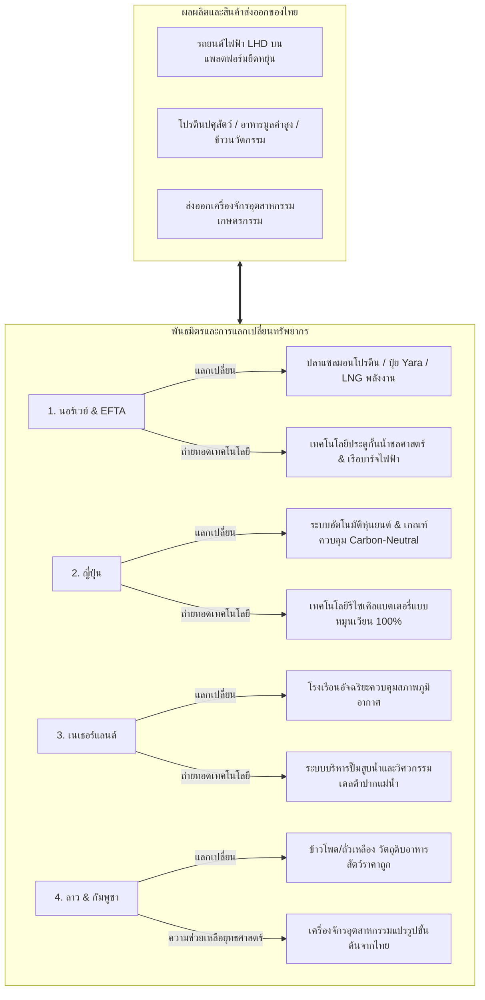

# ยุทธศาสตร์พันธมิตรต่างตอบแทนและจัดหาทรัพยากรระดับโลกเพื่อความมั่นคงทางอุตสาหกรรม (Global Resource Barter Alliance & Geostrategic Industrial Sourcing Policy)

**Date Added:** 2026-05-08  
**Status:** 💡 Idea (ไอเดียตั้งต้น)  
**Category:** Geopolitics / Industrial Strategy / Food Security / Barter Trade  

---

## 1. The Real-world Problem (ปัญหาบนโลกจริง)

### 1.1 วิกฤตการพึ่งพาตัวกลางทางการเงินและความผันผวนของค่าเงินสกุลหลัก (Sovereign Currency Risks & Geopolitical Volatility)
ห่วงโซ่อุปทานอุตสาหกรรมหนักและพลังงานโลกในปัจจุบันเผชิญกับ **"ภาวะความหนืดทางการเงินมหาศาล" (Financial Friction & Liquidity Bottlenecks)** เนื่องจากการทำธุรกรรมนำเข้าและส่งออกทรัพยากรพื้นฐาน เช่น พลังงาน ปุ๋ยเคมี และสินแร่ทองแดงหรือเหล็กดิบ ต้องผ่านตัวกลางทางการเงินและขึ้นตรงกับสกุลเงินดอลลาร์สหรัฐฯ ($USD$) และระบบชำระเงิน SWIFT:
*   **ความผันผวนของราคาสินค้าโภคภัณฑ์และค่าเงิน:** เมื่อประเทศมหาอำนาจดำเนินนโยบายทางการเงินแบบตึงตัวหรือผ่อนคลาย (QE) ราคาของแร่ธาตุอุตสาหกรรมและก๊าซธรรมชาติเหลว (LNG) จะเกิดความผันผวนอย่างรุนแรงทันที ส่งผลให้เกิดการเก็งกำไรในตลาดตราสารอนุพันธ์ ทำลายเสถียรภาพทางการคลังของประเทศผู้พัฒนาใหม่เช่นไทยอย่างหนัก
*   **ความเสี่ยงจากจุดปะทะทางภูมิรัฐศาสตร์ (Geopolitical Chokepoints):** เหมืองแร่คุณภาพและทรัพยากรพลังงานที่ไทยนำเข้า ส่วนใหญ่ต้องเคลื่อนย้ายผ่านช่องแคบมะละกา หรือคลองสุเอซ ซึ่งมีความเสี่ยงจากการกีดกันทางการค้า สงคราม และโจรสลัด ซึ่งจะขัดขวางการเข้าถึงทรัพยากรขั้นพื้นฐานในกรณีฉุกเฉิน

### 1.2 ข้อจำกัดทางอุตสาหกรรมต้นน้ำและขาดแคลนเทคโนโลยีเฉพาะทางในประเทศไทย
แม้ว่าประเทศไทยจะมีความสามารถในการรับจ้างผลิตปลายน้ำสูงเป็นอันดับต้นๆ ของอาเซียน แต่เราเผชิญกับคอขวดที่ร้ายแรงในโครงสร้างการผลิตต้นน้ำ (Foundational Industrial Deficits):
*   **การขาดแคลนเทคโนโลยีระบบประตูกั้นน้ำและอุตสาหกรรมการขนส่งทางน้ำ:** แผนการสร้างคลอง "Water Ring Road" ความยาว 1,400 กิโลเมตร ต้องการโครงสร้างระบบประตูกั้นน้ำชลศาสตร์ (Hydraulic Lock Chambers) และระบบขับเคลื่อนเรือบาร์จอัจฉริยะที่ไทยยังไม่มีความเชี่ยวชาญเพียงพอในระดับสากล
*   **การผูกขาดเทคโนโลยีปุ๋ยเคมีคุณภาพสูงและพลังงานสะอาดต้นน้ำ:** ปัจจุบันประเทศไทยต้องนำเข้าแม่ปุ๋ยไนโตรเจน ฟอสฟอรัส และโพแทสเซียมจากตะวันออกกลางและจีนเป็นมูลค่าหลายหมื่นล้านบาทต่อปี ส่งผลให้ต้นทุนเกษตรกรไทยถูกกำหนดโดยปัจจัยภายนอกที่ไม่สามารถควบคุมได้
*   **คอขวดทางวัสดุศาสตร์และการผลิตชิ้นส่วนรถยนต์ไฟฟ้าพวงมาลัยซ้าย (LHD):** ตลาดส่งออกยานยนต์ไฟฟ้ายักษ์ใหญ่ของโลก โดยเฉพาะในกลุ่มสมาคมการค้าเสรียุโรป (EFTA) และอเมริกาใต้ พึ่งพารถยนต์พวงมาลัยซ้าย (Left-Hand Drive - LHD) ในขณะที่กำลังผลิตและโครงสร้างวิศวกรรมการออกแบบของไทยถูกกำหนดให้สร้างรถยนต์พวงมาลัยขวา (Right-Hand Drive - RHD) เป็นหลัก ทำให้สูญเสียโอกาสทางการค้ามหาศาล

---

## 2. Proposed Solution & Policy (ข้อเสนอ / นโยบาย)

เพื่อทำลายคอขวดเชิงทรัพยากรและเทคโนโลยี ยุทธศาสตร์นี้เสนอให้จัดตั้ง **"ยุทธศาสตร์ระบบแลกเปลี่ยนทรัพยากรและถ่ายทอดเทคโนโลยีแบบสองทิศทาง" (Bilateral Barter & Tech-Acquisition Framework)** เพื่อแลกเปลี่ยนความมั่นคงทางอาหารและอุตสาหกรรมสำเร็จรูปของไทย กับทรัพยากรต้นน้ำและเทคโนโลยีเฉพาะทางของประเทศพันธมิตร โดยมีโครงสร้างบูรณาการดังต่อไปนี้:



### 2.1 พันธมิตรนอร์เวย์-ไทย และกรอบความร่วมมือ EFTA (The Norway-Thailand EFTA Sovereign Barter Deal)
สร้างกรอบข้อตกลงแลกเปลี่ยนทรัพยากรเชิงกลยุทธ์โดยตรงกับนอร์เวย์ภายใต้ความร่วมมือ EFTA เพื่อความมั่นคงทางพลังงาน ปุ๋ย และเทคโนโลยีทางเรือ:
1.  **กลไกการแลกเปลี่ยน "ยานยนต์ไฟฟ้าแลกสินทรัพย์ทางทะเลและพลังงาน" (EVs-for-Energy & Sea Assets Swap):**
    *   **สิ่งที่เราส่งออก:** ประเทศไทยจะใช้ความได้เปรียบของการมีฐานการผลิตชิ้นส่วนอิเล็กทรอนิกส์และโรงงานประกอบแบตเตอรี่โซเดียมไอออนในภาคอีสาน ดำเนินการจัดตั้งสายการผลิตยานยนต์ไฟฟ้าอเนกประสงค์ระบบพวงมาลัยซ้าย (Left-Hand Drive - LHD EVs) บนสายพานการประกอบที่ยืดหยุ่นสูง (Flexible Assembly Lines) ในนิคมอุตสาหกรรมภาคใต้และภาคตะวันออก เพื่อผลิตส่งออกป้อนตลาดนอร์เวย์และยุโรปเหนือโดยตรงในราคาย่อมเยา
    *   **สิ่งที่เราได้รับกลับคืน:** แลกเปลี่ยนโดยตรงโดยไม่พึ่งพาเงินตราสกุลที่สามกับ **ปลาแซลมอนนอร์เวย์เกรดพรีเมียม (Premium Salmon)** เพื่อเป็นแหล่งโปรตีนและไขมันดี (Omega-3 Fatty Acids) ราคาถูกป้อนสู่ห่วงโซ่อาหารไทยทดแทนการนำเข้าไขมันสัตว์คุณภาพต่ำ, แลกเปลี่ยนนำเข้า **ก๊าซธรรมชาติเหลว (LNG) จาก Equinor** เพื่อสร้างความเสถียรให้กับระบบสำรองพลังงานไฟฟ้าของประเทศ, และแลกเปลี่ยนนำเข้า **ปุ๋ยไนโตรเจนคาร์บอนต่ำแบรนด์ Yara** เพื่อแจกจ่ายตรงให้แก่เกษตรกรในโครงการโซนนิ่งของรัฐในราคาอุดหนุนพิเศษ 40%
2.  **การถ่ายทอดเทคโนโลยีวิศวกรรมขั้นสูง (Deep Tech Transfer):**
    *   **เทคโนโลยีประตูกั้นน้ำชลศาสตร์และอุโมงค์เจาะลึก (Maritime Hydraulic Locks & Boring Tech):** นอร์เวย์จะถ่ายทอดองค์ความรู้และส่งทีมวิศวกรโครงสร้างพื้นฐานมาช่วยประเทศไทยออกแบบและวางระบบโครงข่ายประตูกั้นน้ำอัจฉริยะและระบบคูคลองในพื้นที่ต่างระดับความสูงของโครงการคลอง 1,400 กม. พร้อมสนับสนุนเทคโนโลยีเครื่องเจาะอุโมงค์ลึก (Tunnel Boring Machines) เพื่อใช้เจาะวางท่อน้ำแรงดันสูงใต้ดินผันน้ำผ่านแนวเทือกเขาข้ามภูมิภาค
    *   **เทคโนโลยีการต่อเรือและระบบขับเคลื่อนบาร์จไฟฟ้าอัตโนมัติ (Electric Automated Cargo Barges):** นอร์เวย์จะสนับสนุนเทคโนโลยีการออกแบบสถาปัตยกรรมเรือบรรทุกสินค้าขับเคลื่อนด้วยไฟฟ้าและไฮโดรเจนสะอาด พร้อมระบบขับเคลื่อนกึ่งอัตโนมัติ เพื่อให้ไทยสามารถเปิดโรงต่อเรือและโรงประกอบเครื่องยนต์เรือเดินทะเลรุ่นใหม่ในท่าเรือฝั่งอันดามันตอนใต้

### 2.2 พันธมิตรนวัตกรรมวงจรปิดญี่ปุ่นและโมเดลการผลิตเอนโทรปีต่ำ (Japan Circular Automation Partnership)
สถาปนาพันธมิตรความเชื่อถือด้านระบบอัตโนมัติร่วมกับผู้ผลิตเทคโนโลยีญี่ปุ่นเพื่อยกระดับความบริสุทธิ์ของผลิตภัณฑ์ขั้นสูง:
1.  **เทคโนโลยีห้องสะอาดปลอดฝุ่นและวิศวกรรมความแม่นยำสูง (Ultra-Clean Cleanrooms & Precision Machining):** ญี่ปุ่นจะร่วมทุนจัดตั้งสถาบันวิศวกรรมความแม่นยำและห้องสะอาดชั้นสูง (Precision Cleanroom Facilities) ในนิคมอุตสาหกรรมภาคอีสานตอนบน เพื่อประยุกต์ใช้เทคโนโลยีในการสกัดเกลือหินโพแทชและการหลอมสารซิลิกอนความบริสุทธิ์สูงจากชีวมวลแกลบข้าวเหนียวป้อนอุตสาหกรรมชิปเซมิคอนดักเตอร์และแผงวงจรในประเทศ
2.  **การหมุนเวียนแบตเตอรี่แบบปิดระบบ 100% (Circular EV Battery Recycling):** นำระบบการจัดการเศษซากวัสดุหลังผ่านการใช้งาน (End-of-life Circularity) ของญี่ปุ่นเข้ามาควบคุมขั้นตอนการถอดแยกชิ้นส่วนแบตเตอรี่โซเดียมไอออนและลิเธียมไอออน เพื่อดึงวัสดุกลับมารีไซเคิลเป็นองค์ประกอบเคมีของแบตเตอรี่ใหม่ได้ถึง $98\%$ เพื่อควบคุมการปล่อยมลพิษเข้าสู่สิ่งแวดล้อมให้เป็นศูนย์ตามมาตรฐานความตึงเชิงอุตสาหกรรมแบบก้าวหน้า (Carbon-Neutral Manufacturing Standards)

### 2.3 พันธมิตรภูมิอากาศชลศาสตร์เนเธอร์แลนด์ (The Dutch Climatology & Delta Water Management Alliance)
นำความเชี่ยวชาญระดับโลกของเนเธอร์แลนด์มาปฏิรูปความปลอดภัยด้านอุทกภัยและสร้างอุตสาหกรรมพืชอาหารทางเลือก:
1.  **เทคโนโลยีโรงเรือนอัจฉริยะควบคุมสภาพภูมิอากาศเชิงสัมบูรณ์ (Controlled-Environment Smart Greenhouses):** เนเธอร์แลนด์จะส่งมอบเทคโนโลยีและวิศวกรรมควบคุมความชื้น แสงสว่างสังเคราะห์ และความเข้มข้นคาร์บอนในพื้นที่ปิดแก่สถาบันวิจัยการเกษตรภาคเหนือ เพื่อรักษาประสิทธิภาพของแปลงทดลองขยายพันธุ์พืชสวนเมืองหนาวและมะนาวทนทานสูงในทุกสภาพอากาศที่รุนแรง
2.  **วิศวกรรมปั๊มน้ำมหาภาคและการป้องกันภัยพิบัติบริเวณปากแม่น้ำ (Delta Works Hydro-Pumping Engineering):** ถ่ายทอดและร่วมออกแบบโครงสร้างระบบปั๊มสูบส่งน้ำปริมาตรมหาศาลทนความตึงสูง (High-Volume Axial-Flow Pumping Stations) ณ ปลายสายทางออกคลองระบายน้ำ 1,400 กม. ในเขตจังหวัดสมุทรปราการ เพื่อผลักดันน้ำจืดจากอุทกภัยออกสู่ทะเลอย่างรวดเร็วในช่วงฤดูน้ำหลาก และต้านการหนุนเข้าของน้ำเค็ม (Saltwater Intrusion Barrier) ได้อย่างเป็นระบบ

### 2.4 ยุทธศาสตร์ความมั่นคงทางพืชอาหารสัตว์อาเซียนและการส่งถ่ายต้นทุนต่ำ (Regional Crop Arbitrage with Laos & Cambodia)
เพิ่มประสิทธิภาพการใช้พื้นที่ดินและกระจายความเสี่ยงด้านค่าแรงผ่านข้อตกลงการค้าร่วมกับกลุ่มพันธมิตรลุ่มน้ำโขง:
1.  **การย้ายฐานการปลูกพืชแคลอรี่ต่ำและพืชอาหารสัตว์หยาบดิบ (Outsourcing Low-Yield Feed Crops):** รัฐบาลไทยจะจัดทำสัญญาสิทธิพิเศษร่วมกับ ลาว และ กัมพูชา เพื่อส่งเสริมและใช้สัญญาย้ายฐานการเพาะปลูกข้าวโพดเลี้ยงสัตว์หยาบและถั่วเหลืองราคาถูกที่ใช้แรงงานและพื้นที่ดินกว้างขวางไปปลูกในสองประเทศนี้ภายใต้การควบคุมมาตรฐานเกษตรกรรมยั่งยืน โดยหลีกเลี่ยงกระบวนการเผาทำลายป่า
2.  **มาตรการซื้อขายต่างตอบแทนด้านอาหารและเทคโนโลยี (Machinery-for-Grains Barter Mechanism):** ไทยจะยกเว้นภาษีนำเข้าเมล็ดพืชวัตถุดิบอาหารสัตว์เหล่านี้เป็นศูนย์ และสนับสนุนการจัดตั้งศูนย์การบดแปรรูปและคลังกระจายสินค้าป้อนโรงงานผลิตอาหารสัตว์ไทยริมชายฝั่งเพื่อส่งเสริมต้นทุนโปรตีนปศุสัตว์ให้ลดต่ำลง แลกกับการที่ไทยจะส่งออกความมั่นคงในรูปแบบของเครื่องจักรอุตสาหกรรมแปรรูปการเกษตร (Agricultural Food Processing Machinery) เทคโนโลยีปุ๋ยแอมโมเนียที่ผลิตร่วมกับพาร์ตเนอร์นอร์เวย์ และแบตเตอรี่โซเดียมไอออนราคาประหยัดจากภาคอีสานไปสนับสนุนกระบวนการพัฒนาประเทศของเขา เป็นการเกื้อกูลความมั่งคั่งและรักษาความมั่นคงทางอาหารของภูมิภาคร่วมกันอย่างถาวร

---

## 3. UET Perspective (มุมมองเชิงระบบตามทฤษฎี UET)

ภายใต้แบบจำลองฟิสิกส์เชิงปริมาณของ **Unity Equilibrium Theory (UET)** ห่วงโซ่อุปทานการค้าระหว่างประเทศจะถูกวิเคราะห์ในฐานะ **"กระบวนการไหลเวียนและแลกเปลี่ยนความหนาแน่นเชิงเอนโทรปีของระบบเปิดข้ามพรมแดน" (Trans-boundary Entropy Flux Coordination)**

```markdown
ประเทศไทย (ความหนาแน่นสารสนเทศชีวภาพอาหารสูง, ขาดสารเคมีและแร่วัสดุหนัก) 
      <===> [สะพานเชื่อมสมดุลอุณหพลศาสตร์ / การค้าร่วมต่างตอบแทน] <===> 
นอร์เวย์ / ยุโรป (ความหนาแน่นเคมีภัณฑ์และโครงสร้างหนักสูง, ขาดพืชพลังงานแคลอรี่คงที่)
```

### 3.1 การจัดสัดส่วนและถ่ายโอนความหนาแน่นเชิงศักย์พลังงาน (Geographical Chemical Potential Disparity)
ทรัพยากรธรรมชาติและขีดความสามารถทางวิชาการของแต่ละภูมิภาคบนโลกไม่ได้กระจายตัวอย่างสม่ำเสมอตามธรรมชาติ ทำให้เกิดความแตกต่างของระดับศักย์ทางเคมีและข้อมูล ($Potential\ Difference$):
*   ประเทศนอร์เวย์มีศักย์พลังงานเคมีจากการส่งออก LNG และปุ๋ยเคมีสูงมาก แต่ขาดสารสนเทศชีวภาพในการจัดการวงจรห่วงโซ่อุปทานอาหารและโปรตีนดิบเพื่อป้อนประชากรตลอดปีเนื่องจากภูมิอากาศที่เหน็บหนาว
*   ประเทศไทยมีพลังงานศักย์ชีวภาพและข้อมูลจากความอุดมสมบูรณ์ของอาหารสูงมาก แต่มีระดับพลังงานต่ำในการขับเคลื่อนอุตสาหกรรมหนักและการจัดการน้ำขนาดใหญ่
*   **การวิเคราะห์ UET:** ข้อตกลงการค้าต่างตอบแทนคือการสร้าง **"เครื่องต้านทานระดับความหนืดเชิงระบบต่ำ" (Systemic Low-Resistance Thermodynamic Bridge)** เพื่อถ่ายโอน exergy ส่วนเกินข้ามทวีป:
    $$\Delta \mu_k = \mu_k^{\text{Thailand}} - \mu_k^{\text{Norway}}$$
    โดยการแลกเปลี่ยนมวลสารทางกายภาพตามแนวความต่างศักย์นี้โดยตรง จะช่วยลดค่าเอนโทรปีจากการทำธุรกรรมผ่านตัวกลางทางการเงินและลดความปั่นป่วนทางพลังงานจากการกระจายสินค้าอย่างไร้ทิศทาง ทำให้ระบบเศรษฐกิจทั้งสองฝ่ายเคลื่อนตัวเข้าสู่สภาวะสมดุลเชิงรุกร่วมกัน (Sovereign Symbiotic Equilibrium)

### 3.2 การรักษาความมั่นคงทางเอนโทรปีทางภูมิรัฐศาสตร์ (Geopolitical Entropy Isolation)
การจัดโครงสร้างการเคลื่อนที่ของวัตถุดิบและระบบโลจิสติกส์การเดินเรือตรงจากฝั่งอันดามันตอนใต้ของไทยสู่ท่าเรือพันธมิตรโดยไม่ผ่านพื้นที่สงครามหรือจุดปะทะอุณหภูมิจราจรหนาแน่น (Geopolitical Chokepoints) เปรียบเสมือนการปิดระบบกั้นเสียงและแรงต้านจากภายนอก (Geopolitical Noise Isolation) ช่วยรักษาอัตราการไหลของมวลสารให้คงที่ รักษาพลังงานศักย์ของระบบให้พร้อมจ่าย (System exergy availability) และลดความเสี่ยงที่ระบบภายนอกจะเข้ามารบกวนจนทำให้เกิดความวุ่นวายสลายระเบียบของห่วงโซ่อุปทานภายในประเทศ

---

## 4. Future Research Needs (สิ่งที่ต้องวิจัยเพิ่มในอนาคต)

### 4.1 แบบจำลองพลศาสตร์การวิเคราะห์ความมั่นคงทางแร่ธาตุและอัตราส่วนการค้ากายภาพ (Sovereign General Equilibrium & Barter Modeling)
1.  **การพัฒนาแบบจำลองคำนวณสมดุลการแลกเปลี่ยนทรัพยากร (Quantitative General Physical Barter Index):** วิจัยสูตรคำนวณอัตราส่วนการแลกเปลี่ยนสินค้าทางกายภาพขั้นสูงที่อิงค่าดัชนีพลังงานจลน์และการลดเอนโทรปี (Exergy-based Terms of Trade) เช่น อัตราส่วนปริมาณน้ำมันก๊าซเหลว (LNG) หรือปุ๋ยแอมโมเนียต่อตันข้าวสารอุตสาหกรรมแปรรูป หรือจำนวนรถยนต์ไฟฟ้า LHD เพื่อสะท้อนความเป็นจริงของขีดจำกัดทางฟิสิกส์มากกว่าตัวเลขสกุลเงินกระดาษ:
    $$\eta_{\text{barter}} = \frac{T \cdot \Delta S_{\text{entropy decrease}}}{Q_{\text{logistics}}}$$
2.  **แบบจำลองจำลองพลศาสตร์ห่วงโซ่อุปทานยางพาราคอมโพสิตกราฟีนข้ามประเทศ:** วิเคราะห์ระยะเวลาและผลกระทบของเส้นทางเดินเรือตรงผ่านช่องทางอันดามันเพื่อเปรียบเทียบความเสถียรของปริมาณการส่งสินค้า ยางพารา และแบตเตอรี่โซเดียมไอออนไปยังตลาดเป้าหมายในอเมริกาใต้และทวีปยุโรป

### 4.2 การวิจัยร่วมวิศวกรรมทางเรือชลศาสตร์เชิงอุณหพลศาสตร์ (Collaborative Hydraulic Marine Research)
1.  **การทดสอบประสิทธิภาพประตูระบายน้ำแบบขั้นบันไดทนต่อการขยายตัวทางความร้อน:** วิจัยวัสดุคอนกรีตเสริมแรงที่ต้านทานการขัดสีและมีเสถียรภาพสูงในสภาพภูมิประเทศที่มีระดับน้ำและการเคลื่อนของแผ่นดินผันผวนสูง โดยประสานวิจัยเทคโนโลยีคอมพิวเตอร์ร่วมกับสถาบันวิศวกรรมของนอร์เวย์
2.  **การวิจัยแบตเตอรี่โซเดียมไอออนประสิทธิภาพสูงที่เหมาะสมกับสภาพเรือบาร์จอุณหภูมิร้อนชื้น:** พัฒนาสูตรขั้วแคโทดของแบตเตอรี่โซเดียมไอออนและของเหลวอิเล็กโทรไลต์ที่ป้องกันการเสื่อมถอยความร้อนและต้านกระแสกัดเซาะของเกลือชายฝั่งทะเลอ่าวไทยและอันดามัน

### 4.3 โครงข่ายสัญญาต่างตอบแทนในอนุภูมิภาคลุ่มน้ำโขง (Trans-boundary Sub-regional Policy Architecture)
1.  **สัญญาสิทธิประโยชน์และความสอดคล้องนโยบายสิ่งแวดล้อมอาเซียน:** ออกแบบข้อตกลงพหุภาคีเพื่อกำหนดแนวทางการติดตามพิกัดแปลงเกษตรและใช้ดาวเทียมตรวจจับจุดความร้อน (Hotspots Tracker API) เพื่อควบคุมดูแลไม่ให้แปลงข้าวโพดของฝั่งลาวและกัมพูชาที่มีเป้าหมายป้อนโรงอาหารสัตว์ไทยก่อการเผาป่าสร้างมลพิษข้ามแดน (Transboundary PM2.5 Compliance)
2.  **กรอบการวิจัยเทคโนโลยีส่งต่อเครื่องจักรอุตสาหกรรมในเศรษฐกิจฐานรากเพื่อนบ้าน:** ศึกษาประเมินความพร้อมทางทักษะฝีมือแรงงานท้องถิ่นและความสามารถในการรองรับเทคโนโลยีเกษตรกรรมจากไทยของแรงงานกัมพูชาและลาว เพื่อจัดตั้งสถาบันอบรมวิชาชีพร่วมเพื่อความมั่นคงยั่งยืนของทั้งภูมิภาค

---

## 5. References & Resources (แหล่งอ้างอิงและข้อมูลเสริม)

*   **ทฤษฎีและยุทธศาสตร์ร่วม UET (Connected UET Pillars):**
    *   [Topic 0.15 - ความมั่นคงทางภูมิรัฐศาสตร์และโครงสร้างพื้นฐานป้องกันตนเองแห่งอนาคต (Geopolitical Infrastructure and Sovereign Security)](file:///c:/Users/santa/Desktop/uet_harness/docs/incubator/01_policy_and_strategy)
    *   [Topic 0.22 - วิศวกรรมวัสดุสารกึ่งตัวนำและห่วงโซ่อุปทานระบบรางและทางเรือขั้นสูง (Advanced Railroad & Marine Semiprotective Materials)](file:///c:/Users/santa/Desktop/uet_harness/docs/incubator/03_logistics_and_infra)
    *   [Topic 0.40 - ยุทธศาสตร์การบริหารความต่างศักย์อุณหพลศาสตร์และสมดุลการค้าร่วมโลก (Global Thermodynamic Equilibrium Sourcing and Barter Policy)](file:///c:/Users/santa/Desktop/uet_harness/docs/incubator/04_industry_and_production)
*   **งานวิจัยและกรณีศึกษาระดับนานาชาติ:**
    *   *Sovereign Barter Agreements & Commodity Exchanges.* UNCTAD Policy Research Series (2021). (แนวทางข้อตกลงการแลกเปลี่ยนสินค้าของสหประชาชาติ)
    *   *Yara’s Green Ammonia Carbon-free Fertilizer Project (Norway).* Yara International. (กรณีศึกษาปุ๋ยไนโตรเจนสะอาดคาร์บอนต่ำ)
    *   *Equinor LNG Sourcing and Baltic Region Energy Sovereignty Framework.* Equinor Research (2024). (รายงานเสถียรภาพพลังงานและการกระจายก๊าซธรรมชาติเหลวอย่างปลอดภัยของยุโรปเหนือ)
    *   *Dutch Delta Works and Smart High-Volume Water Pumping Stations Engineering.* Rijkswaterstaat, Netherlands (2023). (กรณีศึกษาการจัดการชลศาสตร์มหาภาคปราบภัยพิบัติ)
