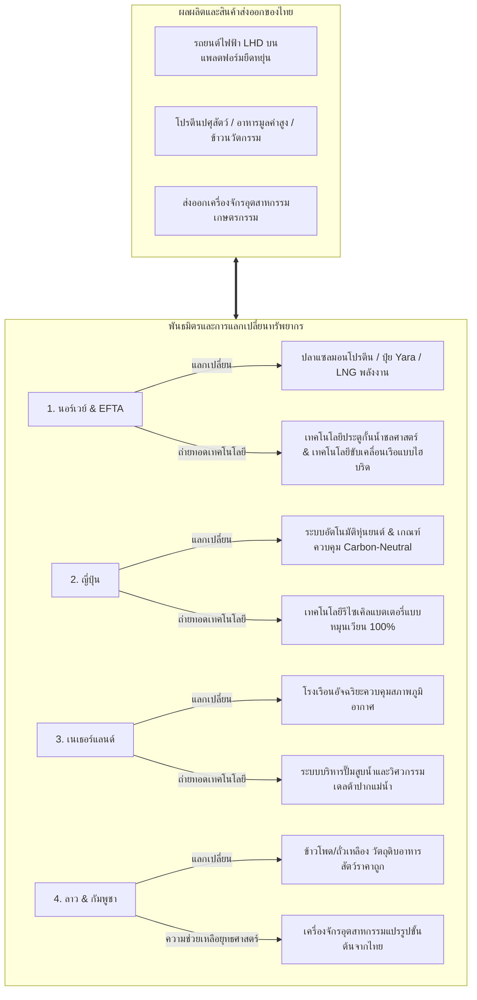

# ยุทธศาสตร์พันธมิตรต่างตอบแทนและจัดหาทรัพยากรระดับโลกเพื่อความมั่นคงทางอุตสาหกรรม (Global Resource Barter Alliance & Geostrategic Industrial Sourcing Policy)

**Date Added:** 2026-05-08  
**Status:** 💡 Idea (ไอเดียตั้งต้น)  
**Category:** Geopolitics / Industrial Strategy / Food Security / Barter Trade  

---

## 1. The Real-world Problem (ปัญหาบนโลกจริง)

### 1.1 วิกฤตการพึ่งพาตัวกลางทางการเงินและความผันผวนของค่าเงินสกุลหลัก (Sovereign Currency Risks & Geopolitical Volatility)
ห่วงโซ่อุปทานอุตสาหกรรมหนักและพลังงานโลกในปัจจุบันเผชิญกับ **"ภาวะความหนืดทางการเงินมหาศาล" (Financial Friction & Liquidity Bottlenecks)** เนื่องจากการทำธุรกรรมนำเข้าและส่งออกทรัพยากรพื้นฐาน เช่น พลังงาน ปุ๋ยเคมี และสินแร่ทองแดงหรือเหล็กดิบ ต้องผ่านตัวกลางทางการเงินและขึ้นตรงกับสกุลเงินดอลลาร์สหรัฐฯ ($USD$) และระบบชำระเงิน SWIFT:
*   **ความผันผวนของราคาสินค้าโภคภัณฑ์และค่าเงิน:** เมื่อประเทศมหาอำนาจดำเนินนโยบายทางการเงินแบบตึงตัวหรือผ่อนคลาย (QE) ราคาของแร่ธาตุอุตสาหกรรมและก๊าซธรรมชาติเหลว (LNG) จะเกิดความผันผวนอย่างรุนแรงทันที ส่งผลให้เกิดการเก็งกำไรในตลาดตราสารอนุพันธ์ ทำลายเสถียรภาพทางการคลังของประเทศผู้พัฒนาใหม่เช่นไทยอย่างหนัก
*   **ความเสี่ยงจากจุดปะทะทางภูมิรัฐศาสตร์ (Geopolitical Chokepoints):** เหมืองแร่คุณภาพและทรัพยากรพลังงานที่ไทยนำเข้า ส่วนใหญ่ต้องเคลื่อนย้ายผ่านช่องแคบมะละกา หรือคลองสุเอซ ซึ่งมีความเสี่ยงจากการกีดกันทางการค้า สงคราม และโจรสลัด ซึ่งจะขัดขวางการเข้าถึงทรัพยากรขั้นพื้นฐานในกรณีฉุกเฉิน

### 1.2 ข้อจำกัดทางอุตสาหกรรมต้นน้ำและขาดแคลนเทคโนโลยีเฉพาะทางในประเทศไทย
แม้ว่าประเทศไทยจะมีความสามารถในการรับจ้างผลิตปลายน้ำสูงเป็นอันดับต้นๆ ของอาเซียน แต่เราเผชิญกับคอขวดที่ร้ายแรงในโครงสร้างการผลิตต้นน้ำ (Foundational Industrial Deficits):
*   **การขาดแคลนเทคโนโลยีระบบประตูกั้นน้ำและอุตสาหกรรมการขนส่งทางน้ำ:** แผนการสร้างคลอง "Water Ring Road" ความยาว 1,400 กิโลเมตร ต้องการโครงสร้างระบบประตูกั้นน้ำชลศาสตร์ (Hydraulic Lock Chambers) และระบบต่อเรือลำเลียงขนาดใหญ่/เรือบาร์จลูกผสม (Hybrid/Mixed-Fleet Barges) ที่ไทยยังไม่มีความเชี่ยวชาญเพียงพอในระดับสากล
*   **การผูกขาดเทคโนโลยีปุ๋ยเคมีคุณภาพสูงและพลังงานสะอาดต้นน้ำ:** ปัจจุบันประเทศไทยต้องนำเข้าแม่ปุ๋ยไนโตรเจน ฟอสฟอรัส และโพแทสเซียมจากตะวันออกกลางและจีนเป็นมูลค่าหลายหมื่นล้านบาทต่อปี ส่งผลให้ต้นทุนเกษตรกรไทยถูกกำหนดโดยปัจจัยภายนอกที่ไม่สามารถควบคุมได้
*   **คอขวดทางวัสดุศาสตร์และการผลิตชิ้นส่วนรถยนต์ไฟฟ้าพวงมาลัยซ้าย (LHD):** ตลาดส่งออกยานยนต์ไฟฟ้ายักษ์ใหญ่ของโลก โดยเฉพาะในกลุ่มสมาคมการค้าเสรียุโรป (EFTA) และอเมริกาใต้ พึ่งพารถยนต์พวงมาลัยซ้าย (Left-Hand Drive - LHD) ในขณะที่กำลังผลิตและโครงสร้างวิศวกรรมการออกแบบของไทยถูกกำหนดให้สร้างรถยนต์พวงมาลัยขวา (Right-Hand Drive - RHD) เป็นหลัก ทำให้สูญเสียโอกาสทางการค้ามหาศาล

---

## 2. Proposed Solution & Policy (ข้อเสนอ / นโยบาย)

เพื่อทำลายคอขวดเชิงทรัพยากรและเทคโนโลยี ยุทธศาสตร์นี้เสนอให้จัดตั้ง **"ยุทธศาสตร์ระบบแลกเปลี่ยนทรัพยากรและถ่ายทอดเทคโนโลยีแบบสองทิศทาง" (Bilateral Barter & Tech-Acquisition Framework)** เพื่อแลกเปลี่ยนความมั่นคงทางอาหารและอุตสาหกรรมสำเร็จรูปของไทย กับทรัพยากรต้นน้ำและเทคโนโลยีเฉพาะทางของประเทศพันธมิตร โดยมีโครงสร้างบูรณาการดังต่อไปนี้:




### 2.1 พันธมิตรนอร์เวย์-ไทย และกรอบความร่วมมือ EFTA (The Norway-Thailand EFTA Sovereign Barter Deal)
สร้างกรอบข้อตกลงแลกเปลี่ยนทรัพยากรเชิงกลยุทธ์โดยตรงกับนอร์เวย์ภายใต้ความร่วมมือ EFTA เพื่อความมั่นคงทางพลังงาน ปุ๋ย และเทคโนโลยีทางเรือ โดยใช้ผลิตภัณฑ์พรีเมียมจากเกษตรอุตสาหกรรมอนาคตของไทยเป็นสื่อกลางแลกเปลี่ยนทดแทนสกุลเงินดอลลาร์:
1.  **กลไกการแลกเปลี่ยน "สารอาหารและเชื้อเพลิงชีวภาพ แลกเปลี่ยนพลังงานและปัจจัยการผลิตอุตสาหกรรม" (Future Foods & Bio-SAF for Strategic Energy & Nutrients Swap):**
    *   **สิ่งที่เราส่งออก:** ประเทศไทยจะส่งออก **โดแป้งแช่แข็งและแป้งข้าวปราศจากกลูเตนระดับพรีเมียม (Gluten-Free Rice Flour & Frozen Dough)** ที่ผลิตจากข้าวหอมมะลิและข้าวไรซ์เบอร์รี่จากพื้นที่ชลเกษตรโซนนิ่งภาคกลางและอีสาน ป้อนเข้าสู่ห้างสรรพสินค้าและผู้จัดจำหน่ายอาหารสุขภาพในกลุ่มสมาคมการค้าเสรียุโรป (EFTA) ควบคู่กับการส่งออก **น้ำมันเชื้อเพลิงอากาศยานแบบยั่งยืนสกัดจากสาหร่าย (Microalgae-based Sustainable Aviation Fuel - Bio-SAF)** และน้ำมันดิบชีวภาพ (Bio-Crude) ที่เพาะเลี้ยงจากท่อโฟโตไบโอรีแอคเตอร์ปลายตลิ่ง บรรทุกเรือขนส่งสินค้าแช่เย็นตรงสู่นอร์เวย์
    *   **สิ่งที่เราได้รับกลับคืน:** แลกเปลี่ยนตรงกับ **ปลาแซลมอนนอร์เวย์ (Premium Salmon) และโปรตีนจากทะเล** ในราคาหน้าโรงงาน เพื่อกระจายเข้าสู่ห่วงโซ่อุปทานอาหารมวลชนในประเทศไทยผ่านตู้เย็นริมฝั่งคลอง 1,400 กม. เพื่อเพิ่มสัดส่วนโปรตีนคุณภาพสูงในการแก้ไขปัญหาสาธารณสุขโรคเบาหวานสะสม, นำเข้า **ก๊าซธรรมชาติเหลว (LNG) จาก Equinor** เพื่อสำรองพลังงานไฟฟ้าระดับชาติ, และนำเข้า **แม่ปุ๋ยคาร์บอนต่ำตรา Yara** เพื่อส่งป้อนสหกรณ์เกษตรกรไทยภายใต้การค้ำประกันบัญชีชำระราคาของรัฐในราคาอุดหนุนพิเศษ
2.  **การถ่ายทอดเทคโนโลยีวิศวกรรมขั้นสูง (Deep Tech Transfer):**
    *   **เทคโนโลยีประตูกั้นน้ำชลศาสตร์และอุโมงค์เจาะลึก (Maritime Hydraulic Locks & Boring Tech):** วิศวกรทางทะเลของนอร์เวย์จะถ่ายทอดเทคโนโลยีระบบประตูน้ำชลศาสตร์ควบคุมความหนืด (Control Hydraulic Lock Systems) และเทคโนโลยีอุโมงค์ผันน้ำแรงดันสูงใต้ดินข้ามเทือกเขา เพื่อสนับสนุนเสถียรภาพการไหลเวียนของน้ำจืดในโครงการคลองวงแหวน 1,400 กม.
    *   **ระบบขับเคลื่อนเรือบาร์จลูกผสมและเรืออัตโนมัติ (Hybrid Automated Cargo Barges):** ร่วมทุนสร้างอู่ต่อเรือในฝั่งอันดามันตอนใต้ของไทย โดยนำโมเดลระบบขับเคลื่อนทางน้ำแบบไฮบริด (ดีเซล-ไฟฟ้า) จากนอร์เวย์มาประกอบเรือบาร์จที่จะวิ่งลำเลียงผัก ผลไม้ และแร่ธาตุอุตสาหกรรมตามสายคลองหลัก เพื่อสนับสนุนนโยบายเปลี่ยนผ่าน (Transition Policy) ให้กองเรือดีเซลเดิมสามารถปรับปรุงเครื่องยนต์ (Retrofit) ได้โดยไม่เกิดภาระต้นทุนเฉียบพลัน

### 2.2 พันธมิตรนวัตกรรมวงจรปิดญี่ปุ่นและโมเดลการผลิตเอนโทรปีต่ำ (Japan Circular Automation Partnership)
สร้างสะพานเชื่อมพลังงานอุณหพลศาสตร์และเทคโนโลยีวัสดุเซมิคอนดักเตอร์กับอุตสาหกรรมญี่ปุ่น:
1.  **เทคโนโลยีห้องสะอาดปลอดฝุ่นและคลัสเตอร์แร่ซิลิคอนชีวภาพบริสุทธิ์สูง (Biogenic Semiconductor Silicon-to-Automation Swap):**
    *   **สิ่งที่เราส่งออก:** ประเทศไทยนำแกลบข้าวเหนียวและข้าวหอมมะลิซึ่งมีความเข้มข้นของซิลิกาสูงจากแปลงเกษตรอีสานตอนบน มาผ่านกระบวนการเผาควบคุมอุณหภูมิและการรีดักชันเคมีเชิงอุณหภาพเพื่อสกัด **"ซิลิคอนชีวภาพความบริสุทธิ์สูงพิเศษ 99.999%" (Biogenic High-Purity Silicon Wafers)** ส่งตรงป้อนอุตสาหกรรมการผลิตชิปเซมิคอนดักเตอร์ ชิ้นส่วนเซนเซอร์วัดค่า และแผงโซลาร์เซลล์ของบริษัทพันธมิตรญี่ปุ่น
    *   **สิ่งที่เราได้รับกลับคืน:** ญี่ปุ่นร่วมทุนตั้งนิคมอุตสาหกรรมความละเอียดสูงพร้อมติดตั้งสถาปัตยกรรมห้องสะอาดปลอดฝุ่นระดับนาโน (Ultra-Clean Cleanrooms) และสนับสนุน **ระบบหุ่นยนต์และระบบอัตโนมัติ (Precision Circular Automation & Robotics)** ป้อนเข้าสู่โรงงานประกอบชิ้นส่วนอิเล็กทรอนิกส์และโรงงานแปรรูปของไทยเพื่อขจัดความผันผวนจากแรงงานมนุษย์และรักษาเอนโทรปีของผลิตภัณฑ์ให้อยู่ในระดับต่ำสุดตามมาตรฐานญี่ปุ่น
2.  **ระบบการหมุนเวียนวัสดุแบตเตอรี่โซเดียมแบบปิด (Circular EV Battery Recycling):** นำนวัตกรรมแยกสลายเชิงความร้อนและเคมีของญี่ปุ่นมาร่วมจัดการการรีไซเคิลแบตเตอรี่โซเดียมไอออนและลิเธียมไอออนที่เสื่อมสภาพจากการใช้งานในโครงข่ายโลจิสติกส์เรือบาร์จไฟฟ้า ดึงวัสดุกลับคืนมาสู่กระบวนการผลิตใหม่ได้ถึง 98% เพื่อรับประกันมาตรฐานสิ่งแวดล้อมที่ไร้คาร์บอน (Carbon-Neutral Standard)

### 2.3 พันธมิตรภูมิอากาศชลศาสตร์เนเธอร์แลนด์ (The Dutch Climatology & Delta Water Management Alliance)
เปลี่ยนภัยพิบัติน้ำหลากให้เป็นทรัพยากรสร้างมูลค่าทางเศรษฐกิจร่วมกับวิศวกรรมเดลต้าของเนเธอร์แลนด์:
1.  **เทคโนโลยีโรงเรือนปิดควบคุมสิ่งแวดล้อมและศูนย์กระจายสินค้ายุโรป (Controlled-Environment Greenhouse & Rotterdam Cold-Chain Logistics Hub):**
    *   **ความร่วมมือและสิ่งที่เราส่งออก:** ร่วมมือกับสมาคมผู้ผลิตโรงเรือนอัจฉริยะเนเธอร์แลนด์เพื่อนำเทคโนโลยีควบคุมอุณหภูมิ ความเข้มแสงสังเคราะห์ และการดักจับ CO2 ในบรรยากาศมาติดตั้งในโรงเรือนปิดระดับพรีเมียม (Tier 1 Smart Greenhouses) ของไทย นำผลผลิตเกรดพรีเมียม โดยเฉพาะ **ซอสพริกศรีราชาสูตรเฉพาะที่ใช้พริกชี้ฟ้าเกษตรพันธสัญญาและกระเทียมโทนไทย** ส่งออกผ่านท่าเรือแหลมฉบังตรงสู่ **ศูนย์กระจายสินค้าโลจิสติกส์เย็นท่าเรือร็อตเตอร์ดัม (Rotterdam Logistics Hub)** เพื่อกระจายพริกและสมุนไพรไทยพรีเมียมขายทั่วยุโรป
    *   **สิ่งที่เราได้รับกลับคืน:** เทคโนโลยีควบคุมสภาวะสิ่งแวดล้อมที่ทำลายวงจรอัตราพืชผลเสียหายให้เป็นศูนย์ รักษาเสถียรภาพและคุณภาพสินค้าเกษตรพรีเมียมของไทยส่งออกได้ตลอดทั้งปี แม้ในภาวะภัยแล้งจัดหรือวิกฤตความร้อนภายนอกโรงเรือน
2.  **วิศวกรรมการระบายน้ำและการผลักดันกระแสน้ำปากแม่น้ำ (Macro DeltaWorks & High-Volume Pumping Stations):** เนเธอร์แลนด์ส่งผ่านเทคโนโลยีสถานีสูบระบายน้ำแรงดันสูงทนพายุมรสุม (Delta Works Coordinated Pumps) วางระบบปั๊มอัจฉริยะขับเคลื่อนด้วยคลื่นน้ำและพลังงานโซลาร์เซลล์ บริเวณปากประตูระบายน้ำฝั่งสมุทรปราการและชลบุรี เพื่อเปิดทางระบายน้ำจืดความเร็วสูงออกสู่ทะเลอย่างนุ่มนวล พร้อมดันน้ำเค็มหนุนย้อนกลับได้แบบเรียลไทม์

### 2.4 ยุทธศาสตร์ความมั่นคงทางพืชอาหารสัตว์อาเซียนและการส่งถ่ายต้นทุนต่ำ (Regional Crop Arbitrage with Laos & Cambodia)
เพิ่มประสิทธิภาพและลดความผันผวนของราคาต้นทุนโปรตีนปศุสัตว์ในประเทศ โดยการจัดระเบียบเกษตรกรรมเพื่อนบ้าน:
1.  **การย้ายฐานการผลิตพืชเศรษฐกิจระดับล่างที่มีอัตราส่วน Exergy ต่ำ (Low-Exergy Agri-Outsourcing):** ไทยจะยกเลิกการส่งเสริมเกษตรกรในประเทศให้ปลูกพืชอาหารสัตว์ประเภทข้าวโพดเชิงเดี่ยวที่ให้ผลตอบแทนต่ำและสร้างปัญหามลพิษ PM2.5 บนเนินเขา โดยทำการโยกย้ายฐานการเพาะปลูกแบบรับซื้อตามเป้าหมาย (Contract Farming Agreements) ไปยังพื้นที่ราบกว้างขวางของ สปป.ลาว และกัมพูชา โดยสนับสนุนเมล็ดพันธุ์เทคโนโลยีประสิทธิภาพสูงที่คุมการทนแล้งของไทย และใช้กฎเหล็กห้ามการเผาป่าโดยเด็ดขาด ควบคุมด้วยดาวเทียมตรวจสอบพิกัดแปลงปลูก (Compliance Geofencing Satellite Systems)
2.  **มาตรการซื้อขายต่างตอบแทนและกระจายฐานอุตสาหกรรม (Strategic Capital-Grains Swap):** ไทยเปิดรับซื้อเมล็ดพืชอาหารสัตว์จากลาวและกัมพูชาผ่านอัตราภาษีนำเข้า 0% นำมาป้อนตรงเข้าสู่ศูนย์บดแปรรูปและคลังแปรรูปแอมโมเนียอาหารสัตว์ตามเส้นทางรางและเรือริมชายฝั่งเพื่อหักล้างต้นทุนอาหารสัตว์ไทยให้ลดต่ำลง แลกกับการส่งออกเครื่องจักรกลการเกษตรอเนกประสงค์ แบตเตอรี่โซเดียมไอออนราคาประหยัด และสิทธิ์การเข้าถึงปุ๋ยไนโตรเจน Yara ราคาพิเศษที่ไทยดีลได้ในบัญชีสัญญานอร์เวย์ เป็นการผูกขาดมิตรภาพเชิงโครงสร้างพื้นฐานอย่างถาวร

### 2.5 โครงสร้างกองทุนส่งเสริมการลงทุนร่วมทุนเพื่อรักษาเสถียรภาพทรัพยากรยุทธศาสตร์ (The Sovereign Wealth & Resource Stabilization Fund)
เพื่อจัดตั้งสถาบันทางการเงินที่มีอำนาจหน้าที่ในการประสานผลประโยชน์และบริหารห่วงโซ่มูลค่าระหว่างหน่วยงานรัฐวิสาหกิจและบริษัทเอกชนที่รัฐบาลร่วมถือหุ้น (เช่น ปตท. และธนาคารออมสิน) ซึ่งจะได้รับผลประโยชน์ทางตรงในเชิงธุรกิจ ห่วงโซ่อุปทาน และความมั่นคงเชิงวัตถุดิบ ยุทธศาสตร์นี้เสนอให้รัฐบาลจัดตั้ง **"กองทุนร่วมทุนรัฐวิสาหกิจเพื่อการรักษาเสถียรภาพทรัพยากรยุทธศาสตร์" (Sovereign Resource Investment & Stabilization Fund - SRISF)** ซึ่งเป็นการบูรณาการร่วมระหว่าง ปตท. (PTT - รัฐถือหุ้น 51%) และธนาคารออมสิน (GSB - รัฐถือหุ้น 100%):
1.  **กลไกการค้ำประกันการรับซื้อและการร่วมทุนโครงสร้างพื้นฐานทางพลังงานและวัสดุ (Enterprise-Led Resource Off-take & Capital Alignment):**
    *   บริษัท ปตท. จำกัด (มหาชน) จะจัดตั้ง **"กองทุนร่วมทุนพัฒนาพลังงานสะอาดและวัสดุอุตสาหกรรมแห่งอนาคต" (Sovereign Clean Energy & Material Investment Fund)** เพื่อร่วมลงทุนและค้ำประกันการรับซื้อน้ำมันดิบชีวภาพ แกลบข้าว และพืชพลังงานจากวิสาหกิจเกษตรกรในประเทศที่ดำเนินการตามเกณฑ์โซนนิ่ง ซึ่งจะเป็นการรักษาความมั่นคงของวัตถุดิบป้อนโรงกลั่นชีวภาพของ ปตท. เอง เพื่อผลิต Bio-SAF และซิลิคอนบริสุทธิ์สูงสำหรับสร้างมูลค่าเชิงธุรกิจระยะยาว
    *   ปตท. จะประสานการนำเข้า LNG จากคู่ค้าพันธมิตร (เช่น Equinor) และบริหารการนำเข้าปุ๋ยคาร์บอนต่ำ (เช่น Yara) เพื่อจำหน่ายผ่านเครือข่ายความร่วมมือของกลุ่มผู้ถือหุ้นและสหกรณ์ ซึ่งช่วยสร้างเสถียรภาพด้านต้นทุนวัตถุดิบและกระจายความเสี่ยงด้านห่วงโซ่อุปทานขององค์กรโดยตรง
2.  **ระบบสนับสนุนทางการเงินและสินเชื่อดอกเบี้ยผ่อนปรนเพื่อยกระดับห่วงโซ่อุปทาน (GSB Supply-Chain Soft Loan & Commercial Integration):**
    *   ธนาคารออมสิน (GSB) ในฐานะธนาคารรัฐวิสาหกิจ จะจัดตั้งโครงการสินเชื่อดอกเบี้ยผ่อนปรนพิเศษ (0.5% - 1.5% Soft Loans) เพื่อเป็นเงินทุนหมุนเวียนและจัดหาอุปกรณ์วิศวกรรมให้แก่กลุ่มเกษตรกรและผู้ประกอบการต้นน้ำ โดยจ่ายในลักษณะสินเชื่อเป้าหมายผ่าน **"ระบบเครดิตทรัพยากร" (Resource Credit Codes)** เพื่อป้องกันการนำเงินทุนไปใช้นอกวัตถุประสงค์ และเอื้อให้กลุ่มเกษตรกรนำมาจัดซื้อปุ๋ยเคมีหรือเครื่องจักรเกรดเทคโนโลยีผ่านเครือข่าย ปตท.
    *   เมื่อเกษตรกรเก็บเกี่ยวและส่งมอบผลผลิตกลับคืนผ่านศูนย์รับซื้อของพันธมิตร บัญชีของธนาคารออมสินจะหักล้างภาระหนี้ตามเกณฑ์ราคาค้ำประกันโดยตรง (Physical Clearing and Settlement) ช่วยลดความเสี่ยงหนี้เสีย (NPL) ของธนาคาร และสร้างยอดการทำธุรกรรมที่มีหลักทรัพย์ค้ำประกันทางกายภาพที่มั่นคง ช่วยเพิ่มประสิทธิภาพและความน่าเชื่อถือให้กับงบแสดงฐานะการเงินของออมสินโดยตรง

### 2.6 ยุทธศาสตร์แลกเปลี่ยนข้ามซีกโลกกับบราซิลและอินเดีย (Cross-Hemisphere Sourcing with Brazil & India)
1.  **บราซิล:** สร้างกลไกแลกเปลี่ยนสินค้าประมงแช่แข็งของไทย (Frozen Seafood) และชิ้นส่วนยานยนต์เพื่อแลกกับกากถั่วเหลือง (Soybean Meal) คุณภาพสูง ซึ่งบราซิลมีต้นทุนการผลิตต่ำกว่าไทยมาก
2.  **อินเดีย:** ใช้จุดแข็งด้านอุตสาหกรรมแป้งมันสำปะหลังแปรรูปและอาหารพร้อมทาน (Ready-to-eat Meals) แลกเปลี่ยนกับกากถั่วเหลืองและข้าวโพด เพื่อสร้างความมั่นคงทางวัตถุดิบและลดการพึ่งพาจากแหล่งเดียว

### 2.7 ยุทธศาสตร์เจาะตลาดแอฟริกาใต้และกลุ่มประเทศบริกส์ (South Africa & BRICS Barter Leverage)
1.  **การใช้อุตสาหกรรมยานยนต์สันดาปเป็นเครื่องมือต่อรอง (ICE Export Leverage):** ทวีปแอฟริกามีพื้นที่มหาศาลแต่ขาดแคลนโครงสร้างพื้นฐานด้านไฟฟ้าและประสบปัญหาไฟดับ (Load Shedding) ทำให้ไม่พร้อมสำหรับรถยนต์ไฟฟ้า (EV) ไทยสามารถส่งออกยานยนต์สันดาป (รถกระบะ ICE) และเครื่องจักรกลการเกษตร (รถไถ ระบบชลประทาน) ให้แก่แอฟริกาใต้เพื่อแลกกับสิทธิการรับซื้อกากถั่วเหลือง ข้าวโพด และแร่ธาตุสำคัญ (เช่น แมงกานีส แพลทินัม วาเนเดียม)
2.  **กลไกซอฟต์โลนรัฐต่อรัฐ (G2G Soft Loan & Anti-Land Grabbing):** เพื่อหลีกเลี่ยงข้อครหาเรื่องการกว้านซื้อที่ดิน (Land Grabbing) และความเสี่ยงทางภูมิรัฐศาสตร์ รัฐบาลไทยจะใช้รูปแบบ "การให้สินเชื่อผ่อนปรน (Soft Loan)" แก่รัฐบาลท้องถิ่นแอฟริกา โดยมีเงื่อนไขให้เกษตรกรท้องถิ่นนำเงินกู้มาซื้อรถแทรกเตอร์และเทคโนโลยีจากไทย และชำระคืนหนี้ด้วยผลผลิตทางการเกษตร (Soybean/Corn Barter Repayment) วิธีนี้ทำให้เกษตรกรแอฟริกันยังคงเป็นเจ้าของที่ดิน และประเทศไทยได้วัตถุดิบต้นน้ำที่มีราคาคงที่โดยไม่ต้องรับความเสี่ยงทางการเมือง

### 2.8 ยุทธศาสตร์การควบคุมสัดส่วนอธิปไตยและการสร้างความปลอดภัยทางกายภาพ (Sovereign Trade Proportions & Strategic Leverage Framework)
การบริหารห่วงโซ่อุปทานระหว่างประเทศ ในปัจจุบันอาศัยการจัดซื้อจัดจ้างผ่านตลาดเสรีและสกุลเงินสากล ซึ่งอาจมีความอ่อนไหวต่อความผันผวนของอัตราแลกเปลี่ยนและความตึงเครียดทางภูมิรัฐศาสตร์ ยุทธศาสตร์นี้จึงเสนอให้สร้าง **"เกราะป้องกันและกลไกการบริหารความเสี่ยง" (Hedging & Strategic Risk Management)** ผ่านการควบคุมสัดส่วนทางกายภาพเชิงอธิปไตย:
1.  **ข้อกำหนดสัดส่วนนำเข้าเชิงยุทธศาสตร์ขั้นต่ำ 40% (40%+ Strategic Import Cushion):**
    *   กำหนดสัดส่วนเชิงนโยบายความมั่นคงแห่งชาติให้มีโควตานำเข้าอย่างน้อย **40% ของความต้องการพื้นฐาน (Baseline Demand)** ในกลุ่มปัจจัยการผลิตที่สำคัญยิ่งยวด (เช่น ปุ๋ยและพลังงานสำรอง) ในรูปแบบการจับคู่ต่างตอบแทนทางกายภาพ (Physical Parity Swaps)
    *   การล็อกสัดส่วน 40% นี้ทำหน้าที่เป็นกันชน (Strategic Cushion) เพื่อรักษารากฐานภาคการผลิตของประเทศไม่ให้หยุดชะงักในยามเกิดวิกฤตความผันผวนของเสถียรภาพทางการเงินระหว่างประเทศ
2.  **กลไกการปรับสัดส่วนเพื่อรักษาเสถียรภาพต้นทุน (Dynamic Hedging & Cost Stabilization):**
    *   เมื่อตลาดโลกเกิดสภาวะราคาสินค้าพุ่งสูงอย่างรุนแรง หรืออัตราแลกเปลี่ยนค่าเงินแกว่งตัว จะมีการส่งสัญญาณปรับเพิ่มสัดส่วนการชำระราคาด้วยปริมาณผลผลิตเกษตรและพลังงานชีวภาพแปรรูปจาก 40% ไปจนถึงสูงสุด 60% แบบยืดหยุ่นชั่วคราว เพื่อลดต้นทุนที่เป็นเงินสดและปกป้องระบบการผลิตในประเทศจากวิกฤตเงินเฟ้อนำเข้า (Imported Inflation)
    *   วิธีนี้ช่วยรักษาเสถียรภาพราคาต้นทุนเฉลี่ยของปัจจัยพื้นฐานเหล่านี้ให้มีความเป็นระเบียบและคาดการณ์ได้ง่ายขึ้น เนื่องจากผูกโยงเข้ากับอัตราส่วนมวลสารและมูลค่าทางกายภาพจริง ไม่ใช่อัตราแลกเปลี่ยนทางการเงินสปอตเพียงอย่างเดียว
3.  **การป้องกันความปลอดภัยเชิงพื้นที่ของคลังทรัพยากร (Spatial Resource Cushioning):**
    *   จัดตั้งเครือข่ายคลังสินค้าเชิงยุทธศาสตร์แบบกระจายศูนย์ (Distributed Sovereign Hubs) เลียบแนวเส้นทางชลทางคลองวงแหวน 1,400 กิโลเมตร เพื่อรับมอบปุ๋ย Yara และ LNG แล้วทำหน้าที่ส่งกระจายตรงสู่ท้องถิ่นในระยะทางเฉลี่ยที่ต่ำที่สุด (Minimal Logistical Path) ป้องกันการขัดขวางการกระจายสินค้าในยามวิกฤตภัยพิบัติทางธรรมชาติหรือความขัดแย้งในประเทศ

### 2.9 ยุทธศาสตร์พันธมิตรเทคโนโลยีอธิปไตยและการแลกเปลี่ยนซอฟต์แวร์กับสหรัฐอเมริกา (US-Thailand Technology Sovereignty & Software Barter Framework)
สถาปนากลไกแลกเปลี่ยนทางกายภาพและพันธมิตรเชิงเทคโนโลยีกับยักษ์ใหญ่ซอฟต์แวร์และคลาวด์ของสหรัฐอเมริกา (เช่น Microsoft, Google) เพื่อสร้างอธิปไตยทางดิจิทัลและการประมวลผล (Digital Sovereignty) แทนที่การใช้จ่ายงบประมาณแผ่นดินซื้อสิทธิ์การใช้งานแบบกระจัดกระจายและผ่านนายหน้าตัวกลาง:
1.  **กลไกการแลกเปลี่ยน "ฮาร์ดแวร์เก็บข้อมูลและทำเลที่ตั้ง แลกเปลี่ยนสิทธิ์ซอฟต์แวร์พรีเมียมและโควตา AI" (Sovereign Infrastructure for Premium Software & Computing Quota Swap):**
    *   **สิ่งที่เราส่งออก/แลกเปลี่ยน:** ประเทศไทยนำจุดแข็งของการเป็นแหล่งผลิตอุปกรณ์เก็บข้อมูล (Hard Disk Drive - HDD) และชิ้นส่วนอิเล็กทรอนิกส์ต้นน้ำที่สำคัญของโลก ร่วมกับการจัดสรรกรรมสิทธิ์สิทธิ์การเช่าที่ดินเพื่อตั้งศูนย์ข้อมูล (Data Center) ในเขตอุดหนุนพื้นที่รกร้าง (เชื่อมโยงกับ [land_reform_progressive_tax.md](file:///c:/Users/santa/Desktop/uet_harness/docs/incubator/01_policy_and_strategy/land_reform_progressive_tax.md)) และการเชื่อมต่อไฟพลังงานสะอาด (Bio-SAF/Solar) ต่ำกว่าราคาตลาด มาอำนวยความสะดวกในการจัดตั้ง Data Center ขนาดใหญ่ของยักษ์ใหญ่เทคโนโลยีสหรัฐฯ ภายในประเทศโดยตรง
    *   **สิ่งที่เราได้รับกลับคืน:** แลกเปลี่ยนโดยตรงเป็นแพ็กเกจซอฟต์แวร์และบริการลิขสิทธิ์ระดับพรีเมียมราคาประหยัดสำหรับประชาชนทั้งประเทศ (National Software Subsidies) เช่น การอุดหนุนบัญชี Microsoft Game Pass ในราคาลดพิเศษสูงสุด (เหลือเพียง 60 บาท/เดือน หรือฟรีสำหรับสถานศึกษา), สิทธิ์การเข้าถึงบัญชี YouTube Premium สำหรับคุณครูและเยาวชนเพื่อตัดโฆษณาและลดสิ่งเร้าที่เป็นมลพิษทางข้อมูล, สิทธิ์การเข้าถึง ChatGPT Plus และระบบบริการประมวลผลคลาวด์ OpenAI/Google Gemini สำหรับนักวิจัยและสถานศึกษาไทยในราคาต้นทุนทางตรง (Direct Cost) โดยไม่ต้องเสียค่าบริการผูกขาดรายเดือนผ่านตัวกลาง
2.  **การเรียนรู้เชิงระบบผ่านพื้นที่จำลองและการประมวลผลทางภาษาธรรมชาติ (Systemic Gaming & Natural Language Learning Ecosystem):**
    *   สนับสนุนและผลักดันให้เยาวชนเข้าถึงซอฟต์แวร์ประเภทจำลองสถานการณ์และการคิดเชิงวิศวกรรม/ระบบระดับพรีเมียม (เช่น เกม *Cities: Skylines* ใน Game Pass) ซึ่งช่วยให้ผู้เล่นเกิดกระบวนการเรียนรู้ด้านการวางผังเมือง ชลศาสตร์ การบริหารทรัพยากร และโลจิสติกส์
    *   กำหนดให้มีการประยุกต์ใช้ปัญญาประดิษฐ์ (AI Assistant) ที่เช่าในราคาอุดหนุน เป็นคู่มือช่วยเหลือแปลภาษาอังกฤษและอธิบายกลไกการจำลองระบบให้กับเด็กอย่างเป็นธรรมชาติ เกิดรูปแบบการศึกษาแบบนำทางด้วยตนเอง (Self-Directed Learning) ที่ไม่ต้องอัดงบประมาณสร้างสถาบันการเรียนรู้แบบเก่า
3.  **การล้างข้อครหาการครอบงำและปกป้องอธิปไตยการคำนวณ (Computing Sovereignty Defense):**
    *   การลงทุนสร้าง Data Center ทางกายภาพภายในประเทศไทยโดยใช้ฮาร์ดแวร์ในประเทศ เป็นการดึงฐานการประมวลผลและการเก็บรักษาข้อมูลสัญชาติไทยให้อยู่ภายใต้อธิปไตยทางกฎหมายและภูมิศาสตร์ของไทย (Physical Computing Buffer Zone) แตกต่างจากการจ่ายเงินสดซื้อซอฟต์แวร์แบบส่งเงินไหลออกนอกประเทศอย่างไร้สิ่งตอบแทน
    *   การเป็นผู้กุมสิทธิ์ที่ตั้งทางกายภาพของ Data Center ทำหน้าที่เป็นแต้มต่อในการเจรจา (Sovereign Leverage) ป้องกันกรณีที่บริษัทไอทีสหรัฐฯ ทำการบิดพลิ้วข้อตกลง หรือเปลี่ยนโครงสร้างการเก็บค่าลิขสิทธิ์กะทันหัน เพราะรัฐบาลไทยมีสิทธิ์และกรรมสิทธิ์ในการเข้าถึงและควบคุมที่ดินตลอดจนพลังงานต้นน้ำของศูนย์ประมวลผลเหล่านั้น

---

## 3. UET Perspective (มุมมองเชิงระบบตามทฤษฎี UET)

ภายใต้แบบจำลองฟิสิกส์เชิงปริมาณของ **Unity Equilibrium Theory (UET)** ห่วงโซ่อุปทานการค้าระหว่างประเทศจะถูกวิเคราะห์ในฐานะ **"กระบวนการไหลเวียนและแลกเปลี่ยนความหนาแน่นเชิงเอนโทรปีของระบบเปิดข้ามพรมแดน" (Trans-boundary Entropy Flux Coordination)**

```markdown
ประเทศไทย (ความหนาแน่นสารสนเทศชีวภาพอาหารสูง, ขาดสารเคมีและแร่วัสดุหนัก) 
      <===> [สะพานเชื่อมสมดุลอุณหพลศาสตร์ / การค้าร่วมต่างตอบแทน] <===> 
นอร์เวย์ / ยุโรป (ความหนาแน่นเคมีภัณฑ์และโครงสร้างหนักสูง, ขาดพืชพลังงานแคลอรี่คงที่)
```

### 3.1 พลศาสตร์บัฟเฟอร์ศักย์พลังงานอธิปไตย (Sovereign Trade Exergy Buffer Equation)
เพื่อพิสูจน์เชิงวิทยาศาสตร์อุณหพลศาสตร์ว่าเหตุใดการทำสัญญาแลกเปลี่ยนทรัพยากรทางกายภาพแบบสัดส่วนตรง (Physical Barter Trade) จึงสามารถต้านทานวิกฤตเศรษฐกิจจากภายนอกได้ UET ได้สถาปนาแบบจำลองสมดุลศักย์งานใช้ได้ของประเทศ (Sovereign Exergy Buffer) ดังนี้:

$$Ex_{\text{total}} = Ex_{\text{domestic}} + \Delta Ex_{\text{sovereign}}$$

โดยที่ศักย์งานใช้ได้ของอธิปไตยส่วนเพิ่ม ($\Delta Ex_{\text{sovereign}}$) จากการแลกเปลี่ยนทางกายภาพคำนวณได้จาก:

$$\Delta Ex_{\text{sovereign}} = \sum_k \gamma_k \cdot (Ex_{k, \text{imported}} - Ex_{k, \text{exported}}) - T \cdot \Delta S_{\text{friction}}$$

โดยที่:
*   $Ex_{k, \text{imported}}$: คือศักย์งานทางฟิสิกส์เชิงอุตสาหกรรม (Physical/Chemical Exergy) ของปัจจัยนำเข้าตัวที่ $k$ (เช่น ก๊าซ LNG จากนอร์เวย์ มีศักย์พลังงานเคมี $kJ/kg$, ปุ๋ยไนโตรเจน Yara มีศักย์เคมีในการเร่งปฏิกิริยาสารสนเทศข้าวเปลือก $kJ/mol$)
*   $Ex_{k, \text{exported}}$: คือศักย์งานทางกายภาพที่ส่งออกไปตัวที่ $k$ (เช่น Bio-SAF ที่สกัดจากสาหร่าย, ซิลิคอน Wafer จากแกลบชีวมวล)
*   $\gamma_k$: คือค่าสัมประสิทธิ์การเชื่อมต่อทางตรงของระบบการค้า (Direct Trade Coupling Coefficient) โดยในระบบการค้าต่างตอบแทนทางกายภาพแบบปิด (Closed-Loop Sovereign Barter) ค่า $\gamma_k \ge 0.95$ เนื่องจากไม่ถูกกร่อนทำลายด้วยตัวกลางหรือสัญญาล่วงหน้ากระดาษ (Paper Futures)
*   $T \cdot \Delta S_{\text{friction}}$: คือพลังงานสูญเสียจากการกระจายตัวเชิงความร้อนและเอนโทรปีแรงเสียดทานระบบธุรกรรม (Systemic Friction Entropy Loss)

### 3.2 สมการเอนโทรปีแรงเสียดทานธุรกรรมทางการเงิน (Systemic Trade Friction Entropy)
เอนโทรปีความสูญเสียเชิงระบบจากการค้าระหว่างประเทศ ($T \cdot \Delta S_{\text{friction}}$) แบ่งออกเป็นสามองค์ประกอบสำคัญ:

$$T \cdot \Delta S_{\text{friction}} = T \cdot \left( \Delta S_{\text{financial}} + \Delta S_{\text{logistics}} + \Delta S_{\text{geopolitical}} \right)$$

ภายใต้ระบบการค้าระหว่างประเทศแบบเดิมที่ต้องชำระราคาและชำระบัญชีผ่านสกุลเงินและโครงข่ายตัวกลางการเงินตราต่างประเทศ เอนโทรปีทางการเงิน ($\Delta S_{\text{financial}}$) จะผันแปรโดยตรงกับความผันผวนของอัตราแลกเปลี่ยนและค่าใช้จ่ายในการทำธุรกรรม:

$$\Delta S_{\text{financial}} = \sum_j \beta_j \ln \left(1 + \sigma^2_{V_j} \right) + \sum_{m} \alpha_m$$

โดยที่:
*   $\sigma^2_{V_j}$: คือความผันผวนทางสถิติมูลค่าอัตราแลกเปลี่ยน (Currency Exchange Volatility) ของสกุลเงินเงินตราเสรีตัวที่ $j$ ต่อสกุลเงินท้องถิ่น
*   $\beta_j$: คือสัมประสิทธิ์ความอ่อนไหวเชิงสถาบันทางการเงิน
*   $\alpha_m$: คือค่าธรรมเนียมและสเปรดจากระบบธนาคารตัวกลางตัวที่ $m$

**ผลลัพธ์ของระบบ Barter Trade ตามทฤษฎี UET:**
เนื่องจากกลไกการประกันการรับซื้อและการร่วมทุนของ ปตท. และธนาคารออมสิน ภายใต้กองทุน SRISF ทำการบริหารจัดการผลผลิตและหักล้างมูลค่าในรูปของปริมาณทางกายภาพ (Physical Equivalent Hedging) โดยตรง ซึ่งเป็นการลดความจำเป็นในการพึ่งพาการซื้อขายผ่านอัตราแลกเปลี่ยนสปอตและการทำสัญญาอนุพันธ์เก็งกำไรในสัดส่วนที่เป็นเป้าหมาย ทำให้ตัวแปรความผันผวนของค่าเงิน ($\sigma^2_{V_j}$) มีผลกระทบต่อต้นทุนนำเข้าโดยรวมลดลงในสัดส่วนการล็อกพาริตี้:

$$\Delta S_{\text{financial, barter}} \approx 0$$

ส่งผลให้เอนโทรปีแรงเสียดทานธุรกรรมลดลง ทำให้ exergy ของระบบคงเหลือเต็มหน่วย พร้อมขับเคลื่อนโครงข่ายโลจิสติกส์ การสร้างทางน้ำ และเสถียรภาพห่วงโซ่อุปทานในรากฐานระบบเศรษฐกิจในประเทศอย่างมีประสิทธิภาพสูงสุด

### 3.3 การแยกตัวจากแรงสั่นสะเทือนอุณหพลศาสตร์โลก (Geopolitical Exergy Shocks Isolation)
เมื่อระบบเศรษฐกิจภายนอกประเทศเผชิญกับคลื่นการลดสัดส่วนพลังงาน (Global Energy Droop) หรือวิกฤตเงินเฟ้อรุนแรง ค่าเอนโทรปีภูมิรัฐศาสตร์ภายนอก ($\Delta S_{\text{geopolitical}}$) จะเพิ่มขึ้นอย่างรวดเร็ว หากใช้ระบบเปิดเสรีทั่วไป คลื่นความวุ่นวายนี้จะไหลซึมผ่านอัตราแลกเปลี่ยนทางการเงินและทำให้ต้นทุนวัตถุดิบในประเทศสูงขึ้นทันที แต่การสถาปนากำแพงอัตราส่วน 40% ของระบบบาร์เตอร์ (Sovereign Proportion Barrier) จะทำหน้าที่เสมือน **"ฉนวนเก็บเสียงอุณหพลศาสตร์" (Thermodynamic Insulator)** กั้นไม่ให้การสูญเสียศักย์งานภายนอกไหลข้ามขอบข้ามพรมแดนเข้ามายังห่วงโซ่อุตสาหกรรมในประเทศ ช่วยให้ระบบเศรษฐกิจไทยทำงานอยู่รอบจุดสมดุลเสถียร (Stable Steady-state Equilibrium) ได้อย่างอิสระ


## 4. Future Research Needs (สิ่งที่ต้องวิจัยเพิ่มในอนาคต)

### 4.1 แบบจำลองพลศาสตร์การวิเคราะห์ความมั่นคงทางแร่ธาตุและอัตราส่วนการค้ากายภาพ (Sovereign General Equilibrium & Barter Modeling)
1.  **การพัฒนาแบบจำลองคำนวณสมดุลการแลกเปลี่ยนทรัพยากร (Quantitative General Physical Barter Index):** วิจัยสูตรคำนวณอัตราส่วนการแลกเปลี่ยนสินค้าทางกายภาพขั้นสูงที่อิงค่าดัชนีพลังงานจลน์และการลดเอนโทรปี (Exergy-based Terms of Trade) เช่น อัตราส่วนปริมาณน้ำมันก๊าซเหลว (LNG) หรือปุ๋ยแอมโมเนียต่อตันข้าวสารอุตสาหกรรมแปรรูป หรือจำนวนรถยนต์ไฟฟ้า LHD เพื่อสะท้อนความเป็นจริงของขีดจำกัดทางฟิสิกส์มากกว่าตัวเลขสกุลเงินกระดาษ:
    $$\eta_{\text{barter}} = \frac{T \cdot \Delta S_{\text{entropy decrease}}}{Q_{\text{logistics}}}$$
2.  **แบบจำลองจำลองพลศาสตร์ห่วงโซ่อุปทานยางพาราคอมโพสิตกราฟีนข้ามประเทศ:** วิเคราะห์ระยะเวลาและผลกระทบของเส้นทางเดินเรือตรงผ่านช่องทางอันดามันเพื่อเปรียบเทียบความเสถียรของปริมาณการส่งสินค้า ยางพารา และแบตเตอรี่โซเดียมไอออนไปยังตลาดเป้าหมายในอเมริกาใต้และทวีปยุโรป

### 4.2 การวิจัยร่วมวิศวกรรมทางเรือชลศาสตร์เชิงอุณหพลศาสตร์ (Collaborative Hydraulic Marine Research)
1.  **การทดสอบประสิทธิภาพประตูระบายน้ำแบบขั้นบันไดทนต่อการขยายตัวทางความร้อน:** วิจัยวัสดุคอนกรีตเสริมแรงที่ต้านทานการขัดสีและมีเสถียรภาพสูงในสภาพภูมิประเทศที่มีระดับน้ำและการเคลื่อนของแผ่นดินผันผวนสูง โดยประสานวิจัยเทคโนโลยีคอมพิวเตอร์ร่วมกับสถาบันวิศวกรรมของนอร์เวย์
2.  **การวิจัยแบตเตอรี่โซเดียมไอออนประสิทธิภาพสูงที่เหมาะสมกับสภาพเรือบาร์จอุณหภูมิร้อนชื้น:** พัฒนาสูตรขั้วแคโทดของแบตเตอรี่โซเดียมไอออนและของเหลวอิเล็กโทรไลต์ที่ป้องกันการเสื่อมถอยความร้อนและต้านกระแสกัดเซาะของเกลือชายฝั่งทะเลอ่าวไทยและอันดามัน

### 4.3 โครงข่ายสัญญาต่างตอบแทนในอนุภูมิภาคลุ่มน้ำโขง (Trans-boundary Sub-regional Policy Architecture)
1.  **สัญญาสิทธิประโยชน์และความสอดคล้องนโยบายสิ่งแวดล้อมอาเซียน:** ออกแบบข้อตกลงพหุภาคีเพื่อกำหนดแนวทางการติดตามพิกัดแปลงเกษตรและใช้ดาวเทียมตรวจจับจุดความร้อน (Hotspots Tracker API) เพื่อควบคุมดูแลไม่ให้แปลงข้าวโพดของฝั่งลาวและกัมพูชาที่มีเป้าหมายป้อนโรงอาหารสัตว์ไทยก่อการเผาป่าสร้างมลพิษข้ามแดน (Transboundary PM2.5 Compliance)
2.  **กรอบการวิจัยเทคโนโลยีส่งต่อเครื่องจักรอุตสาหกรรมในเศรษฐกิจฐานรากเพื่อนบ้าน:** ศึกษาประเมินความพร้อมทางทักษะฝีมือแรงงานท้องถิ่นและความสามารถในการรองรับเทคโนโลยีเกษตรกรรมจากไทยของแรงงานกัมพูชาและลาว เพื่อจัดตั้งสถาบันอบรมวิชาชีพร่วมเพื่อความมั่นคงยั่งยืนของทั้งภูมิภาค

---

## 5. References & Resources (แหล่งอ้างอิงและข้อมูลเสริม)

*   **ทฤษฎีและยุทธศาสตร์ร่วม UET (Connected UET Pillars):**
    *   [Topic 0.15 - ความมั่นคงทางภูมิรัฐศาสตร์และโครงสร้างพื้นฐานป้องกันตนเองแห่งอนาคต (Geopolitical Infrastructure and Sovereign Security)](file:///c:/Users/santa/Desktop/uet_harness/docs/incubator/01_policy_and_strategy)
    *   [Topic 0.22 - วิศวกรรมวัสดุสารกึ่งตัวนำและห่วงโซ่อุปทานระบบรางและทางเรือขั้นสูง (Advanced Railroad & Marine Semiprotective Materials)](file:///c:/Users/santa/Desktop/uet_harness/docs/incubator/03_logistics_and_infra)
    *   [Topic 0.40 - ยุทธศาสตร์การบริหารความต่างศักย์อุณหพลศาสตร์และสมดุลการค้าร่วมโลก (Global Thermodynamic Equilibrium Sourcing and Barter Policy)](file:///c:/Users/santa/Desktop/uet_harness/docs/incubator/04_industry_and_production)
*   **งานวิจัยและกรณีศึกษาระดับนานาชาติ:**
    *   *Sovereign Barter Agreements & Commodity Exchanges.* UNCTAD Policy Research Series (2021). (แนวทางข้อตกลงการแลกเปลี่ยนสินค้าของสหประชาชาติ)
    *   *Yara’s Green Ammonia Carbon-free Fertilizer Project (Norway).* Yara International. (กรณีศึกษาปุ๋ยไนโตรเจนสะอาดคาร์บอนต่ำ)
    *   *Equinor LNG Sourcing and Baltic Region Energy Sovereignty Framework.* Equinor Research (2024). (รายงานเสถียรภาพพลังงานและการกระจายก๊าซธรรมชาติเหลวอย่างปลอดภัยของยุโรปเหนือ)
    *   *Dutch Delta Works and Smart High-Volume Water Pumping Stations Engineering.* Rijkswaterstaat, Netherlands (2023). (กรณีศึกษาการจัดการชลศาสตร์มหาภาคปราบภัยพิบัติ)