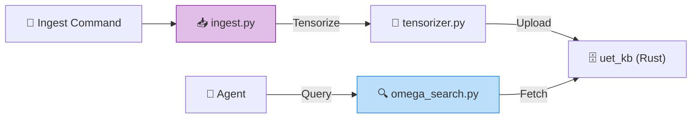

# UET Knowledge Base Client (`docs.knowledge_base`)

## Current local-first status

This folder contains older knowledge-base experiments and bridge code. Some of
that code still describes the larger MCP/Postgres/vector-search direction, but
it should not be treated as the current working path without verification.

For day-to-day personal research use, start with the small local helper:

```bash
python -m docs.knowledge_base.personal_kb status
python -m docs.knowledge_base.personal_kb ingest --dry-run
python -m docs.knowledge_base.personal_kb ingest
python -m docs.knowledge_base.personal_kb search "claim evidence"
```

This helper builds a local SQLite text index and tracks file hashes so changed
files can be identified before heavier embedding infrastructure is repaired. It
does not replace canonical project documents, `docs/meta/`, topic packages, or
the future MCP/Postgres knowledge service.

The larger service plan is documented in:

- `docs/UET_Documentation_Details/01_Introduction/knowledge-system-architecture.md`
- `docs/UET_Documentation_Details/04_User_Guides/knowledge-ingestion-workflow.md`
- `docs/UET_Documentation_Details/05_API_Reference/knowledge-api-and-graphql-plan.md`

---

## Boundary

This directory is a derived retrieval layer. Canonical research files,
metadata, manifests, verifier artifacts, gates, and update logs remain the
source of truth. SQLite, LanceDB, vector, MCP, and future PostgreSQL indexes
must be regenerable from selected source files and must return source paths.

The local helper is the supported personal-first path. The larger MCP,
Postgres, and GraphQL design remains future platform work and must not block
research, books, or policy work.

---


> **"The Connector"** - ชุดเครื่องมือ (Python SDK) สำหรับเชื่อมต่อกับ `uet_kb` (Rust) และจัดการระบบ RAG ทั้งหมด.

---

## 🏛️ Components

| File | Purpose |
| :--- | :--- |
| **`config.toml`** | **Single Source of Truth** สำหรับ API Keys, Models, และ Budgets ทั้งหมด. |
| **`api_client.py`** | Client สำหรับคุยกับ OpenRouter พร้อมระบบ **Cost Tracking**. |
| **`vector_store.py`** | สะพานเชื่อม (Bridge) ไปยัง LanceDB/Postgres ผ่าน MCP. |
| **`ingest.py`** | Pipeline สำหรับอ่านไฟล์ `.md/.py` ทั้งหมด -> แปลงเป็น Vector -> ส่งเข้า Database. |
| **`tensorizer.py`** | แปลงเนื้อหาเอกสารเป็นค่า UET Vector ($\Omega, \kappa, \beta$). |

---

## 🔗 How it works



---

## 🚀 Key Commands

**1. เริ่มกระบวนการนำเข้าข้อมูล (Ingestion):**
```bash
python -m docs.knowledge_base.ingest
```

**2. ดูรายงานค่าใช้จ่าย (Cost Dashboard):**
```bash
python -m docs.knowledge_base.cost_dashboard
```
