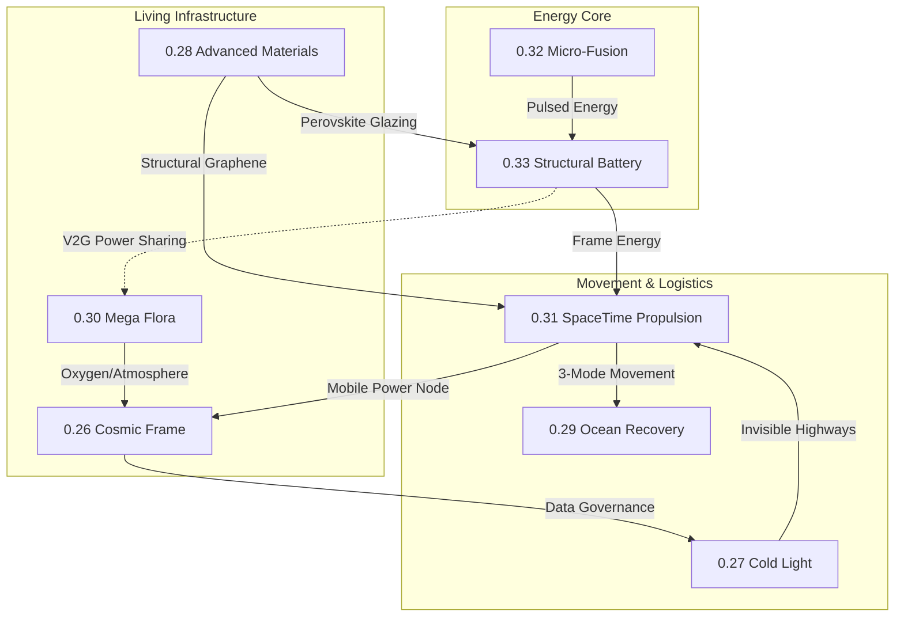

# Cross-Topic Linkage Map: Unified Cosmic Civilization (UCC)

### Key Integration Points:
1. **The Energy Spine (0.32 -> 0.33 -> 0.31):** Fusion power is buffered by structural batteries to drive the 3-mode Stingray vehicle.
2. **The Living Path (0.30 -> 0.26 -> 0.27):** Oxygen rings provide the life support, while Cosmic Hubs and Holographic grids provide the navigation "Highways."
3. **The Material Shell (0.28):** All structures use the same Graphene/Perovskite/Plasma-Sheath synthesis for consistency and efficiency.
