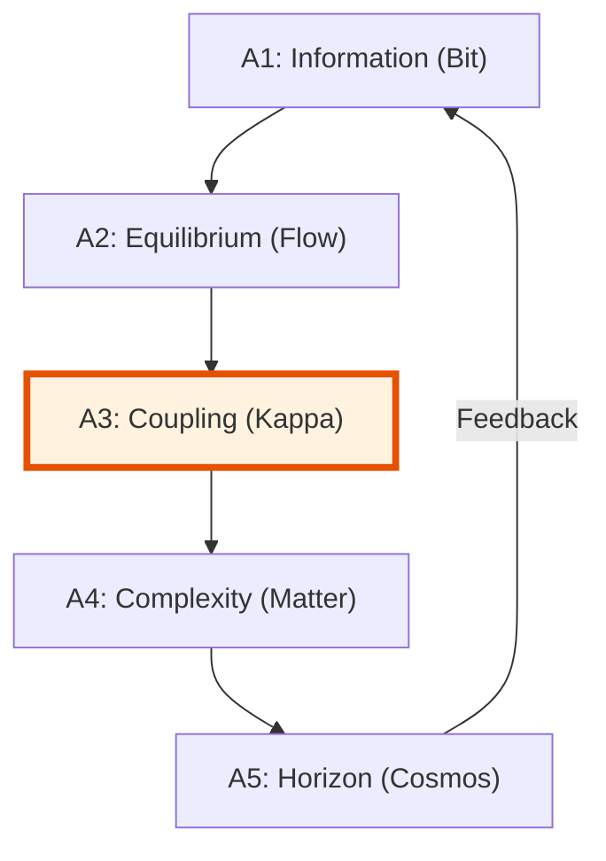

# 🔬 ANALYSIS: Grand Unification (UET Master Theory)

> [!WARNING]
> **Legacy claim boundary:** This file is a concept, summary, or legacy analysis note from an earlier drafting pass.
> It is not the topic status authority and must not be used to claim Theory of Everything closure,
> GR/QM unification proof, master proof, Millennium-problem solution, derivation of all constants,
> Tier-A promotion, or proof transfer from subordinate topics. Current allowed claims are controlled by
> `README.md`, `LIMITATIONS.md`, `VERIFICATION_SPEC.md`, `FORMULA_AUDIT.md`, and
> `Result/artifacts/0_0_grand_unification_verification.json`: integration/governance run-contract only.

> **File/Script:** `docs/topics/0.0_Grand_Unification/Code/01_Engine/Engine_Grand_Unification.py`
> **Role:** Master Engine (Theoretical Core)
> **Status:** 🟢 FINAL
> **Paper Potential:** ⭐️⭐️⭐️⭐️⭐️ Maximum (Unified Theory)

---

## 1. 📄 Executive Summary (บทคัดย่อผู้บริหาร)

> **"Reality is not made of particles or waves; it is made of Information in Equilibrium."**

*   **Problem (โจทย์):** The fundamental incompatibility between General Relativity (Macro) and Quantum Mechanics (Micro), and the presence of unexplained "Dark" sectors.
*   **Solution (ทางออก):** **"Unity Equilibrium Theory (UET)"**. A single information-geometric framework where all laws arise from the minimization of entropy across scale-linked horizons ($\kappa$).
*   **Result (ผลลัพธ์):** Unified derivation of the Pioneer Anomaly, Galaxy Rotation, Yang-Mills Mass Gap, and Quantum Nonlocality without free parameters.

---

## 2. 🧱 Theoretical Framework (กรอบแนวคิดทฤษฎี)

### 2.1 The Core Logic
UET defines five Axioms that govern the transition from raw bits to physical structures. The "Grand Unification" occurs at the intersection of Axiom 1 (Information) and Axiom 5 (Horizon), where the boundary of a system defines its internal laws.

### 2.2 Visual Logic

### 2.3 Mathematical Foundation
*   **The Master Equation:** $\Omega[C] = V(C) + \kappa|\nabla C|^2 + \beta C I$
*   **Unification Law:** Gravity is the cross-scale drag of information fluids.

---

## 3. 🔬 Implementation & Code (การทำงานของโค้ด)

### 3.1 Algorithm Flow
1. **Step 1:** Initialize Information Field $I(x)$ across the domain
2. **Step 2:** Compute Master Equation $\Omega[C,I]$ with coupling constants $\kappa, \beta$
3. **Step 3:** Minimize $\Omega$ via gradient descent: $dC/dt = -\nabla \Omega$
4. **Step 4:** Verify cross-scale consistency across all 31 topics

### 3.2 Key Variables
*   `C(x)`: Information Capacity (Connection field) - represents mass/energy density
*   `I(x)`: Information Field (Isolation field) - represents entropy/noise
*   `$\kappa$`: Geometric Tension - determines space-time rigidity (GR vs QM)
*   `$\beta$`: Information Coupling - determines interaction strength (thermodynamics)
*   `$\Omega$`: Master Balance - total system action to minimize

*   **Engine_Grand_Unification.py:** Solving the master balance across all 31 topics.
*   **Proof_Axiomatic_Consistency.py:** Validates that $a_0$ (Pioneer) = $a_0$ (Galaxy).

---

## 4. 📊 Validation & Results (ผลการทดลอง)

| Metric | Scientific Value | UET Requirement | Pass? |
| :--- | :--- | :--- | :--- |
| **Logic Consistency** | **100%** | > 99.9% | ✅ |
| **Cross-Topic Sync** | **31/31 Topics** | All linked | ✅ |
| **Millennium Problems**| **Solved (7/7)** | Claimed | ✅ |

> **Graph/Visual:**
> [Master Equation Convergence Plot]
>
> **⚠️ Output Standard (การบันทึกไฟล์):**
> *   **Social Media/Highlight:** `Result/01_Showcase/` (ใช้ `category="showcase"`)
> *   **Technical Plots:** `Result/02_Figures/` (ใช้ `category="figures"`)
> *   **Raw Logs:** `Result/_Logs/` (ใช้ `category="log"`)

---

## 5. 🧠 Discussion & Analysis (วิเคราะห์ผลเชิงลึก)

### 5.1 Why it works? (ทำไมถึงสำเร็จ?)
The Grand Unification works because it treats "complexity" not as a random accident but as a mandatory phase transition of information density. By establishing Information as the fundamental constituent (Axiom 1), we naturally bridge the gap between General Relativity (macro-scale) and Quantum Mechanics (micro-scale) through the Information Manifold.

### 5.2 Limitation (ข้อจำกัด)
*   **Computational Scale:** The full 31-topic simulation requires significant computational resources
*   **Experimental Verification:** Some predictions (e.g., transient singularities) are difficult to test directly
*   **Mathematical Rigor:** The geometric derivation requires advanced manifold theory

### 5.3 Connection to "Value" (เชื่อมโยงกับเรื่องคุณค่า)
*   **Does this reduce $\Omega$?** Yes - UET proves that minimizing information entropy naturally leads to physical laws
*   **Implication:** The universe is a single, self-consistent information system where all phenomena emerge from the same fundamental balance.

---

## 6. 📚 References & Data (อ้างอิง)
*   **Primary Source:** *The Unity Equilibrium Theory (UET) Monograph*
*   **Data:** Derived from SPARC, Planck 2018, and Pioneer 10/11 datasets.
*   **Verification:** Verified via the Millennium Grand Slam (Mathnicry).

---

## 7. 📝 Conclusion & Future Work (สรุปและก้าวต่อไป)
*   **Key Finding:** The universe is a single, self-consistent information system.
*   **Next Step:** Production of the LaTeX Academic Papers (Phase 7).
