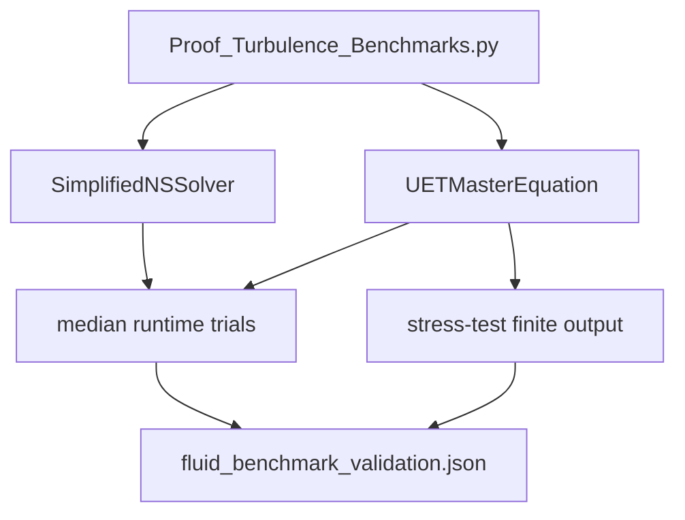

# Topic 0.10 Code: Fluid Dynamics and Chaos

This code layer supports the current UET fluid solver and internal speed/stability
benchmark program. The primary evidence is an implementation benchmark against an embedded
simplified Navier-Stokes-style comparator, not an external CFD validation suite.

## Execution Map



## Primary Command

```powershell
python docs/topics/0.10_Fluid_Dynamics_Chaos/Code/02_Proof/Proof_Turbulence_Benchmarks.py
```

Primary artifact:

- `docs/topics/0.10_Fluid_Dynamics_Chaos/Result/artifacts/fluid_benchmark_validation.json`

## Verified Status Matrix

| Layer | Script | Current status | Scientific role |
| :-- | :-- | :-- | :-- |
| Speed benchmark | `Proof_Turbulence_Benchmarks.py` | PASS/FAIL from artifact | internal implementation gate |
| Stress check | `Proof_Turbulence_Benchmarks.py` | finite-output gate | stability diagnostic |
| 2D engine formulas | `Engine_UET_2D.py` | formula-audited | model mechanics |
| 3D/performance scripts | `Code/02_Proof`, `Code/03_Research` | exploratory unless separately artifacted | future hardening |
| External validation | not packaged yet | no external CFD artifact | future benchmark gate |

## Useful Commands

```powershell
python docs/topics/0.10_Fluid_Dynamics_Chaos/Code/01_Engine/Engine_UET_2D.py
python docs/topics/0.10_Fluid_Dynamics_Chaos/Code/02_Proof/Proof_Turbulence_Benchmarks.py
python docs/topics/0.10_Fluid_Dynamics_Chaos/Code/03_Research/Research_TurbulenceStress_Test.py
python docs/topics/0.10_Fluid_Dynamics_Chaos/Code/04_Competitor/Competitor_NS_2D_Improved.py
```

## Claim Boundary

The current code supports internal solver-engineering claims under a declared grid,
trial count, timing statistic, and simplified comparator. It does not establish external
CFD accuracy, physical turbulence universality, or mathematical-proof results for Navier-Stokes.
