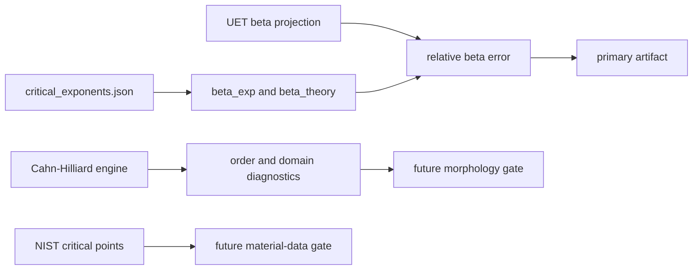

# 0.11 Phase Transitions

> [!NOTE]
> **AI-Digest**: This topic currently supports an internal benchmark for the 3D
> Ising/liquid-gas beta critical exponent and contains normalized spectral Cahn-Hilliard
> phase-separation simulations. It does not yet establish a full renormalization-group
> derivation or universal phase-transition theory.


## Current Claim Boundary

The primary verifier compares the current UET beta-exponent projection against a topic-local
3D Ising/liquid-gas benchmark. The Cahn-Hilliard solver and order-parameter proof scripts are
mechanism diagnostics until their nondimensional units, seeds, morphology metrics, and material
baselines are locked.

## Conceptual Diagram



## Evidence Matrix

| Layer | Current status | Evidence / artifact | Claim allowed |
| :-- | :-- | :-- | :-- |
| Beta critical exponent | Primary internal benchmark | `Result/artifacts/0_11_phase_transitions_verification.json` | selected exponent compatibility |
| Cahn-Hilliard dynamics | Normalized model exists | `Engine_Phase.py`, `FORMULA_AUDIT.md` | mechanism simulation |
| Order parameter proof | Simulation diagnostic | `Proof_Order_Parameter.py` | internal order-emergence check |
| NIST critical points | Working-copy data only | `Data/NIST_Critical_Points.csv` | future provenance/data gate |
| Source evidence workflow | Structured provenance gate | `Data/03_Research/source_evidence_intake_stub.json`, `source_evidence_readiness_matrix.json` | source-review queue |
| Branch claim gate | Structured claim ceiling | `Data/03_Research/branch_claim_gate.json` | selected-branch claim control |
| Claim-scope gate | Artifact export controller | `phase_transition_claim_scope_gate` in artifact | blocks universality/RG overclaim |
| Wave 5 spatial-coupling candidate | Diagnostic candidate | `Result/artifacts/0_11_spatial_coupling_scaling.json` | operator gates pass; universality shift blocked |
| Wave 6 coefficient sensitivity | Diagnostic triage | `Result/artifacts/0_11_spatial_coupling_sensitivity.json` | coefficient-only tuning remains mean-field-like |
| Wave 7 correlation-length diagnostic | Estimator triage | `Result/artifacts/0_11_correlation_length_diagnostics.json` | critical-window and estimator gates blocked |
| Wave 8 finite-size diagnostic | Scaling-window triage | `Result/artifacts/0_11_finite_size_scaling_diagnostics.json` | coverage/Binder pass; xi/L and operator separation blocked |
| Wave 9 critical-window relaxation | Window/relaxation triage | `Result/artifacts/0_11_critical_window_relaxation_diagnostics.json` | closer Tc and longer runs still local |
| Wave 10 operator-form requirement | Design requirement gate | `Result/artifacts/0_11_operator_form_requirement_gate.json` | operator-form revision required before v2 claims |
| Wave 11 spatial-coupled v2 candidate | First v2 operator triage | `Result/artifacts/0_11_spatial_coupled_v2_diagnostic.json` | core/safety/stability pass; correlation and separation blocked |
| Wave 12 v2 component ablation | Component failure triage | `Result/artifacts/0_11_spatial_coupled_v2_component_ablation.json` | tested v2 components remain neutral/damping for correlation growth |
| Wave 13 Model C conserved-order diagnostic | Mechanism repair triage | `Result/artifacts/0_11_model_c_conserved_order_diagnostic.json` | conserved-order mechanism passes; scaling/core integration still open |
| Wave 14 conserved-order core candidate | Opt-in core integration gate | `Result/artifacts/0_11_conserved_order_core_candidate.json` | core mode/mass/legacy gates pass; mechanism response blocked |
| Wave 15 conserved-order numerics gap | Scheme gap diagnostic | `Result/artifacts/0_11_conserved_order_numerics_gap.json` | explicit core stiffness blocks Model C response; spectral/semi-implicit core required |
| Wave 16 conserved-order spectral core | Opt-in core bridge gate | `Result/artifacts/0_11_conserved_order_spectral_core_candidate.json` | core spectral bridge passes; finite-size/exponent scaling still open |
| Universal phase-transition theory | Not closed | limitations and formula audit | do not claim full proof |

## 5x4 Grid Structure

| Pillar | Purpose |
| :-- | :-- |
| `Doc/` | analysis notes for symmetry breaking, phase separation, and critical behavior |
| `Ref/` | critical exponent, Cahn-Hilliard, Ginzburg-Landau, and thermodynamic references |
| `Data/` | topic-local critical exponent and critical-point working copies |
| `Code/` | engine, proof, research, competitor, and visualization scripts |
| `Result/` | artifacts, plots, and run logs |

## Quick Start

```powershell
cd C:\Users\santa\Desktop\uet_harness
python docs/topics/0.11_Phase_Transitions/Code/03_Research/Research_Critical_Exponents.py
```

## Key Files

- `FORMULA_AUDIT.md`: formula, unit, constant, proof-status, and failure-mode registry.
- `VERIFICATION_SPEC.md`: primary command, metrics, thresholds, and artifact interpretation.
- `DATA_MANIFEST.md`: current data roles and provenance gaps.
- `METHOD.md`: topic method scope and dependency policy.
- `LIMITATIONS.md`: blockers that prevent stronger claims.

## Current Limitations

- The primary benchmark currently tests beta only, not the full critical-exponent set.
- The Cahn-Hilliard solver is normalized and not yet calibrated to a material dataset.
- Order-parameter thresholds are internal diagnostics.
- Upstream provenance for critical-exponent and critical-point tables still needs a stronger
  external data cache.
- Topic-level source-evidence and branch-claim gates cap the topic at selected-benchmark and mechanism-diagnostic status.
- The artifact-level `phase_transition_claim_scope_gate` must stay `WARN` even when the beta
  benchmark passes, until full exponent/scaling checks, material critical-point gates, and
  renormalization-group closure are source-backed.
- The Wave 5 `spatial_coupled_v1` candidate currently remains diagnostic-only: engine and spatial-operator gates pass, but `universality_shift_gate` is `BLOCKED` with beta still near mean-field.
- The Wave 6 coefficient sensitivity diagnostic found no tested coefficient-only case near the 3D Ising beta target; the next blocker is operator-form or estimator revision, not simple coefficient tuning.
- The Wave 7 correlation-length diagnostic shows the current synthetic window does not expose critical correlation growth (`xi_near/xi_far` about `1.07`, `nu_proxy` about `0.03`), so beta-only fits must not be used for universality promotion.
- The Wave 8 finite-size diagnostic uses three grid sizes and finds Binder-style proxy coverage, but near-critical `xi/L` remains too small (`<= 0.1045`) and the spatial lane does not separate from baseline.
- The Wave 9 critical-window relaxation diagnostic moved closer to `Tc` and increased steps to `2800`, but spatial `xi/L` stayed near `0.07` and did not separate from baseline.
- The Wave 10 operator-form requirement gate aggregates Waves 5-9 and keeps `operator_form_requirement_gate == BLOCKED`; any `spatial_coupled_v2` path must add a nonlocal, conserved, or scale-dependent mechanism and pass correlation/separation gates before claim promotion.
- The Wave 11 `spatial_coupled_v2` candidate adds screened nonlocal memory and a conserved interface/game drive in core mode, but its first diagnostic remains `WARN`: core/safety/stability gates pass while `v2_correlation_response_gate` and `v2_operator_separation_gate` are `BLOCKED` (`max_xi/L = 0.0733`).
- The Wave 12 component ablation keeps the v2 family diagnostic-only: coverage and force-lane isolation pass, but every tested v2 component profile stays below baseline `xi/L`; the best profile is `v2_memory_long` with improvement `-0.0038`.
- The Wave 13 Model C diagnostic uses the topic Cahn-Hilliard engine and passes mechanism gates: mass drift is `~2.1e-16`, median Model C `xi` growth is `30.49`, and the lane separates from the nonconserved comparison by `5.81` in median `xi`-growth ratio. This is a repair direction, not a universality proof.
- The Wave 14 `conserved_order_v1` core candidate exposes Model C-style conserved flow as an opt-in core mode and preserves legacy defaults/mass conservation, but its explicit finite-difference mechanism response is still blocked: core conserved median `xi` growth is `0.87` versus legacy core `1.47`.
- The Wave 15 numerics-gap diagnostic shows the explicit core path is not a viable direct replacement under Wave 13-like settings: the explicit stiffness proxy is `32685` for the spectral reference settings versus `0.097` for the Wave 14 core candidate, so the next core candidate should be spectral or semi-implicit rather than mobility-only tuning.
- The Wave 16 `conserved_order_spectral_v1` core candidate repairs that implementation gap under Wave 13-like settings: all core bridge gates pass, max topic-engine field delta is `2.89e-12`, and median `xi` growth matches the topic spectral engine at `30.49`; this opens the next scaling verifier but does not upgrade universality claims.

*Status note: internal critical-exponent benchmark and formula-audit hardening gate.*
