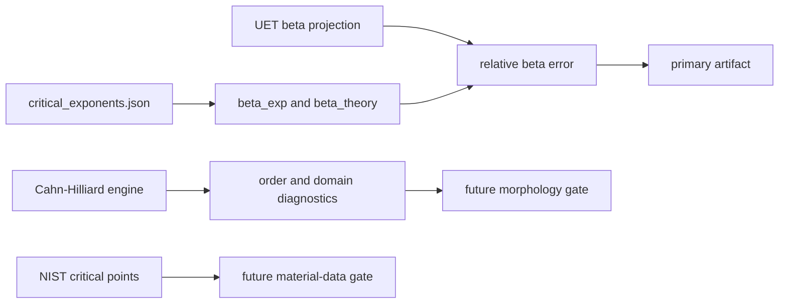

# 0.11 Phase Transitions

> [!NOTE]
> **AI-Digest**: This topic currently supports an internal benchmark for the 3D
> Ising/liquid-gas beta critical exponent and contains normalized spectral Cahn-Hilliard
> phase-separation simulations. It does not yet establish a full renormalization-group
> derivation or universal phase-transition theory.


## Current Claim Boundary

The primary verifier compares the current UET beta-exponent projection against a topic-local
3D Ising/liquid-gas benchmark. The Cahn-Hilliard solver and order-parameter proof scripts are
mechanism diagnostics until their nondimensional units, seeds, morphology metrics, and material
baselines are locked.

## Conceptual Diagram



## Evidence Matrix

| Layer | Current status | Evidence / artifact | Claim allowed |
| :-- | :-- | :-- | :-- |
| Beta critical exponent | Primary internal benchmark | `Result/artifacts/0_11_phase_transitions_verification.json` | selected exponent compatibility |
| Cahn-Hilliard dynamics | Normalized model exists | `Engine_Phase.py`, `FORMULA_AUDIT.md` | mechanism simulation |
| Order parameter proof | Simulation diagnostic | `Proof_Order_Parameter.py` | internal order-emergence check |
| NIST critical points | Working-copy data only | `Data/NIST_Critical_Points.csv` | future provenance/data gate |
| Source evidence workflow | Structured provenance gate | `Data/03_Research/source_evidence_intake_stub.json`, `source_evidence_readiness_matrix.json` | source-review queue |
| Branch claim gate | Structured claim ceiling | `Data/03_Research/branch_claim_gate.json` | selected-branch claim control |
| Claim-scope gate | Artifact export controller | `phase_transition_claim_scope_gate` in artifact | blocks universality/RG overclaim |
| Wave 5 spatial-coupling candidate | Diagnostic candidate | `Result/artifacts/0_11_spatial_coupling_scaling.json` | operator gates pass; universality shift blocked |
| Wave 6 coefficient sensitivity | Diagnostic triage | `Result/artifacts/0_11_spatial_coupling_sensitivity.json` | coefficient-only tuning remains mean-field-like |
| Wave 7 correlation-length diagnostic | Estimator triage | `Result/artifacts/0_11_correlation_length_diagnostics.json` | critical-window and estimator gates blocked |
| Wave 8 finite-size diagnostic | Scaling-window triage | `Result/artifacts/0_11_finite_size_scaling_diagnostics.json` | coverage/Binder pass; xi/L and operator separation blocked |
| Wave 9 critical-window relaxation | Window/relaxation triage | `Result/artifacts/0_11_critical_window_relaxation_diagnostics.json` | closer Tc and longer runs still local |
| Wave 10 operator-form requirement | Design requirement gate | `Result/artifacts/0_11_operator_form_requirement_gate.json` | operator-form revision required before v2 claims |
| Wave 11 spatial-coupled v2 candidate | First v2 operator triage | `Result/artifacts/0_11_spatial_coupled_v2_diagnostic.json` | core/safety/stability pass; correlation and separation blocked |
| Wave 12 v2 component ablation | Component failure triage | `Result/artifacts/0_11_spatial_coupled_v2_component_ablation.json` | tested v2 components remain neutral/damping for correlation growth |
| Wave 13 Model C conserved-order diagnostic | Mechanism repair triage | `Result/artifacts/0_11_model_c_conserved_order_diagnostic.json` | conserved-order mechanism passes; scaling/core integration still open |
| Wave 14 conserved-order core candidate | Opt-in core integration gate | `Result/artifacts/0_11_conserved_order_core_candidate.json` | core mode/mass/legacy gates pass; mechanism response blocked |
| Wave 15 conserved-order numerics gap | Scheme gap diagnostic | `Result/artifacts/0_11_conserved_order_numerics_gap.json` | explicit core stiffness blocks Model C response; spectral/semi-implicit core required |
| Wave 16 conserved-order spectral core | Opt-in core bridge gate | `Result/artifacts/0_11_conserved_order_spectral_core_candidate.json` | core spectral bridge passes; finite-size/exponent scaling still open |
| Wave 17 conserved-order spectral scaling | Finite-size/exponent diagnostic | `Result/artifacts/0_11_conserved_order_spectral_scaling.json` | stability/coverage pass; xi/L and universality exponent gates blocked |
| Wave 18 spectral window repair | Window/parameter tradeoff diagnostic | `Result/artifacts/0_11_conserved_order_spectral_window_repair.json` | kappa can lift xi/L only with low signal; relaxation-only blocked |
| Wave 19 spectral spinodal window | Seed-margin diagnostic | `Result/artifacts/0_11_conserved_order_spectral_spinodal_window.json` | one order-preserving xi/L pass found; seed-margin gate blocked |
| Wave 20 spectral seed-margin repair | Single-grid seed-margin gate | `Result/artifacts/0_11_conserved_order_spectral_seed_margin.json` | seed margin passes at L=16; finite-size replication blocked |
| Wave 21 spectral finite-size replication | Multi-grid replication diagnostic | `Result/artifacts/0_11_conserved_order_spectral_finite_size_replication.json` | L=8/12 pass; L=16 fresh seeds block replication |
| Wave 22 L16 relaxation repair | Relaxation-only repair diagnostic | `Result/artifacts/0_11_conserved_order_spectral_l16_relaxation_repair.json` | longer L16 relaxation preserves order but leaves xi/L margin blocked |
| Wave 23 L16 estimator sensitivity | Estimator-threshold diagnostic | `Result/artifacts/0_11_conserved_order_spectral_l16_estimator_sensitivity.json` | L16 xi/L gate is threshold-sensitive; non-default threshold not accepted |
| Wave 24 L16 structure-factor estimator | Threshold-free estimator diagnostic | `Result/artifacts/0_11_conserved_order_spectral_l16_structure_factor_estimator.json` | structure-factor margin passes but domain-scale guard warns |
| Wave 25 structure-factor multigrid calibration | Multi-grid estimator calibration | `Result/artifacts/0_11_conserved_order_spectral_structure_factor_multigrid_calibration.json` | margin replicates; domain-scale calibration remains blocked |
| Wave 26 L20 structure-factor probe | Larger-grid estimator probe | `Result/artifacts/0_11_conserved_order_spectral_structure_factor_l20_probe.json` | L20 domain-scale relief passes; acceptance-rule gate remains blocked |
| Wave 27 structure-factor acceptance rule | Estimator acceptance preflight | `Result/artifacts/0_11_structure_factor_acceptance_rule_gate.json` | rule defined; current gridset fails domain-scale, absolute-length, and estimator-reconciliation gates |
| Wave 28 estimator reconciliation | Estimator calibration triage | `Result/artifacts/0_11_structure_factor_estimator_reconciliation_gate.json` | ratio stable, but calibration is unaccepted and both absolute lengths decline L16->L20 |
| Wave 29 calibration source support | Source-packaging triage | `Result/artifacts/0_11_structure_factor_calibration_source_support_gate.json` | local estimator-source support missing; package primary second-moment sources before calibration |
| Wave 30 estimator source manifest | Source-manifest packaging | `Data/03_Research/structure_factor_estimator_source_manifest.json`; `Result/artifacts/0_11_structure_factor_source_manifest_gate.json` | primary metadata packaged; formula extraction and calibration still blocked |
| Wave 31 estimator formula boundary | Source-formula mismatch gate | `Data/03_Research/structure_factor_estimator_formula_boundary.json`; `Result/artifacts/0_11_structure_factor_formula_boundary_gate.json` | source formula boundary passes; current RMS inverse-k proxy rejected for claim use |
| Wave 32 lowest-mode estimator candidate | Source-family replacement diagnostic | `Result/artifacts/0_11_structure_factor_lowest_mode_candidate_gate.json` | implementation passes; observable validity blocked by zero-mode snapshot lane |
| Wave 33 ensemble susceptibility lane | S0 observable policy diagnostic | `Result/artifacts/0_11_structure_factor_ensemble_susceptibility_lane_gate.json` | ensemble S0 blocked by conserved mean; spatial variance remains diagnostic-only |
| Wave 34 estimator policy source gate | Policy-source packaging gate | `Data/03_Research/structure_factor_estimator_policy_requirements.json`; `Result/artifacts/0_11_structure_factor_estimator_policy_source_gate.json` | policy requirements pass; conserved susceptibility and finite-k source support missing |
| Wave 35 estimator policy source-candidate gate | Policy source-candidate gate | `Data/03_Research/structure_factor_estimator_policy_source_candidates.json`; `Result/artifacts/0_11_structure_factor_policy_source_candidate_gate.json` | candidate sources packaged; formula extraction and accepted policy still blocked |
| Wave 36 estimator policy formula-boundary gate | Partial policy formula-boundary gate | `Data/03_Research/structure_factor_estimator_policy_formula_boundary.json`; `Result/artifacts/0_11_structure_factor_policy_formula_boundary_gate.json` | abstract-level boundaries pass; full-text extraction and accepted formula remain blocked |
| Wave 37 full-text formula readiness gate | Formula-source localization gate | `Data/03_Research/structure_factor_full_text_formula_extraction_readiness.json`; `Result/artifacts/0_11_structure_factor_full_text_formula_readiness_gate.json` | rendered/abstract boundaries recorded; local TeX/PDF math source remains blocked |
| Wave 38 source-archive localization gate | Temporary arXiv source-cache gate | `Data/03_Research/structure_factor_source_archive_localization_manifest.json`; `Result/artifacts/0_11_structure_factor_source_archive_localization_gate.json` | source archives and TeX members localized in temp cache; formula extraction remains blocked |
| Wave 43 TeX formula-fragment extraction | Source-formula extraction gate | `Data/03_Research/structure_factor_tex_formula_fragments.json`; `Result/artifacts/0_11_structure_factor_tex_formula_fragment_gate.json` | 19 formula fragments preserved in manifest; temporary source cache is missing, so refresh/provenance plus estimator policy and UET normalization remain blocked |
| Wave 44 source-archive policy gate | Source-provenance policy gate | `Data/03_Research/structure_factor_source_archive_policy.json`; `Result/artifacts/0_11_structure_factor_source_archive_policy_gate.json` | policy manifest and repo archive availability pass; temp cache remains irrelevant/blocked, estimator policy remains blocked |
| Wave 46 estimator normalization-map gate | Policy/normalization mapping gate | `Data/03_Research/structure_factor_estimator_normalization_map.json`; `Result/artifacts/0_11_structure_factor_estimator_normalization_map_gate.json` | source formulas mapped to policy lanes; Cahn-Hilliard finite-k lane is the strongest candidate, but UET normalization, finite-size admissibility, and estimator acceptance remain blocked |
| Wave 47 CH finite-k normalization preflight | Unit/admissibility preflight | `Data/03_Research/structure_factor_ch_finite_k_normalization_preflight.json`; `Result/artifacts/0_11_structure_factor_ch_finite_k_normalization_preflight_gate.json` | q-grid convention passes in lattice units; field normalization warns; coefficient mapping, xi extraction, admissibility, and implementation remain blocked |
| Wave 48 CH finite-k estimator candidate | Source-linked estimator candidate | `Result/artifacts/0_11_structure_factor_ch_finite_k_estimator_candidate_gate.json`; `Result/gl_structure_factor_ch_finite_k_estimator_candidate_stats.csv` | implementation/q-window/domain-scale/finite-size trend gates pass; coefficient policy and estimator acceptance remain blocked |
| Wave 49 CH finite-k acceptance policy | Acceptance-policy preflight | `Data/03_Research/structure_factor_ch_finite_k_acceptance_policy.json`; `Result/artifacts/0_11_structure_factor_ch_finite_k_acceptance_policy_gate.json` | strict row policy accepts only `6/18` rows and only `L20`; estimator acceptance and exponent rerun remain blocked |
| Wave 50 CH finite-k extended-grid coverage probe | Coverage probe | `Result/artifacts/0_11_structure_factor_ch_finite_k_extended_grid_coverage_probe.json`; `Result/gl_structure_factor_ch_finite_k_extended_grid_coverage_probe_stats.csv` | accepted-row coverage passes across `L20/L24/L28`, but field normalization, source coefficients, estimator acceptance, and exponent rerun remain blocked |
| Wave 51 CH finite-k field/coefficient policy gate | Claim-boundary policy gate | `Data/03_Research/structure_factor_ch_finite_k_field_coefficient_policy.json`; `Result/artifacts/0_11_structure_factor_ch_finite_k_field_coefficient_policy_gate.json` | diagnostic measurement lane and coefficient exclusion pass; source-equivalent field normalization, estimator replacement, and exponent rerun remain blocked |
| Wave 52 CH finite-k field-normalization decision gate | Field-normalization decision gate | `Data/03_Research/structure_factor_ch_finite_k_field_normalization_decision.json`; `Result/artifacts/0_11_structure_factor_ch_finite_k_field_normalization_decision_gate.json` | source field symbols and centered-C proxy pass diagnostically; amplitude normalization and averaging convention block estimator replacement |
| Wave 53 CH finite-k shape-only normalization policy gate | Shape-only normalization policy gate | `Data/03_Research/structure_factor_ch_finite_k_shape_only_normalization_policy.json`; `Result/artifacts/0_11_structure_factor_ch_finite_k_shape_only_normalization_policy_gate.json` | q-peak amplitude invariance and diagnostic seed aggregation pass; source amplitude, source averaging, estimator replacement, and exponent rerun remain blocked |
| Wave 54 CH finite-k source averaging/uncertainty policy gate | Uncertainty policy preflight | `Data/03_Research/structure_factor_ch_finite_k_source_averaging_uncertainty_policy.json`; `Result/artifacts/0_11_structure_factor_ch_finite_k_source_averaging_uncertainty_gate.json` | diagnostic aggregation passes; claim-bearing replicate floor, source time averaging, uncertainty intervals, estimator replacement, and exponent rerun remain blocked |
| Wave 55 CH finite-k next-path decision gate | Next-path decision preflight | `Data/03_Research/structure_factor_ch_finite_k_next_path_decision.json`; `Result/artifacts/0_11_structure_factor_ch_finite_k_next_path_decision_gate.json` | replicate/temporal acquisition is selected because no replacement observable is accepted; estimator acceptance and exponent rerun remain blocked |
| Universal phase-transition theory | Not closed | limitations and formula audit | do not claim full proof |

## 5x4 Grid Structure

| Pillar | Purpose |
| :-- | :-- |
| `Doc/` | analysis notes for symmetry breaking, phase separation, and critical behavior |
| `Ref/` | critical exponent, Cahn-Hilliard, Ginzburg-Landau, and thermodynamic references |
| `Data/` | topic-local critical exponent and critical-point working copies |
| `Code/` | engine, proof, research, competitor, and visualization scripts |
| `Result/` | artifacts, plots, and run logs |

## Quick Start

```powershell
cd C:\Users\santa\Desktop\uet_harness
python docs/topics/0.11_Phase_Transitions/Code/03_Research/Research_Critical_Exponents.py
```

## Key Files

- `FORMULA_AUDIT.md`: formula, unit, constant, proof-status, and failure-mode registry.
- `VERIFICATION_SPEC.md`: primary command, metrics, thresholds, and artifact interpretation.
- `DATA_MANIFEST.md`: current data roles and provenance gaps.
- `METHOD.md`: topic method scope and dependency policy.
- `LIMITATIONS.md`: blockers that prevent stronger claims.

## Current Limitations

- The primary benchmark currently tests beta only, not the full critical-exponent set.
- The Cahn-Hilliard solver is normalized and not yet calibrated to a material dataset.
- Order-parameter thresholds are internal diagnostics.
- Upstream provenance for critical-exponent and critical-point tables still needs a stronger
  external data cache.
- Topic-level source-evidence and branch-claim gates cap the topic at selected-benchmark and mechanism-diagnostic status.
- The artifact-level `phase_transition_claim_scope_gate` must stay `WARN` even when the beta
  benchmark passes, until full exponent/scaling checks, material critical-point gates, and
  renormalization-group closure are source-backed.
- The Wave 5 `spatial_coupled_v1` candidate currently remains diagnostic-only: engine and spatial-operator gates pass, but `universality_shift_gate` is `BLOCKED` with beta still near mean-field.
- The Wave 6 coefficient sensitivity diagnostic found no tested coefficient-only case near the 3D Ising beta target; the next blocker is operator-form or estimator revision, not simple coefficient tuning.
- The Wave 7 correlation-length diagnostic shows the current synthetic window does not expose critical correlation growth (`xi_near/xi_far` about `1.07`, `nu_proxy` about `0.03`), so beta-only fits must not be used for universality promotion.
- The Wave 8 finite-size diagnostic uses three grid sizes and finds Binder-style proxy coverage, but near-critical `xi/L` remains too small (`<= 0.1045`) and the spatial lane does not separate from baseline.
- The Wave 9 critical-window relaxation diagnostic moved closer to `Tc` and increased steps to `2800`, but spatial `xi/L` stayed near `0.07` and did not separate from baseline.
- The Wave 10 operator-form requirement gate aggregates Waves 5-9 and keeps `operator_form_requirement_gate == BLOCKED`; any `spatial_coupled_v2` path must add a nonlocal, conserved, or scale-dependent mechanism and pass correlation/separation gates before claim promotion.
- The Wave 11 `spatial_coupled_v2` candidate adds screened nonlocal memory and a conserved interface/game drive in core mode, but its first diagnostic remains `WARN`: core/safety/stability gates pass while `v2_correlation_response_gate` and `v2_operator_separation_gate` are `BLOCKED` (`max_xi/L = 0.0733`).
- The Wave 12 component ablation keeps the v2 family diagnostic-only: coverage and force-lane isolation pass, but every tested v2 component profile stays below baseline `xi/L`; the best profile is `v2_memory_long` with improvement `-0.0038`.
- The Wave 13 Model C diagnostic uses the topic Cahn-Hilliard engine and passes mechanism gates: mass drift is `~2.1e-16`, median Model C `xi` growth is `30.49`, and the lane separates from the nonconserved comparison by `5.81` in median `xi`-growth ratio. This is a repair direction, not a universality proof.
- The Wave 14 `conserved_order_v1` core candidate exposes Model C-style conserved flow as an opt-in core mode and preserves legacy defaults/mass conservation, but its explicit finite-difference mechanism response is still blocked: core conserved median `xi` growth is `0.87` versus legacy core `1.47`.
- The Wave 15 numerics-gap diagnostic shows the explicit core path is not a viable direct replacement under Wave 13-like settings: the explicit stiffness proxy is `32685` for the spectral reference settings versus `0.097` for the Wave 14 core candidate, so the next core candidate should be spectral or semi-implicit rather than mobility-only tuning.
- The Wave 16 `conserved_order_spectral_v1` core candidate repairs that implementation gap under Wave 13-like settings: all core bridge gates pass, max topic-engine field delta is `2.89e-12`, and median `xi` growth matches the topic spectral engine at `30.49`; this opens the next scaling verifier but does not upgrade universality claims.
- The Wave 17 finite-size/exponent diagnostic keeps the spectral core candidate diagnostic-only: coverage, stability, and Binder-style proxy gates pass, but max near-critical `xi/L` is only `0.145` and median beta is `1.77`, so correlation-window and universality-exponent gates remain blocked.
- The Wave 18 window-repair diagnostic shows longer relaxation/window tweaks still fail (`max xi/L = 0.113`), while kappa can lift `xi/L` to `0.377` only with low order signal (`0.000377`), so smoothing-like parameter tradeoffs must not be promoted as scaling evidence.
- The Wave 19 spinodal-window diagnostic finds one order-preserving `xi/L` pass (`xi/L = 0.204`, order `0.0126`) at `T = 0.900`, `kappa = 0.100`, and `2400` steps, but the target seed replicate pass fraction is only `0.25` and median replicate `xi/L` is `0.1965`, so the next blocker is seed-margin and finite-size replication, not claim promotion.
- The Wave 20 seed-margin diagnostic repairs that single-grid seed margin at `T = 0.900`, `kappa = 0.100`, and `4000` steps: target pass fraction is `1.0`, min `xi/L` is `0.2004`, and min order is `0.0505`, but `finite_size_replication_gate` remains `BLOCKED`.
- The Wave 21 finite-size replication diagnostic keeps the window diagnostic-only: `L=8` and `L=12` pass across tested seed sets, but `L=16` fresh seeds pass only `1/3` and drop to min `xi/L = 0.1944`, so grid replication and seed-set generalization remain blocked.
- The Wave 22 `L=16` relaxation-repair diagnostic shows longer runs at `4800` and `5600` steps increase order amplitude but still pass only `1/3` fresh seeds; min `xi/L` remains below threshold (`0.1938` to `0.1950`), so relaxation-only repair is blocked.
- The Wave 23 estimator-sensitivity diagnostic reproduces the default `e^-1` blocker exactly, but lower axis-autocorrelation thresholds (`0.30`, `0.25`, `0.20`) make all 9 L16 fresh-seed cases pass without saturation; this narrows the controller to estimator derivation/calibration, not claim promotion.
- The Wave 24 structure-factor diagnostic adds a threshold-free RMS length proxy: it passes the L16 margin in `9/9` cases with min `xi/L = 0.5549`, but `domain_scale_guard == WARN` because the single-grid length is near the domain scale, so multi-grid calibration is now the controller.
- The Wave 25 multi-grid calibration confirms the structure-factor margin replicates across `L=8,12,16` and both seed sets (`18/18` passes), but `domain_scale_calibration_gate == BLOCKED`: median `xi/L` is `0.997` at `L=8`, `0.717` at `L=12`, and `0.566` at `L=16`, so the estimator remains domain-scale saturated.
- The Wave 26 L20 probe passes stability and L20 margin gates (`6/6` cases, median `xi/L = 0.4347`), but `derived_acceptance_rule_gate == BLOCKED`: the L20 absolute `xi` is slightly below L16 (`L20/L16 = 0.9599`), prior L8 remains domain-scale, and structure-factor/axis-estimator reconciliation still lacks an admissibility rule.
- The Wave 27 acceptance preflight defines the missing rule but does not clear it: candidate grids `L=12,16,20` exist, while `L=8` is excluded, `absolute_length_consistency_gate == BLOCKED`, and `estimator_reconciliation_gate == BLOCKED`.
- The Wave 28 reconciliation gate finds the structure-factor/axis-lower ratio is stable (`2.6849` at L16 and `2.6261` at L20), but calibration remains unaccepted and both axis-lower and structure-factor absolute lengths decline from L16 to L20.
- The Wave 29 source-support gate finds zero local text-source matches for structure-factor, second-moment correlation length, Fourier estimator definition, or finite-size admissibility, so calibration acceptance is blocked until primary estimator sources are packaged.
- The Wave 30 source-manifest gate packages three primary-source candidates and passes metadata coverage, but `local_formula_extraction_gate` and `calibration_acceptance_gate` remain `BLOCKED`.
- The Wave 31 formula-boundary gate extracts the source-family second-moment estimator boundary, but `current_proxy_source_match_gate` remains `BLOCKED` because the current RMS inverse-k proxy does not match the source-backed lowest-mode relation.
- The Wave 32 lowest-mode candidate gate implements the source-family estimator, but `lowest_mode_observable_gate` is `BLOCKED`: all `15/15` current snapshot cases are invalid because raw `S(0)` is not larger than `S(k_min)`.
- The Wave 33 susceptibility-lane gate separates ensemble magnetization `S(0)` from spatial-variance proxy: raw ensemble `S(0)` is blocked by conserved-mean constraints, while spatial variance is diagnostic-only and not source-equivalent.
- The Wave 34 estimator-policy source gate defines three policy paths, but both source-backed replacement paths remain `BLOCKED`; spatial variance stays diagnostic-only.
- The Wave 35 source-candidate gate packages fixed-magnetization/canonical and Cahn-Hilliard structure-factor source candidates, but formula extraction and accepted estimator policy remain `BLOCKED`.
- The Wave 36 formula-boundary gate extracts conservative source boundaries, but full-text formula extraction, UET normalization mapping, and accepted estimator policy remain `BLOCKED`.
- The Wave 37 readiness gate records rendered/abstract source access but blocks formula acceptance until local TeX/PDF math sources are localized and mapped.
- The Wave 38 localization gate verifies temporary arXiv source archives and main TeX members, but formula extraction, repo archival policy, and estimator acceptance remain blocked or warning-level.
- Wave 43 preserves 19 TeX formula fragments across the fixed-magnetization, canonical finite-size, and Cahn-Hilliard structure-factor source lanes, but the current rerun finds the temporary source cache missing; source refresh/provenance, accepted estimator policy, and UET normalization mapping remain blocked.
- Wave 44 records the repo archive policy and candidate paths under `docs/data/external/condensed_matter/phase_transitions/structure_factor_sources`; `repo_archive_availability_gate == PASS` after restoring all three arXiv source archives to repo paths; `temporary_cache_availability_gate` remains `BLOCKED`, and estimator-policy/UET normalization mapping remains blocked.
- Wave 46 maps the restored formula fragments to estimator-policy lanes. The Cahn-Hilliard finite-k structure-factor source lane is now the clearest candidate path, but `uet_normalization_mapping_gate`, `finite_size_admissibility_gate`, and `estimator_policy_acceptance_gate` remain `BLOCKED`.
- Wave 47 writes the Cahn-Hilliard finite-k normalization preflight. `fourier_convention_gate == PASS`, but `field_normalization_gate == WARN` and coefficient mapping, xi extraction, admissibility, implementation, and estimator acceptance remain `BLOCKED`.
- Wave 48 implements a source-linked Cahn-Hilliard finite-k peak estimator candidate on existing conserved-order fields. Implementation, source-linkage, q-window diagnostics, domain-scale guard, and finite-size trend gates pass, but coefficient policy and estimator acceptance remain `BLOCKED`; median `xi/L` is `0.5` and pass fraction is `12/18`.
- Wave 49 defines the strict acceptance policy for that candidate. `wave48_chain_gate`, `acceptance_policy_manifest_gate`, `coefficient_exclusion_policy_gate`, and `low_window_edge_policy_gate` pass, but `accepted_row_coverage_gate`, `source_dynamics_coefficient_mapping_gate`, `estimator_acceptance_gate`, and `exponent_rerun_gate` remain `BLOCKED`; accepted rows are `6/18` and only cover `L20`.
- Wave 50 probes larger grids under the unchanged Wave 49 policy. `accepted_multi_grid_coverage_gate == PASS` with accepted grid counts `L20:6`, `L24:2`, and `L28:2`, but `field_normalization_policy_gate == WARN`, while `source_dynamics_coefficient_mapping_gate`, `estimator_acceptance_gate`, and `exponent_rerun_gate` remain `BLOCKED`.
- Wave 51 separates the finite-k measurement lane from source-dynamics claims. `diagnostic_measurement_lane_gate`, `measurement_field_centering_gate`, and `measurement_only_coefficient_exclusion_gate` pass, but `source_equivalent_field_normalization_gate`, `accepted_estimator_replacement_gate`, and `exponent_rerun_gate` remain `BLOCKED`.
- Wave 52 decides field-normalization readiness: source field symbols and centered-C proxy use pass for diagnostics, but `amplitude_normalization_gate`, `averaging_convention_gate`, `accepted_estimator_replacement_gate`, and `exponent_rerun_gate` remain `BLOCKED`.
- Wave 53 separates shape-only q-peak diagnostics from source-amplitude claims. `q_peak_amplitude_invariance_gate`, `diagnostic_seed_aggregation_gate`, and `shape_only_diagnostic_lane_gate` pass, but `source_amplitude_normalization_gate`, `source_averaging_convention_gate`, `source_equivalent_estimator_gate`, and `exponent_rerun_gate` remain `BLOCKED`.
- Wave 54 defines the source averaging/uncertainty preflight. `diagnostic_seed_aggregation_gate == PASS`, but `claim_bearing_replicate_gate`, `source_time_averaging_gate`, `uncertainty_interval_policy_gate`, `source_equivalent_estimator_gate`, and `exponent_rerun_gate` remain `BLOCKED`.
- Wave 55 selects replicate/temporal acquisition as the next controller. `wave54_chain_gate`, `replicate_temporal_acquisition_plan_gate`, and `selected_next_path_gate` pass, while replacement-observable availability, estimator acceptance, exponent rerun, and next-path execution remain `BLOCKED`.

*Status note: internal critical-exponent benchmark and formula-audit hardening gate.*
