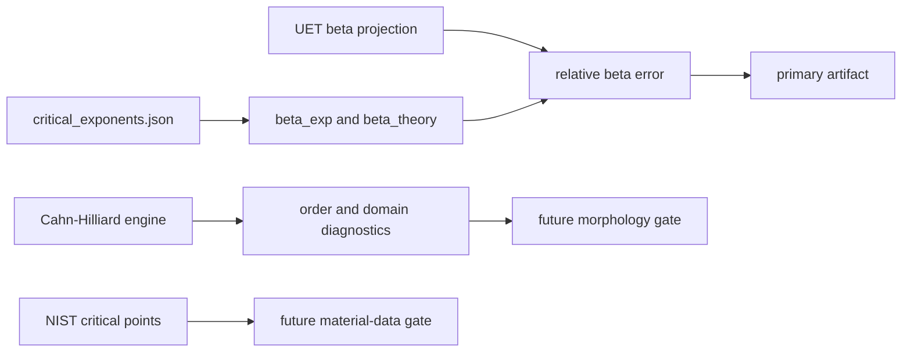

# 0.11 Phase Transitions

> [!NOTE]
> **AI-Digest**: This topic currently supports an internal benchmark for the 3D
> Ising/liquid-gas beta critical exponent and contains normalized spectral Cahn-Hilliard
> phase-separation simulations. It does not yet establish a full renormalization-group
> derivation or universal phase-transition theory.


## Current Claim Boundary

The primary verifier compares the current UET beta-exponent projection against a topic-local
3D Ising/liquid-gas benchmark. The Cahn-Hilliard solver and order-parameter proof scripts are
mechanism diagnostics until their nondimensional units, seeds, morphology metrics, and material
baselines are locked.

## Conceptual Diagram



## Evidence Matrix

| Layer | Current status | Evidence / artifact | Claim allowed |
| :-- | :-- | :-- | :-- |
| Beta critical exponent | Primary internal benchmark | `Result/artifacts/0_11_phase_transitions_verification.json` | selected exponent compatibility |
| Cahn-Hilliard dynamics | Normalized model exists | `Engine_Phase.py`, `FORMULA_AUDIT.md` | mechanism simulation |
| Order parameter proof | Simulation diagnostic | `Proof_Order_Parameter.py` | internal order-emergence check |
| NIST critical points | Working-copy data only | `Data/NIST_Critical_Points.csv` | future provenance/data gate |
| Source evidence workflow | Structured provenance gate | `Data/03_Research/source_evidence_intake_stub.json`, `source_evidence_readiness_matrix.json` | source-review queue |
| Branch claim gate | Structured claim ceiling | `Data/03_Research/branch_claim_gate.json` | selected-branch claim control |
| Claim-scope gate | Artifact export controller | `phase_transition_claim_scope_gate` in artifact | blocks universality/RG overclaim |
| Wave 5 spatial-coupling candidate | Diagnostic candidate | `Result/artifacts/0_11_spatial_coupling_scaling.json` | operator gates pass; universality shift blocked |
| Wave 6 coefficient sensitivity | Diagnostic triage | `Result/artifacts/0_11_spatial_coupling_sensitivity.json` | coefficient-only tuning remains mean-field-like |
| Universal phase-transition theory | Not closed | limitations and formula audit | do not claim full proof |

## 5x4 Grid Structure

| Pillar | Purpose |
| :-- | :-- |
| `Doc/` | analysis notes for symmetry breaking, phase separation, and critical behavior |
| `Ref/` | critical exponent, Cahn-Hilliard, Ginzburg-Landau, and thermodynamic references |
| `Data/` | topic-local critical exponent and critical-point working copies |
| `Code/` | engine, proof, research, competitor, and visualization scripts |
| `Result/` | artifacts, plots, and run logs |

## Quick Start

```powershell
cd C:\Users\santa\Desktop\uet_harness
python docs/topics/0.11_Phase_Transitions/Code/03_Research/Research_Critical_Exponents.py
```

## Key Files

- `FORMULA_AUDIT.md`: formula, unit, constant, proof-status, and failure-mode registry.
- `VERIFICATION_SPEC.md`: primary command, metrics, thresholds, and artifact interpretation.
- `DATA_MANIFEST.md`: current data roles and provenance gaps.
- `METHOD.md`: topic method scope and dependency policy.
- `LIMITATIONS.md`: blockers that prevent stronger claims.

## Current Limitations

- The primary benchmark currently tests beta only, not the full critical-exponent set.
- The Cahn-Hilliard solver is normalized and not yet calibrated to a material dataset.
- Order-parameter thresholds are internal diagnostics.
- Upstream provenance for critical-exponent and critical-point tables still needs a stronger
  external data cache.
- Topic-level source-evidence and branch-claim gates cap the topic at selected-benchmark and mechanism-diagnostic status.
- The artifact-level `phase_transition_claim_scope_gate` must stay `WARN` even when the beta
  benchmark passes, until full exponent/scaling checks, material critical-point gates, and
  renormalization-group closure are source-backed.
- The Wave 5 `spatial_coupled_v1` candidate currently remains diagnostic-only: engine and spatial-operator gates pass, but `universality_shift_gate` is `BLOCKED` with beta still near mean-field.
- The Wave 6 coefficient sensitivity diagnostic found no tested coefficient-only case near the 3D Ising beta target; the next blocker is operator-form or estimator revision, not simple coefficient tuning.

*Status note: internal critical-exponent benchmark and formula-audit hardening gate.*
