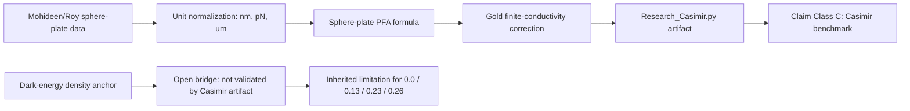

# 0.12 Vacuum Energy & Casimir Effect

> [!NOTE]
> **AI-Digest**: This topic currently has a source-backed internal benchmark for the Casimir force using a Mohideen/Roy sphere-plate working dataset. The vacuum-energy and dark-energy interpretation remains an open bridge: it is important to the theory, but it is not validated by the Casimir artifact alone.


## Research Role

Topic `0.12` is the vacuum/Casimir benchmark layer. Its immediate scientific job is to test whether the implemented engine reproduces a measured force-versus-distance Casimir curve with declared geometry, units, constants, and error thresholds. Its larger role in UET is to define a possible bridge from vacuum boundary effects toward vacuum-energy structure, but that bridge is not yet a cosmology proof.

## Conceptual Map



## Evidence and Status Matrix

| Layer | Current status | Evidence path | Claim allowed now | Blocker |
| :-- | :-- | :-- | :-- | :-- |
| Data | Real source referenced, topic-local working copy | `Data/03_Research/mohideen_1998_casimir.json` | The benchmark uses a declared Mohideen/Roy-style sphere-plate dataset. | Upstream archival URL/DOI and transcription audit still need freezing. |
| Formula | Reviewed registry | `FORMULA_AUDIT.md` | PFA Casimir and finite-conductivity formulas are mapped to code and units. | Parallel-plate pressure function is still named as force; dark-energy anchor is not derived. |
| Verification | Runnable primary artifact | `Code/03_Research/Research_Casimir.py` | Casimir force agreement can be judged by average and max relative error thresholds. | Needs radius/material sensitivity runs and independent baseline comparison. |
| Source evidence workflow | Structured provenance gate | `Data/03_Research/source_evidence_intake_stub.json`, `source_evidence_readiness_matrix.json` | source-review queue | Upstream archival pointers, sensitivity packages, and cosmology bridge evidence are still missing. |
| Branch claim gate | Structured claim ceiling | `Data/03_Research/branch_claim_gate.json` | benchmark-only claim control | Casimir benchmark does not promote vacuum-energy closure claims. |
| Claims | Bounded to Casimir benchmark | this README, `METHOD.md`, `LIMITATIONS.md` | Supports internal benchmark claims only. | Does not solve the vacuum catastrophe or establish dark energy. |
| Dependencies | Limited downstream use | `0.0`, `0.13`, `0.23`, `0.26` | Downstream topics may cite Casimir benchmark behavior. | Downstream topics must inherit dark-energy bridge limitations. |

## Primary Verification

```powershell
python docs/topics/0.12_Vacuum_Energy_Casimir/Code/03_Research/Research_Casimir.py
```

Expected artifact:

- `Result/artifacts/0_12_vacuum_energy_casimir_verification.json`

The verifier must record PASS/FAIL, dataset hash, geometry, model radius, formula IDs, thresholds, and per-point residuals.

## Key Files

- `FORMULA_AUDIT.md`: formula registry, units, proof status, failure modes.
- `DATA_MANIFEST.md`: dataset provenance, local paths, hashes, benchmark roles.
- `VERIFICATION_SPEC.md`: primary command, thresholds, artifact contract.
- `METHOD.md`: modeling assumptions and dependency policy.
- `LIMITATIONS.md`: explicit boundaries for vacuum-energy and cosmology claims.
- `Data/03_Research/source_evidence_intake_stub.json`: provenance intake for benchmark and bridge upgrades.
- `Data/03_Research/source_evidence_readiness_matrix.json`: readiness gate for source review.
- `Data/03_Research/branch_claim_gate.json`: branch-level claim ceiling.
- `Code/01_Engine/Engine_Vacuum.py`: current engine implementation.
- `Code/03_Research/Research_Casimir.py`: primary benchmark verifier.
