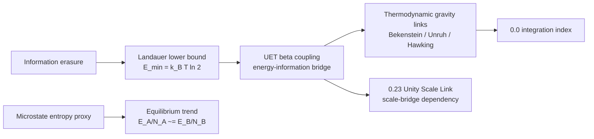

# Method

## Problem target

This topic studies whether UET can connect entropy, information cost, and dissipation benchmarks under one bridge model.

## Core components

### Engine components
- `Code/01_Engine/Engine_Thermodynamics.py`

### Proof-oriented components
- `Code/02_Proof/Proof_Entropy_Max.py`

### Research and comparison components
- `Code/03_Research/Proof_Vacuum_Entropy_Sink.py`
- `Code/03_Research/Research_Landauer.py`
- `Code/03_Research/Research_NonEquilibrium_Validation.py`

## Mechanism map

## Evidence matrix

| Layer | Current implementation | Evidence class | Use in theory |
|:--|:--|:--|:--|
| Landauer identity | Exact-constant calculation in engine and verifier | `C` | Supports information-energy lower-bound bridge. |
| Entropy/equilibrium proxy | Stirling entropy proxy and stochastic contact engine | `D/C` | Useful model sandbox; needs seeded ensemble acceptance. |
| Bekenstein/Unruh/Hawking links | Formula-consistency checks against standard identities | `D/C` | Context for thermodynamic gravity bridge; not independent UET validation. |
| Cattaneo heat-flux benchmark | Synthetic hysteresis dataset and Euler relaxation update | `D` | Demonstrates expected lag behavior only. |
| Vacuum entropy sink | Topic-local heuristic simulation | `E/D` | Hypothesis sandbox; cannot support core claims yet. |
| Source-evidence gate | Intake stub plus readiness matrix for unresolved upstream files and uncertainty packages | `Workflow gate` | Blocks claim/data upgrades until missing external evidence is explicitly attached. |

## Variable framing

- Primary modeled quantities: entropy, dissipated work, information cost, relaxation terms, and bridge coefficients
- Physical-unit formulas use SI constants where available (`k_B`, `hbar`, `c`, `G`, `e`, `h`).
- Engine entropy/equilibrium quantities are dimensionless proxies unless an explicit physical scale is introduced.

## Assumptions

- The topic currently uses selected dissipation and information-thermodynamics benchmarks rather than a universal derivation.
- Landauer measurements are treated as lower-bound consistency checks, not exact predictions of total dissipated heat.
- Bekenstein, Unruh, and Hawking formulas are established theoretical identities used as bridge constraints, not as standalone proof of UET.

## Domain of validity

- Selected Landauer-style and nonequilibrium thermodynamics comparisons represented in topic-local files.

## Excluded cases

- A universal proof across all thermodynamic regimes or all coarse-graining choices.
- Direct experimental measurement of Hawking/Unruh temperatures in the regimes shown by the verifier.
- Physical proof that the proposed vacuum entropy sink exists.

## Parameter sensitivity note

- Reported behavior depends on coarse-graining choices and selected bridge coefficients.
- Synthetic non-equilibrium behavior depends on `tau`, `k_cond`, and the hand-built Cattaneo benchmark.

## Dependency layer

| Dependency | Direction | Status |
|:--|:--|:--|
| `0.0_Grand_Unification` | receives this topic as a bridge constraint | Integration-only until this topic's external data and formula audit are source-locked. |
| `0.23_Unity_Scale_Link` | depends on this topic for information-energy scale logic | Must inherit `0.13` limitations where scale links rely on Landauer/Bekenstein bridge claims. |
| `0.26_Cosmic_Dynamic_Frame` | may reference thermodynamic frame language | Cannot use synthetic/vacuum-sink sections as empirical support. |

## Provenance hardening workflow

1. Run `Research_Landauer.py` to regenerate the verifier artifact and source-evidence workflow files.
2. Fill `Data/03_Research/source_evidence_intake_stub.json` only with real DOI/URL/local-path/row evidence.
3. Use `Data/03_Research/source_evidence_readiness_matrix.json` as the gate before changing claim class or rewriting working-copy data.
4. Promote wording only when formula audit, source evidence, verifier artifact, and dependency limitations agree.
