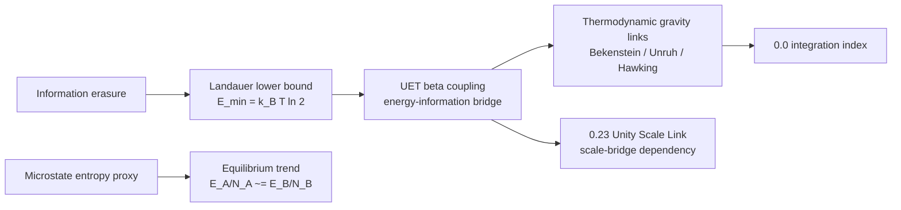

# Method

## Problem target

This topic studies whether UET can connect entropy, information cost, and dissipation benchmarks under one bridge model.

## Core components

### Engine components
- `Code/01_Engine/Engine_Thermodynamics.py`

### Proof-oriented components
- `Code/02_Proof/Proof_Entropy_Max.py`

### Research and comparison components
- `Code/03_Research/Proof_Vacuum_Entropy_Sink.py`
- `Code/03_Research/Research_Landauer.py`
- `Code/03_Research/Research_NonEquilibrium_Validation.py`

## Research lanes

| Lane | Current role | Primary evidence state | Why it matters |
| :-- | :-- | :-- | :-- |
| Landauer lower-bound lane | Primary benchmark lane | source-referenced internal benchmark | Gives the cleanest current constraint connecting information erasure and energy cost. |
| Standard thermodynamic-gravity identity lane | Constraint lane | formula-consistency only | Keeps Bekenstein/Unruh/Hawking usage bounded to established identities rather than treating them as independent UET proof. |
| Synthetic nonequilibrium lane | Exploratory dynamics lane | simulation-only | Useful for model-shape work, but not a validation lane until a real sourced dataset exists. |
| Vacuum entropy-sink lane | Hypothesis sandbox | open mechanism | Keeps speculative bridge logic visible without letting it silently support core claims. |
| Foundation export lane | Dependency-control lane | machine-readable gate | Controls what `0.0` and `0.23` may inherit from `0.13` right now. |

## Mechanism map

## Evidence matrix

| Layer | Current implementation | Evidence class | Use in theory |
|:--|:--|:--|:--|
| Landauer identity | Exact-constant calculation in engine and verifier | `C` | Supports information-energy lower-bound bridge. |
| Entropy/equilibrium proxy | Stirling entropy proxy and stochastic contact engine | `A/B/C diagnostic` | Useful model sandbox; needs seeded ensemble acceptance. |
| Bekenstein/Unruh/Hawking links | Formula-consistency checks against standard identities | `B/C diagnostic` | Context for thermodynamic gravity bridge; not independent UET validation. |
| Cattaneo heat-flux benchmark | Synthetic hysteresis dataset and Euler relaxation update | `A/B simulation-only` | Demonstrates expected lag behavior only. |
| Vacuum entropy sink | Topic-local heuristic simulation | `A hypothesis` | Hypothesis sandbox; cannot support core claims yet. |
| Source-evidence gate | Intake stub plus readiness matrix for unresolved upstream files and uncertainty packages | `Workflow gate` | Blocks claim/data upgrades until missing external evidence is explicitly attached. |

## Claim-class interpretation

- `Class A`: hypothesis or open mechanism lane
- `Class B`: model or constraint lane with a runnable or inspectable formulation
- `Class C`: current internal benchmark lane with explicit metrics, thresholds, and artifact output

This topic currently mixes all three classes. The key governance rule is that only the Landauer lower-bound lane is allowed to behave like a topic-level benchmark lane; the others must stay explicitly diagnostic, simulation-only, or hypothesis-level until stronger evidence exists.

## Variable framing

- Primary modeled quantities: entropy, dissipated work, information cost, relaxation terms, and bridge coefficients
- Physical-unit formulas use SI constants where available (`k_B`, `hbar`, `c`, `G`, `e`, `h`).
- Engine entropy/equilibrium quantities are dimensionless proxies unless an explicit physical scale is introduced.
- `UNITS_CONTRACT.md` and `Data/03_Research/units_contract.json` are the current authority for separating the SI layer from the proxy layer.

## Assumptions

- The topic currently uses selected dissipation and information-thermodynamics benchmarks rather than a universal derivation.
- Landauer measurements are treated as lower-bound consistency checks, not exact predictions of total dissipated heat.
- Bekenstein, Unruh, and Hawking formulas are established theoretical identities used as bridge constraints, not as standalone proof of UET.
- If a downstream topic inherits `0.13`, it inherits only the specific allowed export named in the foundation claim gate, not the full conceptual bridge.

## Domain of validity

- Selected Landauer-style and nonequilibrium thermodynamics comparisons represented in topic-local files.

## Excluded cases

- A universal proof across all thermodynamic regimes or all coarse-graining choices.
- Direct experimental measurement of Hawking/Unruh temperatures in the regimes shown by the verifier.
- Physical proof that the proposed vacuum entropy sink exists.

## Parameter sensitivity note

- Reported behavior depends on coarse-graining choices and selected bridge coefficients.
- Synthetic non-equilibrium behavior depends on `tau`, `k_cond`, and the hand-built Cattaneo benchmark.

## Current hardening priorities

1. Move the primary Landauer lane from source-referenced working-copy status toward row-level source-normalized status.
2. Extend the current uncertainty artifact into a fuller package: Jun needs source-summary file/table identity and an exact fit-target locator, Berut needs numeric-point or stronger-surface provenance, and gravity-adjacent outputs still need systematic astrophysical-term closure plus systematic terms beyond the current mass-plus-`G`-proxy layer.
3. Keep the standard-identity lane separate from any claim that UET derives those identities.
4. Replace or explicitly quarantine synthetic nonequilibrium and vacuum-sink lanes so they do not drift upward into core-claim territory.
5. Build a derivation map showing what a future UET-specific bridge proof would have to supply beyond the current identities and lower-bound checks.

## Row-closure navigation

- Human-readable row blocker map: `ROW_CLOSURE_MATRIX.md`
- Machine-readable row blocker map: `Data/03_Research/row_closure_matrix.json`
- Human-readable Landauer row contract: `LANDAUER_ROW_CONTRACT.md`
- Machine-readable Landauer row contract: `Data/03_Research/landauer_row_contract.json`
- Human-readable Berut gap note: `BERUT_2012_PROVENANCE_GAP.md`
- Machine-readable Berut gap note: `Data/03_Research/berut_2012_provenance_gap.json`
- Human-readable Jun gap note: `JUN_2014_UNCERTAINTY_GAP.md`
- Machine-readable Jun gap note: `Data/03_Research/jun_2014_uncertainty_gap.json`
- Human-readable Jun mapping-conflict note: `JUN_2014_RUNTIME_MAPPING_CONFLICT.md`
- Machine-readable Jun mapping-conflict note: `Data/03_Research/jun_2014_runtime_mapping_conflict.json`
- Human-readable Hong-lineage note: `HONG_2016_SOURCE_LINEAGE_NOTE.md`
- Machine-readable Hong-lineage note: `Data/03_Research/hong_2016_source_lineage_note.json`
- Human-readable Hong numeric-mismatch note: `HONG_2016_NUMERIC_MISMATCH_NOTE.md`
- Machine-readable Hong numeric-mismatch note: `Data/03_Research/hong_2016_numeric_mismatch_note.json`
- Human-readable Hong source-acquisition blocker: `HONG_2016_SOURCE_ACQUISITION_BLOCKER.md`
- Machine-readable Hong source-acquisition blocker: `Data/03_Research/hong_2016_source_acquisition_blocker.json`
- Human-readable Peterson conflict note: `PETERSON_2018_SOURCE_CONFLICT.md`
- Machine-readable Peterson conflict note: `Data/03_Research/peterson_2018_source_conflict.json`
- Human-readable Peterson branch identity policy: `PETERSON_BRANCH_IDENTITY_POLICY.md`
- Machine-readable Peterson branch identity policy: `Data/03_Research/peterson_branch_identity_policy.json`
- Human-readable measured-constant note: `MEASURED_CONSTANT_UNCERTAINTY_PACKAGE.md`
- Machine-readable measured-constant note: `Data/03_Research/measured_constant_uncertainty_package.json`

These files sit between the source-evidence intake and the uncertainty artifacts.
They exist so the next hardening move can be chosen row-by-row rather than by broad topic-wide blocker labels.
The Landauer row contract narrows that still further for the `Berut` and `Jun` pair, which are the current shortest path to improving the main benchmark lane.
The Berut gap note isolates the row-level provenance problem on the strongest current Landauer row.
The Berut source-surface note narrows one part of that same blocker again: the currently visible Nature page surface behaves like a figure-level preview, and the new figure-locator mapping note now pins `Figure 3` as the current conservative preview-level locator for the topic-summary row rather than leaving the locator itself open.
The Berut transcription-policy blocker narrows the same lane one step further: before claiming row-level closure, the repo should choose one explicit normalization path rather than implying that any future row extraction method would be equally trustworthy. The current decision note chooses `figure_level_locator_capture`, and the new figure-locator mapping note attaches `Figure 3` to the topic-summary row, so the next Berut controller is now numeric-point capture or one stronger upstream numeric surface rather than figure-locator choice itself.
The Jun gap note now isolates the remaining source-summary identity work after the summary-layer interval was attached.
The Jun mapping-conflict note narrows a different Jun problem: the current runtime `0.028 eV` row is incompatible with the pinned source-facing asymptotic-work quantity, and the legacy-row policy now demotes it out of active Jun benchmark logic.
The Hong-lineage note narrows a different problem again: the same legacy `0.028 eV / 44% above limit` row may belong partly or wholly to a later nanomagnetic-memory branch, so it cannot currently be treated as a clean `Jun 2014` row or an active Hong row without final-source confirmation.
A staged external source record for that possible `Hong 2016` branch now exists under `docs/data/external/thermodynamics/landauer/hong_2016/`, and a locally archived Crossref work record now confirms `DOI 10.1126/sciadv.1501492` plus the expected article metadata; even so, it is still source-record-only and must not yet be treated as a closed row reassignment.
The Hong numeric-mismatch note narrows the blocker again: even if the row belongs to the Hong branch, the currently visible secondary summary is closer to `0.026 eV` than the local legacy `0.028 eV` row, so source-family closure alone still would not close the runtime number.
The Hong source-acquisition blocker narrows the branch from yet another angle: the likely paper identity is visible, but a primary DOI or official article page is still missing, so the alternate branch remains source-record-only.
The Peterson conflict note isolates a different problem: the quantum-Landauer branch now appears to be a composite misreference, where the local DOI resolves to a Nature Physics entropy-measurement paper while the trapped-ion quantum-Landauer narrative points to a different 2018 PRL article, so row capture cannot begin until one exact paper identity is chosen.
The Peterson branch identity policy narrows that one step further: the repo now explicitly separates the Peterson-led 2016 authorship cue from the trapped-ion 2018 PRL cue and from the Nature Physics 2018 DOI, so the local `Peterson 2018` label is demoted and the branch is treated as a generic unresolved placeholder until one exact paper is selected.
The measured-constant package isolates the current runtime uncertainty policy for `G` and now threads that proxy into provisional gravity-context combined intervals while keeping the mass-only baseline visible.

## Derivation boundary

- Human-readable boundary file: `DERIVATION_MAP.md`
- Machine-readable boundary file: `Data/03_Research/bridge_derivation_map.json`
- Landauer-specific mapping boundary: `LANDAUER_UET_MAPPING.md` and `Data/03_Research/landauer_uet_mapping.json`
- Beta-role clarification boundary: `BETA_ROLE.md` and `Data/03_Research/beta_role_clarification.json`

These two files should stay aligned with `FORMULA_AUDIT.md` and the verifier artifact.
They exist to stop the topic from silently upgrading imported standard identities into claimed UET derivations.

## Dependency layer

| Dependency | Direction | Status |
|:--|:--|:--|
| `0.0_Grand_Unification` | receives this topic as a bridge constraint | Integration-only until this topic's external data and formula audit are source-locked. |
| `0.23_Unity_Scale_Link` | depends on this topic for information-energy scale logic | Must inherit `0.13` limitations where scale links rely on Landauer/Bekenstein bridge claims. |
| `0.26_Cosmic_Dynamic_Frame` | may reference thermodynamic frame language | Cannot use synthetic/vacuum-sink sections as empirical support. |

## Provenance hardening workflow

1. Run `Research_Landauer.py` to regenerate the verifier artifact and source-evidence workflow files.
2. Fill `Data/03_Research/source_evidence_intake_stub.json` only with real DOI/URL/local-path/row evidence, and if the visible upstream surface is only a figure-level preview, record that surface status plus one explicit transcription-policy choice instead of pretending a row table is already archived.
3. Use `Data/03_Research/source_evidence_readiness_matrix.json` as the gate before changing claim class or rewriting working-copy data.
4. Promote wording only when formula audit, source evidence, verifier artifact, and dependency limitations agree.
5. Record each coherent hardening wave in `UPDATE_LOG.md` after the verifier or boundary state changes.
