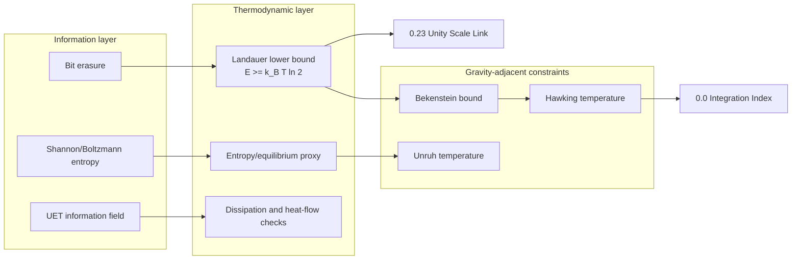

# 0.13 Thermodynamic Bridge

<!--
{
  "@context": "https://schema.org",
  "@type": "ScholarlyArticle",
  "name": "UET Topic 0.13: Thermodynamic Bridge",
  "description": "Thermodynamic and information-energy bridge module for Unity Equilibrium Theory.",
  "about": "Thermodynamics, Information Theory, Landauer Limit, Entropy, Information-Energy Equivalence, UET"
}
-->

> [!NOTE]
> **AI-Digest**: UET Topic 0.13 is the core information-energy bridge. Its strongest current support is source-backed Landauer lower-bound consistency (`E >= k_B T ln 2`) plus formula-consistency checks for Bekenstein/Unruh/Hawking thermodynamic links. The UET-specific bridge mechanism remains a hardening target that depends on source-locked data, explicit units, verifier artifacts, and cross-topic dependency control.


> **Research role:** this topic constrains how UET may connect information, entropy, and energy cost. Strong claims must cite the formula audit, data manifest, and verifier artifact rather than relying on the conceptual bridge alone.

---

## 1. 5x4 Grid Structure

| Pillar | Purpose |
| :--- | :--- |
| **Doc/** | Analysis of information-energy equivalence and thermodynamic bridge assumptions. |
| **Ref/** | Landauer, Berut, Jacobson, Bekenstein, and related source anchors. |
| **Data/** | Topic-local Landauer, black-hole, constants, and synthetic heat-flux working copies with open source-lock tasks. |
| **Code/** | `01_Engine` microstate/thermodynamic helpers, `02_Proof` entropy proxy, and `03_Research` bridge checks. |
| **Result/** | Verifier artifact, entropy plots, and Landauer/Bekenstein/Jacobson visual outputs. |

---

## Theory Connection



---

## Research Hardening Matrix

| Layer | Current status | Evidence path | What strengthens the theory next |
| :-- | :-- | :-- | :-- |
| Core mechanism | Information-erasure energy bridge via Landauer-style relation | `METHOD.md`, `FORMULA_AUDIT.md` | Map each thermodynamic term to units, constants, and verifier roles. |
| Data | Berut/CODATA source records plus topic-local working copies with hashes | `DATA_MANIFEST.md`, `docs/data/external/thermodynamics/landauer/berut_2012/source_record.json`, `docs/data/external/constants/codata/si_2019_exact_constants.json`, `Data/03_Research/source_evidence_intake_stub.json` | Archive raw/supplemental Berut numeric tables and add uncertainty-aware preprocessing notes. |
| Formula | Reviewed formula audit maps Landauer, entropy proxy, Bekenstein, Unruh, Hawking, Cattaneo, and vacuum-sink formulas | `FORMULA_AUDIT.md` | Add uncertainty propagation, audit duplicate helper constants, and separate identity checks from UET-specific bridge claims. |
| Verification | Primary script writes structured artifact with metrics, thresholds, hashes, warning reasons, and source-evidence readiness | `VERIFICATION_SPEC.md`, `Result/artifacts/0_13_thermodynamic_bridge_verification.json`, `Data/03_Research/source_evidence_readiness_matrix.json` | Promote from `WARN` only after external source-lock and cross-topic proof dependencies are closed. |
| Theory dependency | Feeds UET's information-energy and entropy interpretation | `0.0_Grand_Unification`, `0.23_Unity_Scale_Link`, `0.26_Cosmic_Dynamic_Frame` | Define exactly which claims inherit this bridge and which remain open. |
| Limitation | Strong conceptual importance, incomplete provenance normalization | `LIMITATIONS.md` | Separate theoretical identity, experimental lower-bound benchmark, synthetic benchmark, and heuristic extension. |

---

## Problem And Current Result

- **The Problem:** Thermodynamics deals with heat and work, while Information Theory deals with bits and bandwidth. Landauer's Principle gives a concrete bridge (`E >= k_B T ln 2`), but UET still needs an explicit, checkable mapping from information-field variables to thermodynamic observables.
- **The Solution:** UET treats information as physical and uses Landauer/Bekenstein-style constraints as boundary conditions for the bridge. The current research task is to make each variable, unit, constant, formula, and dependency auditable.
- **The Result:** The present verifier checks exact-constant Landauer consistency and lower-bound behavior against pinned source records; broader UET thermodynamic claims remain tied to the open hardening tasks in `FORMULA_AUDIT.md`, `DATA_MANIFEST.md`, and `LIMITATIONS.md`.

---

## Test Results

| Category | Test | Result | Status |
| :--- | :--- | :--- | :--- |
| **01_Engine** | Thermo Solver | Entropy/equilibrium proxy, needs seeded ensemble gate | WARN |
| **02_Proof** | Entropy Max | Delta-S simulation check, not a formal proof | WARN |
| **03_Research** | Landauer Data | Exact-constant lower-bound consistency | PASS/WARN |
| **03_Research** | Black Hole Entropy | Formula-consistency with area law | WARN |

---

## 2. Quick Start

```powershell
.venv\Scripts\python.exe docs\topics\0.13_Thermodynamic_Bridge\Code\03_Research\Research_Landauer.py
```

## Key Files

- [Engine_Thermodynamics.py](./Code/01_Engine/Engine_Thermodynamics.py): microstate and thermodynamic helper engine.
- [FORMULA_AUDIT.md](./FORMULA_AUDIT.md): formula registry with units, constants, proof status, verifier role, and failure modes.
- [DATA_MANIFEST.md](./DATA_MANIFEST.md): data provenance, local hashes, benchmark roles, and external source-lock targets.
- [VERIFICATION_SPEC.md](./VERIFICATION_SPEC.md): primary command, thresholds, artifact path, and interpretation rules.
- [Research_Landauer.py](./Code/03_Research/Research_Landauer.py): primary verifier for Landauer/Bekenstein/Jacobson formula checks.
- [source_evidence_intake_stub.json](./Data/03_Research/source_evidence_intake_stub.json): structured intake sheet for missing external-source evidence before any claim or data upgrade.
- [source_evidence_readiness_matrix.json](./Data/03_Research/source_evidence_readiness_matrix.json): readiness gate showing which source targets are still blocked by missing evidence fields.

---

*Core hardening status: formula-audited, verifier-artifact enabled, source records pinned, source-evidence intake/readiness enabled, raw-table source-lock still open.*
