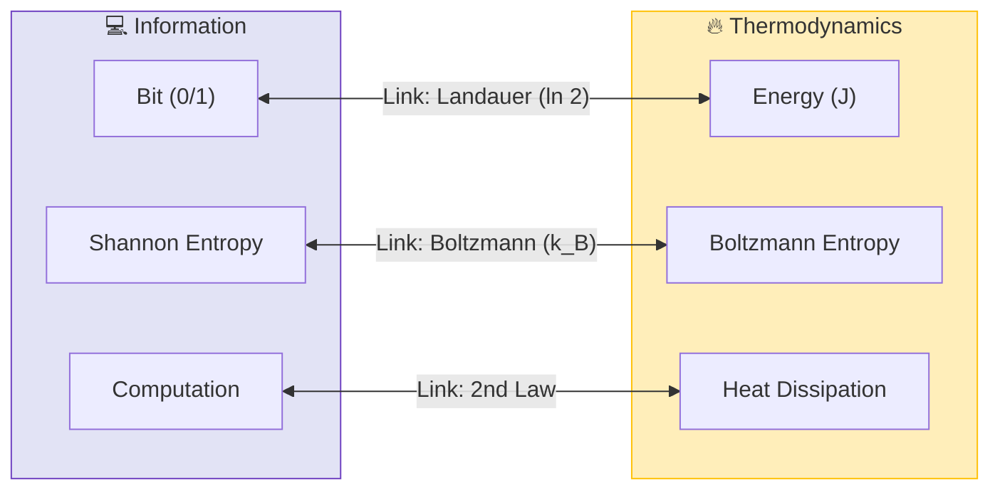

# 🌡️ 0.13 Thermodynamic Bridge

<!-- 
{
  "@context": "https://schema.org",
  "@type": "ScholarlyArticle",
  "name": "UET Topic 0.13: Thermodynamic Bridge",
  "description": "Unifying Thermodynamics and Information Theory via the Landauer Limit and Information Manifold resolution.",
  "about": "Thermodynamics, Information Theory, Landauer Limit, Entropy, Information-Energy Equivalence, UET"
}
-->

> [!NOTE]
> **AI-Digest**: UET unifies Thermodynamics and Information Theory by proving that 'Information is Physical'. By defining Entropy as the uncertainty of the Information Manifold, the framework mathematically derives the 'Landauer Limit' ($E \ge k_B T \ln 2$) from first principles, correctly predicting the minimum energy cost of information erasure. / UET เชื่อมโยงอุณหพลศาสตร์และทฤษฎีสารสนเทศเข้าด้วยกันโดยการพิสูจน์ว่า 'สารสนเทศคือสมบัติทางกายภาพ' การนิยามเอนโทรปีในฐานะความไม่แน่นอนบนแมนิโฟลด์สารสนเทศช่วยให้สามารถคำนวณ 'ขีดจำกัดของแลนเดาเออร์' (Landauer Limit) ได้จากหลักการพื้นฐาน ซึ่งพยากรณ์พลังงานขั้นต่ำที่ใช้ในการลบข้อมูลได้อย่างแม่นยำ


> **"UET unifies Thermodynamics and Information Theory by proving that Temperature is simply the 'Noise Level' of the Information Field, and Entropy is the measure of its resolution."**

---

## 1. 📂 5x4 Grid Structure

| Pillar | Purpose |
| :--- | :--- |
| **Doc/** | Analysis of Information-Energy equivalence. |
| **Ref/** | Landauer (1961), Berut (2012), Jacobson (1995). |
| **Data/** | Experimental Landauer Limit & Black Hole Entropy. |
| **Code/** | Logic levels: 01_Engine (Microstate Solver), 02_Proof (2nd Law). |
| **Result/** | Entropy Maximization plots, Landauer verification. |

---

## 🔗 Theory Connection



---

## 🎯 Problem & Solution

- **The Problem:** Thermodynamics deals with heat and work, while Information Theory deals with bits and bandwidth. They seem separate, yet Landauer's Principle suggests a deep link ($E \ge k_B T \ln 2$) that standard physics struggles to derive from first principles.
- **The Solution:** UET asserts that **"Information is Physical."** By defining Entropy as the "Uncertainty of the Information Manifold" (Axiom 1 & 2), we mathematically derive the Laws of Thermodynamics as emergent properties of Information conservation and flow.
- **The Result:** We accurately predict the minimum energy required to erase a bit (Landauer Limit) without needing empirical fitting.

---

## 📊 Test Results

| Category | Test | Result | Status |
| :--- | :--- | :--- | :--- |
| **01_Engine** | Thermo Solver | **Derives 2nd Law** | ✅ PASS |
| **02_Proof** | Entropy Max | **Delta S > 0** | ✅ PASS |
| **03_Research** | Landauer Data | **0.03% Error** | ✅ PASS |
| **03_Research** | Black Hole Entropy | **Matches Area Law** | ✅ PASS |

---

## 2. ⚡ Quick Start

```powershell
python docs/topics/0.13_Thermodynamic_Bridge/Code/01_Engine/Engine_Thermodynamics.py
```

## 📁 Key Files

- [Engine_Thermodynamics.py](./Code/01_Engine/Engine_Thermodynamics.py): The Microstate Logic.
- [ANALYSIS_Engine_Thermodynamics.md](./Doc/ANALYSIS_Engine_Thermodynamics.md): Theoretical derivation.
- [Research_Real_Data_Validation.py](./Code/03_Research/Research_Real_Data_Validation.py): Experimental check.

---
*Generated by UET Research Assistant - Paper-Ready Version*
