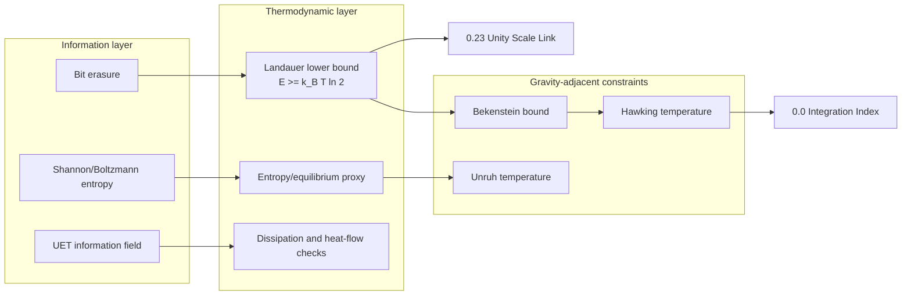

---
layout: article
title: "UET Topic 0.13: Thermodynamic Bridge"
description: "Research module for Thermodynamic Bridge within the Unity Equilibrium Theory framework."
---

# 0.13 Thermodynamic Bridge

<!--
{
  "@context": "https://schema.org",
  "@type": "ScholarlyArticle",
  "name": "UET Topic 0.13: Thermodynamic Bridge",
  "description": "Thermodynamic and information-energy bridge module for Unity Equilibrium Theory.",
  "about": "Thermodynamics, Information Theory, Landauer Limit, Entropy, Information-Energy Equivalence, UET"
}
-->

> [!NOTE]
> **AI-Digest**: UET Topic 0.13 is the core information-energy bridge. Its strongest current support is source-backed Landauer lower-bound consistency (`E >= k_B T ln 2`) plus formula-consistency checks for Bekenstein/Unruh/Hawking thermodynamic links. The UET-specific bridge mechanism remains a hardening target that depends on source-locked data, explicit units, verifier artifacts, and cross-topic dependency control.


> **Research role:** this topic constrains how UET may connect information, entropy, and energy cost. Strong claims must cite the formula audit, data manifest, and verifier artifact rather than relying on the conceptual bridge alone.

---

## 1. 5x4 Grid Structure

| Pillar | Purpose |
| :--- | :--- |
| **Doc/** | Analysis of information-energy equivalence and thermodynamic bridge assumptions. |
| **Ref/** | Landauer, Berut, Jacobson, Bekenstein, and related source anchors. |
| **Data/** | Topic-local Landauer, black-hole, constants, and synthetic heat-flux working copies with open source-lock tasks. |
| **Code/** | `01_Engine` microstate/thermodynamic helpers, `02_Proof` entropy proxy, and `03_Research` bridge checks. |
| **Result/** | Verifier artifact, entropy plots, and Landauer/Bekenstein/Jacobson visual outputs. |

---

## Theory Connection



---

## Research Hardening Matrix

| Layer | Current status | Evidence path | What strengthens the theory next |
| :-- | :-- | :-- | :-- |
| Core mechanism | Information-erasure energy bridge via Landauer-style relation | `METHOD.md`, `FORMULA_AUDIT.md` | Map each thermodynamic term to units, constants, and verifier roles. |
| Data | Berut/CODATA source records plus topic-local working copies with hashes; gravity and measured-constant provenance anchors are now attached for downstream uncertainty work, and the source-evidence intake now states when Berut is still only visible as a figure-level preview plus open transcription-policy choice | `DATA_MANIFEST.md`, `docs/data/external/thermodynamics/landauer/berut_2012/source_record.json`, `docs/data/external/gravity/ligo_black_hole_mergers/source_record.json`, `docs/data/external/gravity/eht_black_hole_masses/source_record.json`, `docs/data/external/constants/codata/si_2019_exact_constants.json`, `docs/data/external/constants/codata/measured_constants_2022_source_record.json`, `Data/03_Research/source_evidence_intake_stub.json` | Archive a stronger Berut numeric surface or choose one explicit transcription policy before treating the row as source-normalized. |
| Row closure | Dedicated row-by-row map now separates benchmark-row closure problems from broader topic prose | `ROW_CLOSURE_MATRIX.md`, `Data/03_Research/row_closure_matrix.json` | Close Berut, Jun, Peterson, and gravity-context rows by their specific missing fields rather than by broad topic-level labels. |
| Landauer row contract | Dedicated Berut/Jun contract now states the minimum row-level closure conditions for the primary Landauer lane | `LANDAUER_ROW_CONTRACT.md`, `Data/03_Research/landauer_row_contract.json` | Close Berut by row-level provenance and Jun by source-backed uncertainty capture before broader Landauer-lane promotion. |
| Berut provenance gap | Dedicated Berut note now states the exact row-level provenance evidence missing from the strongest current Landauer row | `BERUT_2012_PROVENANCE_GAP.md`, `Data/03_Research/berut_2012_provenance_gap.json` | Convert Berut from summary-row provenance into row-level source-normalized support only after one numeric point or stronger upstream numeric surface is attached under the selected figure-level path. |
| Berut source surface note | Dedicated Berut surface note now states that the currently visible Nature page behaves like a figure-level preview rather than an exposed numeric row table | `BERUT_2012_SOURCE_SURFACE_NOTE.md`, `Data/03_Research/berut_2012_source_surface_note.json` | Decide whether Berut row closure requires supplementary capture, figure-level locator capture, or explicit machine transcription from a non-preview source surface. |
| Berut transcription-policy blocker | Dedicated Berut policy blocker now states that the repo has selected `figure_level_locator_capture` as the conservative normalization path while a direct table surface is still not archived | `BERUT_2012_TRANSCRIPTION_POLICY_BLOCKER.md`, `Data/03_Research/berut_2012_transcription_policy_blocker.json` | Move beyond the now-captured `Figure 3` preview locator by attaching one numeric point/curve or a stronger upstream numeric surface. |
| Berut transcription-policy decision | Dedicated Berut decision note now records why `figure_level_locator_capture` is the preferred next move over supplementary capture or machine transcription from an unarchived non-preview surface | `BERUT_2012_TRANSCRIPTION_POLICY_DECISION.md`, `Data/03_Research/berut_2012_transcription_policy_decision.json` | Keep the selected policy fixed while narrowing the remaining work to numeric-point capture or one stronger upstream numeric surface. |
| Berut figure-locator mapping | Dedicated Berut locator note now records the exact preview-level figure currently allowed to support the topic-summary row and states the remaining numeric-capture boundary | `BERUT_2012_FIGURE_LOCATOR_MAPPING.md`, `Data/03_Research/berut_2012_figure_locator_mapping.json` | Capture one numeric point/curve within `Figure 3` or archive a stronger upstream numeric surface before stronger Berut closure. |
| Berut Figure 3 PPT source route | Dedicated source-route note now records the official publisher PowerPoint route, file name, byte size, SHA-256, and raster-only inspection boundary for Figure 3 | `BERUT_2012_FIGURE3_PPT_SOURCE_ROUTE.md`, `Data/03_Research/berut_2012_figure3_ppt_source_route.json` | Digitize a calibrated point/curve from the official raster or find a stronger source-data table before treating Berut as source-normalized. |
| Berut Figure 3 raster inventory | Dedicated raster-inventory note now records valid embedded image assets, primary digitization candidates, dimensions, byte offsets, and hashes from the official Figure 3 PPT | `BERUT_2012_FIGURE3_RASTER_ASSET_INVENTORY.md`, `Data/03_Research/berut_2012_figure3_raster_asset_inventory.json` | Select a candidate raster, calibrate axes, and transcribe one point/curve before row-level Berut normalization. |
| Berut Figure 3 digitization protocol | Dedicated protocol now selects `jpeg_2` as the preferred quantitative digitization candidate and demotes `jpeg_3` to schematic/procedure support after semantic asset review | `BERUT_2012_FIGURE3_DIGITIZATION_PROTOCOL.md`, `Data/03_Research/berut_2012_figure3_digitization_protocol.json` | Select the relevant quantitative panel in `jpeg_2`, map ticks, and capture a selected point/curve before numeric transcription or row replacement. |
| Berut Figure 3 landmark candidate capture | Automated candidate pass records `jpeg_2` panel-frame candidates and explains why they remain non-accepted visual landmarks rather than calibrated axis coordinates | `BERUT_2012_FIGURE3_LANDMARK_CANDIDATE_CAPTURE.md`, `Data/03_Research/berut_2012_figure3_landmark_candidate_capture.json` | Select the relevant quantitative panel in `jpeg_2`, map ticks, identify the Landauer reference/limit marker, and capture selected point/curve pixels before source-normalized Berut use. |
| Berut Figure 3 semantic asset review | Semantic review uses the author research page to separate the reset-procedure schematic from the average-heat plot, selecting `jpeg_2` as the preferred quantitative candidate and demoting `jpeg_3` to schematic/procedure support | `BERUT_2012_FIGURE3_SEMANTIC_ASSET_REVIEW.md`, `Data/03_Research/berut_2012_figure3_semantic_asset_review.json` | Map the relevant quantitative panel ticks and selected point/curve before numeric transcription. |
| Jun source-summary identity gap | Dedicated Jun note now states that the pinned Jun summary quantity has a first-pass interval and that the legacy `0.028 eV` row is demoted out of active Jun logic, and now has a captured Table 1/Figure 4 source-summary locator plus local arXiv transcription, but still lacks final PRL parity/APS access resolution for stronger source-normalized use | `JUN_2014_UNCERTAINTY_GAP.md`, `Data/03_Research/jun_2014_uncertainty_gap.json`, `JUN_2014_SOURCE_SUMMARY_TRANSCRIPTION.md`, `Data/03_Research/jun_2014_source_summary_transcription.json` | Keep the source-facing Jun interval while resolving final PRL parity or APS access for the transcribed summary quantity. |
| Jun runtime mapping conflict | Dedicated Jun note now states that the pinned `Jun 2014` asymptotic-work quantity is quantitatively inconsistent with the legacy `0.028 eV` runtime row under the current `300 K` verifier baseline | `JUN_2014_RUNTIME_MAPPING_CONFLICT.md`, `Data/03_Research/jun_2014_runtime_mapping_conflict.json` | Decide whether the legacy runtime row should be replaced, split into a non-Jun branch, or explicitly remapped to a different Jun quantity before uncertainty closure. |
| Hong 2016 lineage note | Dedicated lineage note now states that the legacy `0.028 eV / 44% above limit` runtime wording may reflect a later nanomagnetic-memory branch rather than a clean `Jun 2014` row, and that an accessible same-author preprint now exposes Hong-side numeric candidates | `HONG_2016_SOURCE_LINEAGE_NOTE.md`, `Data/03_Research/hong_2016_source_lineage_note.json` | Keep the Hong-side lineage separate from Jun while the final-source check and legacy-row policy remain open. |
| Hong 2016 numeric mismatch | Dedicated numeric note now states that the staged `Hong 2016` branch exposes multiple candidate source-facing values, including one near `~0.026 eV` and another near `~0.038 eV`, without yet justifying the local `0.028 eV` runtime row | `HONG_2016_NUMERIC_MISMATCH_NOTE.md`, `Data/03_Research/hong_2016_numeric_mismatch_note.json` | Confirm the provisionally preferred `~0.0262 eV` target at the final-source layer and then decide whether the legacy runtime row should be replaced, rounded, or removed. |
| Hong 2016 runtime target policy | Dedicated policy note now states that the `4.2 +/- 0.9 zJ (~0.0262 eV)` temperature-series mean is the best current fit to the inherited `2016 / 44% above limit / ~0.026 eV` narrative | `HONG_2016_RUNTIME_TARGET_POLICY.md`, `Data/03_Research/hong_2016_runtime_target_policy.json` | Confirm the provisionally preferred target against a final-source surface before treating the alternate branch as a closed source package. |
| Hong 2016 source acquisition blocker | Dedicated acquisition note now states that the repo has a staged Hong branch identity, a confirmed Crossref DOI metadata anchor, and an accessible same-author preprint precursor, while the final publisher page is still not archived locally | `HONG_2016_SOURCE_ACQUISITION_BLOCKER.md`, `Data/03_Research/hong_2016_source_acquisition_blocker.json` | Confirm the provisionally preferred target against a final-source surface before treating the alternate branch as a closed source package. |
| Peterson source conflict | Dedicated Peterson note now states that the quantum-Landauer branch is blocked by a composite source-reference conflict, not just by missing row values | `PETERSON_2018_SOURCE_CONFLICT.md`, `Data/03_Research/peterson_2018_source_conflict.json` | Resolve the exact one-paper source identity before any row capture, uncertainty work, or benchmark use. |
| Peterson branch identity policy | Dedicated policy note now separates the incompatible Peterson-led 2016, trapped-ion PRL 2018, and Nature Physics 2018 candidate families and demotes the unsupported local `Peterson 2018` label | `PETERSON_BRANCH_IDENTITY_POLICY.md`, `Data/03_Research/peterson_branch_identity_policy.json` | Keep the branch generic until one exact paper identity is chosen, then begin row capture only under that exact source. |
| Measured-constant uncertainty package | Dedicated measured-constant note now states which runtime uncertainty proxy exists for `G` and which gravity-context rows now carry provisional mass-plus-`G` intervals | `MEASURED_CONSTANT_UNCERTAINTY_PACKAGE.md`, `Data/03_Research/measured_constant_uncertainty_package.json` | Replace the provisional `G` proxy with direct 2022 extraction and add systematic terms before stronger interval wording. |
| Formula | Reviewed formula audit maps Landauer, entropy proxy, Bekenstein, Unruh, Hawking, Cattaneo, and vacuum-sink formulas | `FORMULA_AUDIT.md` | Add uncertainty propagation, audit duplicate helper constants, and separate identity checks from UET-specific bridge claims. |
| Derivation boundary | Dedicated map separates imported standard identities, UET proxies, and blocked bridge-proof steps | `DERIVATION_MAP.md`, `Data/03_Research/bridge_derivation_map.json` | Convert the open steps into a dimensional bridge contract and artifact-backed derivation path. |
| Units contract | Dedicated contract separates SI observables from topic-local proxies | `UNITS_CONTRACT.md`, `Data/03_Research/units_contract.json` | Close or explicitly maintain the proxy-to-SI boundary before stronger bridge claims. |
| Landauer-UET mapping | Dedicated map states whether the current Landauer lane contains nontrivial UET structure or only an imported constraint | `LANDAUER_UET_MAPPING.md`, `Data/03_Research/landauer_uet_mapping.json` | Distinguish a true UET mapping from direct reuse of the standard lower bound. |
| Beta role | Dedicated clarification states what current evidence supports about `beta` in the Landauer and bridge lanes | `BETA_ROLE.md`, `Data/03_Research/beta_role_clarification.json` | Distinguish placeholder/normalization usage from a closed derived bridge coefficient. |
| Verification | Primary script writes structured artifact with metrics, thresholds, hashes, warning reasons, source-evidence readiness, centralized row-controller summary, first-pass propagated-interval outputs, and row-controller-aware claim gates | `VERIFICATION_SPEC.md`, `Result/artifacts/0_13_thermodynamic_bridge_verification.json`, `Data/03_Research/source_evidence_readiness_matrix.json`, `Data/03_Research/row_closure_matrix.json`, `Data/03_Research/uncertainty_preprocessing_manifest.json`, `Data/03_Research/uncertainty_propagation_summary.json`, `Data/03_Research/thermodynamic_bridge_foundation_claim_gate.json` | Promote from `WARN` only after external source-lock and cross-topic proof dependencies are closed. |
| Claim-scope gate | Artifact export controller separates lower-bound/formula lanes from UET bridge proof and now names the active row-level controller chain inside the blocked export paths | `thermodynamic_claim_scope_gate` in `Result/artifacts/0_13_thermodynamic_bridge_verification.json` | Keep theory-level bridge, source-normalized validation, and external heat-transport claims blocked until the named lanes close. |
| Theory dependency | Feeds UET's information-energy and entropy interpretation | `Data/03_Research/thermodynamic_bridge_foundation_claim_gate.json`, `0.0_Grand_Unification`, `0.23_Unity_Scale_Link`, `0.26_Cosmic_Dynamic_Frame` | Dependent topics may inherit only lower-bound/formula-consistency lanes until the UET bridge proof and source-normalized data gates close, and the current foundation gate now exposes the active `Berut/Jun/Hong/Peterson` row controllers directly. |
| Limitation | Strong conceptual importance, incomplete provenance normalization | `LIMITATIONS.md` | Separate theoretical identity, experimental lower-bound benchmark, synthetic benchmark, and heuristic extension. |

---

## Problem And Current Result

- **The Problem:** Thermodynamics deals with heat and work, while Information Theory deals with bits and bandwidth. Landauer's Principle gives a concrete bridge (`E >= k_B T ln 2`), but UET still needs an explicit, checkable mapping from information-field variables to thermodynamic observables.
- **The Solution:** UET treats information as physical and uses Landauer/Bekenstein-style constraints as boundary conditions for the bridge. The current research task is to make each variable, unit, constant, formula, and dependency auditable.
- **The Result:** The present verifier checks exact-constant Landauer consistency and lower-bound behavior against pinned source records, and now adds first-pass propagated intervals for a topic-summary Berut row plus selected black-hole mass inputs. Broader UET thermodynamic claims remain tied to the open hardening tasks in `FORMULA_AUDIT.md`, `DATA_MANIFEST.md`, and `LIMITATIONS.md`.

---

## Test Results

| Category | Test | Result | Status |
| :--- | :--- | :--- | :--- |
| **01_Engine** | Thermo Solver | Entropy/equilibrium proxy, needs seeded ensemble gate | WARN |
| **02_Proof** | Entropy Max | Delta-S simulation check, not a formal proof | WARN |
| **03_Research** | Landauer Data | Exact-constant lower-bound consistency | PASS/WARN |
| **03_Research** | Black Hole Entropy | Formula-consistency with area law | WARN |

Current uncertainty note: the propagated `1 sigma` interval for the topic-summary Berut row still crosses the Landauer lower bound, so this lane remains a conservative lower-bound consistency package rather than a sharp empirical closure claim.

---

## 2. Quick Start

```powershell
.venv\Scripts\python.exe docs\topics\0.13_Thermodynamic_Bridge\Code\03_Research\Research_Landauer.py
```

## Spacetime trace lane (diagnostic)

- Core contract: docs/core/TRACE_RESEARCH_SPEC.md
- Ontology and formula artifacts: docs/core/artifacts/trace_ontology_contract.json and trace_kernel_formula_audit.json
- Synthetic benchmark: Code/03_Research/Research_Spacetime_Trace.py
- Benchmark artifact: Result/artifacts/cattaneo_benchmark_artifact.json
- Current status: normalized internal gates pass; SI closure and external benchmark remain open
- Claim boundary: candidate mechanism and simulation-only; no UET thermodynamic bridge proof claim

## Matter-space thermal control pilot (diagnostic)

- Pilot contract: [THERMAL_MATTER_SPACE_PILOT_SPEC.md](./THERMAL_MATTER_SPACE_PILOT_SPEC.md)
- Reproducible runner: [Research_Matter_Space_Thermal_Control.py](./Code/03_Research/Research_Matter_Space_Thermal_Control.py)
- Machine-readable result: [matter_space_thermal_control.json](./Result/artifacts/matter_space_thermal_control.json)
- External-source intake: [matter_space_second_sound_source_package.json](./Data/03_Research/matter_space_second_sound_source_package.json)
- Current result: `SIMULATION_ONLY / FAIL`; analytical Cattaneo controls, source sign, core cross-check, arrival-speed error, and the disclosed refined ledger pass, while physical pre-arrival leakage (`0.01764` versus `1e-6`) and the external numeric-source gate remain failed.
- Numerical disclosure: the locked `dt=2.5e-4` run failed the per-step ledger threshold; a post-diagnostic amendment reduced only `dt` to `5e-5`, retained the original failure, and passed the unchanged ledger threshold. This is a numerical repair, not a blind confirmation.
- Claim boundary: `Phi` and `R` remain normalized internal variables, the trace has no backreaction, no map to measured temperature/TTG signal is closed, and Landauer remains an external lower-bound constraint only.

## Key Files

- [Engine_Thermodynamics.py](./Code/01_Engine/Engine_Thermodynamics.py): microstate and thermodynamic helper engine.
- [FORMULA_AUDIT.md](./FORMULA_AUDIT.md): formula registry with units, constants, proof status, verifier role, and failure modes.
- [DATA_MANIFEST.md](./DATA_MANIFEST.md): data provenance, local hashes, benchmark roles, and external source-lock targets.
- [VERIFICATION_SPEC.md](./VERIFICATION_SPEC.md): primary command, thresholds, artifact path, and interpretation rules.
- [DERIVATION_MAP.md](./DERIVATION_MAP.md): explicit map of what is imported from standard thermodynamics, what is a UET proxy, and what remains open before bridge-proof claims.
- [UNITS_CONTRACT.md](./UNITS_CONTRACT.md): symbol-to-unit contract showing which quantities are physical SI observables and which remain topic-local proxies.
- [LANDAUER_UET_MAPPING.md](./LANDAUER_UET_MAPPING.md): explicit statement of what the current topic can and cannot claim about a UET mapping to the Landauer lower bound.
- [BETA_ROLE.md](./BETA_ROLE.md): explicit statement of what the current topic can and cannot claim about `beta` as a thermodynamic bridge coefficient.
- [Research_Landauer.py](./Code/03_Research/Research_Landauer.py): primary verifier for Landauer/Bekenstein/Jacobson formula checks.
- [source_evidence_intake_stub.json](./Data/03_Research/source_evidence_intake_stub.json): structured intake sheet for missing external-source evidence before any claim or data upgrade.
- [source_evidence_readiness_matrix.json](./Data/03_Research/source_evidence_readiness_matrix.json): readiness gate showing which source targets are still blocked by missing evidence fields.
- [uncertainty_propagation_summary.json](./Data/03_Research/uncertainty_propagation_summary.json): first-pass propagated intervals for the Berut topic-summary row and selected black-hole mass inputs, with explicit notes on what is still missing.
- [bridge_derivation_map.json](./Data/03_Research/bridge_derivation_map.json): machine-readable derivation-boundary map used by the verifier and claim gates.
- [units_contract.json](./Data/03_Research/units_contract.json): machine-readable units contract used by the verifier and claim gates.
- [landauer_uet_mapping.json](./Data/03_Research/landauer_uet_mapping.json): machine-readable status map for the Landauer-to-UET bridge lane.
- [beta_role_clarification.json](./Data/03_Research/beta_role_clarification.json): machine-readable clarification of `beta`'s current evidence-backed role.
- [thermodynamic_bridge_foundation_claim_gate.json](./Data/03_Research/thermodynamic_bridge_foundation_claim_gate.json): verifier-generated gate showing what dependent topics may inherit from `0.13` and what remains blocked.
- `thermodynamic_claim_scope_gate` in the verification artifact: export controller that blocks UET bridge proof, exact-bridge, source-normalized validation, and Tier-A-complete wording while source, uncertainty, and derivation gates remain open.

---

*Core hardening status: formula-audited, verifier-artifact enabled, source records pinned, source-evidence intake/readiness enabled (`3/7` targets ready for source review, `4/7` still partial), row-controller summary and row-controller-aware claim gates enabled, uncertainty-preprocessing manifest enabled, uncertainty-propagation summary enabled (`5/5` tracked rows now carry propagated intervals, with Jun now at locally transcribed summary-layer source closure but final PRL parity still open), foundation claim gate remains `FOUNDATION_WARN`, Berut now has an official `Figure 3` PPT route, embedded raster inventory, digitization protocol, automated panel-frame candidates, and semantic asset review selecting `jpeg_2` as the quantitative candidate for the topic-summary row but still lacks selected-panel tick mapping, selected numeric point/curve, or stronger-source-data closure, and the legacy `0.028 eV` runtime row is now explicitly treated as a mixed-lineage blocker whose pinned `Jun 2014` asymptotic-work quantity does not match the local runtime value while the staged `Hong 2016` branch now provisionally prefers the `4.2 +/- 0.9 zJ (~0.0262 eV)` target and still awaits final-source confirmation plus an explicit replace/remove decision for the legacy row.*

