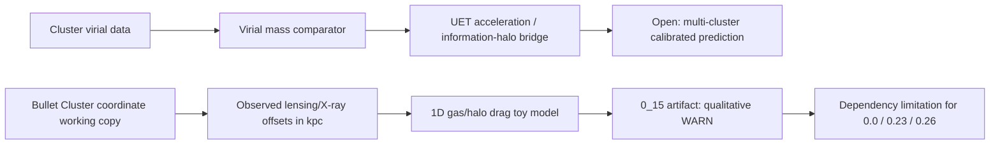

# 0.15 Cluster Dynamics

> [!NOTE]
> **AI-Digest**: This topic studies whether UET-style information-gravity terms can organize selected galaxy-cluster missing-mass and offset diagnostics. The current primary verifier is a Bullet Cluster qualitative diagnostic: it reads a source-labeled offset dataset and checks only separation direction, not calibrated kpc magnitude.


## Research Role

Topic `0.15` sits between galaxy-scale dynamics and cosmological structure. Its core research value is not a finished dark-matter replacement; it is a controlled place to test whether cluster-scale virial discrepancies, lensing/X-ray offsets, and information-field terms can be connected with explicit data, formulas, and artifacts.

## Conceptual Map



## Evidence and Status Matrix

| Layer | Current status | Evidence path | Claim allowed now | Blocker |
| :-- | :-- | :-- | :-- | :-- |
| Data | Real source referenced, mixed working copies | `Data/Bullet_Cluster_Coordinates.json`, `Data/03_Research/*.json` | Bullet Cluster and cluster-virial source labels are available locally. | Some files still need upstream URL/DOI normalization and transcription notes. |
| Formula | Reviewed registry | `FORMULA_AUDIT.md` | Main virial, acceleration, Fisher-halo, and toy-drag formulas are mapped to code. | Several bridge constants remain heuristic or model-unit only. |
| Verification | Runnable diagnostic artifact | `Code/03_Research/Research_BulletCluster_Offset.py` | Checks qualitative separation-sign agreement and records dataset hash. | Does not predict kpc offset magnitude or lensing mass map. |
| Source evidence workflow | Structured provenance gate | `Data/03_Research/source_evidence_intake_stub.json`, `source_evidence_readiness_matrix.json` | source-review queue | Upstream archival capture, calibration, and multi-cluster packages are still missing. |
| Branch claim gate | Structured claim ceiling | `Data/03_Research/branch_claim_gate.json` | diagnostic-only claim control | Cluster diagnostics do not promote dark-matter replacement claims. |
| Claims | Bounded to diagnostic cluster benchmark | this README, `METHOD.md`, `LIMITATIONS.md` | Supports exploratory cluster-dynamics diagnostics. | Cannot claim closed missing-mass theory or dark-matter-free proof. |
| Dependencies | Important but limited | `0.0`, `0.1`, `0.3`, `0.23`, `0.26` | May inform cross-topic structure only with inherited limitations. | Any downstream theory claim must wait for calibrated artifacts. |

## Primary Verification

```powershell
python docs/topics/0.15_Cluster_Dynamics/Code/03_Research/Research_BulletCluster_Offset.py
```

Expected artifact:

- `Result/artifacts/0_15_cluster_dynamics_verification.json`

Current expected status is `WARN`, because the model can show qualitative separation but has no dimensional calibration to the observed kpc offsets.

## Key Files

- `FORMULA_AUDIT.md`: formula registry, units, proof status, and bridge limitations.
- `DATA_MANIFEST.md`: source labels, local paths, hashes, and benchmark roles.
- `VERIFICATION_SPEC.md`: primary command, artifact contract, and current acceptance boundary.
- `METHOD.md`: modeling lanes and dependency policy.
- `LIMITATIONS.md`: explicit boundaries on cluster and dark-matter claims.
- `Data/03_Research/source_evidence_intake_stub.json`: provenance intake for benchmark and bridge upgrades.
- `Data/03_Research/source_evidence_readiness_matrix.json`: readiness gate for source review.
- `Data/03_Research/branch_claim_gate.json`: branch-level claim ceiling.
- `Code/01_Engine/cluster_solver.py`: virial and acceleration-bridge calculations.
- `Code/01_Engine/Engine_Cluster_Dynamics.py`: grid information-halo engine.
- `Code/03_Research/Research_BulletCluster_Offset.py`: primary diagnostic verifier.
