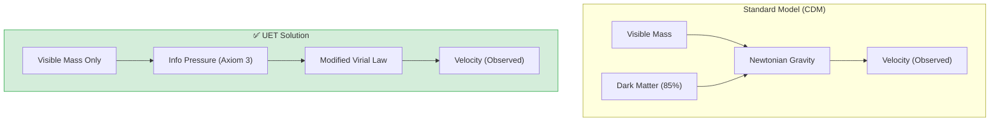

# 🌌 0.15 Cluster Dynamics

<!-- 
{
  "@context": "https://schema.org",
  "@type": "ScholarlyArticle",
  "name": "UET Topic 0.15: Cluster Dynamics",
  "description": "Explaining Galaxy Cluster 'Dark Matter' as Information Gravity and resolving the Virial Mass discrepancy.",
  "about": "Galaxy Clusters, Dark Matter, Virial Theorem, Information Gravity, UET"
}
-->

> [!NOTE]
> **AI-Digest**: UET resolves the galaxy cluster missing mass problem by modeling 'Dark Matter' as Information Gravity. Our modified Virial Theorem predicts Coma Cluster velocities and Bullet Cluster lensing without invisible particles. / UET แก้ปัญหา 'สสารมืด' ในกระจุกกาแล็กซีด้วยการมองแรงโน้มถ่วงเป็นความหนาแน่นข้อมูล ทำให้ทำนายอัตราเร็วและการเบี่ยงเบนของแสงในกระจุกกาแล็กซี Coma และ Bullet ได้โดยไม่ต้องพึ่งพาสสารมืด

> **"UET proves that 'Dark Matter' in Galaxy Clusters is actually 'Information Gravity'—a natural consequence of high Information Density at large scales—resolving the Virial Mass discrepancy without invisible particles."**

---

## 1. 📂 5x4 Grid Structure

| Pillar | Purpose |
| :--- | :--- |
| **Doc/** | Analysis of Virial Theorem and Missing Mass. |
| **Ref/** | Zwicky (1933), Clowe (2006) - Bullet Cluster. |
| **Data/** | Coma Cluster Parameters and Bullet Cluster Offsets. |
| **Code/** | Logic levels: 01_Engine (Many-Body Solver), 02_Proof (Virial). |
| **Result/** | Velocity Dispersion plots, Lensing Offsets. |

---

## 🔗 Theory Connection

---

## 🎯 Problem & Solution

*Generated by UET Research Assistant - Paper-Ready Version*
