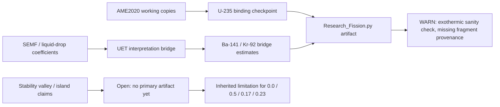

# 0.16 Heavy Nuclei

> [!NOTE]
> **AI-Digest**: This topic currently tests a UET interpretation of liquid-drop / SEMF-like heavy-nuclei terms. The primary verifier is a fission sanity check: it confirms an exothermic U-235 bridge calculation and checks U-235 binding against an AME2020 working copy, but it does not yet validate source-locked Ba/Kr fragment masses or island-of-stability claims.


## Research Role

Topic `0.16` is the heavy-nuclei bridge between nuclear binding systematics, fission energetics, and UET information-saturation language. Its near-term scientific role is to make the binding formulas, coefficients, isotope data, and fission diagnostics auditable before any stronger claim about superheavy stability or first-principles nuclear structure is made.

## Conceptual Map



## Evidence and Status Matrix

| Layer | Current status | Evidence path | Claim allowed now | Blocker |
| :-- | :-- | :-- | :-- | :-- |
| Data | Real AME2020 source labels and local working copies | `Data/03_Research/ame2020_heavy_nuclei.json`, `Data/03_Research/ame2020_heavy/ame2020_heavy.json`, `Data/AME2020_mass.txt` | U-235 and selected heavy-nuclei checkpoints can be traced to local files. | Fragment rows for the primary fission Q-value are not source-locked in the verifier. |
| Formula | Reviewed registry | `FORMULA_AUDIT.md` | SEMF terms and UET bridge interpretation are mapped to code and units. | Current UET bridge equals SEMF, so it is not independent first-principles prediction. |
| Verification | Runnable artifact with honest WARN | `Code/03_Research/Research_Fission.py` | Supports internal fission sanity-check wording. | Needs AME/NUBASE fragment masses and evaluated fission-energy baseline for PASS. |
| Source evidence workflow | Structured provenance gate | `Data/03_Research/source_evidence_intake_stub.json`, `source_evidence_readiness_matrix.json` | source-review queue | Fragment lock, Q-value baseline, and stability evidence are still missing. |
| Branch claim gate | Structured claim ceiling | `Data/03_Research/branch_claim_gate.json` | checkpoint-and-sanity claim control | U-235 checkpoint does not promote stability or full fission-theory claims. |
| Claims | Bounded to diagnostic benchmark | this README, `METHOD.md`, `LIMITATIONS.md` | May discuss heavy-nuclei bridge diagnostics. | Cannot claim exact U-235 fission energy, island prediction, or full nuclear-stability theory. |
| Dependencies | Important nuclear bridge | `0.5`, `0.17`, `0.21`, `0.23`, `0.0` | May inform cross-topic nuclear/system-scale maps with limitations. | Downstream claims must inherit SEMF-bridge and fragment-provenance limits. |

## Primary Verification

```powershell
python docs/topics/0.16_Heavy_Nuclei/Code/03_Research/Research_Fission.py
```

Expected artifact:

- `Result/artifacts/0_16_heavy_nuclei_verification.json`

Current expected status is `WARN`: exothermic sanity and U-235 checkpoint pass, but fragment provenance is incomplete.

## Key Files

- `FORMULA_AUDIT.md`: formula registry, coefficients, units, proof status, and failure modes.
- `DATA_MANIFEST.md`: AME2020 working-copy provenance and benchmark roles.
- `VERIFICATION_SPEC.md`: primary command, thresholds, artifact contract.
- `METHOD.md`: evidence lanes and dependency policy.
- `LIMITATIONS.md`: boundaries for fission, binding, and stability claims.
- `Data/03_Research/source_evidence_intake_stub.json`: provenance intake for checkpoint and fission upgrades.
- `Data/03_Research/source_evidence_readiness_matrix.json`: readiness gate for source review.
- `Data/03_Research/branch_claim_gate.json`: branch-level claim ceiling.
- `Code/01_Engine/Engine_Heavy_Nuclei.py`: SEMF and UET bridge implementation.
- `Code/03_Research/Research_Fission.py`: primary diagnostic verifier.
- `Code/03_Research/Research_Heavy_Binding.py`: secondary AME heavy-nuclei comparison lane.
