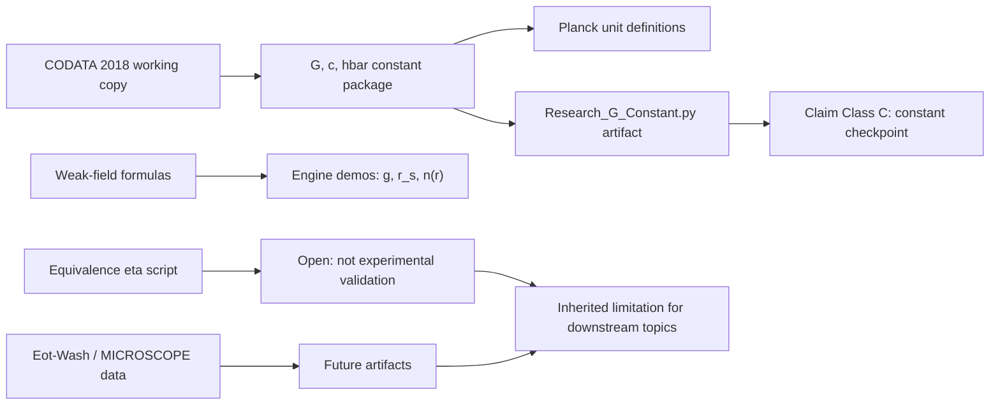

# 0.19 Gravity & General Relativity

> [!NOTE]
> **AI-Digest**: This topic currently has a CODATA gravitational-constant checkpoint and a reviewed weak-field formula registry. The primary artifact verifies that the engine constant package matches the local CODATA working copy; it does not yet derive Einstein's equations, validate light bending/perihelion precession, or solve singularities.


## Research Role

Topic `0.19` is the gravity/GR bridge layer. Its immediate role is to keep constants, weak-field formulas, equivalence-principle diagnostics, and short-range gravity datasets auditable before any stronger theoretical claim is made. It is important for `0.0`, `0.2`, `0.3`, `0.21`, `0.23`, and `0.26`, but those topics must inherit its current limitations.

## Conceptual Map



## Evidence and Status Matrix

| Layer | Current status | Evidence path | Claim allowed now | Blocker |
| :-- | :-- | :-- | :-- | :-- |
| Data | CODATA/Eot-Wash/MICROSCOPE working copies with source labels | `Data/03_Research/*.json` | Local constants and comparator datasets are inspectable. | Some source URLs/licenses and extraction notes still need normalization. |
| Formula | Reviewed registry | `FORMULA_AUDIT.md` | Constant package, Planck definitions, Newtonian/Schwarzschild diagnostics, eta, and Yukawa comparator are mapped. | Several theoretical bridges remain diagnostics or open lanes. |
| Verification | Runnable primary artifact | `Code/03_Research/Research_G_Constant.py` | Confirms engine `G` matches CODATA working copy under declared threshold. | This is a copied/source-constant checkpoint, not a derivation. |
| Source evidence workflow | Structured provenance gate | `Data/03_Research/source_evidence_intake_stub.json`, `source_evidence_readiness_matrix.json` | source-review queue | Weak-field, equivalence, and short-range packages still need dedicated artifacts. |
| Branch claim gate | Structured claim ceiling | `Data/03_Research/branch_claim_gate.json` | checkpoint-only claim control | Constant checkpoint does not promote GR closure claims. |
| Claims | Bounded to internal checkpoint | this README, `METHOD.md`, `LIMITATIONS.md` | May state that the engine constant package is internally consistent with CODATA. | Cannot claim GR derivation, light-bending validation, or singularity avoidance. |
| Dependencies | High-impact core bridge | `0.0`, `0.2`, `0.3`, `0.21`, `0.23`, `0.26` | Downstream topics may cite constants/weak-field formulas with limitations. | Strong GR/cosmology claims need future artifacts. |

## Primary Verification

```powershell
python docs/topics/0.19_Gravity_GR/Code/03_Research/Research_G_Constant.py
```

Expected artifact:

- `Result/artifacts/0_19_gravity_gr_verification.json`

The artifact records dataset hash, CODATA DOI, formula IDs, threshold, engine `G`, and Planck-unit metrics.

## Key Files

- `FORMULA_AUDIT.md`: formula registry, units, constants, proof status, and failure modes.
- `DATA_MANIFEST.md`: CODATA, Eot-Wash, and MICROSCOPE working-copy provenance.
- `VERIFICATION_SPEC.md`: primary command, threshold, and artifact contract.
- `METHOD.md`: evidence lanes and dependency policy.
- `LIMITATIONS.md`: boundaries for GR, equivalence, and singularity claims.
- `Data/03_Research/source_evidence_intake_stub.json`: provenance intake for constants and future GR lanes.
- `Data/03_Research/source_evidence_readiness_matrix.json`: readiness gate for source review.
- `Data/03_Research/branch_claim_gate.json`: branch-level claim ceiling.
- `Code/01_Engine/Engine_Gravity_GR.py`: constant package and weak-field calculations.
- `Code/03_Research/Research_G_Constant.py`: primary verifier.
