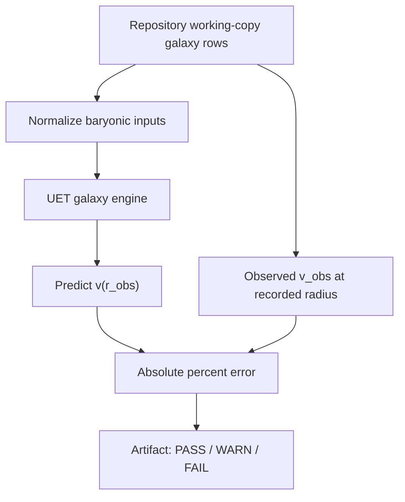

# 0.1 Galaxy Rotation Problem

## Problem

This topic studies whether UET-style galaxy dynamics can reproduce selected observed
rotation-curve behavior using baryonic inputs and repository-stored benchmark data.

## Status matrix

| Layer | Current status | What it means now | Next hardening target |
| :-- | :-- | :-- | :-- |
| Data | Working-copy real-data package | Repository has real galaxy rows, but they are not yet source-locked as a full upstream SPARC archive | Add upstream file identity, row semantics, and preprocessing notes |
| Formula | Structured with heuristic bridges | Core engine relations are now mapped, but several bridge factors remain heuristic | Derive or sensitivity-test `RHO_UNITY`, `GAMMA_UET`, `11.7`, and `0.075` |
| Verification | Runnable summary-row benchmark | Verifier measures one-point-per-galaxy error over the checked-in working copy | Upgrade to curve-level verification and competitor baselines |
| Claims | Internal benchmark only with model-residual blocker | Topic can claim repository run-contract status, but the current summary-row model gate fails the 15% residual threshold | Tie stronger claims to curve-level artifacts, source-locked data, and competitor baselines |

## Assumptions and scope

- Scope: internal numerical comparison against repository copies of galaxy-rotation data
- Out of scope: external confirmation that dark matter is unnecessary in all galaxy classes
- Scope includes both first-principles-style experiments and scripts that perform
  calibration-oriented comparisons

## Data sources

- Local dataset: `Data/03_Research/sparc_data.json`
- Secondary local dataset: `Data/03_Research/little_things_data.json`
- Reference citation: SPARC 2016 in [docs/references.bib](/C:/Users/santa/Desktop/uet_harness/docs/references.bib:1)
- Current repository JSON package contains `154` records in `sparc_data.json`; this should
  not be described as the full upstream SPARC release without a fresh provenance pass
- Current topic verifier uses these records as summary rows with one benchmark
  radius and one observed velocity per processed galaxy

## Method summary

- Engine: `Code/01_Engine/Engine_Galaxy_V3.py`
- Proof layer: `Code/02_Proof/Proof_Unity_Density_Law.py`
- Research comparison: `Code/03_Research/Research_Galaxy_Rotation.py`
- Verification-oriented script: `Code/03_Research/Verify_Galaxy_Rotation.py`

Supporting standard files:

- [METHOD.md](/C:/Users/santa/Desktop/uet_harness/docs/topics/0.1_Galaxy_Rotation_Problem/METHOD.md:1)
- [DATA_MANIFEST.md](/C:/Users/santa/Desktop/uet_harness/docs/topics/0.1_Galaxy_Rotation_Problem/DATA_MANIFEST.md:1)
- [VERIFICATION_SPEC.md](/C:/Users/santa/Desktop/uet_harness/docs/topics/0.1_Galaxy_Rotation_Problem/VERIFICATION_SPEC.md:1)
- [BASELINE_COMPARISON.md](/C:/Users/santa/Desktop/uet_harness/docs/topics/0.1_Galaxy_Rotation_Problem/BASELINE_COMPARISON.md:1)
- [LIMITATIONS.md](/C:/Users/santa/Desktop/uet_harness/docs/topics/0.1_Galaxy_Rotation_Problem/LIMITATIONS.md:1)

## Parameters and fitting status

- Public repository wording should not call this topic `zero curve fitting`
- `Research_Galaxy_Rotation.py` reports internal comparison metrics from baryonic inputs
- `Verify_Galaxy_Rotation.py` explicitly discusses best-fit or selected coupling behavior
- Repository documentation therefore treats this topic as a mix of derived assumptions and
  calibration-oriented internal experiments

## Metrics and thresholds

- Primary internal metric in `Research_Galaxy_Rotation.py`: mean absolute percentage error
- Topic-level pass threshold currently documented in script logic: `< 15%` error
- `WARN` means the script produced valid comparisons but missed the current average-error gate
- The artifact's `galaxy_model_gate` separates runnable verifier status from model acceptance; current summary-row residuals block dark-matter replacement or galaxy-closure wording.
- README-level status should be interpreted as internal benchmark status only

## Baselines

- Comparator model files exist under `Code/04_Competitor/`
- Baseline expectation is not "all dark-matter models fail"; instead, repository users
  should compare UET outputs against documented competitor implementations and report the
  metric definitions used

## Limitations and open risks

- Dataset provenance needs a stricter normalization pass
- Fitting versus prediction boundaries must remain explicit
- Current repository scripts do not constitute external replication

## Reproducibility

- Verification command: `python docs/topics/0.1_Galaxy_Rotation_Problem/Code/03_Research/Research_Galaxy_Rotation.py`
- Artifact contract: see [VERIFICATION_SPEC.md](/C:/Users/santa/Desktop/uet_harness/docs/topics/0.1_Galaxy_Rotation_Problem/VERIFICATION_SPEC.md:1)

## Current readiness status

`Structured`
