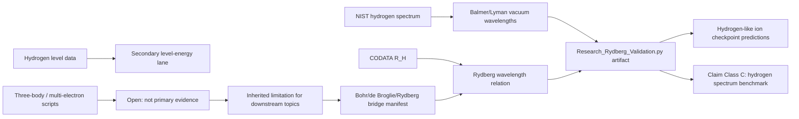

# 0.20 Atomic Physics

> [!NOTE]
> **AI-Digest**: This topic currently has a source-backed hydrogen Rydberg benchmark using a NIST hydrogen spectrum working copy and CODATA `R_H`. It also has an explicit Bohr/de Broglie/Rydberg formula-bridge manifest that maps inherited standard atomic physics to UET dependencies (`0.13`, `0.6`, `0.17`, `0.23`) without upgrading those dependencies into a first-principles UET derivation. The current artifact now adds a rounded hydrogen n-level energy benchmark, a provisional selected hydrogen-like ion reduced-mass benchmark for He+ and Li2+ plus a C VI higher-Z stress-test lane, a precision spectroscopy source gate, nonrelativistic and leading Dirac 1S-2S baseline residual diagnostics, an empirical Lamb-shift handoff, a 21 cm hyperfine source gate, a Fermi-contact hyperfine baseline, a neutral helium source gate, source-locked neutral-helium term assignments, air/vacuum wavelength-medium normalization, line-component/blend policy, ground-state two-electron baseline residual diagnostics, an external E-Hy-CI correlated reference target, excited-state target preparation, a zero-quantum-defect hydrogenic residual baseline, a limited source-calibrated quantum-defect leave-one-out prediction gate, a same-source-family NIST holdout gate for selected He I levels, a restricted wavelength holdout gate for ground-state transitions, and a predictive-closure contract for broader atomic spectra. The current predicted holdout lines are below 2000 A and treated as vacuum under the NIST wavelength convention; the predictive-closure gate remains blocked with open requirements for independent external holdouts, uncertainty propagation, fixed-parameter CI/correlated or UET atomic operators, comparator baselines, and a multi-atom benchmark suite.


## Research Role

Topic `0.20` is the atomic benchmark layer for UET. Its near-term job is to make hydrogen spectral formulas, constants, NIST data, and residual thresholds auditable before the theory uses atomic physics as evidence for broader information-channel claims.

## Conceptual Map



## Evidence and Status Matrix

| Layer | Current status | Evidence path | Claim allowed now | Blocker |
| :-- | :-- | :-- | :-- | :-- |
| Data | NIST/CODATA source-labeled working copies | `Data/03_Research/nist_hydrogen_spectrum.json`, `codata_2018_atomic.json` | Hydrogen line and constant inputs are inspectable with hashes. | Wavelength precision and source-transcription notes still need normalization. |
| Formula | Reviewed registry plus bridge manifest | `FORMULA_AUDIT.md`, `Data/03_Research/atomic_formula_bridge_manifest.json` | Photon transition, de Broglie standing wave, Bohr energy, Rydberg relation, and dependency roles are mapped. | UET derivation of `h`, `alpha`, `R_H`, transition operators, or the atomic Hamiltonian is not artifact-backed. |
| Verification | Runnable primary artifact | `Code/03_Research/Research_Rydberg_Validation.py` | Supports hydrogen-spectrum internal benchmark claims. | Many-electron and QED effects are outside the verifier. |
| Source evidence workflow | Structured provenance gate | `Data/03_Research/source_evidence_intake_stub.json`, `source_evidence_readiness_matrix.json` | source-review queue | Direct hydrogen level-table precision, direct Li III ASD capture, precision, and many-electron packages still need dedicated artifacts. |
| Branch claim gate | Structured claim ceiling | `Data/03_Research/branch_claim_gate.json` | benchmark-only claim control plus formula-bridge manifest branch | Hydrogen benchmark and bridge manifest do not promote full atomic-theory claims. |
| Hydrogen level energies | Rounded source-referenced benchmark | `Data/03_Research/hydrogen_spectra_data.json`, `hydrogen_level_energy_benchmark` in artifact | Selected `n=1..8` level rows pass ionization-energy anchored thresholds (`avg ~69 ppm`, `max ~118 ppm`). | Direct ASD per-level transcription precision and fine/QED splitting remain open. |
| Hydrogen-like ions | Provisional reduced-mass benchmark plus stress lane | `Data/03_Research/hydrogen_like_ion_spectrum.json`, `hydrogen_like_checkpoint` in artifact | Selected He+ and Li2+ rows pass reduced-mass hydrogenic thresholds (`avg ~76 ppm`, `max ~97 ppm`); C VI is recorded as a higher-Z stress test (`~479 ppm`). | Li III still needs direct primary ASD capture; C VI is not counted in PASS/FAIL until higher-Z fine/QED policy exists. |
| Precision spectroscopy | Source package plus baseline diagnostics | `Data/03_Research/hydrogen_precision_spectroscopy_sources.json`, `hydrogen_lamb_shift_correction_sources.json`, `hydrogen_hyperfine_21cm_sources.json`, `hydrogen_hyperfine_fermi_constants.json`, and precision gates in artifact | 1S-2S, Lamb shift, and 21 cm hyperfine targets are organized; nonrelativistic, leading Dirac, empirical Lamb-handoff, 21 cm bookkeeping, and Fermi-contact baseline gates are computed. | 1S-2S residuals step from `~22.99 GHz` to `~7.10 GHz` to `~10.32 MHz`; Fermi-contact 21 cm residual is `~753.8 kHz` (`~530.7 ppm`); these are not QED/recoil/proton-size/hyperfine Hamiltonian closure. |
| Neutral helium / many-electron | Source package plus term, medium, component policy, ground baseline, excited targets, hydrogenic residual baseline, source-calibrated quantum-defect prediction, same-source-family holdouts, and wavelength holdouts | `Data/03_Research/helium_many_electron_sources.json`, `helium_transition_assignments.json`, `helium_ground_state_energy_sources.json`, `helium_quantum_defect_holdout_sources.json`, and helium gates in artifact | Five He I visible target lines have photon energies computed (`~1.755-3.188 eV`); 5/5 rows now have NIST term assignments, air/vacuum normalization, and component policy; ground-state total binding is anchored to NIST ionization energies and compared with a NIST-publication E-Hy-CI reference; 9 unique excited-state level targets are prepared; zero-quantum-defect baseline residuals are computed for 9 levels; limited leave-one-out quantum-defect predictions cover 7 levels; NIST same-source-family holdouts predict 3 of 5 unique holdout levels; restricted wavelength holdouts predict 2 ground-state lines. | Independent-electron baseline overbinds by `~29.83 eV`; uncorrelated variational baseline misses the ionization anchor by `~1.52 eV`; excited-level hydrogenic baseline has `~0.252 eV` average and `~1.366 eV` maximum absolute residual; source-calibrated quantum-defect prediction lowers selected residuals to `~0.0133 eV` average and `~0.0496 eV` maximum; same-source-family level holdouts are `~0.000956 eV` average and `~0.00185 eV` maximum; wavelength holdouts are `~0.0327 A` average and `~0.0431 A` maximum (`~61.5-80.2 ppm`), but this is not independent validation or first-principles theory. |
| Predictive atomic spectra closure | Governance gate for moving from diagnostics to prediction claims | `atomic_predictive_model_closure_gate` in artifact | Defines the required path: no-leakage split, baseline comparator, fixed-parameter generative model, uncertainty propagation, and domain expansion gates. | `5/5` closure checks remain open and `2` are fail-open; broad atomic prediction, helium first-principles spectra, and periodic-table spectra remain blocked. |
| Claim-scope gate | Artifact export controller | `atomic_claim_scope_gate` in artifact | blocks derivation/QED/many-electron overclaim | Hydrogen PASS remains topic-level `WARN` until precision and derivation branches are primary-gated. |
| Claims | Bounded to hydrogen benchmark | this README, `METHOD.md`, `LIMITATIONS.md` | May state that selected hydrogen lines match the standard Rydberg relation within declared thresholds. | Cannot claim full atomic theory or first-principles UET derivation. |
| Dependencies | Atomic constants/levels bridge | `0.6`, `0.17`, `0.21`, `0.23`, `0.0` | Downstream topics may cite the hydrogen benchmark with limitations. | Stronger claims need fine-structure/many-electron artifacts. |

## Primary Verification

```powershell
python docs/topics/0.20_Atomic_Physics/Code/03_Research/Research_Rydberg_Validation.py
```

Expected artifact:

- `Result/artifacts/0_20_atomic_physics_verification.json`

The artifact records dataset hashes, NIST/CODATA source IDs, line residuals, fitted slope, level-energy residuals, thresholds, formula-bridge manifest metadata, selected hydrogen-like ion benchmark rows, and limitations.
It must also record `atomic_claim_scope_gate`, which allows only hydrogen Rydberg benchmark, rounded hydrogen level-energy benchmark, formula-bridge-manifest, provisional selected He+/Li2+ reduced-mass benchmark language, C VI stress-test language, precision-source-package language, nonrelativistic/Dirac 1S-2S baseline diagnostic language, empirical Lamb-handoff language, 21 cm source-bookkeeping/Fermi-baseline language, neutral-helium source/transition/medium/component/ground-baseline/excited-target/hydrogenic-residual/quantum-defect-prediction/holdout/wavelength-holdout diagnostic language, and predictive-closure-contract language while blocking Rydberg derivation, broad hydrogen-like ion validation, QED correction validation, independent neutral helium validation, many-electron, and full atomic-theory claims.

## Key Files

- `FORMULA_AUDIT.md`: formula registry, units, constants, proof status, and failure modes.
- `DATA_MANIFEST.md`: NIST/CODATA working-copy provenance and benchmark roles.
- `VERIFICATION_SPEC.md`: primary command, thresholds, and artifact contract.
- `METHOD.md`: evidence lanes and dependency policy.
- `LIMITATIONS.md`: boundaries for derivation, QED, helium, and many-electron claims.
- `Data/03_Research/source_evidence_intake_stub.json`: provenance intake for hydrogen and future atomic lanes.
- `Data/03_Research/source_evidence_readiness_matrix.json`: readiness gate for source review.
- `Data/03_Research/branch_claim_gate.json`: branch-level claim ceiling.
- `Data/03_Research/atomic_formula_bridge_manifest.json`: Bohr/de Broglie/Rydberg dependency map connecting inherited formulas to UET topics without overclaiming derivation.
- `Data/03_Research/hydrogen_like_ion_spectrum.json`: source-referenced He+ and Li2+ rows for the provisional one-electron ion gate plus C VI as a higher-Z stress-test row.
- `Data/03_Research/hydrogen_precision_spectroscopy_sources.json`: precision spectroscopy target package for future fine/Lamb/hyperfine artifacts.
- `Data/03_Research/hydrogen_lamb_shift_correction_sources.json`: empirical Lamb-shift source handoff for 1S-2S residual sizing.
- `Data/03_Research/hydrogen_hyperfine_21cm_sources.json`: source-locked 21 cm hyperfine target and wavelength bookkeeping package.
- `Data/03_Research/hydrogen_hyperfine_fermi_constants.json`: constants and claim boundary for the leading Fermi-contact 21 cm baseline.
- `Data/03_Research/helium_many_electron_sources.json`: neutral helium source targets and many-electron model requirements.
- `Data/03_Research/helium_transition_assignments.json`: NIST handbook/ASD term assignments and component policy for selected He I rows.
- `Data/03_Research/helium_quantum_defect_holdout_sources.json`: additional NIST He I persistent-line rows reserved for same-source-family quantum-defect holdout diagnostics.
- `Data/03_Research/helium_ground_state_energy_sources.json`: NIST ionization-energy anchors for neutral helium ground-state baseline residual diagnostics.
- `Code/01_Engine/Engine_Atomic_Hydrogen.py`: hydrogen engine and local Rydberg formula.
- `Code/03_Research/Research_Rydberg_Validation.py`: primary verifier.
