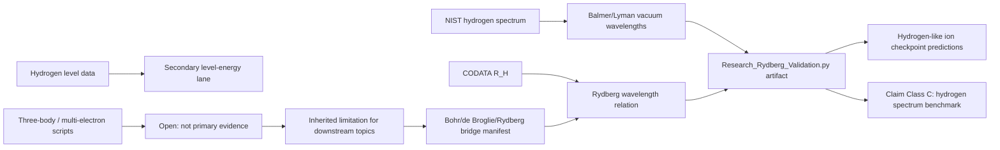

# 0.20 Atomic Physics

> [!NOTE]
> **AI-Digest**: This topic currently has a source-backed hydrogen Rydberg benchmark using a NIST hydrogen spectrum working copy and CODATA `R_H`. It now also has an explicit Bohr/de Broglie/Rydberg formula-bridge manifest that maps inherited standard atomic physics to UET dependencies (`0.13`, `0.6`, `0.17`, `0.23`) without upgrading those dependencies into a first-principles UET derivation. The current artifact supports internal hydrogen-spectrum agreement only; hydrogen-like ion rows are checkpoint predictions, and fine structure, Lamb shift, helium, many-electron atoms, and UET-derived `R_H` remain blocked.


## Research Role

Topic `0.20` is the atomic benchmark layer for UET. Its near-term job is to make hydrogen spectral formulas, constants, NIST data, and residual thresholds auditable before the theory uses atomic physics as evidence for broader information-channel claims.

## Conceptual Map



## Evidence and Status Matrix

| Layer | Current status | Evidence path | Claim allowed now | Blocker |
| :-- | :-- | :-- | :-- | :-- |
| Data | NIST/CODATA source-labeled working copies | `Data/03_Research/nist_hydrogen_spectrum.json`, `codata_2018_atomic.json` | Hydrogen line and constant inputs are inspectable with hashes. | Wavelength precision and source-transcription notes still need normalization. |
| Formula | Reviewed registry plus bridge manifest | `FORMULA_AUDIT.md`, `Data/03_Research/atomic_formula_bridge_manifest.json` | Photon transition, de Broglie standing wave, Bohr energy, Rydberg relation, and dependency roles are mapped. | UET derivation of `h`, `alpha`, `R_H`, transition operators, or the atomic Hamiltonian is not artifact-backed. |
| Verification | Runnable primary artifact | `Code/03_Research/Research_Rydberg_Validation.py` | Supports hydrogen-spectrum internal benchmark claims. | Many-electron and QED effects are outside the verifier. |
| Source evidence workflow | Structured provenance gate | `Data/03_Research/source_evidence_intake_stub.json`, `source_evidence_readiness_matrix.json` | source-review queue | Level-energy, precision, and many-electron packages still need dedicated artifacts. |
| Branch claim gate | Structured claim ceiling | `Data/03_Research/branch_claim_gate.json` | benchmark-only claim control plus formula-bridge manifest branch | Hydrogen benchmark and bridge manifest do not promote full atomic-theory claims. |
| Hydrogen-like ions | Checkpoint-only predictions | `hydrogen_like_checkpoint` in artifact | Lists simple `Z^2` one-electron ion predictions for H, He+, and Li2+. | No source-backed He+/Li2+ spectra, reduced-mass convention, nuclear mass source, uncertainty policy, or residual gate yet. |
| Claim-scope gate | Artifact export controller | `atomic_claim_scope_gate` in artifact | blocks derivation/QED/many-electron overclaim | Hydrogen PASS remains topic-level `WARN` until precision and derivation branches are primary-gated. |
| Claims | Bounded to hydrogen benchmark | this README, `METHOD.md`, `LIMITATIONS.md` | May state that selected hydrogen lines match the standard Rydberg relation within declared thresholds. | Cannot claim full atomic theory or first-principles UET derivation. |
| Dependencies | Atomic constants/levels bridge | `0.6`, `0.17`, `0.21`, `0.23`, `0.0` | Downstream topics may cite the hydrogen benchmark with limitations. | Stronger claims need fine-structure/many-electron artifacts. |

## Primary Verification

```powershell
python docs/topics/0.20_Atomic_Physics/Code/03_Research/Research_Rydberg_Validation.py
```

Expected artifact:

- `Result/artifacts/0_20_atomic_physics_verification.json`

The artifact records dataset hashes, NIST/CODATA source IDs, line residuals, fitted slope, thresholds, formula-bridge manifest metadata, hydrogen-like checkpoint predictions, and limitations.
It must also record `atomic_claim_scope_gate`, which allows only hydrogen Rydberg benchmark and formula-bridge-manifest language while blocking Rydberg derivation, hydrogen-like ion validation, QED correction, helium, many-electron, and full atomic-theory claims.

## Key Files

- `FORMULA_AUDIT.md`: formula registry, units, constants, proof status, and failure modes.
- `DATA_MANIFEST.md`: NIST/CODATA working-copy provenance and benchmark roles.
- `VERIFICATION_SPEC.md`: primary command, thresholds, and artifact contract.
- `METHOD.md`: evidence lanes and dependency policy.
- `LIMITATIONS.md`: boundaries for derivation, QED, helium, and many-electron claims.
- `Data/03_Research/source_evidence_intake_stub.json`: provenance intake for hydrogen and future atomic lanes.
- `Data/03_Research/source_evidence_readiness_matrix.json`: readiness gate for source review.
- `Data/03_Research/branch_claim_gate.json`: branch-level claim ceiling.
- `Data/03_Research/atomic_formula_bridge_manifest.json`: Bohr/de Broglie/Rydberg dependency map connecting inherited formulas to UET topics without overclaiming derivation.
- `Code/01_Engine/Engine_Atomic_Hydrogen.py`: hydrogen engine and local Rydberg formula.
- `Code/03_Research/Research_Rydberg_Validation.py`: primary verifier.
