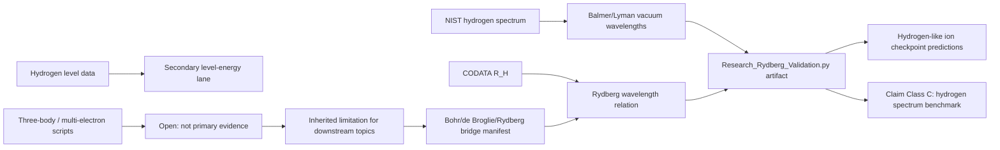

# 0.20 Atomic Physics

> [!NOTE]
> **AI-Digest**: This topic currently has a source-backed hydrogen Rydberg benchmark using a NIST hydrogen spectrum working copy and CODATA `R_H`. It also has an explicit Bohr/de Broglie/Rydberg formula-bridge manifest that maps inherited standard atomic physics to UET dependencies (`0.13`, `0.6`, `0.17`, `0.23`) without upgrading those dependencies into a first-principles UET derivation. The current artifact now adds hydrogen line transcription-bound diagnostics, a rounded hydrogen n-level energy benchmark, a provisional selected hydrogen-like ion reduced-mass benchmark for He+ and Li2+ plus a C VI higher-Z stress-test lane, a hydrogen-like domain-coverage gate covering only `Z=2,3,6` with `5/5` coverage checks still blocking broad validation, a precision spectroscopy source gate, nonrelativistic and leading Dirac 1S-2S baseline residual diagnostics, an empirical Lamb-shift handoff, a 21 cm hyperfine source gate, a Fermi-contact hyperfine baseline, a neutral helium source gate, source-locked neutral-helium term assignments, air/vacuum wavelength-medium normalization, line-component/blend policy, ground-state two-electron baseline residual diagnostics, an external E-Hy-CI correlated reference target, excited-state target preparation, a zero-quantum-defect hydrogenic residual baseline, a fixed-parameter screening baseline, a limited source-calibrated quantum-defect leave-one-out prediction gate, a same-source-family NIST holdout gate for selected He I levels, a restricted wavelength holdout gate for ground-state transitions, a legacy multi-electron code audit gate, a UET atomic-operator readiness gate, an internal baseline-comparator table, an uncertainty-readiness matrix, a residual uncertainty-budget gate, a fixed-parameter model-readiness matrix, a predictive-closure contract, a predictive-model specification gate, a first predictive implementation candidate gate, predictive-v1 parameter-lock, threshold, fixed-correction-operator, operator-candidate-resolution, operator-build-spec, operator-residual, operator-acceptance-harness, candidate-execution, kernel-interface, basis-assembly, Hamiltonian/effective-operator, diagnostic-report, publication-readiness, and external-holdout lineage gates for broader atomic spectra. The model spec requires `standard_baseline + delta_uet_or_ci` with parameter lock, holdout rows, baseline comparators, uncertainty propagation, and domain lanes; it currently records `4` development lanes, `3` blocked lanes, and `4` blocking implementation blockers. The parameter-lock gate records `3` inherited constants, `1` calibrated quantum-defect policy row, `4` forbidden holdout/external leakage fields, `0` policy failures, and `1` missing future locked parameter. The threshold gate records `3` diagnostic thresholds; all `3` pass current same-source-family diagnostics, but `0` are validation-ready and `4` validation-reclassification requirements remain blocking. The fixed-correction operator gate defines the `delta_uet_or_ci` contract, records `3` operator candidates, and accepts `0` as implemented; the current empirical quantum-defect lane is explicitly diagnostic-only. The operator-candidate-resolution gate classifies `7` common formula/model candidates: `0` are accepted as `delta_uet_or_ci`, `5` existing candidates are rejected as baseline/heuristic/empirical/smoke-test roles, and `2` acceptable operator paths remain missing implementation. The operator-build-spec gate defines `2` implementation lanes with I/O, acceptance gates, forbidden shortcuts, and minimum first-build artifacts; `2/2` lanes are implementation-ready as specs, and the fixed-CI lane now carries both an input preflight and a review-only implementation declaration. That means source-backed helium anchors and targets are present, the intended correlated two-electron family is declared, and the convergence-lock policy is declared, while accepted implementation is still missing. The operator-residual gate exports `3` same-source-family He I diagnostic residual rows in `baseline + diagnostic_delta` form: all `3` rows populate `delta_energy_eV`, locked-parameter, source/model uncertainty, `uncertainty_computable`, and no-fit fields; all `3` rows improve over the zero-QD baseline, with average absolute residual moving from `~0.01616 eV` to `~0.000956 eV`; accepted `delta_uet_or_ci` operator count remains `0`. The operator-acceptance-harness gate now names the target module, three local artifact targets, a `16`-field residual row schema, and a `5`-row decision matrix; `5/5` harness checks pass with `0` schema-missing rows and `0` no-leakage failures, but `3/5` operator-acceptance decisions still block acceptance because the rows are diagnostic-only and no accepted CI/UET operator emits them. The candidate-execution gate proves that the current exporter runs through the verifier, writes the residual artifact, emits the expected `3` holdout rows, and keeps every row diagnostic-only while filling `3/3` `uncertainty_computable` flags. The kernel-interface gate reports `5/5` checks passing for the current wrapper state while making the missing core explicit as `4` undeployed kernel components - basis assembly, Hamiltonian/effective-operator evaluation, accepted `delta_uet_or_ci` emission, and row-level uncertainty from the accepted operator. The basis-assembly gate narrows the first missing kernel component into a contract-ready state: it passes `5/5` checks, confirms the fixed-CI family and convergence-policy declarations match the runtime contract, and records all `5` required inputs explicitly while still stating `CONTRACT_ONLY_IMPLEMENTATION_MISSING`. The new Hamiltonian/effective-operator gate narrows the second missing kernel component the same way: it also passes `5/5` checks, records the required basis dependency, operator identity, all `5` required inputs, and all `3` required outputs, while still stating `CONTRACT_ONLY_IMPLEMENTATION_MISSING`. So the repo now has machine-readable contracts for both basis assembly and Hamiltonian/effective-operator evaluation, but not a runnable correlated basis builder or evaluator. The operator split gate records `5` calibration rows, `4` same-source-family holdout rows, and `2` CHIANTI cross-check rows with `0` overlap and a policy forbidding holdout/cross-check rows from setting accepted operator parameters. The operator provenance gate still has `1/5` evidence rows present and `4/5` blocking, but it now carries an explicit candidate implementation review record: `PROV-02` stays at parameter-set-ready while accepted operator remains missing, and `PROV-01/04/05` now state that candidate code identity, diagnostic residual emission, and diagnostic uncertainty policy are locked for review without counting as accepted operator provenance. The fixed-CI declaration work now lets `BUILD-SPEC-06` pass, and the basis/Hamiltonian contract waves make the first two kernel-component blockers auditable without pretending execution exists. The next controlling kernel-side blockers are now accepted `delta_uet_or_ci` emission and row-level uncertainty from the accepted operator. The v1 diagnostic report records `3` same-source-family level predictions and `2` wavelength predictions, passes `3/3` diagnostic thresholds, and keeps `3` validation blockers active: missing fixed CI/UET correction operator, missing non-NIST source package, and missing validation-ready thresholds. The publication-readiness gate is `PUBLICATION_READINESS_BLOCKED`: `2/5` checks pass for clean residual rows and baseline improvement, while `3/5` block publication because accepted correction operator, validation-ready thresholds, and independent non-NIST source lineage are missing. The lineage decision gate classifies CHIANTI He I as `CROSSCHECK_ONLY_NOT_INDEPENDENT`: `2` raw files have NIST lineage notes, `2` overlap rows remain cross-check-only, and non-NIST source capture is still required. The blueprint gate converts the question "how do we build a predictive model?" into `7` auditable steps: `1` ready diagnostic step, `1` internal comparator pass, `5` partial steps, and `0` blocked steps; the model-equation step still cites the fixed-correction operator gate with `3` candidates and `0` accepted implementations. The remaining work is partial rather than ambiguous: fixed CI/UET correction operator, accepted correlated basis/Hamiltonian execution, validation-ready thresholds, and non-NIST external source package. The first implementation candidate gate selects the helium quantum-defect same-source-family holdout lane (`3` level holdouts and `2` wavelength holdouts) as the narrowest current diagnostic path, while independent external validation remains blocked. The external-holdout acquisition gate now records CHIANTI He I as a cross-check candidate with `2` raw files, `2` SHA256 hashes, and `2` overlapping line captures; the residual cross-check gate computes `2` CHIANTI-vs-current holdout deltas with max wavelength delta `~0.172 ppm` and max upper-energy delta `~0.104 cm^-1`. A display-rounding screening policy is now declared: `2/2` wavelength deltas pass, but the source-version reconciliation gate keeps `2/2` upper-energy deltas blocked for source-version review, so this is not validation. The residual-budget gate has `9` rows: all `9` now have computable source-uncertainty ratios, including hydrogen and helium rows that use transcription-rounding bounds rather than official NIST measurement uncertainties; every row still exceeds source uncertainty, so missing model terms remain the blocker. The quantum-defect diagnostics now propagate limited fitted-parameter uncertainty where possible and use a leave-one-out residual RMSE fallback for same-source holdouts, but this is still diagnostic only. The legacy multi-electron scripts are now hash-audited as smoke/demo code with `0` primary evidence scripts, so they cannot stand in for CI/correlated helium modeling. The UET atomic-operator readiness gate lists `6` required derivation/residual artifacts and all `6` remain blocking. The fixed-screening baseline is heuristic and not fitted to the current rows; it has `~0.549 eV` average residual and improves only `2` rows versus zero-QD, so CI/correlated helium modeling remains required.


## Research Role

Topic `0.20` is the atomic benchmark layer for UET. Its near-term job is to make hydrogen spectral formulas, constants, NIST data, and residual thresholds auditable before the theory uses atomic physics as evidence for broader information-channel claims.

## Conceptual Map



## Evidence and Status Matrix

| Layer | Current status | Evidence path | Claim allowed now | Blocker |
| :-- | :-- | :-- | :-- | :-- |
| Data | NIST/CODATA source-labeled working copies | `Data/03_Research/nist_hydrogen_spectrum.json`, `codata_2018_atomic.json` | Hydrogen line and constant inputs are inspectable with hashes; local wavelength rows now carry transcription-rounding bounds. | Official/upstream wavelength uncertainties and source-page transcription audit still need normalization before uncertainty-qualified claims. |
| Formula | Reviewed registry plus bridge manifest | `FORMULA_AUDIT.md`, `Data/03_Research/atomic_formula_bridge_manifest.json` | Photon transition, de Broglie standing wave, Bohr energy, Rydberg relation, and dependency roles are mapped. | UET derivation of `h`, `alpha`, `R_H`, transition operators, or the atomic Hamiltonian is not artifact-backed. |
| Verification | Runnable primary artifact | `Code/03_Research/Research_Rydberg_Validation.py` | Supports hydrogen-spectrum internal benchmark claims. | Many-electron and QED effects are outside the verifier. |
| Source evidence workflow | Structured provenance gate | `Data/03_Research/source_evidence_intake_stub.json`, `source_evidence_readiness_matrix.json` | source-review queue | Direct hydrogen level-table precision, direct Li III ASD capture, precision, and many-electron packages still need dedicated artifacts. |
| Branch claim gate | Structured claim ceiling | `Data/03_Research/branch_claim_gate.json` | benchmark-only claim control plus formula-bridge manifest branch | Hydrogen benchmark and bridge manifest do not promote full atomic-theory claims. |
| Hydrogen level energies | Rounded source-referenced benchmark | `Data/03_Research/hydrogen_spectra_data.json`, `hydrogen_level_energy_benchmark` in artifact | Selected `n=1..8` level rows pass ionization-energy anchored thresholds (`avg ~69 ppm`, `max ~118 ppm`). | Direct ASD per-level transcription precision and fine/QED splitting remain open. |
| Hydrogen-like ions | Provisional reduced-mass benchmark plus stress lane | `Data/03_Research/hydrogen_like_ion_spectrum.json`, `hydrogen_like_checkpoint` in artifact | Selected He+ and Li2+ rows pass reduced-mass hydrogenic thresholds (`avg ~76 ppm`, `max ~97 ppm`); C VI is recorded as a higher-Z stress test (`~479 ppm`). | Li III still needs direct primary ASD capture; C VI is not counted in PASS/FAIL until higher-Z fine/QED policy exists. |
| Hydrogen-like coverage | Domain coverage diagnostic only | `hydrogen_like_domain_coverage_gate` in artifact | Maps represented ion charges `Z=2,3,6`, benchmark lanes, source-status counts, and the fact that all current rows are 2 -> 1 Lyman-alpha style targets. | `5/5` coverage checks block broad hydrogen-like validation: direct Li III ASD capture, multi-transition suites, higher-Z fine/QED policy, source precision policy, and uncertainty-aware thresholds are still missing. |
| Precision spectroscopy | Source package plus baseline diagnostics | `Data/03_Research/hydrogen_precision_spectroscopy_sources.json`, `hydrogen_lamb_shift_correction_sources.json`, `hydrogen_hyperfine_21cm_sources.json`, `hydrogen_hyperfine_fermi_constants.json`, and precision gates in artifact | 1S-2S, Lamb shift, and 21 cm hyperfine targets are organized; nonrelativistic, leading Dirac, empirical Lamb-handoff, 21 cm bookkeeping, and Fermi-contact baseline gates are computed. | 1S-2S residuals step from `~22.99 GHz` to `~7.10 GHz` to `~10.32 MHz`; Fermi-contact 21 cm residual is `~753.8 kHz` (`~530.7 ppm`); these are not QED/recoil/proton-size/hyperfine Hamiltonian closure. |
| Neutral helium / many-electron | Source package plus term, medium, component policy, ground baseline, excited targets, hydrogenic residual baseline, fixed-screening baseline, source-calibrated quantum-defect prediction, same-source-family holdouts, and wavelength holdouts | `Data/03_Research/helium_many_electron_sources.json`, `helium_transition_assignments.json`, `helium_ground_state_energy_sources.json`, `helium_quantum_defect_holdout_sources.json`, and helium gates in artifact | Five He I visible target lines have photon energies computed (`~1.755-3.188 eV`); 5/5 rows now have NIST term assignments, air/vacuum normalization, and component policy; ground-state total binding is anchored to NIST ionization energies and compared with a NIST-publication E-Hy-CI reference; 9 unique excited-state level targets are prepared; zero-quantum-defect baseline residuals and a fixed-screening baseline are computed for 9 levels; limited leave-one-out quantum-defect predictions cover 7 levels; NIST same-source-family holdouts predict 3 of 5 unique holdout levels; restricted wavelength holdouts predict 2 ground-state lines. | Independent-electron baseline overbinds by `~29.83 eV`; uncorrelated variational baseline misses the ionization anchor by `~1.52 eV`; excited-level hydrogenic baseline has `~0.252 eV` average and `~1.366 eV` maximum absolute residual; fixed screening has `~0.549 eV` average and `~1.129 eV` maximum and improves only 2 rows versus zero-QD; source-calibrated quantum-defect prediction lowers selected residuals to `~0.0133 eV` average and `~0.0496 eV` maximum; same-source-family level holdouts are `~0.000956 eV` average and `~0.00185 eV` maximum; wavelength holdouts are `~0.0327 A` average and `~0.0431 A` maximum (`~61.5-80.2 ppm`), but this is not independent validation or first-principles theory. |
| Predictive atomic spectra closure | Governance gate for moving from diagnostics to prediction claims | `atomic_predictive_model_closure_gate` in artifact | Defines the required path: no-leakage split, baseline comparator, fixed-parameter generative model, uncertainty propagation, and domain expansion gates. | `4/5` closure checks remain open or partial and `0` are fail-open; broad atomic prediction, helium first-principles spectra, and periodic-table spectra remain blocked. |
| Predictive model specification | Model contract for turning diagnostics into predictions | `atomic_predictive_model_spec_gate` in artifact | Specifies `standard_baseline + delta_uet_or_ci`, parameter manifest, holdout evaluation, comparator, uncertainty, and domain requirements. | Implementation remains blocked: `3/4` development lanes are blocked and `4/4` implementation blockers remain active, including missing UET operator and fixed-parameter generative model. |
| First predictive implementation candidate | Narrowest current lane for moving from spec to implementation | `atomic_first_predictive_implementation_candidate_gate` in artifact | Selects helium quantum-defect same-source-family holdouts as the first diagnostic lane: `3` level holdouts and `2` wavelength holdouts. | External validation remains blocked; this lane is not independent helium validation and does not derive quantum defects from UET. |
| Predictive v1 parameter lock | Parameter policy for the first candidate lane | `atomic_predictive_v1_parameter_manifest.json`, `atomic_predictive_v1_parameter_lock_gate` in artifact | Locks inherited constants, allowed calibrated quantum-defect parameters, forbidden holdout/external leakage fields, and missing future locked parameters. | `0/5` policy checks fail, but `1/5` remains partial because the CI/UET correction operator is still missing. |
| Predictive v1 threshold gate | Diagnostic threshold policy for the first candidate lane | `atomic_predictive_v1_threshold_manifest.json`, `atomic_predictive_v1_threshold_gate` in artifact | Declares diagnostic thresholds for level and wavelength holdouts and compares current residuals against them; now also records `4` validation-reclassification requirements. | `3/3` diagnostic thresholds pass, but `0/3` are validation-ready and `4/4` reclassification requirements remain blocking: official/source uncertainty, accepted fixed operator, non-NIST independent source, and preregistered validation-ready threshold revision. |
| Predictive v1 fixed-correction operator | Contract for the missing correction term | `atomic_predictive_v1_fixed_correction_operator_manifest.json`, `atomic_predictive_v1_fixed_correction_operator_gate` in artifact | Defines acceptable `delta_uet_or_ci` operator classes, required inputs/outputs/units, parameter-lock rule, and holdout exclusion rule. | Contract is ready, but `0/3` operator candidates are accepted as implemented; empirical quantum defect remains diagnostic-only. |
| Predictive v1 operator candidate resolution | Candidate decision table for existing formulas and missing operator paths | `atomic_predictive_v1_operator_candidate_resolution_gate` in artifact | Resolves Bohr/Rydberg/Dirac/Lamb, fixed-screening, quantum-defect, legacy scripts, CI/correlated, and UET operator candidates against the `delta_uet_or_ci` contract. | `0/7` candidates are accepted as `delta_uet_or_ci`; `5` existing candidates are rejected as baseline/heuristic/empirical/smoke-test roles, while `2` acceptable paths remain missing. |
| Predictive v1 operator build spec | Implementation-ready I/O and acceptance contract for the first correction operator | `atomic_predictive_v1_operator_build_spec_manifest.json`, `atomic_predictive_v1_fixed_ci_input_preflight.json`, `atomic_predictive_v1_fixed_ci_implementation_declaration.json`, `atomic_predictive_v1_operator_build_spec_gate` in artifact | Defines fixed CI/correlated and explicit UET operator build lanes, required inputs/outputs, forbidden shortcuts, minimum first-build artifacts, and acceptance conditions, and now attaches both a fixed-CI input preflight and a fixed-CI implementation declaration. | `2/2` lanes are implementation-ready as specs, and the fixed-CI lane has closed its declaration blockers; the next gap is no longer undeclared setup but the missing accepted implementation itself. |
| Predictive v1 operator residual rows | Diagnostic residual-row export for selected v1 lane | `atomic_predictive_v1_operator_residual_rows.json`, `atomic_predictive_v1_operator_residual_gate` in artifact | Exports 3 same-source-family He I residual rows in `zero-QD baseline + diagnostic quantum-defect delta` form with locked-parameter, no-fit, source/model uncertainty, and diagnostic-only claim fields. | `3/3` rows populate `delta_energy_eV` and improve over zero-QD baseline (`avg abs residual ~0.01616 eV -> ~0.000956 eV`), but `0` accepted `delta_uet_or_ci` operators; rows are not independent validation or CI/UET correction evidence. |
| Predictive v1 operator acceptance harness | Concrete target module and residual-row acceptance contract | `atomic_predictive_v1_operator_acceptance_harness_manifest.json`, `atomic_predictive_v1_operator_acceptance_harness_gate` in artifact | Names the target module, required entrypoint, three local artifacts, 16 residual-row fields including `uncertainty_computable`, and a 5-row operator acceptance decision matrix. | `5/5` harness schema/no-leakage checks pass, but `3/5` operator-acceptance decisions still block acceptance and accepted correction operators remain `0`. |
| Predictive v1 candidate execution | Runnable candidate-export gate for the current operator skeleton | `atomic_predictive_v1_candidate_execution_manifest.json`, `Research_Atomic_Operator_V1.py`, `atomic_predictive_v1_candidate_execution_gate` in artifact | Confirms that the current target module runs through the verifier, writes the residual artifact, emits the expected holdout row count, and fills per-row uncertainty state without relabeling the diagnostic emitter as `delta_uet_or_ci`. | Execution scaffolding is ready, but accepted operator, accepted provenance, and validation-ready thresholds are still missing. |
| Predictive v1 kernel interface | Explicit kernel-level blocker map inside the current operator module | `atomic_predictive_v1_kernel_interface_manifest.json`, `Research_Atomic_Operator_V1.py`, `atomic_predictive_v1_kernel_interface_gate` in artifact | Verifies that the current module exposes an explicit kernel contract and enumerates the missing core pieces for the selected fixed-CI/correlated path. | `5/5` checks pass, but the accepted kernel is still missing in 4 named core components. |
| Predictive v1 basis assembly | Contract-only hardening gate for the first fixed-CI/correlated kernel component | `atomic_predictive_v1_basis_assembly_manifest.json`, `Research_Atomic_Operator_V1.py`, `atomic_predictive_v1_basis_assembly_gate` in artifact | Verifies that the module exposes a basis-assembly contract whose family, convergence policy, required inputs, and blocked-claim boundary match the declared fixed-CI lane. | `5/5` checks pass and all `5` required inputs are explicit, but the contract still states `CONTRACT_ONLY_IMPLEMENTATION_MISSING`; no correlated basis has been assembled yet. |
| Predictive v1 Hamiltonian/effective operator | Contract-only hardening gate for the second fixed-CI/correlated kernel component | `atomic_predictive_v1_hamiltonian_effective_operator_manifest.json`, `Research_Atomic_Operator_V1.py`, `atomic_predictive_v1_hamiltonian_effective_operator_gate` in artifact | Verifies that the module exposes a Hamiltonian/effective-operator contract whose basis dependency, operator identity, required inputs, required outputs, and blocked-claim boundary match the declared fixed-CI lane. | `5/5` checks pass, `5` required inputs and `3` required outputs are explicit, but the contract still states `CONTRACT_ONLY_IMPLEMENTATION_MISSING`; no correlated Hamiltonian/effective-operator evaluation exists yet. |
| Predictive v1 operator parameter preflight | Field-level acceptance checks for future operator parameters | `atomic_predictive_v1_operator_parameter_acceptance_preflight.json`, `atomic_predictive_v1_operator_parameter_acceptance_preflight_gate` in artifact | Defines required parameter-set fields, parameter fields, lock rules, allowed operator classes, forbidden parameter sources, and now exposes both a promoted review-only parameter set and the original candidate trail. | The gate is now `PARAMETER_PREFLIGHT_READY_FOR_OPERATOR_ACCEPTANCE` with `1` parameter set and `0` preflight blockers, but that still does not mean an accepted correction operator exists. |
| Predictive v1 parameter candidate promotion | Promotion-review gate for moving a candidate into accepted `parameter_sets` | `atomic_predictive_v1_operator_parameter_candidate_promotion.json`, `atomic_predictive_v1_operator_parameter_candidate_promotion_gate` in artifact | Checks selected operator class, selected-class placeholder policy, lock timestamp, source binding, and claim-use before promotion review. | Current candidate count is `1`, and the gate is now `CANDIDATE_PROMOTION_REVIEW_READY`; the candidate is review-ready but still not an accepted parameter set or implemented operator. |
| Predictive v1 operator-class selection review | Review gate for deciding which allowed operator class should be selected first | `atomic_predictive_v1_operator_class_selection_review.json`, `atomic_predictive_v1_operator_class_selection_review_gate` in artifact | Compares the allowed CI/correlated and explicit UET lanes against current build-spec priority, fixed-operator readiness, and UET derivation blockers, then records whether the candidate has already chosen one class. | The review recommends the fixed CI/correlated lane, records that the current candidate explicitly selects it, and now points next to explicit promotion review plus later replacement of locked placeholders with sourced fixed-CI values. |
| Predictive v1 operator training/holdout split | Row-separation manifest for the current diagnostic lane | `atomic_predictive_v1_operator_training_holdout_split.json`, `atomic_predictive_v1_operator_training_holdout_split_gate` in artifact | Freezes `5` calibration rows, `4` same-source-family holdout rows, and `2` CHIANTI cross-check rows with `0` row overlap. | Diagnostic-only split evidence; it closes row-separation provenance but does not provide an accepted operator or independent validation. |
| Predictive v1 operator implementation provenance | Implementation-evidence contract before accepting `delta_uet_or_ci` output | `atomic_predictive_v1_operator_implementation_provenance.json`, `atomic_predictive_v1_operator_candidate_implementation_review.json`, `atomic_predictive_v1_operator_implementation_provenance_gate` in artifact | Defines required code identity, non-empty parameter lock, training/holdout split, accepted residual emitter, and operator uncertainty provenance, and now locks the current candidate module/emitter/uncertainty lane for review without claiming operator acceptance. | `1/5` provenance evidence rows are present and `4/5` remain blocking; `PROV-02` stays at "parameter set ready, accepted operator still missing," while `PROV-01/04/05` now explicitly say the candidate identity, diagnostic rows, and diagnostic uncertainty policy are locked for review but still not accepted operator provenance. |
| Predictive v1 publication readiness | Publication claim gate for selected v1 lane | `atomic_predictive_v1_publication_readiness_gate` in artifact | Checks residual-row hygiene, baseline improvement, accepted operator, validation thresholds, and independent source lineage; the validation-threshold check now reports `4` reclassification blockers. | `2/5` checks pass, `3/5` block publication; this topic is not publication-ready as a predictive atomic model. |
| Predictive v1 diagnostic report | First machine-readable report for the selected candidate lane | `atomic_predictive_v1_diagnostic_report_gate` in artifact | Collects `3` same-source-family level predictions, `2` wavelength predictions, parameter-lock status, threshold rows, and lineage decision. | Diagnostic report is ready, but `3` validation blockers remain: missing fixed CI/UET correction operator, non-NIST source package, and validation-ready thresholds. |
| Predictive model blueprint | Auditable build path for a real prediction model | `atomic_predictive_model_blueprint_gate` in artifact | Defines seven required build steps: domain lane, model equation, parameter lock, holdout protocol, baseline comparator, uncertainty threshold, and source lineage. | `0/7` steps are blocked and `5/7` are partial; the model-equation step now cites `0` accepted fixed correction operators, so the next model cannot be claimed predictive until fixed correction/operator, validation-ready thresholds, and a non-NIST independent source package are closed. |
| Helium external holdout acquisition | Source-acquisition gate for the first candidate lane | `helium_external_holdout_acquisition_gate` in artifact | Identifies CHIANTI He I as an external database cross-check candidate with two raw files, two SHA256 hashes, and two overlapping lines (`522.21309 A`, `537.02992 A`). | Not accepted as independent validation because the lineage decision classifies CHIANTI as NIST-dependent cross-check-only. |
| Helium external holdout residual cross-check | Cross-source delta gate for the first candidate lane | `helium_external_holdout_residual_crosscheck_gate` in artifact | Computes 2 CHIANTI-vs-current holdout deltas; max wavelength delta is `~0.172 ppm`, max upper-energy delta is `~0.104 cm^-1`; 2/2 wavelength rows pass display-rounding consistency. | Diagnostic only; 2/2 upper-energy rows need source-version reconciliation, and CHIANTI remains cross-check-only. |
| Helium external holdout source-version reconciliation | Source-version blocker gate for CHIANTI/current upper-energy deltas | `helium_external_holdout_source_version_reconciliation_gate` in artifact | Separates wavelength display-rounding consistency from upper-energy source-version deltas; 2/2 rows require source-version reconciliation. | Diagnostic source bookkeeping only; wavelength rounding pass cannot validate upper-energy agreement or independent helium predictions. |
| Helium external holdout lineage decision | Source-lineage decision for the CHIANTI candidate | `helium_external_holdout_lineage_decision_gate` in artifact | Decides CHIANTI He I is `CROSSCHECK_ONLY_NOT_INDEPENDENT` because captured metadata records NIST ASD lineage. | Independent validation is not allowed from this package; a non-NIST He I source package remains required. |
| Atomic prediction comparator | Internal baseline/candidate comparison table | `atomic_prediction_baseline_comparator_gate` in artifact | Seven comparator rows make current residual improvements and missing comparator lanes machine-readable. | CI/correlated helium baseline, independent external holdout baseline, higher-Z fine/QED comparators, UET operator residual lane, and multi-atom table remain open. |
| Atomic uncertainty readiness | Lane-wise source/model/propagation/threshold readiness matrix | `atomic_uncertainty_readiness_gate` in artifact | Nine lanes map source uncertainty, model uncertainty, propagation status, and threshold status; hydrogen line transcription bounds and fitted quantum-defect uncertainty are partially propagated for diagnostic lanes. | Three lanes still have blocked propagation, six are partial, and residuals are not yet uncertainty-qualified. |
| Atomic residual uncertainty budget | Source-uncertainty residual-budget rows where current source uncertainties permit computation | `atomic_residual_uncertainty_budget_gate` in artifact | Nine budget rows now have computable residual-to-source-uncertainty ratios; hydrogen and helium line rows use transcription-rounding bounds only, not official NIST uncertainties. | All nine budget rows still exceed source uncertainty, and the added fitted-model uncertainty is diagnostic/fallback only, so no uncertainty-qualified prediction claim is allowed. |
| Fixed-parameter model readiness | Lane-wise model-readiness matrix | `atomic_fixed_parameter_model_readiness_gate` in artifact | Ten lanes separate fixed standard baselines, fixed heuristic baselines, empirical handoffs, fitted diagnostics, legacy smoke/demo scripts, and missing required generative models. | Two required model lanes are missing: CI/correlated helium and explicit UET atomic operator. |
| UET atomic operator readiness | Derivation/residual requirement map | `uet_atomic_operator_readiness_gate` in artifact | Six concrete requirements map what a UET-specific atomic prediction must derive or source-lock before claim upgrade. | All six requirements remain blocking; CODATA constants are inputs, no UET Hamiltonian/transition operator or UET residual lane is present. |
| Claim-scope gate | Artifact export controller | `atomic_claim_scope_gate` in artifact | blocks derivation/QED/many-electron overclaim | Hydrogen PASS remains topic-level `WARN` until precision and derivation branches are primary-gated. |
| Claims | Bounded to hydrogen benchmark | this README, `METHOD.md`, `LIMITATIONS.md` | May state that selected hydrogen lines match the standard Rydberg relation within declared thresholds. | Cannot claim full atomic theory or first-principles UET derivation. |
| Dependencies | Atomic constants/levels bridge | `0.6`, `0.17`, `0.21`, `0.23`, `0.0` | Downstream topics may cite the hydrogen benchmark with limitations. | Stronger claims need fine-structure/many-electron artifacts. |

## Primary Verification

```powershell
python docs/topics/0.20_Atomic_Physics/Code/03_Research/Research_Rydberg_Validation.py
```

Expected artifact:

- `Result/artifacts/0_20_atomic_physics_verification.json`

The artifact records dataset hashes, NIST/CODATA source IDs, line residuals, fitted slope, level-energy residuals, thresholds, formula-bridge manifest metadata, selected hydrogen-like ion benchmark rows, hydrogen-like coverage diagnostics, predictive-model specification rows, predictive-v1 parameter-lock rows, predictive-v1 threshold rows, predictive-v1 diagnostic-report rows, predictive-model blueprint rows, and limitations.
It must also record `atomic_claim_scope_gate`, which allows only hydrogen Rydberg benchmark, rounded hydrogen level-energy benchmark, formula-bridge-manifest, provisional selected He+/Li2+ reduced-mass benchmark language, hydrogen-like domain-coverage diagnostic language, predictive-model-specification language, predictive-v1 parameter-lock language, predictive-v1 threshold/report language, predictive-model blueprint language, C VI stress-test language, precision-source-package language, nonrelativistic/Dirac 1S-2S baseline diagnostic language, empirical Lamb-handoff language, 21 cm source-bookkeeping/Fermi-baseline language, neutral-helium source/transition/medium/component/ground-baseline/excited-target/hydrogenic-residual/quantum-defect-prediction/holdout/wavelength-holdout diagnostic language, internal-comparator language, uncertainty-readiness and residual-budget language, fixed-parameter-readiness language, and predictive-closure-contract language while blocking Rydberg derivation, broad hydrogen-like ion validation, QED correction validation, independent neutral helium validation, many-electron, and full atomic-theory claims.

## Key Files

- `FORMULA_AUDIT.md`: formula registry, units, constants, proof status, and failure modes.
- `UPDATE_LOG.md`: multi-wave hardening history for the hydrogen/helium predictive lane and operator-blocker narrowing.
- `DATA_MANIFEST.md`: NIST/CODATA working-copy provenance and benchmark roles.
- `VERIFICATION_SPEC.md`: primary command, thresholds, and artifact contract.
- `METHOD.md`: evidence lanes and dependency policy.
- `LIMITATIONS.md`: boundaries for derivation, QED, helium, and many-electron claims.
- `Data/03_Research/source_evidence_intake_stub.json`: provenance intake for hydrogen and future atomic lanes.
- `Data/03_Research/source_evidence_readiness_matrix.json`: readiness gate for source review.
- `Data/03_Research/branch_claim_gate.json`: branch-level claim ceiling.
- `Data/03_Research/atomic_formula_bridge_manifest.json`: Bohr/de Broglie/Rydberg dependency map connecting inherited formulas to UET topics without overclaiming derivation.
- `Data/03_Research/hydrogen_like_ion_spectrum.json`: source-referenced He+ and Li2+ rows for the provisional one-electron ion gate plus C VI as a higher-Z stress-test row.
- `Data/03_Research/hydrogen_precision_spectroscopy_sources.json`: precision spectroscopy target package for future fine/Lamb/hyperfine artifacts.
- `Data/03_Research/hydrogen_lamb_shift_correction_sources.json`: empirical Lamb-shift source handoff for 1S-2S residual sizing.
- `Data/03_Research/hydrogen_hyperfine_21cm_sources.json`: source-locked 21 cm hyperfine target and wavelength bookkeeping package.
- `Data/03_Research/hydrogen_hyperfine_fermi_constants.json`: constants and claim boundary for the leading Fermi-contact 21 cm baseline.
- `Data/03_Research/helium_many_electron_sources.json`: neutral helium source targets and many-electron model requirements.
- `Data/03_Research/helium_transition_assignments.json`: NIST handbook/ASD term assignments and component policy for selected He I rows.
- `Data/03_Research/helium_quantum_defect_holdout_sources.json`: additional NIST He I persistent-line rows reserved for same-source-family quantum-defect holdout diagnostics.
- `Data/03_Research/atomic_predictive_v1_parameter_manifest.json`: parameter policy and leakage boundary for the first predictive-model candidate lane.
- `Data/03_Research/atomic_predictive_v1_threshold_manifest.json`: diagnostic threshold policy for the first predictive-model candidate lane.
- `Data/03_Research/atomic_predictive_v1_operator_build_spec_manifest.json`: implementation-ready build contract for the first acceptable fixed CI/correlated or UET correction operator.
- `Data/03_Research/atomic_predictive_v1_fixed_ci_input_preflight.json`: fixed-CI lane input preflight that narrows the next build blocker to missing model-family and convergence-policy declarations.
- `Data/03_Research/atomic_predictive_v1_candidate_execution_manifest.json`: runnable candidate-export contract that proves the current operator skeleton executes as a diagnostic exporter without promoting it into an accepted operator.
- `Data/03_Research/atomic_predictive_v1_kernel_interface_manifest.json`: kernel-level contract that makes the missing fixed-CI/correlated core explicit inside the current operator module.
- `Data/03_Research/atomic_predictive_v1_basis_assembly_manifest.json`: contract for the first kernel component, making basis-family, convergence-policy, and required-input expectations auditable before implementation.
- `Data/03_Research/atomic_predictive_v1_hamiltonian_effective_operator_manifest.json`: contract for the second kernel component, making evaluation inputs, outputs, and basis dependency auditable before implementation.
- `Data/03_Research/atomic_predictive_v1_operator_acceptance_harness_manifest.json`: concrete module, artifact, and residual-row schema contract for accepting a future runnable operator.
- `Data/03_Research/atomic_predictive_v1_operator_class_selection_review.json`: machine-readable review of which allowed operator class should be selected first for the current candidate without silently promoting that choice into implementation.
- `Data/03_Research/atomic_predictive_v1_operator_candidate_implementation_review.json`: machine-readable lock on the current candidate module identity, diagnostic residual emitter, and diagnostic uncertainty lane before any accepted-operator claim.
- `Data/03_Research/helium_ground_state_energy_sources.json`: NIST ionization-energy anchors for neutral helium ground-state baseline residual diagnostics.
- `Code/01_Engine/Engine_Atomic_Hydrogen.py`: hydrogen engine and local Rydberg formula.
- `Code/03_Research/Research_Rydberg_Validation.py`: primary verifier.
