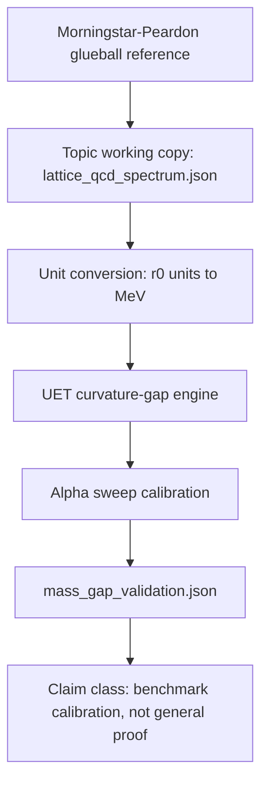

# 0.21 Yang-Mills Mass Gap

## Problem

This topic studies whether UET-inspired mass-gap mechanisms can reproduce selected
repository benchmark behavior related to confinement and glueball-mass scales.

## Assumptions and scope

- Scope: internal exploratory modeling and benchmark comparison against cited lattice-QCD
  references
- Out of scope: presenting a general Clay Millennium Problem proof from this benchmark alone

## Concept Map

## Data sources

- Topic-local lattice working copy:
  - `data/03_Research/lattice_qcd_spectrum.json`
- External source record:
  - `docs/data/external/particle_physics/glueball/morningstar_peardon_1999/source_record.json`
- Source-lock manifest:
  - `data/03_Research/source_lock_manifest.json`
- Reference citation:
  - Morningstar and Peardon in [docs/references.bib](/C:/Users/santa/Desktop/uet_harness/docs/references.bib:1)

## Method summary

- Engine: `Code/01_Engine/Engine_Mass_Gap.py`
- Proof script: `Code/02_Proof/Proof_Mass_Gap.py`
- Research comparison: `Code/03_Research/Research_Mass_Gap.py`

Supporting standard files:

- [METHOD.md](/C:/Users/santa/Desktop/uet_harness/docs/topics/0.21_Yang_Mills_Mass_Gap/METHOD.md:1)
- [DATA_MANIFEST.md](/C:/Users/santa/Desktop/uet_harness/docs/topics/0.21_Yang_Mills_Mass_Gap/DATA_MANIFEST.md:1)
- [VERIFICATION_SPEC.md](/C:/Users/santa/Desktop/uet_harness/docs/topics/0.21_Yang_Mills_Mass_Gap/VERIFICATION_SPEC.md:1)
- [BASELINE_COMPARISON.md](/C:/Users/santa/Desktop/uet_harness/docs/topics/0.21_Yang_Mills_Mass_Gap/BASELINE_COMPARISON.md:1)
- [LIMITATIONS.md](/C:/Users/santa/Desktop/uet_harness/docs/topics/0.21_Yang_Mills_Mass_Gap/LIMITATIONS.md:1)

## Parameters and fitting status

- `Research_Mass_Gap.py` performs a best-fit style sweep over `alpha`
- Public documentation must therefore classify this topic as a calibration-oriented internal
  benchmark, not as a proof of `Delta > 0` for general Yang-Mills theory

## Metrics and thresholds

- Current topic script reports a best-fit mass prediction and relative error against the
  selected lattice reference
- The artifact status is `PASS` only when the selected scalar-glueball residual stays inside
  the reference-row uncertainty; otherwise it records `WARN`
- No repository-wide mathematical-completeness threshold is recognized in this standards pass

## Baselines

- Selected lattice-QCD glueball mass values act as the current benchmark reference

## Evidence Matrix

| Layer | Current evidence | Status | Next hardening target |
|:--|:--|:--|:--|
| Data | Lattice-QCD working copy plus DOI source record and source-lock manifest | Source-backed working copy | Replace curated topic JSON with a reproducible upstream extraction table |
| Formula | Curvature-gap, scale conversion, lattice conversion, sweep, and error formulas are registered | Structured | Separate fitted scale choices from candidate theory constants |
| Verification | `Research_Mass_Gap.py` writes artifact hashes, threshold rule, residual, and status | Runnable | Promote from one-state scalar benchmark to multi-state spectrum validation |
| Claim | Calibration-aware benchmark against selected glueball mass | Bounded | Add independent lattice rows before stronger physics wording |
| Dependency | Feeds confinement/mass-generation discussions in the core map | Open | Mark downstream topics as inheriting the calibration limitation |

## Limitations and open risks

- The topic uses a calibration sweep and should say so plainly
- Internal match to selected benchmark values does not establish a general mathematical proof
- The local dataset package is topic-scoped rather than a full external replication kit

## Reproducibility

- Verification command: `python docs/topics/0.21_Yang_Mills_Mass_Gap/Code/03_Research/Research_Mass_Gap.py`
- Artifact contract: see [VERIFICATION_SPEC.md](/C:/Users/santa/Desktop/uet_harness/docs/topics/0.21_Yang_Mills_Mass_Gap/VERIFICATION_SPEC.md:1)

## Current readiness status

`Structured`
