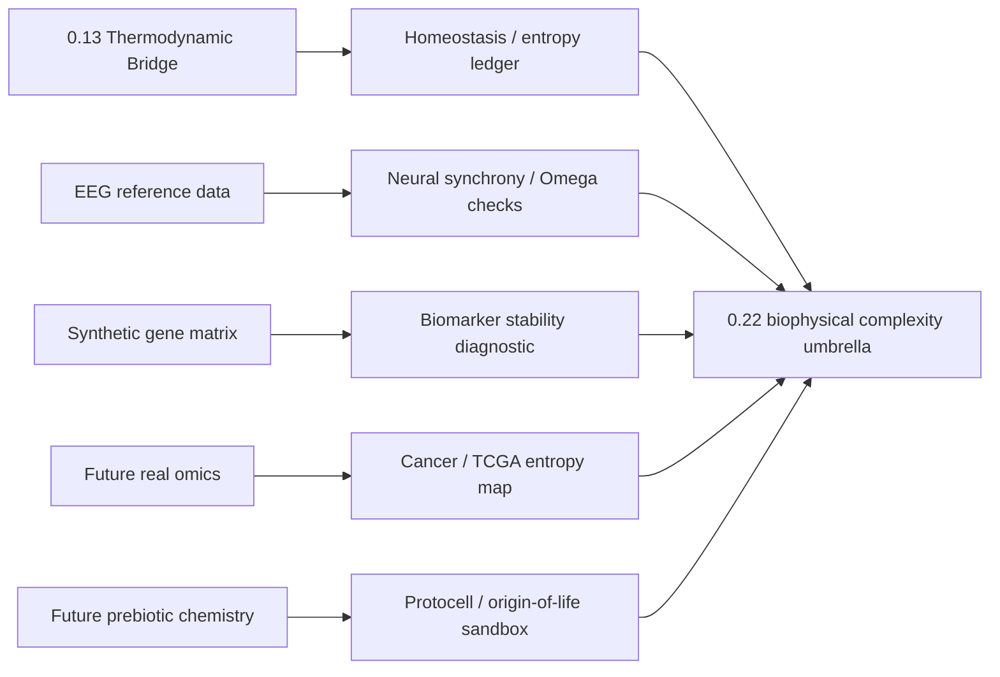

# Method

## Problem target

This topic studies whether UET-inspired biophysical complexity models can organize selected biological or neural proxy datasets.

## Core components

### Engine components
- `Code/01_Engine/Engine_Biophysics.py`
- `Code/01_Engine/Engine_Biophysics_Neural.py`
- `Code/01_Engine/Engine_Life_Entropy.py`

### Proof-oriented components
- `Code/02_Proof/Proof_Neural_Complexity.py`
- `Code/02_Proof/Proof_Neural_Dynamics.py`
- `Code/02_Proof/Proof_Schrodinger_Life.py`

### Research and comparison components
- `Code/03_Research/output.txt`
- `Code/03_Research/Research_Biomarker_Identification.py`
- `Code/03_Research/Research_Cancer_Cell_Chaos.py`

## Variable framing

- Primary modeled quantities: complexity proxies, biomarker-like features, neural-dynamics measures, and coupling terms
- `Omega`, stability, coherence, complexity, and diversity values are normalized proxy scores unless a source-specific unit contract is stated.
- Biomedical labels such as seizure, biomarker, cancer, and TCGA must be mapped to a concrete data source before they are used as evidence.

## Mechanism map

## Evidence matrix

| Layer | Current implementation | Evidence class | Use in theory |
|:--|:--|:--|:--|
| Homeostasis/negative entropy | Normalized entropy proxy with information-intake and decay terms | `D/A` | Conceptual bridge to `0.13`; needs environment entropy ledger. |
| EEG/seizure | CHB-MIT metadata plus Bonn-style local text samples; some scripts still synthetic | `D/C` | Neural complexity sandbox until raw windows/preprocessing are source-locked. |
| Biomarker | Seeded synthetic expression matrix with known positive controls | `D` | Code-path diagnostic only. |
| Cancer/TCGA | Mock expression matrices in scripts | `D` | Figure/metric sandbox only. |
| Protein/protocell | HP/proxy simulations | `D/A` | Exploratory biophysical mechanism tests. |
| Source evidence workflow | Intake stub plus readiness matrix for missing biomedical source packages | `Workflow gate` | Blocks data rewrites and claim upgrades until real evidence is attached. |
| Subclaim gate | Separate lane controls for biomarker, seizure, cancer, origin-of-life, and protein claims | `Workflow gate` | Prevents blended umbrella claims from outrunning the evidence. |

## Assumptions

- The current data package is heterogeneous and appears to use biological and neural proxies as exploratory stand-ins.
- The primary verifier currently validates only a seeded synthetic biomarker diagnostic.
- EEG, origin-of-life, cancer, and protein-folding claims need separate artifacts before they can be promoted.

## Domain of validity

- Exploratory biophysical-complexity benchmarks represented in topic-local evidence assets and downloaded files.

## Excluded cases

- A full origin-of-life mechanism or a complete validated biochemical theory.
- Clinical biomarker validation.
- Real EEG seizure classification or prediction.
- Real TCGA/omics validation.

## Parameter sensitivity note

- Proxy choice and preprocessing strongly affect interpretation in the current package.
- Any topic using `0.22` as support must inherit the synthetic/local-data limitations until source-locked sub-verifiers exist.

## Claim Workflow

1. Run `Research_Biomarker_Identification.py` to regenerate the artifact and workflow files.
2. Read `data/03_Research/source_evidence_intake_stub.json` as a mixed state file: CHB-MIT is already populated from pinned source records and local summaries, Bonn and TCGA are partially populated, and protein/prebiotic remain empty.
3. Use `data/03_Research/source_evidence_readiness_matrix.json` as the provenance gate before changing working-copy data or claim class.
4. Check `data/03_Research/subclaim_gate.json` before treating any sub-lane as evidence beyond the current synthetic biomarker diagnostic.

## Current provenance gate state

- CHB-MIT: source-review-ready for the current summary-based working copy (`6/6` fields complete), but still not a raw EDF archive.
- Bonn EEG: partial provenance only (`4/6` fields complete); license and source sampling-rate metadata are still missing.
- TCGA: partial provenance only (`3/6` fields complete); no real cohort or assay matrix is archived.
- Protein/prebiotic lanes: still placeholders with no pinned external package in the repo.
