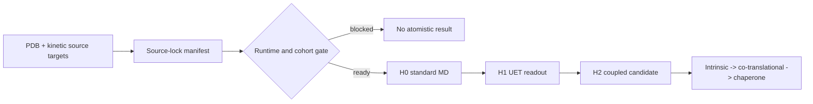

# 0.22 Biophysics & Origin of Life

> Current boundary: Draft / Tier B / WARN. This umbrella contains separate lanes. The primary evidence-producing verifier is a seeded synthetic biomarker diagnostic; the protein lane has a separate finite 2-D HP benchmark and a source/runtime preflight for future dynamics. All current evidence remains internal.

## Purpose and scope

This topic records how UET-style entropy, coherence, information-flow, and complexity proxies may organize biological and neural research questions. It is an umbrella workspace, not one unified biomedical result.

The active package distinguishes:

- conceptual hypotheses and normalized proxy models;
- exploratory simulations for homeostasis, neural dynamics, protocells, and immune extensions;
- one class-C synthetic biomarker diagnostic and one separate class-C finite HP model benchmark;
- source-referenced EEG and omics context whose raw inputs and preprocessing remain open;
- a class-B protein-folding dynamics design/preflight whose source and runtime gates must close independently;
- future sub-gates that must be closed independently.

## Canonical controller

- RESEARCH_REGISTRY.json: active lane, script, formula, data, and artifact inventory.
- Result/artifacts/0_22_biophysics_origin_of_life_claim_gate.json: claim boundary and promotion controller.
- VERIFICATION_SPEC.md: current run contract.
- DATA_MANIFEST.md: source identity and data reality.
- FORMULA_AUDIT.md: formula ontology, units, and derivation status.
- DYNAMICS_RESEARCH_SPEC.md plus DYNAMICS_DATA_MANIFEST.json and DYNAMICS_RUNTIME_MANIFEST.json: protein-folding dynamics contract and blockers.

## Theory and dependency map

0.13 thermodynamic dependency -> homeostasis proxy

Source-referenced EEG context -> neural model sandbox

Seeded synthetic matrix -> class-C biomarker diagnostic

Future source-locked omics -> TCGA/omics sub-gate

Future reaction-network data -> origin/protocell sub-gate

PDB/KineticDB/PFD/PFDB/CASP source targets + runtime gate -> protein-folding dynamics sub-gate

All lanes remain subordinate to the 0.22 umbrella and do not merge their evidence.

## Evidence and dependency matrix

| Lane | Current evidence | Claim ceiling | Controlling blocker |
| :-- | :-- | :--: | :-- |
| Homeostasis | Normalized proxy model | B | Environment entropy ledger and 0.13 dependency closure |
| Origin of life | Simulation sandbox | B | Source-locked prebiotic reaction network and dedicated artifact |
| EEG/neural | Source records and local summaries; no raw windows | B | Raw windows, preprocessing, record IDs, holdout metrics |
| Synthetic biomarker | Seeded internal diagnostic artifact | C | Real omics matrix and independent baseline |
| TCGA/omics | Mock matrix scripts archived as legacy | B | Real matrix, cohort, assay units, preprocessing, baseline |
| Protein folding | Deterministic finite 2-D HP benchmark with exhaustive oracle and seeded comparators | C | Real structure correspondence, source-backed benchmark, and independent replication |
| Protein-folding dynamics | Wave-0 source/runtime preflight; no atomistic result | B | Source-locked 12-protein cohort, pinned runtime, force-field assets, and smoke tests |
| Immune/clinical | Virtual-subject exploratory extensions | B | Ethical clinical design and independent outcome validation |

## Current claim boundary

Supported now: an internal synthetic biomarker diagnostic path, a class-C finite HP model benchmark, a class-B protein-folding dynamics research design/preflight, documented normalized formulas, and an explicit provenance/blocker map.

Not established: an origin-of-life mechanism, life thermodynamics, clinical biomarker usefulness, real TCGA analysis, EEG seizure prediction, real protein folding dynamics, cellular folding mechanism confirmation, AlphaFold replication, PDB/CASP validation, or external replication.

## Reproduce the current benchmark

    .venv\Scripts\python.exe docs\topics\0.22_Biophysics_Origin_of_Life\Code\03_Research\Research_Biomarker_Identification.py

    .venv\Scripts\python.exe docs\topics\0.22_Biophysics_Origin_of_Life\Code\03_Research\Research_Protein_Folding_HP_Benchmark.py

    .venv\Scripts\python.exe docs\topics\0.22_Biophysics_Origin_of_Life\Code\03_Research\Research_Protein_Folding_Dynamics_Gate.py

The dynamics command is a source/runtime preflight only; a BLOCKED lane gate is expected until the cohort and runtime are frozen. The biomarker command remains WARN with `claim_class=C` and `data_class=synthetic`. The protein command emits `0_22_protein_folding_hp_benchmark.json` with `verification_status=PASS`, `claim_class=C`, and `data_class=synthetic`; this PASS is limited to the finite model mechanics contract.

## Protein-folding dynamics map

The current gate stops at source/runtime preflight. It does not download data or generate a molecular-dynamics trajectory.

## Legacy boundary

Historical analysis prose, non-gated scripts, and old figure assets remain under Doc/Legacy/, Code/Legacy/, data/legacy/, Ref/Legacy/, and Result/Legacy/. They are preserved for research history but excluded from current evidence and status decisions.

## Next controller

The next controller is the protein-folding dynamics source/runtime gate: freeze the source-backed cohort, pin the atomistic runtime and force-field assets, and pass smoke tests. The existing HP benchmark remains a separate synthetic control.
