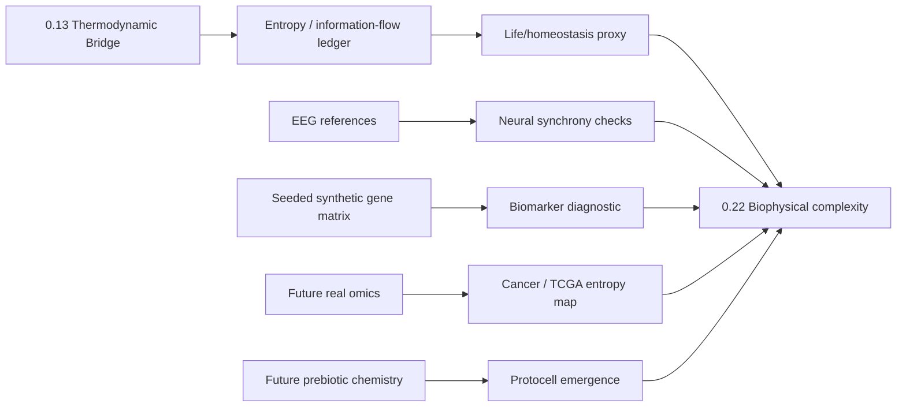

# 0.22 Biophysics & Origin of Life

> [!NOTE]
> **AI-Digest**: This topic is a biophysical-complexity umbrella. It studies how UET-style entropy, coherence, and information-flow proxies might organize living-system, neural, biomarker, cancer, protein-folding, and protocell simulations. Current support is exploratory: the primary verifier is a seeded synthetic biomarker diagnostic, while EEG and origin-of-life evidence need separate source-locked gates.


---

## 1. 5x4 Grid Structure

| Pillar | Purpose |
| :--- | :--- |
| **Doc/** | Analysis of biophysical complexity, neural dynamics, entropy, and origin-of-life hypotheses. |
| **Ref/** | Schrodinger, Prigogine, EEG, cancer/omics, protein-folding, and prebiotic references. |
| **data/** | Source-labeled EEG summaries, Bonn-style local EEG text files, and working research inputs. |
| **Code/** | Engine, proof, research, competitor, and visualization scripts. |
| **Result/** | Machine-readable verifier artifact and generated figures/logs. |

---

## Theory Role Diagram



---

## Evidence And Dependency Matrix

| Layer | Current status | Evidence path | What strengthens the theory next |
| :-- | :-- | :-- | :-- |
| Homeostasis/origin-of-life | Entropy and Omega proxy simulations | `METHOD.md`, `FORMULA_AUDIT.md` | Add environment entropy ledger and real/prebiotic reaction data. |
| EEG/neural dynamics | CHB-MIT/Bonn source records and local summaries exist, but primary verifier does not classify raw EEG | `DATA_MANIFEST.md`, `data/03_Research/source_lock_manifest.json` | Archive raw windows, preprocessing, exact record IDs, and classifier metrics. |
| Biomarker | Seeded synthetic positive-control diagnostic | `Research_Biomarker_Identification.py`, verifier artifact | Replace synthetic matrix with real omics data and baseline statistics. |
| Source evidence | Intake + readiness workflow gate; CHB-MIT row is review-ready, Bonn/TCGA remain partial | `data/03_Research/source_evidence_intake_stub.json`, `data/03_Research/source_evidence_readiness_matrix.json` | Close Bonn/TCGA field gaps and attach raw biomedical evidence before data rewrites or claim upgrades. |
| Cancer/TCGA | TCGA/GDC source target exists, but current scripts include mock matrices | `FORMULA_AUDIT.md`, `LIMITATIONS.md`, `docs/data/external/biophysics/omics/tcga/source_record.json` | Add real TCGA-derived matrix, cohort, preprocessing, hashes, and baseline statistics. |
| Protein/protocell | HP/proxy simulations | `FORMULA_AUDIT.md` | Add known benchmark optima, source data, deterministic artifacts. |
| Dependency | Thermodynamic language depends on `0.13` | `METHOD.md`, `LIMITATIONS.md`, `data/03_Research/subclaim_gate.json` | Inherit `0.13` source-lock limitations until closed. |

---

## Current Research Claim

- **Supported now:** a runnable internal diagnostic for synthetic biomarker stability, plus mapped formulas and data provenance gaps.
- **Not established yet:** origin-of-life mechanism, clinical biomarkers, external seizure prediction, real TCGA cancer entropy validation, or protein-folding superiority.
- **Main value:** `0.22` should become a set of separated biophysical sub-gates, not one blended biomedical claim.

---

## Test Results

| Test | Question | Current result | Status |
| :-- | :-- | :-- | :-- |
| Synthetic biomarker | Can seeded high-variance controls be flagged by stability score? | Artifact-producing verifier | WARN |
| EEG/seizure | Can UET classify real seizure windows? | Not primary-gated yet | OPEN |
| Origin of life | Can entropy accounting support local order in an open system? | Proxy simulation only | OPEN |
| Cancer/TCGA | Can real omics show coherence collapse? | Mock matrix currently | OPEN |
| Protein/protocell | Can benchmark optima be reached reproducibly? | Sandbox scripts | OPEN |

---

## Quick Start

```powershell
.venv\Scripts\python.exe docs\topics\0.22_Biophysics_Origin_of_Life\Code\03_Research\Research_Biomarker_Identification.py
```

## Key Files

- [FORMULA_AUDIT.md](./FORMULA_AUDIT.md): formula registry with units, proof status, verifier role, and failure modes.
- [DATA_MANIFEST.md](./DATA_MANIFEST.md): EEG/source references, synthetic verifier role, local hashes, and source-lock targets.
- [VERIFICATION_SPEC.md](./VERIFICATION_SPEC.md): primary verifier command, thresholds, artifact target, and interpretation.
- [METHOD.md](./METHOD.md): method map, evidence matrix, and dependency notes.
- [LIMITATIONS.md](./LIMITATIONS.md): current claim boundaries and blockers.
- [source_evidence_intake_stub.json](./data/03_Research/source_evidence_intake_stub.json): structured landing zone for missing EEG, omics, protein, and prebiotic source evidence.
- [source_evidence_readiness_matrix.json](./data/03_Research/source_evidence_readiness_matrix.json): workflow gate for which biomedical source packages are still blocked by missing evidence fields.
- [subclaim_gate.json](./data/03_Research/subclaim_gate.json): separated claim ceilings for biomarker, seizure, cancer, origin-of-life, protein, and cross-topic thermodynamic lanes.

---

*Core hardening status: formula-audited, synthetic verifier artifact enabled, biomedical source records pinned, source/subclaim gates enabled, raw biomedical data gates still open.*

Current provenance gate snapshot:

- CHB-MIT: `6/6` fields complete for the current source-referenced summary package, ready for source review
- Bonn EEG: `4/6` fields complete, blocked by license and source sampling-rate metadata
- TCGA: `3/6` fields complete, blocked by real cohort/assay identity and feature-filter metadata
- HP protein and prebiotic chemistry: `0/6` fields complete, still target placeholders only
