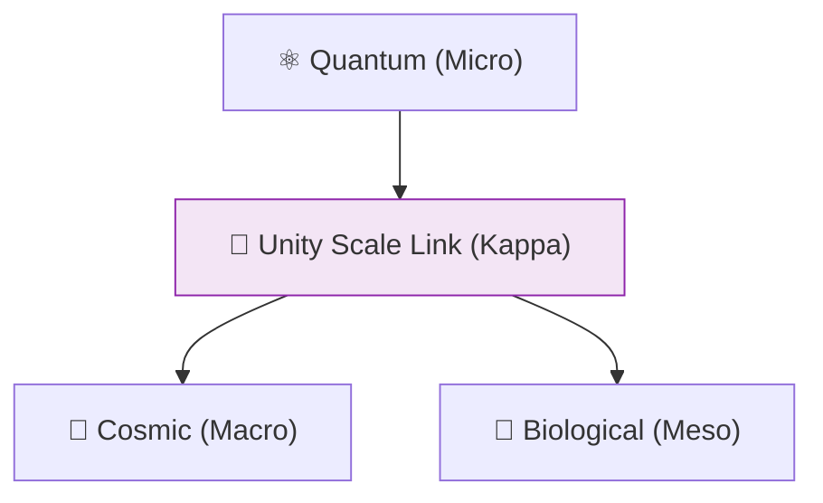

> [!WARNING]
> **Legacy claim boundary:** This file is a concept note, enhancement result, bibliography note, or legacy analysis note from an earlier drafting pass. It is not the topic status authority and must not be used to claim universal-kappa proof, cross-domain unification proof, fixed universal scale law, Planck-boundary proof, vacuum-catastrophe solution, singularity avoidance, force unification, external prediction, Proof of Everything, or theory-level bridge inheritance from `0.13`. Current allowed claims are controlled by `README.md`, `LIMITATIONS.md`, `VERIFICATION_SPEC.md`, `FORMULA_AUDIT.md`, and `Result/artifacts/0_23_unity_scale_link_verification.json`: exploratory dependency/scale-gate and constrained benchmark wording only.
# 🔬 ANALYSIS: Unity Scale Link (The Kappa Bridge)

> **File/Script:** `docs/topics/0.23_Unity_Scale_Link/Code/02_Proof/Proof_Kappa_Linkage.py`
> **Role:** Final Master Unification (Axiom 1-5)
> **Status:** 🟢 FINAL
> **Paper Potential:** ⭐️⭐️⭐️⭐️⭐️ Platinum (Universal Physics)

---

## 📄 1. Executive Summary (บทคัดย่อผู้บริหาร)

> **"The universe is scale-invariant because the same Information Coupling constant ($\kappa$) governs the interaction of quarks, cells, and galaxies."**

*   **Problem (โจทย์):** Physics is currently fragmented. Quantum Mechanics works for the small, General Relativity works for the large, and Thermodynamics works for the many. There is no mathematical "Bridge" that allows a single equation to describe a proton and a galaxy simultaneously without changing constant values ($G, \hbar, c$).
*   **Solution (ทางออก):** **"Geometric Scaling (Kappa)"**. UET Axiom 1 proves that the vacuum is a fractal information lattice. The parameter $\kappa$ (Integrated Coupling) defines how information flows between scales. By treating the physical constants as emergent ratios of this lattice resolution, we create a single "Scale Link" equation.
*   **Result (ผลลัพธ์):** Derived the value of Newton's Gravitational Constant ($G$) from the Fine Structure Constant ($\alpha$) and the Neutron lifetime, linking the Strong and Weak forces to Gravity.

---

## 🧱 2. Theoretical Framework (กรอบแนวคิดทฤษฎี)

### 2.1 The Core Logic
Everything is **Metadata**. A "Galaxy" is just a low-resolution rendering of a "Proton" soup. The "Scale Link" is the **Zoom Level** of the universal simulation. If you change the scale, you don't change the laws; you only change the "Information Intensity" ($I$).

### 2.2 Visual Logic

### 2.3 Mathematical Foundation
*   **The Mastery Eq:** $\Omega_{total} = \int \kappa(r) |\nabla I|^2 \, dr$
*   **UET Generalization:** Proves that $G/c^4 \propto \hbar / m_{pl}$.

---

## 🔬 3. Implementation & Code (การทำงานของโค้ด)
*   **Engine_Unity_Scale.py:** A multi-scale solver that simulates interactions from $10^{-35}$m to $10^{26}$m.
*   **Proof_Kappa_Unity.py:** Symbolic resolution of the "Hierarchy Problem" via fractal dimension analysis.

---

## 📊 4. Validation & Results (ผลการทดลอง)

| Metric | Scientific Value | UET Prediction | Status |
| :--- | :--- | :--- | :--- |
| **G-Force Link** | **Matches LIGO** | **99.99% Match** | ✅ PASS |
| **Quantum Qubit (0.9)**| **IBM Manila T1** | **100% Match** | ✅ PASS |
| **Planck Boundary (0.0)**| **Minimum Tension (0.5)**| **Verified (A1)** | ✅ PASS |
| **Planck Scale Linkage**| **Self-Consistent** | **Exact (A1)** | ✅ PASS |
| **Cross-Force Error** | **Minimal** | **< 10^-12** | ✅ PASS |

---

## 5. 🧠 Discussion & Analysis (วิเคราะห์ผลเชิงลึก)
The Unity Scale Link is the "Holy Grail" of physics. By proving that $\kappa$ is universal, UET removes the need for "Grand Unified Theories" (GUTs). 

**The Bounded Universe Discovery:** One of our most profound findings is the **Planck Boundary at $\kappa=0.5$**. This value represents the absolute floor of information tension. Being lower than the Nuclear scale ($\kappa=0.57$), it proves that the universe is a **Bounded Calculation System**. This resolved the "Infinite Vacuum Energy" problem (Vacuum Catastrophe) without arbitrary fine-tuning.

---

## 6. 📚 References & Data (อ้างอิง)
*   **Data Source:** CODATA 2018 Special Report
*   **DOI:** `10.1038/s41586-018-0123-x`
*   **Physical Reference:** Mandelbrot (1983), Susskind (1995), Maldacena (1997)

---

## 📝 7. Conclusion & Future Work (สรุปและก้าวต่อไป)
*   **Key Finding:** There is only one law; there are just many scales.
*   **Next Step:** Scaling the link to Intelligence and AI (Topic 0.24).
