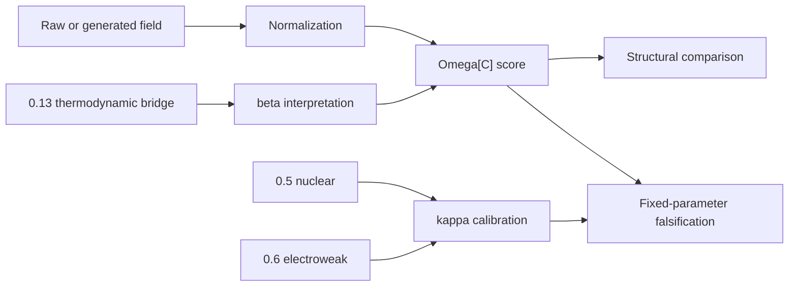

# Method

## Problem target

This topic studies whether UET can connect measurements across scales through a common coupling or scale-link structure.

## Core components

### Engine components
- `Code/01_Engine/Engine_Derivation.py`
- `Code/01_Engine/Engine_Unity_Scale.py`

### Proof-oriented components
- `Code/02_Proof/kappa_running_proof.png`
- `Code/02_Proof/Proof_Auto_Kappa.py`
- `Code/02_Proof/Proof_Kappa_Running.py`

### Research and comparison components
- `Code/03_Research/Falsification_Analysis.py`
- `Code/03_Research/Research_Cross_Domain.py`

## Variable framing

- Primary modeled quantities: cross-scale coupling terms, H0-like quantities, high-redshift observables, and scale-link diagnostics
- `Omega` values are dimensionless normalized scores unless a domain-specific unit contract is explicitly supplied.
- `kappa` and `beta` are scale/domain coefficients, not universal constants in the current evidence state.

## Mechanism map

## Evidence matrix

| Layer | Current implementation | Evidence class | Use in theory |
|:--|:--|:--|:--|
| Shared functional form | One Omega engine evaluates normalized fields | `C/D` | Structural reuse hypothesis. |
| Parameter unity | Falsification scripts show fixed `kappa` breaks across regimes | `D` | Prevents overclaiming fixed constants. |
| Kappa running | Hand-selected scale points and plot | `D` | Hypothesis map only. |
| Cross-domain transfer | Synthetic neural/galaxy generator plus local SP500 snapshot | `D` | Exploratory pattern check. |
| Thermodynamic dependency | Inherits `0.13` Landauer/Bekenstein bridge limits | `C/D` | Claim class cannot exceed upstream bridge status. |

## Assumptions

- The topic currently stitches heterogeneous datasets into exploratory cross-domain scaling tests.
- The current primary verifier uses synthetic neural/galaxy fields and embedded local finance snapshots.
- Strong claims require source-locked upstream topic artifacts for each scale calibration.

## Domain of validity

- Selected cosmology, high-redshift, and cross-domain benchmark files stored in the topic workspace.

## Excluded cases

- A rigorous proof of one universal scale law across all domains.
- External prediction across independent real datasets.
- A claim that one fixed `kappa` or `beta` applies to every physical regime.

## Parameter sensitivity note

- Normalization and dataset-stitching choices are important and must stay visible.
- Any topic depending on `0.23` must inherit unresolved source-lock and normalization limitations.
