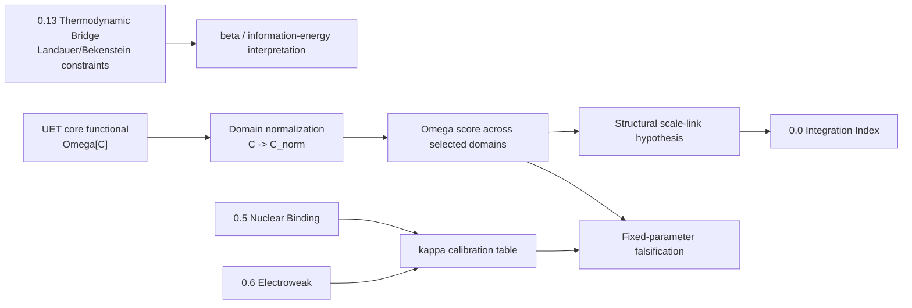

# 0.23 Unity Scale Link

> [!NOTE]
> **AI-Digest**: This topic tests whether UET can reuse a common functional structure across domains without pretending that one fixed parameter set works everywhere. Current evidence supports an exploratory structural scale-link hypothesis, while parameter unity, external prediction, and grand-unification claims remain open.


---

## 1. 5x4 Grid Structure

| Pillar | Purpose |
| :--- | :--- |
| **Doc/** | Analysis of cross-scale structure, Planck boundary hypotheses, and scale-link assumptions. |
| **Ref/** | Scale invariance, holography, renormalization, complex-system scaling, and allometry references. |
| **data/** | Topic-local cosmology, scale-mapping, unified-system, and finance snapshots. |
| **Code/** | Engine, proof/falsification, cross-domain research, implementation, and enhancement experiments. |
| **Result/** | Machine-readable verifier artifact and generated scale-link logs. |

---

## Theory Role Diagram



---

## Evidence And Dependency Matrix

| Layer | Current status | Evidence path | What strengthens the theory next |
| :-- | :-- | :-- | :-- |
| Core mechanism | Same Omega implementation can evaluate normalized fields | `Code/01_Engine/Engine_Unity_Scale.py`, `FORMULA_AUDIT.md` | Define dimensional contracts so normalized comparisons do not erase physical scale. |
| Data | Source-referenced local finance snapshots plus synthetic galaxy/neural fields | `DATA_MANIFEST.md`, `data/03_Research/source_lock_manifest.json`, `docs/data/external/finance/yahoo_snapshots/0_23_unity_scale_link/source_manifest.json` | Add reproducible Yahoo query logs/retrieval timestamps and replace synthetic neural fields with real EEG. |
| Formula | Reviewed formula audit now separates Omega form, normalization, kappa-running, falsification, and cross-domain tests | `FORMULA_AUDIT.md` | Link each calibration to upstream topic artifact and uncertainty. |
| Verification | Primary verifier writes structured artifact with directional test outcomes, not merely run success | `VERIFICATION_SPEC.md`, `Result/artifacts/0_23_unity_scale_link_verification.json` | Add real external EEG/finance/cosmology source packages and fixed thresholds. |
| Dependency | Inherits only accepted `0.13` foundation exports plus calibration status from `0.5`/`0.6`, now with an explicit dependency manifest | `METHOD.md`, `LIMITATIONS.md`, `data/03_Research/scale_dependency_manifest.json`, `../0.13_Thermodynamic_Bridge/Data/03_Research/thermodynamic_bridge_foundation_claim_gate.json` | A dependent claim cannot exceed the weakest required source topic or a blocked 0.13 foundation export. |

---

## Current Research Claim

- **Supported now:** UET has a reusable computational form for normalized fields, and fixed parameter unity is explicitly falsified by the topic's own diagnostics.
- **New governance gate:** the verifier records `scale_claim_gate`, which treats fixed-parameter failure as a useful constraint and keeps synthetic neural/galaxy branches simulation-only until real source packages exist.
- **0.13 inheritance rule:** `0.23` may use `T13_EXPORT_LANDAUER_LOWER_BOUND` and `T13_EXPORT_STANDARD_THERMO_GRAVITY_IDENTITIES` as constraints, but must not inherit `T13_EXPORT_UET_BRIDGE_PROOF`, source-normalized Landauer dataset closure, or Cattaneo external validation while those exports remain blocked.
- **Not established yet:** full theory-wide integration, a universal fixed `kappa`, vacuum-energy closure, or held-out external cross-domain prediction.
- **Main value:** `0.23` should serve as a scale-dependency map that shows where UET can reuse structure, where parameters must run, and which upstream topic artifacts each claim inherits.

---

## Test Results

| Test | Question | Current result | Status |
| :-- | :-- | :-- | :-- |
| Shared Omega form | Can the engine compute a common normalized functional? | Runs on generated/embedded examples | WARN |
| Fixed parameter unity | Does one `kappa` work everywhere? | Falsification says no | PASS as blocker |
| Scale-dependent kappa | Do selected points suggest a running pattern? | Hand-selected exploratory curve | WARN |
| Cross-domain transfer | Does galaxy-like `kappa` separate generated neural states? | Synthetic check passes | WARN |
| Finance comparison | Does local SP500 snapshot follow the same ordering as the synthetic neural diagnostic? | Must be checked explicitly; mismatch is allowed and recorded | WARN |

---

## Quick Start

```powershell
.venv\Scripts\python.exe docs\topics\0.23_Unity_Scale_Link\Code\03_Research\Research_Cross_Domain.py
```

## Key Files

- [FORMULA_AUDIT.md](./FORMULA_AUDIT.md): formula, unit, constant, proof-status, and failure-mode registry.
- [DATA_MANIFEST.md](./DATA_MANIFEST.md): local datasets, source-lock gaps, and provenance status.
- [VERIFICATION_SPEC.md](./VERIFICATION_SPEC.md): primary verifier command, metrics, thresholds, and artifact path.
- [METHOD.md](./METHOD.md): method, dependency layer, and domain-of-validity statement.
- [LIMITATIONS.md](./LIMITATIONS.md): claim boundary and blockers before paper-facing use.

---

*Core hardening status: formula-audited, verifier-artifact enabled, finance source metadata pinned, `scale_claim_gate` enabled, reproducible retrieval and real EEG source-lock still open.*
