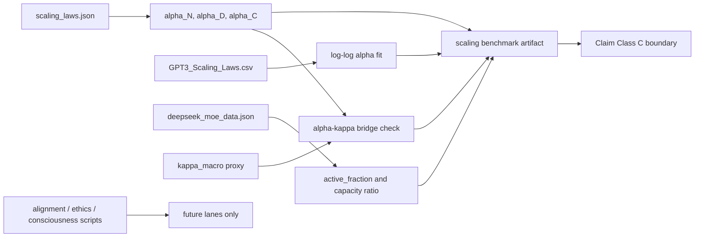

# 0.24 Artificial Intelligence

> [!NOTE]
> **AI-Digest**: This topic currently supports an internal AI scaling and
> sparse-architecture benchmark. It checks topic-local scaling-law constants,
> a small GPT-style scaling table, and dense/MoE active-parameter fractions. It
> does not yet prove AI alignment, ethics as a physical law, consciousness, or
> universal intelligence dynamics.


## Current Claim Boundary

The accepted evidence for this topic is limited to reproducible scaling-law and
sparse-architecture diagnostics. UET-specific bridges such as `alpha_N ~= kappa`,
entropy-based learning-rate rules, alignment equilibrium, and consciousness
models remain open until they have their own source-backed verifier artifacts.

## Conceptual Diagram



## Evidence Matrix

| Layer | Current status | Evidence / artifact | Claim allowed |
| :-- | :-- | :-- | :-- |
| Scaling-law constants | Source-referenced working copy | `Data/03_Research/scaling_laws.json` | benchmark input |
| Local exponent fit | Runnable diagnostic | `Research_AI_Scaling_Audit.py` | internal consistency check |
| MoE sparsity | Runnable diagnostic | `deepseek_moe_data.json`, verifier artifact | active-parameter comparison |
| Source evidence | Intake + readiness workflow gate; all three targets now mapped as partial instead of blank | `Data/03_Research/source_evidence_intake_stub.json`, `Data/03_Research/source_evidence_readiness_matrix.json`, `Data/03_Research/source_lock_manifest.json` | no claim upgrade by itself |
| `alpha_N` to UET `kappa` bridge | Heuristic/open | artifact blocker when mismatch is too large | no constant-identification claim |
| Entropy-learning engine | Implemented but not benchmark-validated | `UET_AI_Core.py`, `FORMULA_AUDIT.md`, `Data/03_Research/model_claim_gate.json` | future optimizer benchmark |
| Alignment/ethics/consciousness | Exploratory | limitations and future scripts | no physical-law claim |

## 5x4 Grid Structure

| Pillar | Purpose |
| :-- | :-- |
| `Doc/` | analysis notes for AI entropy, ethics, and alignment concepts |
| `Ref/` | referenced AI scaling, neural network, and transformer materials |
| `Data/` | topic-local scaling-law and architecture metadata working copies |
| `Code/` | engine, proof, research, competitor, and developmental-AI scripts |
| `Result/` | verifier artifacts, plots, and run logs |

## Quick Start

```powershell
cd C:\Users\santa\Desktop\uet_harness
python docs/topics/0.24_Artificial_Intelligence/Code/03_Research/Research_AI_Scaling_Audit.py
```

## Key Files

- `FORMULA_AUDIT.md`: reviewed formula/variable/unit/proof-status registry.
- `VERIFICATION_SPEC.md`: primary command, metrics, thresholds, and artifact contract.
- `DATA_MANIFEST.md`: data provenance, unit conventions, hashes, and benchmark roles.
- `METHOD.md`: method scope, evidence lanes, variables, and dependency policy.
- `LIMITATIONS.md`: blockers that prevent stronger AI/alignment claims.
- `Data/03_Research/source_evidence_intake_stub.json`: structured landing zone for missing scaling/model-metadata source records.
- `Data/03_Research/source_evidence_readiness_matrix.json`: workflow gate for which source packages are still blocked by missing evidence fields.
- `Data/03_Research/model_claim_gate.json`: accepted-versus-blocked claim lanes for benchmarks, heuristics, and exploratory scripts.

## Current Limitations

- Scaling and model metadata are local working copies, not a complete archival
  upstream provenance package.
- The `kappa` bridge is heuristic and must not be promoted as a derived law.
- MoE sparsity is not equivalent to full efficiency, intelligence, safety, or
  alignment.
- Ethics, alignment, consciousness, and developmental-AI claims remain future
  lanes until separately verified.

## Provenance Snapshot

- Scaling-law source package: `6/6` fields complete for source review; exact extraction review is still required before claim upgrades
- GPT-style scaling table: `5/6` fields complete; still missing construction/retrieval date
- Model architecture metadata: `4/6` fields complete; still missing public model-card URLs and retrieval date
- `source_lock_manifest.json` now binds the three working-copy benchmark lanes to explicit data classes and unit conventions

---

[Previous: Unity Scale Link](../0.23_Unity_Scale_Link/README.md) | [Back to Topics](../README.md)
