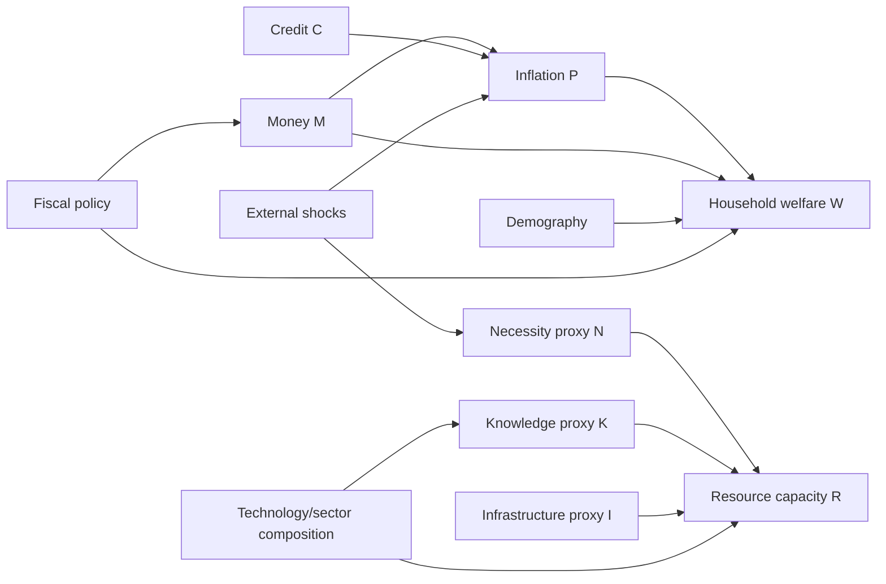

# Causal DAG Contract — Topic 0.25 Economics

The DAG is a design constraint, not evidence that identification has been achieved. The
machine-readable graph is
[`uet_economics_causal_dag.json`](Data/03_Research/uet_economics_causal_dag.json).

Current status is `NOT_IDENTIFIED`. Descriptive regressions, local projections, VAR/BVAR
comparators, and forecasts may be reported as diagnostics. Causal wording requires joint
pre-trend tests, placebo windows, negative controls, weak-instrument screening, alternative
windows/controls, and two independent identification strategies. A fitted association is
not evidence that fiat policy, a strategy, or social stabilization caused an outcome.
