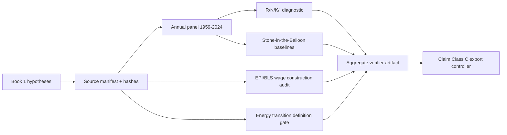

# 0.25 Strategy Power Economics

> [!NOTE]
> **Current package state:** `Structured / Tier A` as a standards-package readiness label.
> **Claim boundary:** `Claim Class C` and `DESCRIPTIVE_DIAGNOSTIC_ONLY` remain controlling.
> The package is an auditable internal diagnostic, not a confirmation of an economic law,
> a fiat-currency causal effect, a policy, or an asset-superiority claim.


## What changed in this hardening wave

The Book 1 lane now has a frozen U.S. annual source package for 1959-2024. The source gate
is `PASS` with `15/15` required inputs, the normalized panel has `66` rows, all four
non-network audit commands complete with zero execution failures, and the legacy-document
quarantine gate passes for `12/12` markdown notes. The aggregate artifact is
still `WARN` because the literal energy-density lane is intentionally blocked. That warning
is a scientific boundary, not a missing result.

The legacy Yahoo-style market files, `Global_Economy_2024.json`, and the local daily snapshot
remain a separate Claim Class C diagnostic lane. They are not used as primary inputs to the
Book 1 historical tests.

## Current claim boundary

Allowed wording is limited to source-locked descriptive findings such as:

- the predeclared U.S. proxy panel did or did not outperform its named internal baselines;
- the EPI chart construction and the BLS comparator produced the reported source-specific
  growth figures;
- the energy-throughput and regime summaries are descriptive.

The following remain blocked: `R=N+K+I` as a derived economic law, fiat-money causality,
policy validation, strategic superiority, social stabilization, Nash-equilibrium improvement,
and a validated gold/equity scaling peg.

## Conceptual and verification path



## Evidence and status matrix

| Lane | Current evidence | Artifact / gate | Allowed result |
| :-- | :-- | :-- | :-- |
| Source package | 15/15 required inputs present in frozen `2026-07-12` package | `uet_us_economics_source_manifest.json`, `uet_us_economics_source_readiness.json` | provenance and rerun readiness only |
| Normalized panel | 66 annual U.S. rows, 1959-2024; no imputation | `uet_us_macro_panel_1959_2024.csv`, `uet_us_macro_panel_status.json` | internal descriptive diagnostics |
| Resource engine | Primary 3-year and 1/5-year sensitivities complete; candidate signal false | `0_25_uet_resource_equation_audit.json` | proxy association and baseline comparison |
| Monetary-resource mismatch | 1/3/5-year baseline comparisons complete; candidate signal false | `0_25_stone_balloon_audit.json` | non-causal temporal comparison |
| Wage-productivity | EPI export reproduced; BLS comparator reported separately | `0_25_wage_productivity_audit.json` | construction/vintage findings |
| Energy | 1959-2024 throughput ready; 1776-1945 history absent; literal density blocked | `0_25_energy_density_audit.json` | descriptive energy lane only |
| Pegged-stone assets | LBMA and licensed S&P total-return exports absent | `asset_lane` in stone artifact | no peg or asset-superiority claim |
| Legacy claim quarantine | all `12` legacy markdown notes carry the required boundary warning | `legacy_claim_quarantine` in aggregate artifact | legacy prose is not status or primary evidence |
| Legacy market/economy | local working-copy diagnostics with incomplete upstream metadata | `0_25_strategy_power_economics_verification.json` | row-count, Gini, return statistics only |

## Current result snapshot

- Resource engine: at the primary 3-year horizon, median rolling-origin RMSE improvement
  versus constant-growth is `-14.9%`; versus zero-growth it is `-6.4%`; the candidate gate is
  false. The 1-year and 5-year sensitivities also fail the predeclared candidate rule.
- Stone-in-the-Balloon: the mismatch does not beat the inflation autoregression at any
  horizon; the 3-year median improvement versus that baseline is `-67.0%`.
- Wage lane: the versioned EPI chart gives productivity growth `80.24%` and published total
  compensation growth `28.38%` for 1979-2021. The Book quote (`64.6%` and `17.3%`) is retained
  as a source/construction comparison. The BLS comparator gives `125.02%` and `56.64%`.
- Aggregate status: `WARN`, with only `energy_density: WARN` as the machine-readable next
  controller; all executed commands exit zero and the legacy quarantine gate is `PASS`.

## Readiness and tier meaning

`Structured / Tier A` means that the root standards set, source manifest, formula registry,
parameter/holdout policies, normalized panel, baselines, and verifier artifacts are present
and auditable internally. It does not mean the theory is proved. Any move beyond this internal
package still requires human review, external replication, stronger causal identification,
and closure of the named blockers.

## Quick start

```powershell
cd C:\Users\santa\Desktop\uet_harness
.\.venv\Scripts\python.exe docs/topics/0.25_Strategy_Power_Economics/Code/03_Research/Research_UET_Economics_External_Source_Transform.py --vintage 2026-07-12 --epi-csv <provider-export.csv>
.\.venv\Scripts\python.exe docs/topics/0.25_Strategy_Power_Economics/Code/03_Research/Research_UET_Economics_Source_Package.py --vintage 2026-07-12
.\.venv\Scripts\python.exe docs/topics/0.25_Strategy_Power_Economics/Code/03_Research/Verify_UET_Economics_Hardening.py
```

The EPI provider export is an input to the source-transform pass, not a hidden download.
The verifier never silently imputes missing rows and never substitutes the legacy Yahoo files
for the declared primary panel.

## Key files

- `METHOD.md`: theory-to-proxy mapping and evaluation policy.
- `DATA_MANIFEST.md`: source, path, unit, transformation, and hash rules.
- `FORMULA_AUDIT.md`: formula IDs, variable definitions, unit closure, and proof status.
- `BASELINE_COMPARISON.md`: exact baseline metrics from the latest artifact.
- `VERIFICATION_SPEC.md`: rerun order, gates, thresholds, and artifact contract.
- `LIMITATIONS.md`: open evidence and claim blockers.
- `UPDATE_LOG.md`: hardening-wave history.
- `Result/artifacts/0_25_uet_economics_verification.json`: current export controller.
