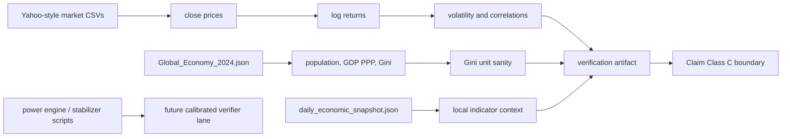

# 0.25 Strategy Power Economics

> [!NOTE]
> **AI-Digest**: This topic currently supports an internal economic-data and
> market-diagnostics benchmark. It checks local market time series, Gini/GDP
> working-copy sanity, and provenance blockers. Strategic stabilizer, world-lease,
> social-manifold, and game-theory claims remain model proposals until calibrated
> against source-locked data and verifier-gated.


## Current Claim Boundary

The accepted evidence for this topic is limited to descriptive diagnostics from
topic-local market and economy working copies. The power-engine scenarios can be
used as exploratory models, but they do not yet prove policy causality, strategic
superiority, game-theory improvement, or real-world social stabilization.

## Conceptual Diagram



## Evidence Matrix

| Layer | Current status | Evidence / artifact | Claim allowed |
| :-- | :-- | :-- | :-- |
| Market time series | Runnable diagnostic | `Research_Economic_Data_Audit.py` and artifact | descriptive returns/volatility/correlation |
| Economy baseline | Source-referenced working copy | `Global_Economy_2024.json` | Gini/GDP/population sanity |
| Daily snapshot | Local gateway snapshot | `daily_economic_snapshot.json` | local context only |
| Social power engine | Heuristic model | `Engine_Power_Dynamics.py`, formula audit | simulation proposal |
| 8-billion resonance | Old run-contract only | previous artifact now treated as insufficient | no stability claim |
| Policy/game-theory claims | Not verifier-gated | limitations | no superiority or causality claim |

## 5x4 Grid Structure

| Pillar | Purpose |
| :-- | :-- |
| `Doc/` | strategy, social manifold, policy, and economics notes |
| `Ref/` | references and historical stabilizer metadata |
| `Data/` | market CSVs, global economy working copy, and daily snapshot |
| `Code/` | engine, proof, research, and scenario scripts |
| `Result/` | artifacts, figures, logs, and summary outputs |

## Quick Start

```powershell
cd C:\Users\santa\Desktop\uet_harness
python docs/topics/0.25_Strategy_Power_Economics/Code/03_Research/Research_Economic_Data_Audit.py
```

## Key Files

- `FORMULA_AUDIT.md`: reviewed formulas, units, proof status, and failure modes.
- `VERIFICATION_SPEC.md`: primary command, thresholds, and artifact contract.
- `DATA_MANIFEST.md`: data provenance, unit conventions, and benchmark roles.
- `METHOD.md`: accepted evidence lanes and dependency policy.
- `LIMITATIONS.md`: blockers for stronger strategy/economics claims.

## Current Limitations

- Upstream provenance for the local market and economy files is not archival yet.
- Descriptive market diagnostics are not causal economic laws.
- Social stabilizer and policy simulations are not calibrated to real policy data.
- No current artifact supports old green-check strategic superiority wording or
  real-world stabilization claims.

---

[Previous: Artificial Intelligence](../0.24_Artificial_Intelligence/README.md) | [Back to Topics](../README.md)
