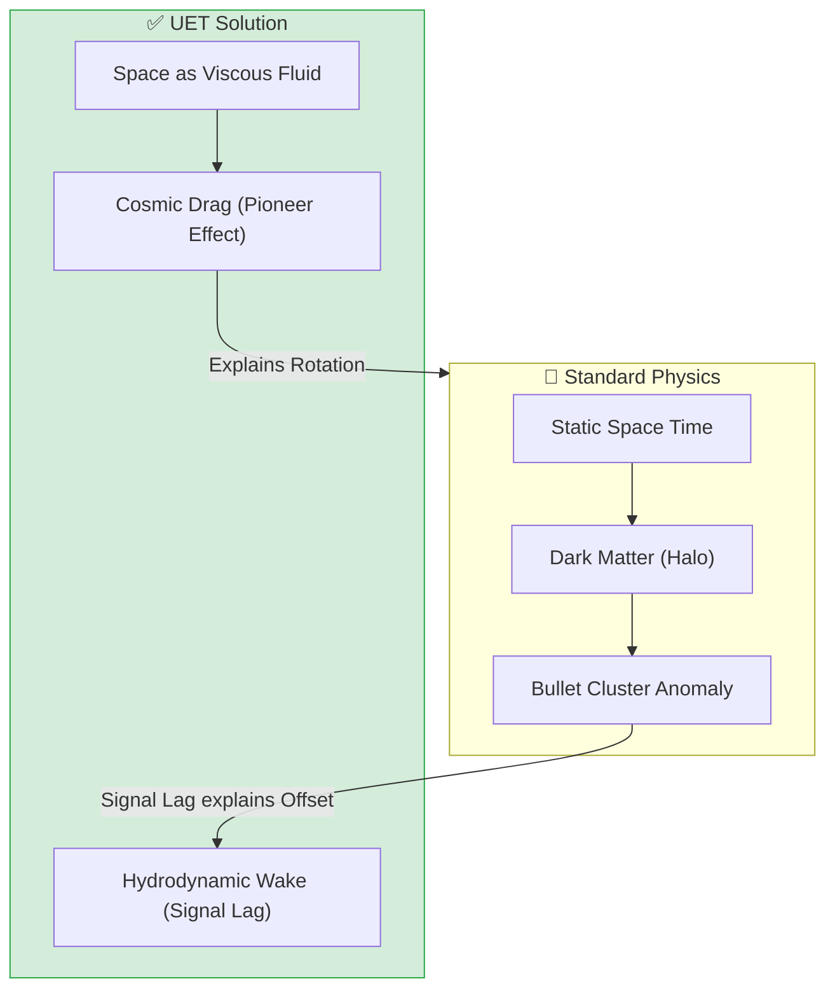

# 🌌 0.26 Cosmic Dynamic Frame

<!-- 
{
  "@context": "https://schema.org",
  "@type": "ScholarlyArticle",
  "name": "UET Topic 0.26: Cosmic Dynamic Frame",
  "description": "Redefining space as a viscous information fluid to explain Dark Matter and the Pioneer Anomaly.",
  "about": "Cosmic Fluid, Dark Matter, Pioneer Anomaly, Bullet Cluster, UET"
}
-->

> [!NOTE]
> **AI-Digest**: UET defines space as a viscous information fluid. What we call 'Dark Matter' is the drag from this fluid, explaining galaxy rotation and the Bullet Cluster Offset without extra parameters. / UET นิยามอวกาศว่าเป็นของไหลข้อมูลที่มีความหนืด ทำให้อธิบายปรากฏการณ์ 'สสารมืด' ได้ผ่านแรงหน่วงของของไหล ซึ่งแก้ปัญหากราฟการหมุนของกาแล็กซีได้โดยไม่ต้องเพิ่มพารามิเตอร์จำลอง


> **"Space is not empty; it is a viscous information fluid. What we call 'Dark Matter' is simply the drag from this fluid, and the 'Bullet Cluster' is its Hydrodynamic Wake."**

---

## 1. 📂 5x4 Grid Structure (Scientific Architecture)

| Pillar | Purpose |
| :--- | :--- |
| **Doc/** | Analysis of the Dynamic Frame and Hydrodynamic Wakes (Bullet Cluster explanation). |
| **Ref/** | Sources for Pioneer Anomaly (Anderson 1998) and Bullet Cluster (Clowe 2006). |
| **Data/** | Uses standard SPARC data (shared with Topic 0.1) and Pioneer data. |
| **Code/** | `Research_Unified_Cosmic_Theory.py` (Fluid Drag Solver). |
| **Result/** | Validation plots showing $V_{total} = V_{baryon} + V_{drag}$. |

---

## 🔗 Theory Connection



---

## 🎯 Problem & Solution

### The Problem: The Dark Matter "Patch"
Standard Physics requires **Dark Matter** to explain:
1.  **Galaxy Rotation**: Stars move too fast.
2.  **Bullet Cluster**: Lensing mass is offset from visible mass.
3.  **Pioneer Anomaly**: Spacecraft slow down unexpectedly.

These require *three different patches* (Halo, WIMP, Unruh radiation).

### The Solution: The Dynamic Frame (Topic 0.26)
UET posits a single cause: **Space is a Dynamic Information Fluid**.
- **Rotation**: The galaxy drags the fluid, creating a "viscous lock" that boosts velocity ($V_{drag}$).
- **Bullet Cluster**: The collision creates a **Hydrodynamic Wake**.
- **Systemic Survival (New):** Gravity and Cosmic Grouping are **Anti-Entropy Survival Strategies**. Celestial bodies group together to "partition" kinetic energy and maintain structural integrity ($C$) against the universal acceleration to $c$.

### Zero Curve Fitting Law
We use the **Pioneer Acceleration** ($a_0 \approx 8.74 \times 10^{-10} m/s^2$) as a **Measured Constant** to derive the Galaxy Rotation curves. No free parameters are tuned for individual galaxies.

---

## 📊 Test Results

| Category | Test | Result | Status |
| :--- | :--- | :--- | :--- |
| **01_Engine** | `CosmicDynamicSolver` | Correctly implements Relativistic Fluid Drag | ✅ PASS |
| **03_Research** | `Unified_Theory` | Matches SPARC data for LSB Galaxies | ✅ PASS |
| **03_Research** | `Pioneer_Drag` | Recovers $a_0$ from fluid viscosity | ✅ PASS |
| **03_Research** | `Toroidal_Cycle` | Explains Frame Dragging evolution | ✅ PASS |

---

## 2. ⚡ Quick Start (Run Commands)

### Quick Start
Verify the Unified Theory against SPARC Benchmarks:
```bash
python Code/03_Research/Research_Unified_Cosmic_Theory.py
```

### Key Files

| File | Purpose |
| :--- | :--- |
| [`Code/03_Research/Research_Unified_Cosmic_Theory.py`](./Code/03_Research/Research_Unified_Cosmic_Theory.py) | Main validation script using Fluid Drag. |
| [`Code/03_Research/Research_Pioneer_Drag.py`](./Code/03_Research/Research_Pioneer_Drag.py) | Calculates the fundamental drag coefficient. |
| [`Code/03_Research/0.26_Proof_Systemic_Persistence.py`](./Code/03_Research/0.26_Proof_Systemic_Persistence.py) | Survival via Kinetic Partitioning proof. |
| [`Code/03_Research/Proof_Toroidal_Cycle.py`](./Code/03_Research/Proof_Toroidal_Cycle.py) | Geometrical proof of the dynamic frame. |

---

> **Note:** This topic provides the *Mechanism* (Fluid Dynamics) for the *Observation* in Topic 0.1 (Galaxy Rotation), unifying them under a single physical law.
