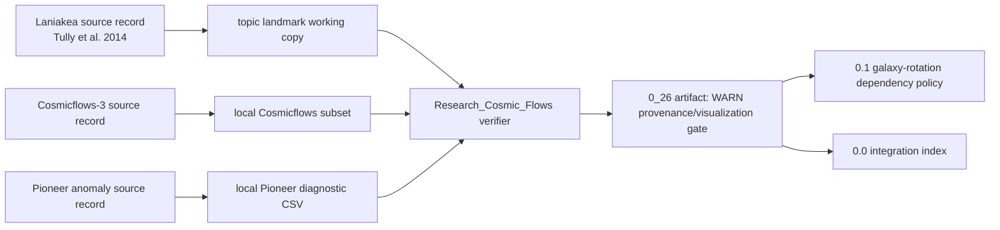

# 0.26 Cosmic Dynamic Frame

> [!NOTE]
> **AI-Digest**: This topic explores a dynamic-frame interpretation of cosmic flows, galaxy-scale drag analogies, and Pioneer-style anomaly diagnostics. Current evidence is a source-referenced visualization/provenance gate, not a validated dark-matter replacement or cosmological model fit.


## Current Claim Boundary

`0.26` is a candidate mechanism layer for dynamic-frame cosmology. It can support later theory work only through explicit source records, formula-audit entries, verifier artifacts, and inherited limitations from related core topics. It must not be used as a dark-matter replacement claim until raw flow/lensing/galaxy datasets, baselines, uncertainty handling, and model residual gates exist.

## Conceptual Diagram



## Evidence And Dependency Matrix

| Layer | Current status | Evidence path | What strengthens the theory next |
| :-- | :-- | :-- | :-- |
| Core mechanism | Dynamic information-fluid frame with drag/wake interpretation | `METHOD.md`, `FORMULA_AUDIT.md` | Derive drag, wake, and frame terms from explicit units and compare against baselines. |
| Data | Laniakea/Cosmicflows/Pioneer source records plus local working copies | `DATA_MANIFEST.md`, `Data/03_Research/source_lock_manifest.json` | Archive raw tables, observer frames, distance calibration, preprocessing, and upstream hashes. |
| Formula | Reviewed formula audit separates rotation, fluid correction, decay, Pioneer drag, viscosity analogy, and torus visuals | `FORMULA_AUDIT.md` | Link galaxy-fit claims to `0.1` artifacts and add uncertainty-aware residual metrics. |
| Verification | Primary artifact hashes local inputs plus external source records, but remains visualization/provenance only | `VERIFICATION_SPEC.md`, `Result/artifacts/0_26_cosmic_dynamic_frame_verification.json` | Add numeric flow residual gates and model/baseline comparisons. |
| Theory dependency | Candidate mechanism layer for galaxy rotation and integration claims | `0.1_Galaxy_Rotation_Problem`, `0.0_Grand_Unification`, `0.23_Unity_Scale_Link` | State which claims inherit the dynamic-frame limitations and which remain independent. |
| Limitation | High conceptual importance, incomplete raw-data and baseline package | `LIMITATIONS.md` | Separate physical mechanism, empirical benchmark, analogy, and speculative topology. |

## Problem And Method

- Standard cosmology and galaxy dynamics use different explanatory layers for rotation curves, cosmic flows, lensing offsets, and spacecraft residuals.
- UET investigates whether a dynamic information-frame model can organize these effects under a common mechanism.
- The present verifier does not fit a cosmological model. It checks whether the local Laniakea/Cosmicflows/Pioneer working package is traceable enough to serve as a future benchmark scaffold.

## Current Verification Results

| Test | Question | Current result | Status |
| :-- | :-- | :-- | :-- |
| Laniakea flow map | Can the topic-local landmark package load and render? | Figure artifact written | WARN |
| Source identity | Are Laniakea/Cosmicflows/Pioneer source records pinned? | Source records and hashes present | WARN |
| Cosmicflows numeric gate | Are raw flow residuals tested? | Not yet | OPEN |
| Pioneer branch | Is a thermal-recoil competitor included? | Not yet | OPEN |
| Dark-matter replacement | Is a full model comparison established? | Not yet | OPEN |
| Toroidal cosmology | Is there an observable gate? | Not yet | OPEN |

## 5x4 Grid Structure

| Pillar | Purpose |
| :-- | :-- |
| `Doc/` | Dynamic-frame, wake, and cosmic-flow analysis notes. |
| `Ref/` | References for Laniakea, Cosmicflows, Pioneer anomaly, and dynamic-frame context. |
| `Data/` | Source-referenced Laniakea/Cosmicflows/Pioneer working copies; raw tables still open. |
| `Code/` | Dynamic-frame engines, proof sketches, research visualizers, and diagnostic scripts. |
| `Result/` | Flow-map figure and machine-readable verification artifact. |

## Quick Start

```powershell
.venv\Scripts\python.exe docs\topics\0.26_Cosmic_Dynamic_Frame\Code\03_Research\Research_Cosmic_Flows.py
```

## Key Files

- `DATA_MANIFEST.md`: source records, local working-copy status, hashes, units, and limitations.
- `FORMULA_AUDIT.md`: formula registry for rotation, drag, decay, Pioneer, viscosity, and torus paths.
- `VERIFICATION_SPEC.md`: command, inputs, threshold, artifact, and interpretation policy.
- `LIMITATIONS.md`: claim boundaries and blockers before any paper-facing dynamic-frame claim.
- `Code/03_Research/Research_Cosmic_Flows.py`: primary provenance/visualization verifier.

*Core hardening status: source records pinned, verifier-artifact enabled, raw flow tables and model residual gates still open.*
