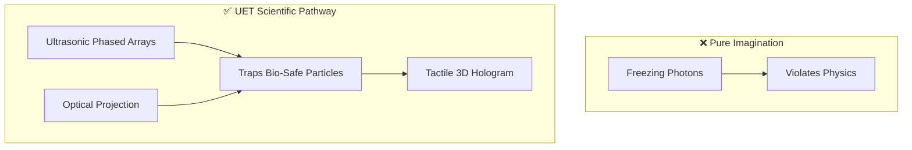

# 🔦 0.27 Cold Light Hologram (Acousto-Optic Tactile Interface)

> **"The Light you can Touch, Grounded in Sound."**

## 🎯 Problem & Grounded Solution

- **The Problem:** Current holograms are intangible. Previous UET iterations proposed "freezing light," which violates the fundamental nature of photons.
- **The Grounded Solution:** **Acoustic Levitation & Haptics**. Instead of freezing light, UET uses **Ultrasonic Phased Arrays** to create high-pressure acoustic nodes in mid-air. These nodes trap bio-safe, non-toxic particles (e.g., Lead-Free Perovskite dust) to form a physical canvas.
- **The Tactile Effect:** When a user reaches in, the ultrasonic waves create actual physical resistance (Haptic feedback) on their skin, while lasers project the image onto the levitated particles. This achieves the "Ben 10 Hologram" intent completely within the laws of wave mechanics.

## 🔗 Theory Connection

## 📊 Evaluation Focus (LIMITATIONS)
- **Air Currents:** Susceptibility of the levitated particle canvas to ambient wind or breath.
- **Acoustic Energy Limits:** The energy required to maintain high-density haptic feedback without causing auditory damage.
