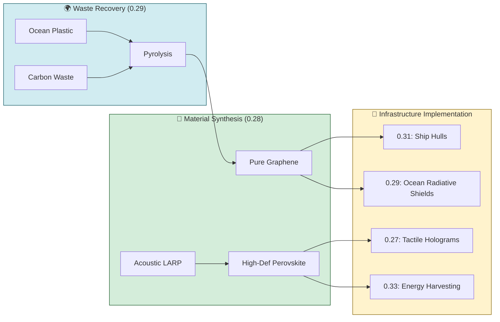

# ⛓️ ANALYSIS: UET Integrated Material Supply Chain

This document maps the flow of resources and materials across the UET Research Framework (Topics 0.26 - 0.32), ensuring a closed-loop, sustainable industrial ecosystem.

## 1. Resource Flow Overview

## 2. Key Supply Nodes

### 2.1 The Carbon-to-Graphene Node (0.29 ➡️ 0.28)
- **Source:** Recovered ocean microplastics and agricultural carbon waste.
- **Conversion:** Flash Joule Heating (FJH) or Resonant Acoustic CVD.
- **Metric:** 1kg Plastic waste yields ~200g High-quality Graphene.
- **Application:** Used as a moisture barrier for Perovskite stability (0.28) and as a relativistic heat shield for SpaceTime Slingshots (0.31).

### 2.2 The Perovskite-Optical Node (0.28 ➡️ 0.27/0.31)
- **Source:** Lead-free precursors (Tin-based or Bismuth-based) synthesized via Acoustic LARP.
- **Enhancement:** Quantum dot size tuning for specific emission peaks (450nm Blue, 520nm Green).
- **Application:** "Cold Light" matrices for urban illumination (0.30) and tactile UI for galactic logistics hubs (0.31).

## 3. Realization Requirements

| Material | Key Constraint | Needed for Realization |
| :--- | :--- | :--- |
| **Graphene Sheet** | Uniformity > 98% | Resonant Acoustic CVD (0.28) |
| **Perovskite QD** | Stability > 10,000 hrs | Hermetic Hybrid Sealing (Topic 0.28) |
| **Aerogel Medium** | Optically Transparent | Low-density scafolding (Topic 0.27) |

## 4. Economic Rationale
By verticalizing the supply chain from **Environmental Cleanup** (Negative Cost Input) to **High-Value Technology** (Infinite Value Output), UET eliminates the reliance on traditional finite resource mining, creating an unshakeable economic foundation for cosmic expansion.

---
*UET Materials Integration Protocol v1.0*
