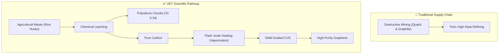

# 🧪 0.28 Material Synthesis (Dual-Extraction & Acoustic CVD)

> **"One Harvest: Silicon for the Mind, Graphene for the Muscle."**

## 🎯 Problem & Grounded Solution

- **The Problem:** Semiconductor and aerospace industries rely on destructive mining for Quartz (Silicon) and Graphite/Oil (Carbon). Traditional CVD for graphene is slow, toxic, and random.
- **The Grounded Solution:** **Dual-Extraction from Biochar & Acoustic CVD**. Agricultural waste (e.g., Rice Husks) naturally contains ~40% Carbon and ~20% Silica. 
  1. We use chemical leaching to extract the Silica and refine it into **Polysilicon chunks**. (These chunks are sent to Topic 0.34 to become wafers/chips).
  2. The remaining pure Carbon is vaporized using Flash Joule Heating.
  3. Inside the CVD chamber, **Resonant Acoustic Guidance (Surface Acoustic Wave Epitaxy)** forces the carbon vapor into perfect honeycomb lattices (Graphene) faster and with fewer defects.

## 🔗 Theory Connection

## 📊 Evaluation Focus (LIMITATIONS)
- **Energy Net-Yield:** Does the energy required to vaporize carbon (FJH) outweigh the energy saved from eliminating traditional mining?
- **Acoustic Penetration:** Maintaining acoustic resonance as the graphene layers grow thicker on the substrate.
