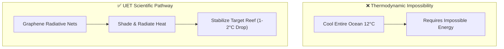

# 🌊 0.29 Ocean Recovery (Micro-climate Thermal Shields)

> **"Targeted Protection for Vulnerable Waters."**

## 🎯 Problem & Grounded Solution

- **The Problem:** Ocean warming causes coral bleaching. Previous concepts aimed to cool the entire ocean by 12°C, which is thermodynamically impossible without a planetary-scale heat sink.
- **The Grounded Solution:** **Localized Micro-climate Thermal Shields**. UET deploys floating, modular Graphene-foam nets over highly vulnerable areas (like specific coral reefs). These nets provide targeted shade, filter microplastics, and utilize **Passive Radiative Cooling** to vent heat into the upper atmosphere, reducing the *local* water temperature by 1-2°C—just enough to prevent bleaching.

## 🔗 Theory Connection

## 📊 Evaluation Focus (LIMITATIONS)
- **Ecological Impact:** Ensuring the nets do not block essential sunlight for phytoplankton.
- **Material Degradation:** Saltwater corrosion and bio-fouling of the graphene mesh over time.
