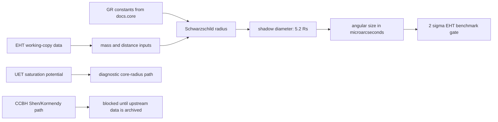

# 0.2 Black Hole Physics

> [!NOTE]
> **AI-Digest**: This topic currently supports an internal EHT shadow-size benchmark and
> documents heuristic UET saturation-core diagnostics. It does not yet establish a complete
> singularity-resolution proof, GR replacement, or CCBH cosmological-coupling result.


## Current Claim Boundary

The primary verifier checks whether the current engine reproduces selected EHT angular
shadow sizes for M87* and Sgr A* using the topic-local working-copy data package. The
saturation-core mechanism and CCBH mass-growth path remain hardening targets until their
scale choices, upstream data, and acceptance thresholds are fully locked.

## Conceptual Diagram



## Evidence Matrix

| Layer | Current status | Evidence / artifact | Claim allowed |
| :-- | :-- | :-- | :-- |
| EHT shadow-size comparison | Primary internal benchmark | `Result/artifacts/0_2_black_hole_physics_verification.json` | selected internal benchmark only |
| GR radius/entropy/temperature formulas | Formula-audited comparator identities | `FORMULA_AUDIT.md` | standard comparator calculations |
| Saturation-core mechanism | Heuristic numerical diagnostic | `Engine_BlackHole.solve_internal_structure` | proposed mechanism / diagnostic |
| CCBH cosmological coupling | Data-blocked secondary path | `Research_CCBH_Analysis.py` currently needs upstream files outside repo | blocked research path |
| Source evidence workflow | Structured provenance gate | `Data/03_Research/source_evidence_intake_stub.json`, `source_evidence_readiness_matrix.json` | source-review queue |
| Branch claim gate | Structured claim ceiling | `Data/03_Research/branch_claim_gate.json` | benchmark-only claim control |
| Singularity-resolution claim | Not closed | limitations and formula audit | do not state as proved |

## 5x4 Grid Structure

| Pillar | Purpose |
| :-- | :-- |
| `Doc/` | analysis notes for black-hole saturation and related mechanisms |
| `Ref/` | EHT, GR, LIGO, and CCBH reference material |
| `Data/` | topic-local working-copy EHT and black-hole catalog inputs |
| `Code/` | engine, proof, research, competitor, and visualization scripts |
| `Result/` | benchmark artifacts, plots, and run logs |

## Problem And Method

- The physics target is the black-hole horizon/shadow benchmark plus a proposed UET
  information-saturation mechanism for avoiding divergent core behavior.
- The current verifier uses the EHT shadow-size data path because the relevant local inputs
  are available inside the repository.
- The CCBH path is scientifically important but cannot serve as the primary gate until the
  Shen/Kormendy upstream datasets are stored and hashed under `docs/data/external/...`.

## Quick Start

```powershell
cd C:\Users\santa\Desktop\uet_harness
python docs/topics/0.2_Black_Hole_Physics/Code/03_Research/Research_EHT_Validation.py
```

## Key Files

- `FORMULA_AUDIT.md`: formula, unit, constant, proof-status, and failure-mode registry.
- `VERIFICATION_SPEC.md`: primary command, thresholds, artifact, and interpretation.
- `DATA_MANIFEST.md`: current data posture and provenance gaps.
- `METHOD.md`: topic method scope and dependency policy.
- `LIMITATIONS.md`: blockers that prevent stronger claims.
- `Data/03_Research/source_evidence_intake_stub.json`: provenance intake for EHT, GW, and CCBH lanes.
- `Data/03_Research/source_evidence_readiness_matrix.json`: readiness gate for source review.
- `Data/03_Research/branch_claim_gate.json`: branch-level claim ceiling.

## Current Limitations

- The EHT data package is still a topic-local working copy, not a fully normalized archival
  upstream source package.
- The shadow benchmark uses a compact `5.2 R_s` relation rather than full image-domain
  ray-tracing.
- The UET core-stabilization path uses rescaled numerical diagnostics and still needs a
  physically locked saturation scale.
- The CCBH analysis needs real upstream data archived in the repo before it can support
  claim upgrades.

*Status note: internal benchmark and formula-audit hardening gate.*
